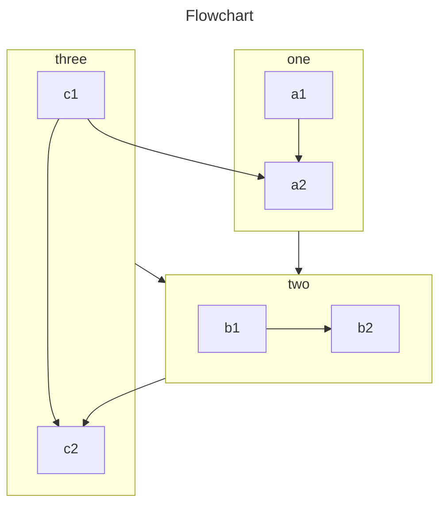

# 示例文档

## 1.测试基本语法

本文档仅作为测试和模板来使用：开发者可以基于这个文档中进行测试，贡献者可以基于这个文档中进行编写。

**粗体**、*斜体*、==高亮==、[引用](https://github.com/limou3434)

- 无序列表
- 无序列表
- 无序列表

1. 有序列表
2. 有序列表
3. 有序列表


```cpp
include <iostream>
int main() {
    auto text = "Hello Would!";
    std::cout << text << std::endl;
    return 0;
}
```

## 2.测试拓展语法

### 2.1.数学公式

$$x = {-b \pm \sqrt{b^2-4ac} \over 2a}$$

### 2.2.箴言补充

> [!CAUTION]
>
> 警告：

> [!WARNING]
>
> 注意：

> [!IMPORTANT]
>
> 补充：

> [!TIP]
>
> 区别：

> [!NOTE]
>
> 吐槽：

### 2.2.媒体载体

@[bilibili](BV1xG8ge6ESE)

@[youtube](0JJPfz5dg20)

@[pdf](/text.pdf)

### 2.3.马克高亮

==一个提示=={.tip} ==一个警告=={.warning} ==一个错误=={.danger} ==重要内容=={.important}

### 2.4.隐秘文本

!!不能偷看!!

### 2.5.内容注释

中国古代 **四大名著** [+名著] 家喻户晓。

[+名著]:
**《三国演义》：**

    以三国时期的历史为背景，描写了魏、蜀、吴三国之间的政治、军事斗争，塑造了诸葛亮、曹操、关羽、刘备等众多历史人物形象。

[+名著]:
**《西游记》：**

    讲述了唐僧师徒四人（孙悟空、猪八戒、沙僧、白龙马）西天取经的故事，充满了神话色彩和奇幻冒险。

[+名著]:
**《红楼梦》：**

    以贾、史、王、薛四大家族的兴衰为背景，描写了贾宝玉、林黛玉、薛宝钗等人的爱情悲剧，展现了封建社会的腐朽与没落。

[+名著]:
**《水浒传》：**

    描写了北宋末年以宋江为首的108位好汉在梁山泊聚义，反抗朝廷的故事，展现了官逼民反的社会现实。

### 2.6.使用步骤

:::: steps

1. 步骤 1

   ```ts
   console.log('Hello World!')
   ```

2. 步骤 2

   这里是步骤 2 的相关内容

3. 步骤 3

   ::: tip
   提示容器
   :::

4. 结束
   ::::

### 2.7.文件目录

::: file-tree

- docs
    - .vuepress
        - config.ts
    - page1.md
    - README.md
- theme 一个 **主题** 目录
    - client
        - components
            - **Navbar.vue**
        - composables
            - useNavbar.ts
        - styles
            - navbar.css
        - config.ts
    - node/
- package.json
- pnpm-lock.yaml
- .gitignore
- README.md
- …

:::

### 2.8.内容卡片

:::: card-grid
::: card title="卡片标题 1" icon="twemoji:astonished-face"

这里是卡片内容。
:::

::: card title="卡片标题 2" icon="twemoji:astonished-face"

这里是卡片内容。
:::
::::

<LinkCard title="链接卡片" href="/" description="这里是卡片内容" />
<LinkCard icon="twemoji:astonished-face" title="链接卡片" href="/" />

<ImageCard
image="https://cn.bing.com/th?id=OHR.AlfanzinaLighthouse_ZH-CN9704515669_1920x1080.webp"
title="阿尔凡齐纳灯塔，阿尔加维，葡萄牙"
description="
今天照片中的灯塔位于葡萄牙南部海岸阿尔加维的卡沃埃罗。阿尔凡齐纳灯塔建于1919年，照耀着大海，帮助船只在该地区周围危险的水域航行。这座灯塔是著名的旅游胜地，同时也是该地区与海洋紧密联系的象征。如果你有幸住在灯塔附近，那么本周末就是拜访灯塔的最佳时机。"
href="/"
author="Andreas Kunz"
date="2024/08/16"
/>

<CardGrid>
  <ImageCard
    image="https://cn.bing.com/th?id=OHR.AlfanzinaLighthouse_ZH-CN9704515669_1920x1080.webp"
    title="阿尔凡齐纳灯塔，阿尔加维，葡萄牙"
    description="..."
    href="/"
    author="Andreas Kunz"
    date="2024/08/16"
  />
  <ImageCard
    image="https://cn.bing.com/th?id=OHR.AlfanzinaLighthouse_ZH-CN9704515669_1920x1080.webp"
    title="阿尔凡齐纳灯塔，阿尔加维，葡萄牙"
    description="..."
    href="/"
    author="Andreas Kunz"
    date="2024/08/16"
  />
</CardGrid>

<RepoCard repo="pengzhanbo/vuepress-theme-plume" />

<CardGrid>
  <RepoCard repo="vuepress/core" />
  <RepoCard repo="vuepress/ecosystem" />
</CardGrid>

### 2.9.代码选项

::: tabs#test
@tab npm

```sh
npm i
```

@tab pnpm

```sh
pnpm i
```

:::

::: tabs#test
@tab npm

```sh
npm i
```

@tab pnpm

```sh
pnpm i
```

:::

### 2.10.时间轴线

::: timeline

- 节点一
  time=2025-03-20 type=success

  正文内容

- 节点二
  time=2025-02-21 type=warning

  正文内容

- 节点三
  time=2025-01-22 type=danger

  正文内容
  :::

### 2.11.折叠面板

::: collapse

- 标题 1

  正文内容

- 标题 2

  正文内容
  :::

### 2.12.页面测试

@[caniuse](css-matches-pseudo)

### 2.13.对话记录

::: chat title="标题"
{:2025-03-24 10:15:00}

{用户一}
用户一的消息

{.}
本人的消息

{用户二}
用户二的消息

{.}
本人的消息
:::

### 2.14.内容注释

站点由 VuePress [+vuepress] 驱动。

[+vuepress]:
VuePress 是一个 [静态站点生成器](https://en.wikipedia.org/wiki/Static_site_generator) (SSG) 。
专为构建快速、以内容为中心的站点而设计。

中国古代 **四大名著** [+名著] 家喻户晓。

[+名著]:
**《三国演义》：**

    以三国时期的历史为背景，描写了魏、蜀、吴三国之间的政治、军事斗争，塑造了诸葛亮、曹操、关羽、刘备等众多历史人物形象。

[+名著]:
**《西游记》：**

    讲述了唐僧师徒四人（孙悟空、猪八戒、沙僧、白龙马）西天取经的故事，充满了神话色彩和奇幻冒险。

[+名著]:
**《红楼梦》：**

    以贾、史、王、薛四大家族的兴衰为背景，描写了贾宝玉、林黛玉、薛宝钗等人的爱情悲剧，展现了封建社会的腐朽与没落。

[+名著]:
**《水浒传》：**

    描写了北宋末年以宋江为首的108位好汉在梁山泊聚义，反抗朝廷的故事，展现了官逼民反的社会现实。

### 2.15.流程图表



### 2.16.思维图表

```markmap
---
markmap:
  colorFreezeLevel: 2
---

# markmap

## 链接

- <https://markmap.js.org/>
- [GitHub](https://github.com/markmap/markmap)

## 功能

- 链接
- **强调** ~~删除线~~ *斜体* ==高亮==
- 多行
  文字
- `行内代码`
-
    ```js
    console.log('code block');
    ```
- Katex
  - $$x = {-b \pm \sqrt{b^2-4ac} \over 2a}$$
- 现在我们可以通过 `maxWidth` 选项自动换行非常非常非常非常非常非常非常非常非常非常长的内容
```

### 2.17.静态图表

::: chartjs 块状图案例

```json
{
  "type": "bar",
  "data": {
    "labels": [
      "红色",
      "蓝色",
      "黄色",
      "绿色",
      "紫色",
      "橙色"
    ],
    "datasets": [
      {
        "label": "投票数",
        "data": [
          12,
          19,
          3,
          5,
          2,
          3
        ],
        "backgroundColor": [
          "rgba(255, 99, 132, 0.2)",
          "rgba(54, 162, 235, 0.2)",
          "rgba(255, 206, 86, 0.2)",
          "rgba(75, 192, 192, 0.2)",
          "rgba(153, 102, 255, 0.2)",
          "rgba(255, 159, 64, 0.2)"
        ],
        "borderColor": [
          "rgba(255, 99, 132, 1)",
          "rgba(54, 162, 235, 1)",
          "rgba(255, 206, 86, 1)",
          "rgba(75, 192, 192, 1)",
          "rgba(153, 102, 255, 1)",
          "rgba(255, 159, 64, 1)"
        ],
        "borderWidth": 1
      }
    ]
  },
  "options": {
    "scales": {
      "y": {
        "beginAtZero": true
      }
    }
  }
}
```

:::

### 2.18.动态图标

待补充...

### 2.19.加强码块

```js{1,4,6-8} :collapsed-lines=10 :whitespace
// [!code word:VitePress]
export default { // Highlighted
  data () {
    return {
      msg: `Highlighted!
      This line isn't highlighted,
      but this and the next 2 are.`,
      motd: 'VitePress is awesome',
      lorem: 'ipsum' // [!code focus] 聚焦语法在不同的语言代码块中，应该使用该语言的有效的行注释语法
    }
  }
}

export default {
  data () {
    return {
      error: 'Removed', // [!code --]
      warning: 'Added' // [!code ++]
    }
  }
}
```

### 2.20.版本标签

- VuePress - <Badge type="info" text="v2" />
- VuePress - <Badge type="tip" text="v2" />
- VuePress - <Badge type="warning" text="v2" />
- VuePress - <Badge type="danger" text="v2" />
- VuePress - <Badge text="v2" color="#8e5cd9" bg-color="rgba(159, 122, 234, 0.16)" />

### 2.21.容器布局

<CardGrid>
  <Card title="卡片标题" icon="twemoji:astonished-face">
    这里是卡片内容。
  </Card>
  <Card title="卡片标题" icon="twemoji:astonished-face">
    这里是卡片内容。
  </Card>
</CardGrid>

<CardGrid>
  <LinkCard title="卡片标题" href="/" />
  <LinkCard icon="twemoji:astonished-face" title="卡片标题" href="/" />
</CardGrid>

:::: card-masonry

::: card title="卡片1"
卡片内容
:::

::: card title="卡片2"
卡片内容

卡片内容
:::

::: card title="卡片3"
卡片内容
:::

::: card title="卡片4"
卡片内容
:::

::: card title="卡片5"
卡片内容

卡片内容
:::

::: card title="卡片6"
卡片内容
:::

::::

### 2.22.滚动图片

<Swiper :items="['https://cn.bing.com/th?id=OHR.BudapestParliament_ZH-CN1607028780_1920x1080.webp', 'https://cn.bing.com/th?id=OHR.LyonTraboules_ZH-CN8476826325_1920x1080.webp']" />
