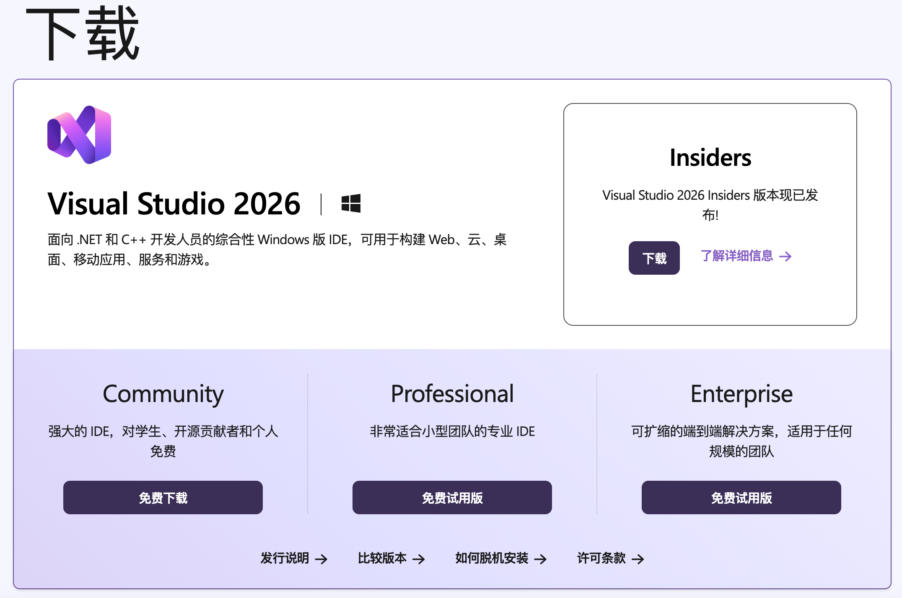
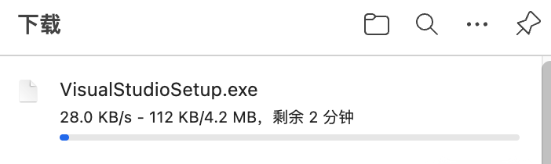
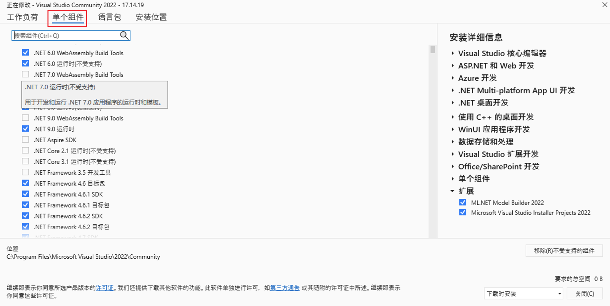
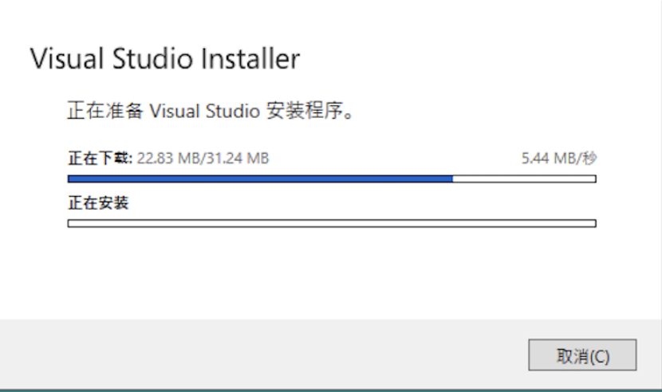
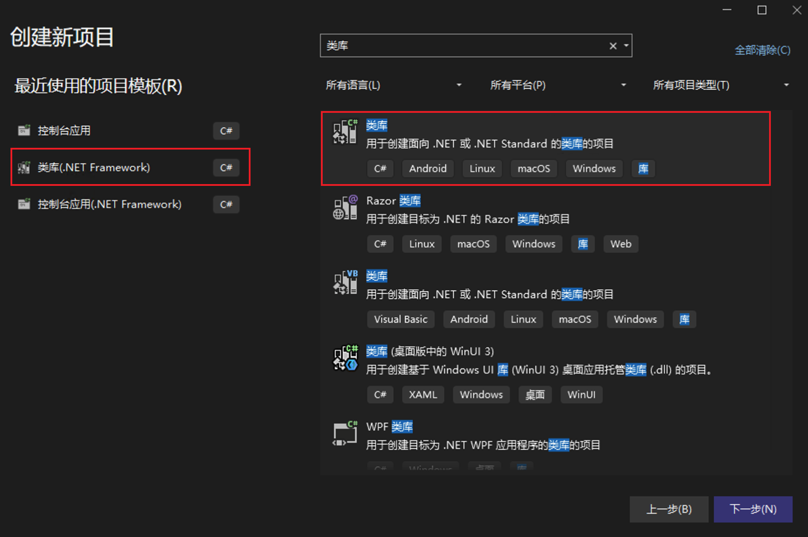
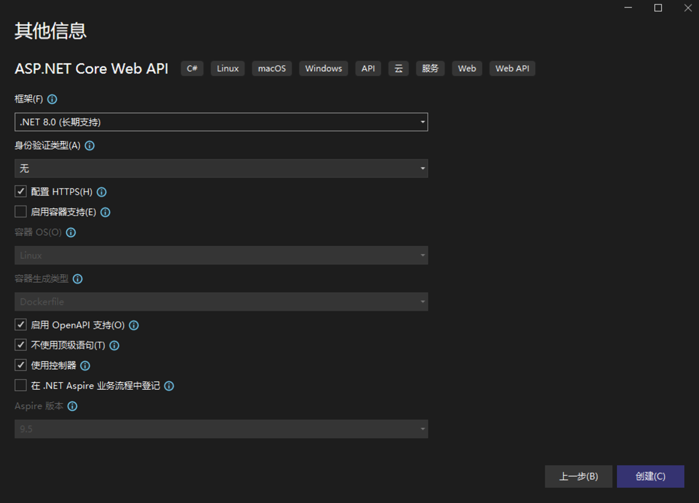

# 环境搭建

## 1.1 软件安装需求

需要先根据基础介绍中的编译软件部分选择需要软件进行安装，后续的演示都以 `VS` 作为编译软件。!!说一句写C#的Virtual Studio是世界第一不过分叭!!

## 1.2 软件安装流程

首先还是需要先去[微软官方下载页](https://visualstudio.microsoft.com/zh-hans/)下载安装包，一般来说Community版本已经足够覆盖大部分使用场景。



点击下载后就会自动开始下载，如果下载比较缓慢或卡顿，需要自行使用 *科学上网* 的方式进行加速。



下载完成后打开会显示安装引导，需要按照具体的需求进行安装，不同的选择会下载不同框架以及依赖（如果磁盘空间够大的可以当笔者没说 ~~磁盘空间大了不起啊，对不起磁盘空间大真的了不起~~）。


如果需要添加额外的依赖如不被支持的Net框架，可以通过选择单个组件进行单独添加。



在选择对应的依赖后就可以静待下载完成，有时会遇到进度卡住不动的情况，此时需要使用 *科学上网* 进行下载。



至此 `VS` 的安装已经完成，可以打开 `VS` 设置一下喜欢的界面样式了。

# 项目创建

项目创建在==基础介绍==中讲过非常简便，以下将通过创建三个不同的项目进行演示。

## 2.1 Console控制台

**cmd命令行**想必大家都比较熟悉，`Console控制台` 项目其实本质就是cmd控制台，项目运行后会弹出命令行窗口，根据编写的程序代码进行执行。

:::: steps

1. 首先先打开 `VS` 创建新项目，搜索栏搜索 **控制台** ，注意区分后面括号，代表不同的框架，无括号为 `.net` ，有括号的为 `.net framework` 。


2. 确认选择要创建的项目后，点击下一步，可以修改项目名以及存放位置，不改默认安装目录。~~安装目录在C盘，C盘那变红都是代码太多害的（暴论）~~ 此处框选出来的设置为 `.sln` **解决方案文件**的存放，分开存放有助于后续扩展多项目，按个人需求选择即可。


3. 确认设置完成后，点击下一步会来到具体的框架选择，选择具体的需要的框架即可，其他设置如**容器支持**等，有需要可以点击旁边感叹号进行查看，此处选择==不使用顶级语句==便于展示，其余不过多赘述。


4. 确认设置完成后，点击创建等待后即可完成项目创建。!!是不是很简单？简单就对啦！全都来写C#！!!


::::

### 2.1.1 代码总结

```c#
/* (块注释)
Program.cs 内部
*/

/* (文档注释)
* 作者：cocoyyy
*/

// 命名空间：一般为项目名称
namespace TestApp
{
    // 类名：与cs文件名相同
    internal class Program
    {
        //main方法：程序主运行方法
        static void Main(string[] args)
        {
            Console.WriteLine("Hello, World!");
        }
    }
}
```

非常简单的命令行代码， `main()` 实现了在命令行中打印 `Hello, World!`。

## 2.2 Dll类库

`Dll类库` 如果打游戏之类的有时候会遇到dll报错等问题， `Dll类库` 是将代码逻辑进行封装后生成的**dll文件**，举个例子如果你只想让别人使用代码，不想让别人看见代码的运行逻辑，那就可以把代码写成==private==的，只留外部调用的方法为==public==的，这样在生成dll后反编译也只会显示方法名。

如果感觉比较难以理解的话，可以先初步把**dll文件**理解为存放代码的单独仓库，这个仓库里的所有代码可以给不同项目使用。

:::: steps

1. 首先先打开 `VS` 创建新项目，搜索栏搜索 **类库** ，注意区分后面括号，代表不同的框架，无括号为 `.net` ，有括号的为 `.net framework` 。




2. 确认选择要创建的项目后，点击下一步，可以修改项目名以及存放位置，不改默认安装目录。（一般类库会作为项目被其他项目引用，记得放好位置避免移动后其他项目直接依赖丢失 !!别问为什么笔者会知道!!）此处框选出来的设置为 `.sln` **解决方案文件**的存放，分开存放有助于后续扩展多项目，按个人需求选择即可。


3. 确认设置完成后，点击下一步会来到具体的框架选择，选择具体的需要的框架即可。


4. 确认设置完成后，点击创建等待后即可完成项目创建。!!是都说很简单啦~!!


::::

### 2.2.1 代码总结

```c#
/* (块注释)
Class1.cs 内部
*/

/* (文档注释)
* 作者：cocoyyy
*/

// 命名空间：一般为项目名称
namespace TestClassLibrary
{
    // 类名：与cs文件名相同
    public class Class1
    {

    }
}

```

一个空的dll文件， `Class1` 中可以编写需求的逻辑方法，最后生成**dll文件**使用，也可以通过直接引用项目调用内部文件。

## 2.3 ASP.NET Core Web API

`ASP.NET Core Web API` 是最常用的Web API项目，作用就是搭建可用于部署的Web API，笔者自用部署于[IIS服务器](https://blog.csdn.net/qq_46175823/article/details/111168591)，通俗一点来说就是在服务器上部署一个可以调用的接口，举个例子网页的登录操作其实就是调用了登录接口。

:::: steps

1. 首先先打开 `VS` 创建新项目，搜索栏搜索 **ASP.NET** ，选择 `ASP.NET Core Web API` 项目。至于上面那个Web应用，笔者只能说很不好用，不如去学习一下 `React` 等其他前端语言做到前后端分离 ~~（谁问你了）~~。


2. 确认选择要创建的项目后，点击下一步，可以修改项目名以及存放位置，不改默认安装目录。此处框选出来的设置为 `.sln` **解决方案文件**的存放，分开存放有助于后续扩展多项目，按个人需求选择即可。


3. 确认设置完成后，点击下一步会来到具体的框架选择，选择具体的需要的框架即可。其他设置如**容器支持**等，有需要可以点击旁边感叹号进行查看，此处不过多赘述。



4. 确认设置完成后，点击创建等待后即可完成项目创建。!!简单吗？简单...吧!!


::::