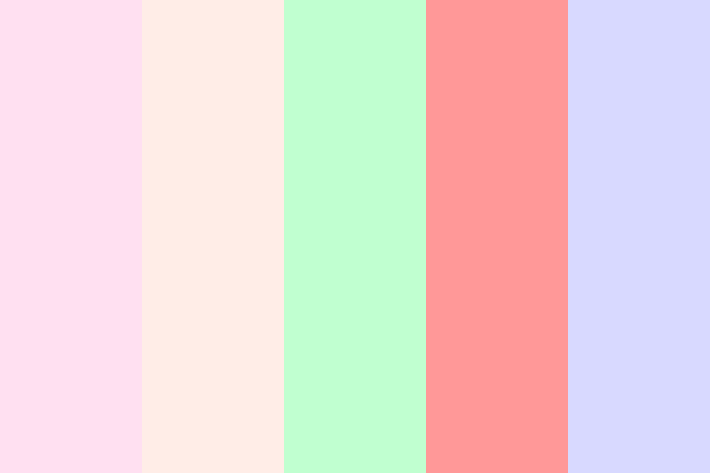

# 艺术风格

## 1.Ins 风格

`Ins` 风格就是指源自社交平台 `Instagram` 的视觉设计与审美风格，是用户在该平台分享生活、穿搭、家居、美食等内容时，逐渐形成的一套流行美学范式。`Instagram/IG/INS` 是 `Meta` 公司的一款免费提供在线图片及视频分享的社群应用程序，于 `2010` 年 `10` 月发布，`2014` 年，此应用中国大陆被屏蔽。它可以让用户以智能手机拍下照片后将不同的滤镜效果添加到照片上再分享至 `Instagram` 的服务器，或 `Facebook、Twitter、Tumblr、Flickr` 等社交媒体。

- `Instagram` 的一个显著特点是拍摄照片为正方形，类似宝丽来拍立得等复古相机拍摄的效果，而通常所使用的移动设备的相机的纵横比为 `4:3` 和 `16:9`。`2015` 年，在其 `7.5` 版本中，这一尺寸限制被取消。而在所有的功能中，快拍的功能最为兴盛

- `ins` 风格以简洁著称，房间会有大片的白色，这样会看起来更加明亮整洁

- 各种充满设计感的物件、性冷淡的配色

  | 对比维度         | 马卡龙色系                                                   | 莫兰迪色系（INS 核心）                                       | 大地色系（INS 核心）                                         | 极简黑白灰（INS 核心）                                       |
  | ---------------- | ------------------------------------------------------------ | ------------------------------------------------------------ | ------------------------------------------------------------ | ------------------------------------------------------------ |
  | **颜色比较**     |  |  |  |  |
  | **色彩本质**     | 高饱和 + 低明度的糖果色（加白调和）                          | 低饱和 + 中明度的灰调色（加灰调和）                          | 低饱和 + 中低明度的自然色（棕 / 米 / 咖为主）                | 无彩色系（纯黑 / 纯白 / 不同明度灰）                         |
  | **代表颜色**     | 樱花粉、薄荷绿、蒂芙尼蓝、柠檬黄、薰衣草紫                   | 雾霾蓝、豆沙粉、燕麦绿、烟灰紫                               | 驼色、焦糖棕、亚麻米、浅卡其                                 | 象牙白、炭黑、高级灰、水泥灰                                 |
  | **视觉氛围**     | 甜美、梦幻、少女感、活泼清新                                 | 温柔、文艺、复古、治愈克制                                   | 质朴、沉稳、自然、温暖大气                                   | 利落、冷淡、极简、高级干练                                   |
  | **INS 风适配性** | ✅ 可适配（小面积点缀）                                       | ✅ 核心适配（大面积基调）                                     | ✅ 核心适配（大面积基调）                                     | ✅ 核心适配（大面积基调）                                     |
  | **INS 风用法**   | 作为软装 / 道具点缀（如抱枕、花瓶），避免大面积铺陈          | 全屋软装 / 背景色，搭配原木、陶瓷材质                        | 家居硬装 / 服饰主色，搭配藤编、棉麻材质                      | 空间基调 + 线条装饰，搭配金属、玻璃材质                      |
  | **搭配逻辑**     | 小面积撞色（如粉 + 绿）或同色系渐变                          | 同色系 / 邻近色搭配，无撞色冲突                              | 深浅大地色渐变，加绿植提亮                                   | 黑白灰明暗对比，拒绝多余色彩                                 |
  | **适用场景**     | 少女风卧室、甜品摄影、美妆包装、童装设计                     | 文艺风家居、通勤穿搭、静物摄影、品牌 VI                      | 复古风家居、秋冬穿搭、户外摄影、民宿设计                     | 工业风家居、极简穿搭、商业空间、海报设计                     |
  | **核心特点总结** | 「甜美的彩色糖果」，INS 风里的 “调味剂”                      | 「柔和的雾面滤镜」，INS 风里的 “温柔底色”                    | 「自然的大地肌理」，INS 风里的 “温暖底色”                    | 「利落的黑白画布」，INS 风里的 “百搭底色”                    |

- 同色系深浅渐变（如浅咖 → 深棕），视觉统一不杂乱

- 避免超过 `3` 种主色，防止色彩冲突

- 比较常见的 `ins` 风装修还会具备以下几种特点：

  - 浓烈的北欧风格装饰
  - 香薰
  - 蜡烛
  - 木质各种小物
  - 大理石
  - 各种盘子
  - 时尚杂志床头灯
  - ...

- 避免超过 `3` 种主色，防止色彩冲突

- 物品的摆放错落有致，构图简约且符合黄金比例，整体暗调，暗部偏灰，散发高级感；
- 风格生活化，擅用原始且有质感的物品，使照片的气质变得温柔婉约

具体展开可以分成摄影和配色两方面，比如摄影/绘画的构图、机位，配色的色相、印象等等。

构图
在拍照或画画的时候，我们可以适当考虑画面中元素的摆放位置，这就形成了构图。ins 风中比较常见的有三角构图、对角线构图、框架构图、三分法构图等。

稍微说一下三分法构图：按照三等分线划分界面，将被摄主体放到图中 4 个点（所谓最吸睛的点）上，即为三分法。这是一种比较好用的构图法。

机位
ins 风主要采用水平、俯拍、倾斜三种机位。

1）水平机位
2）俯拍机位
3）倾斜机位

调色
ins 风配色特点：色调饱和度很低，对比度很低，色温较低，曝光较低。

大家可以在后期修图调色的时候这样做：

1）减少曝光，使画面偏暗
2）局部变暗，压低高光和白色
3）暗部（如黑色）变亮，偏灰

https://zhuanlan.zhihu.com/p/682069224

https://www.zhihu.com/question/480947483

