# 素材调整

## 1.环境安装

## 2.基础工具

### 2.1.拍摄软件

#### 2.1.1.手机相机

使用专业相机的成本过高，而且性价比也不够友好，在手机性能内卷的时代，使用相机来进行拍摄就是最好的选择。在 `Apple iPhone 15` 系列后的苹果手机中相机开始支持一种叫做 `Apple Log` 的模式（本教程使用的是 `iPhone 16 Pro`），可以在设置中设置好后在相机中使用。

下面的对比图就可以看出使用 `Log` 编码的前后对比。

> [!IMPORTANT]
>
> 补充：`Log` 模式会让苹果不计存储空间的代价，尽可能存储所有的视频信息（尤其是明暗信息）。

但是原生相机对这个模式的支持还不够好用，因此我们选择使用完全开源免费的 `Blackmagic Camera` 来作为本次入门的实用工具。除了 `Blackmagic Camera`，由于本教材是基于飓风影视觉出品，所以也可以考虑使用他们家新开发的 `飓风影视+闪电分镜`，不过我们先基于 `BC, 简称 Blackmagic Camera` 来进行学习。而下载好后，我们也需要进行一些简单的调整。

下面这些参数我们最好是在后续的学习过程中进行学习，而不应该直接学习参数的含义，否则就会陷入知识的无底洞中（不过为了可课程的完整性，这里也会稍微解释一下），这里提供了一份预设（由 `Tim` 官方提供）。

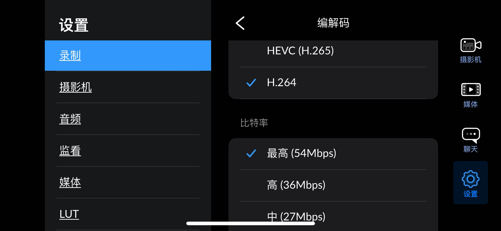

> [!IMPORTANT]
>
> 补充：视频录制时的编解码，核心是 **对视频数据进行压缩（编码）和解压缩（解码）** 的过程。
>
> - 编码：录制时将原始视频的海量像素数据，通过特定算法压缩成体积更小的文件格式。
> - 解码：播放时将压缩后的文件还原为原始视频信号，让设备能正常显示。
>
> 选好编码可以减少存储占用，原始视频数据量极大，编码后可节省内存和硬盘空间。提升传输效率，压缩后的文件能更快上传、下载或通过网络传输。保障播放流畅度，解码算法需快速还原数据，避免卡顿。常见编解码标准比较：
>
> - **H2.264**：
>   - 核心优势：兼容性极强，几乎所有设备（手机、电脑、播放器）都支持，编码速度快、硬件适配成熟。
>   - 压缩效率：`1080 P` 视频压缩后码率约 `3-6 Mbps`，能平衡画质和体积。
>   - 适用场景：日常录制、短视频、网络直播、普通影视存储，是目前最普及的标准。
> - **H2.265/HEVC**：
>   - 核心优势：压缩效率比 `H.264` 高 `50`% 左右，相同画质下文件体积更小，支持 `4 K/8 K` 等高分辨率视频。
>   - 压缩效率：`1080 P` 视频压缩后码率约 `1.5-3 Mbps`，`4K` 视频约 `10-20 Mbps`。
>   - 适用场景：`4K/8K` 录制、高清影视存储、需要节省空间的长视频，但硬件解码要求更高，部分老设备不支持。

> [!IMPORTANT]
>
> 补充：比特率（也称码率）是视频编解码中核心参数，指 **单位时间内传输或存储的视频数据量**，单位通常是 `Mbps`（兆比特/秒）。
>
> - 直接影响画质：比特率越高，单位时间内承载的图像细节越多，画质越清晰；反之则可能出现模糊、色块、卡顿。
> - 与文件体积正相关：相同分辨率和编码格式下，比特率越高，视频文件越大。
>
> 设置编码时需设定比特率，编解码器会按该标准压缩数据，避免体积过大或画质受损。不同编码对於比特率的利用率不同：`H.265` 能以更低比特率达到 `H.264` 相同画质（比如 `H.264 1080 P` 需 `4 Mbps`，`H.265` 仅需 `2 Mbps`）。常见场景比特率参考：
>
> - **H.264**：`1080 P` 日常录制 `3-6 Mbps`，`4K` 录制 `15-25 Mbps`。
> - **H.265**：`1080 P` 日常录制 `1.5-3 Mbps`，`4K` 录制 `8-15 Mbps`。
>
> 也就是说，编解码选的是算法，比特率是调整是否加大算法效果。

然后 [获取一些资源压缩包](https://pan.baidu.com/s/15ANTa_P6xsDsXgHYNQ_UiA)，提取密码为 `ysjf`，我们首先获取其中的 `LUT`。

您需要先导入 `LUT` 后，然后在相机界面中更换 `LUT`。并且我们后面可以注意到，只有开启切换了 `LUT` 后把上面的 `开/关` 设置为打开 `LUT` 后才可以把“`LUT` 录制到片段”这个设置打开，不过我们依旧是不推荐录制到片段。

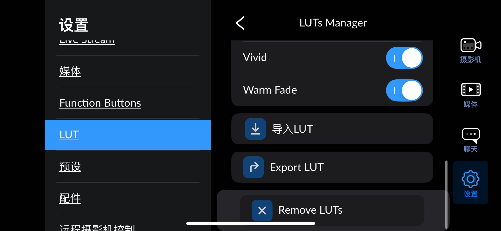

> [!CAUTION]
>
> 警告：最好平时关闭吧 `LUT` 录制到片段的开关，这样我们的前期处理只是一个尽可能录制信息的获取设备，而我们的后期处理才是一个修改录制信息的一个过程，解耦合总是好的（当然快速录制场景是可以的）。不过这只是没有录制到片段里，但是我们拍摄的过程中还是看得到效果的。
>
> 并且其实可以看到 `BC` 的拍摄画面中的左上角是有一个红色的 `LUT` 警告的，这个警告在提示您：“您的操作是不可以逆转的”。

还有几个预设方便我们后期进行学习，同样需要在上面文件中导入。

- 曝光演示
- 快速记录分享
- 专业拍摄
- 电影感

> [!IMPORTANT]
>
> 补充：对比一下不同的预设。
>
> 

> [!CAUTION]
>
> 警告：注意，虽然这款软件也挺好用，但是也有一些问题

#### 2.1.2.专业相机

关于型号和各种用途比较，以及和手机相机的区别，待补充...

> [!IMPORTANT]
>
> 补充：老实说两种相机需要学习的知识都是差不多的。

### 2.2.编辑软件

编辑软件首先推荐达芬奇，电脑任意，本教程使用的是在 `Ubuntu22.04` 环境下的 `DaVinci`，请 [参考官方主页进行安装](https://www.blackmagicdesign.com/cn/products/davinciresolve)，其他环境其实也是差不多的。

一般情况下，我会使用达芬奇来完成调色、音频、切片的工作。如果需要快速剪辑出效果就会搭配剪映，如果还需要搭配动画效果就会使用 `AE` 软件。很可惜的是，后面两者都只能在 `Widnows` 上使用...对于我个人而言 `Windows` 电脑在剪辑方面确实更加具备又优势且稳定一些。这里简单总结为：

- **视频调整**：`DaVinci Resolve`
- **视频编排**：`CapCut`
- **视频动画**：`Adobe After Effects`

### 2.3.日轨软件

`巧摄现场版` 可以查看一天太阳的起落关键时间点，方便我们制定合理的拍摄计划。

## 3.快速体验

> [!IMPORTANT]
>
> 补充：文件命名。
>
> 一个友好高效的文件管理模板是非常重要的，首先需要清楚文件名字的规范。
>
> 
>
> 
>
> 
>
> 
>
> - **卷号**：英文为 `Roll`，在胶片时代，它指的是第几盘胶片，数字时代则是指储存卡等存储介质的编号。一般用字母加数字的形式表示，如 `A01、A0001`。卷号主要用于区分不同的存储介质，方便对拍摄素材进行管理和查找。
> - **场景**：英文为 `Scene`，是指剧本中的第几场戏。记录场景编号的格式通常是数字 ＋ 英文字母，如 `1A`，意思就是第一场戏的第一个镜头，约定俗成在镜头序号中不使用字母 `I、O`，因为它们跟数字 `1、0` 很像。场景编号有助于剧组人员明确拍摄的具体内容和顺序，也是后期剪辑时对素材进行分类和整理的重要依据。
> - **镜次**：英文为 `Shot`，是指该场戏里的第几个镜头。比如一场戏中，导演可能会从不同角度、用不同的拍摄手法拍摄多个镜头，每个镜头都有一个对应的镜次编号。镜次从属于场景，一些场记板没有单独的镜次编号，而是直接在场景数字后加字母表示镜次。
>
> 不过实际上，对于单机位的拍摄，基本上用不到那么复杂的命名规则，只需要一个时间排序就可以。

> [!IMPORTANT]
>
> 补充：文件传输。
>
> 当然，我们最终还是要把巨大的文件放置在电脑中处理的，这个时候文件传输就是一个问题，下面就是不同平台的各种传输方式。
>
> | 平台       | 方式          | 操作步骤                                                     | 适用场景                            | 优点                                                 | 缺点                                                         |
> | ---------- | ------------- | ------------------------------------------------------------ | ----------------------------------- | ---------------------------------------------------- | ------------------------------------------------------------ |
> | WINDOWS 端 | 相册 USB 传输 | 1. 媒体界面内存储视频到 “相册” 2. USB 连接电脑手机上点击信任 3. 在 Windows 文件系统中找到并打开 “Apple iPhone” 根据年份及月份文件夹找到对应素材进行拷贝复制 | 在一段时间内集中拍摄的素材          | 原生支持，兼容性高；直接操作简单，无需额外工具       | 只能读取到相册内的素材；只能按照年份和月份文件夹排序         |
> |            | 硬盘录制传输  | 1. 连接外置硬盘，在 Blackmagic camera 设置中选择外录路径 2. 拔下硬盘后通过 USB 连接 Windows，直接访问硬盘文件 | 大批量以及大文件体积的素材          | 节省手机空间；支持 ProRes 4K/60 帧；拔插即用         | 需稳定数据线；部分硬盘发热或存在兼容性问题；需确保硬盘格式正确 |
> |            | iCloud 云同步 | 1. iPhone 开启 iCloud 照片同步 2. 媒体界面内存储视频到 “相册” 3. 在 Windows 安装 iCloud for Windows 并登录或使用网页端 iCloud4. 下载同步后的素材文件 | 不急于拷贝的少量素材                | 无需数据线，和 iCloud 自动同步上传                   | 依赖网络速度，同步可能需要较长时间；需 Apple ID 有云端储存空间，不稳定，BUG 较多 |
> | MAC 端     | Airdrop       | 1. 开启 iPhone 和 Mac 的蓝牙与 WiFi 2. 在媒体选中素材，点击 “分享按钮”>“隔空投送” 3. 选择目标 Mac，确认接收 | 快速分享小素材；无线传输            | 无需数据线；保留规范文件名                           | 大文件传输慢；传输速度不可控；文件默认保存至 “下载” 文件夹；需手动整理 |
> |            | 访达          | 1. 连接后打开 Mac 的 “访达”> 左侧栏选择 iPhone 2. 在 “文件” 标签页中找到 App 文件夹，整个拖拽文件至 Mac | 批量导出 App 内录制的文件及代理文件 | 一键拖拽完成；保留规范文件名和代理文件               | 无法筛选或排序；关闭 iCloud 照片后才能读取                   |
> |            | 图像捕捉      | 1. 连接后打开 Mac 的 “图像捕捉” 应用 2. 选择相册中的片段，多选后点击下载导出 | 高速导出相册中的视频                | 传输速度较快；支持进度条和取消操作；可多批次批量导出 | 文件名可能乱序；App 内文件需先保存至相册                     |
> |            | 相册应用      | 1. 连接后打开 Mac 的 “照片” 应用 2. 点击左侧 “设备名” 标签页，勾选视频后点击导入 | 已保存到相册需保留元数据的完整导出  | 可查看新增视频；保留镜头信息；传输速度较快           | 导入后需再次导出到其他位置；无法显示文件名并且无法按文件名排序 |
> |            | 外置硬盘      | 1. 连接外置硬盘，在 Blackmagic camera 设置中选择外录路径 2. 拔下硬盘后通过 USB 连接 Mac，直接访问硬盘文件 | 大量大文件体积的素材                | 节省手机空间；支持 ProRes 4K/60 帧；拔插即用         | 需稳定数据线；部分硬盘发热或存在兼容性问题；需确保硬盘格式正确 |
> | LINUX 端   | GSConnect     | 1. 电脑端安装 [GSConnect](https://extensions.gnome.org/extension/1319/gsconnect/) 拓展 2. 手机端安装 KDE Connect 软件 3. 处于同一个局域网下就可以互相共享文件，按照界面操作 | 快速共享到电脑上                    | 支持度不错，快速简单                                 | 只支持 `Ubuntu` 系列的部分平台，并且必须在软件内传输（连熄屏都不行），并且必须处于同一个局域网 |
> | ALL 端     | FileShare     | 1. 安装 Utools 工具 2. 下载 FileShare 拓展  3. 确保电脑端和手机端处于同一个局域网中 4. 开启服务，分享链接 5. 手机端使用浏览器打开链接，按照界面操作 | 全平台同意共享文件                  | 快速，几乎是全平台支持                               | 需要安装 `Utools` 工具                                       |
>
> 实际上，对于任何正在拍摄的情况而言，删除素材都是是最危险的选择，最好等一切确定下来之后再来删除（不过可以做标记）。

> [!IMPORTANT]
>
> 补充：文件备注。
>
> 虽然我们强调不能删除视频，但是可以考虑使用备注或点个小爱心（表示 `Good Take`，在后期处理时，可以在处理软件中筛选出来好的镜次出来）。
>
> 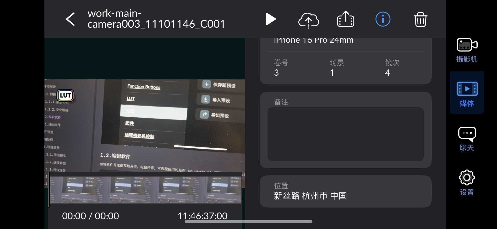
>
> 
>

### 3.1.前期处理

#### 3.1.1.设备准备

##### 3.1.1.1.清洁镜头

可以买专业的清洁纳米布（`10+/- ￥`），擦拭镜头来提高画面的干净程度。这个一般建议购买，因为价格不算贵，但是使用起来比直接用衣服擦拭更加优雅和方便，仅此而已。

##### 3.1.1.2.滤镜套装

| 滤镜类型 | 紫外线过滤器（`UV` 过滤器）                                  | 中性密度过滤器（`ND` 过滤器）                                | 圆形偏振镜（`CPL` 过滤器）                                   |
| -------- | ------------------------------------------------------------ | ------------------------------------------------------------ | ------------------------------------------------------------ |
| 英文名称 | `UV Filter`                                                  | `Neutral Density Filter`                                     | `Circular Polarizer Filter`                                  |
| 主要功能 | **保护镜头**：防止灰尘、水滴、刮擦等损害镜头。 **过滤紫外**：在胶片时代可减少紫外线引起的模糊或蓝色偏色，数码时代此功能弱化 | **减少进光**：在强光下实现长曝光效果，如拍摄流水拉丝、云彩流动等； **景深效果**：或使用大光圈获得浅景深效果 | **消除或减弱反光** 这是 `CPL` 最核心的作用。它能过滤掉非金属表面（如水面、玻璃、树叶、岩石、车漆等）的偏振反光，让画面更清晰； **增强色彩饱和度与对比度** `CPL` 能过滤掉空气中的杂散偏振光，减少画面的 “灰雾感”，让天空更蓝、树叶更绿、花朵更鲜艳，同时增强画面的明暗对比，让景物层次更分明（例如让蓝天白云的对比更强烈） |
| 升级版本 |                                                              | 调制好的 `ND` 滤镜有固定的减光档位，如 `ND2、ND4、ND8` 等，使用时需要根据光线情况更换不同档位的滤镜。而 `VND` 滤镜，即可变中性密度滤镜，通常由两片偏振镜组成，通过旋转镜片来改变两片偏振镜之间的夹角，从而在一定范围内连续调节减光量，无需频繁更换滤镜 |                                                              |

还有一些 `黑柔过滤器、星光过滤器、渐变过滤器`，个人还是非常推荐购买一套专业的镜头套件的，定价 `600+/- ￥` 即可。不过如果拍摄场景大部分都是室内，并且不太需要各种特殊效果的话，只考虑买一个 `ND` 滤镜就已经足够（避免出现强光牺牲帧率）。

##### 3.1.1.3.支架云台

有一个东西是必要购买的，三角支架（`100+/- ￥`）最好买一些比较稳固的，避免出现机器在支架上固定时出现偏离弯曲的现象。此外可以绑定手机支持稳定拍摄的云台（`700+/- ￥`），最好附带充电、远程控制、三角支架。这个主要是避免手抖的问题，不过如果可以接受的话，可以考虑使用一些软件来防止抖动。

##### 3.1.1.4.外部磁盘

外接一个磁盘，可以解决空间不够的问题（`400+/- ￥`），不过现在的手机磁盘也很大，可以不用考虑。

##### 3.1.1.5.兔笼设备

如果外置设备过多，则可以考虑使用兔笼来整合设备（`400+/- ￥`），不过我觉得如果省钱的话，也可以完全不购买。

##### 3.1.1.6.灯光设备

如果是室内灯光，则可以考虑购买相应的打灯工具，如果需要还可以购买一些：

- 背景灯
- 面部灯
- 头发灯
- 轮廓灯
- 氛围灯

然后可以购买一个反光板（米波罗），以及购买一些易撕的胶带，方便对各种设备的布局进行一个标记，避免后期工作期间，因为各种原因导致设备移动，无法重新移动到和原来系统的位置...

##### 3.1.1.7.音频录制

###### 3.1.1.7.1.声源探查

先对现场的拍摄环境进行一个声学探查：

- **室外**：飞机引擎的声音、夏日蝉鸣、马路声音，最好查阅一下天气是否有风
- **室内**：并且是否有哪些电子仪器发出的噪音，比如空调、冰箱、风扇、钟表等

这种需要在拍摄前期和现场人员沟通、查询天气表的风级、航空纵横航线地图等，尽可能关闭或避开噪音源。

###### 3.1.1.7.2.混响处理

较大的混响（就是比回声放回时长要短的声波）会导致素材声音含糊不清，影响声音的辨识度。这种情况下需要使用吸音毯来减弱声音能量减少反射（也可以使用地毯、窗帘来平替换）。

###### 3.1.1.7.3.专业工具

- **普通麦**：可以使用专业的领夹式麦克风（小蜜蜂），并且使用防风毛套来削弱风的影响（麦枪甚至会搭配一个防风塑料漏斗）。并且一般从下巴为起点比个六手势到胸口的位置，并且在靠近麦的地方把线缆打一个圈以避免线缆摩擦产生噪音，减少线缆活动幅度，并且麦朝向说话的那一侧
- **枪式麦**：如果是枪式一般架设在被拍摄对象的头顶斜上方 `30 cm+/-` 的位置，并且以 `40 度+/-` 的位置将麦克风指向声源（实际上就是嘴巴），如果需要再严格一点还需要架设在减震架上，避免由于不小心碰到枪麦 `C` 架而产生噪音，然后将卡农线缠绕在枪麦上就可以
- **时码器**：有条件可以给每个设备都加上时码器，方便同步时间

实际声音信号是有一个公式的：
$$
\frac{\text{有效信号}}{\text{噪声信号}} = \text{信噪比(声音干净比)}
$$
因此应对噪音的做法就两种：“靠近有效信号，关闭噪声信号”。如果需要收集声音，专业的就是使用录音机来获取。

甚至于还需要给录音机插入监听套耳式耳机，以监听声音的正常。

#### 3.1.2.曝光技巧

> [!IMPORTANT]
>
> 补充：有一个由 `+/-` 组成的黑白对角的按钮叫做“曝光补偿”，这个按钮是帮助一些不想调整三个要素来控制曝光，而只想告诉相机“我就要这个曝光”的懒人而准备的。在 `BC` 中如果设置为自动，其实就是经典相机中的自动曝光模式。

##### 3.1.2.1.三个要素

- **光圈**：光圈是镜头内部可调节的孔径大小，用于控制进入相机传感器的光线量。它就像相机的 ==“瞳孔”==，光圈大小用 **f 值（光圈系数）** 表示，格式为 `f / 数值`，例如 `数值小 -- f/1.4、f/2.8、f/4、f/5.6、f/8、f/11、f/16 -- 数值大` 等，`f` 值的数值通常遵循 `倍增/减半` 规律，相邻两档光圈进光量差一倍（如 `f/2.8` 比 `f/4` 进光量多一倍）。除了控制进光量，光圈最关键的作用是决定 **景深**，画面中清晰区域的范围。
  - **分母数值小**：进光量越多，孔径越大，进光量越多，**越亮**；景深浅，背景模糊、主体突出，适合人像、微距等需要 **突出主体** 的场景
  - **分母数值大**：进光量越少，孔径越小，进光量越少，**越暗**；景深深，从近到远、都较清晰，适合风光、建筑等需要 **全景清晰** 的场景

- **快门**：快门是相机传感器前的 ==“闸门”==，控制光线照射传感器的 **时间长短**。快门速度直接影响画面的动态呈现和曝光量。快门速度以时间为单位，常见数值有：`数值小 -- 1/30 秒、1/125 秒、1/500 秒、1/1000 秒 -- 数值大` 等。==一般会把快门的速度调整到帧率的两倍分只一，也就是说 `30` 帧的视频，会使用 `1/60` 的快门，这种快门速度可以持续保持人眼视觉习惯的动态模糊==。
  - **分母数值小**：曝光时间长，进光量多，**越亮**；运动更加 **模糊，记录轨迹**，但是连贯
  - **分母数值大**：曝光时间短，进光量少，**越暗**；运动更加 **细节，冻结瞬间**，但是跳跃

- `ISO`：`ISO` 表示相机传感器对光线的 ==“敏感”== 程度。在光线不足时，提高 `ISO` 可增强传感器的感光能力，让画面更亮，但也会带来画质代价，也就是杂色噪点。
  - **ISO 数值越低**：传感器对光线敏感度低，画质纯净、噪点少，适合光线充足的场景
  - **ISO 数值越高**：传感器敏感度高，能在弱光下提亮画面，但会产生 **噪点**（画面中的杂色颗粒），降低画质

##### 3.1.2.2.判断工具

###### 3.1.2.2.1.直方图

实际上，由于 `ios` 物理硬件上的限制，没有办法灵活调整光圈，因此实际上可以调整的参数只有两个（快门、`ISO`），因此我们的相机软件也只支持两个参数的调整。而且我们调整参数的时候，有些时候很难评判我们本次拍摄是否过曝/欠曝（例如户外光线过强导致手机屏幕变暗，最终导致影响我们对曝光的判断），因此我们就需要直方图工具。

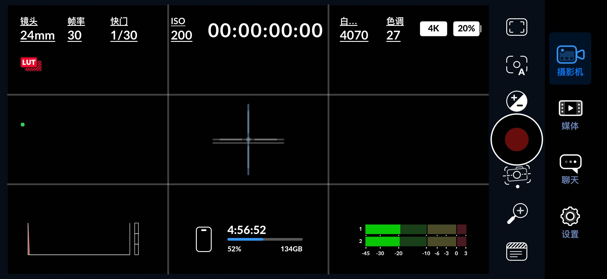

这里对比两种环境下，左下角的直方图，可以看到

- 在 **暗环境** 下直方图三个色峰都在 **左侧**，如果最高峰在左侧则欠曝
- 在 **亮环境** 下直方图三个色峰都在 **右侧**，如果最高峰在右侧则过曝

而我们调整两个参数导致亮度变化的过程中，也会导致直方图的改动，怎么更加专业看待这个直方图呢？

在不过曝的情况下，可以尽可能把直方图往中间和右边去曝光一点，这是手机设备的硬件限制导致的做法，尤其是暗部的地方。因此，拉右一点在后期也可以拉回来。

> [!IMPORTANT]
>
> 补充：事实上这个直方图就是把画面中的所有像素收集起来得到的图。原理其实就是会逐行扫描画面中每一个像素，读取每个像素：
>
> - 先拆分通道数据：把像素的三个数值单独提取，不合并、不平均，就是 R = 120、G = 100、B = 80 三个独立数据
> - 分通道定位位置：
>   - R = 120：在红色曲线的横轴 “120” 这个位置，记 “+1 个像素”（表示该亮度等级多了一个像素）
>   - G = 100：在绿色曲线的横轴 “100” 这个位置，记 “+1 个像素”（表示该亮度等级多了一个像素）
>   - B = 180：在蓝色曲线的横轴 “180” 这个位置，记 “+1 个像素”（表示该亮度等级多了一个像素）
> - 累计形成曲线：当相机扫描完画面所有像素后，每个通道的横轴位置都会累计出对应的像素总数

###### 3.1.2.2.2.斑马纹

还有一个斑马纹的工具值得我们开启，我们需要设置 `80%` 以下就会开启。您在拍照片或视频时，最怕的就是画面太亮（过曝），比如阳光下的白色衣服、天空，亮到细节全没了（变成一片死白）。斑马纹工具就是帮你提前发现这种 “过亮风险” 的：

- 当你开启它，画面中 **快要过曝** 或 **已经过曝** 的区域，会出现黑白相间的条纹（像斑马身上的花纹）
- 比如拍人像时，人脸的高光区域（额头、鼻尖）出现斑马纹，就说明这里快过曝了，你可以赶紧调暗一点（比如缩小光圈、加快快门），避免细节丢失

简单说：**斑马纹在哪，哪里就可能太亮，需要注意调整曝光**，可以看下面的对比图。

##### 3.1.2.3.实战场景

###### 3.1.2.3.1.室内顺光拍摄

- 适当降低 `ISO` 
- 观察直方图是否峰值在中间偏右的场景
- 尽可能减少 `80%` 班马纹的出现

###### 3.1.2.3.2.室内逆光拍摄

- 比较容易出现无法兼收的场景，要么整体欠曝，要么主体正确曝光、背景过于曝光
- 这实际上是超过 `iPhone` 手机的极限，要么配置打光，要么换环境
- 如果实在没有办法，过曝永远都是我们最不想要的情况，这在后期想要救回来非常困难
- 因此欠曝好歹噪点多一点，后期还可以救一下
- 同时调整机位尽量不要让过亮的地方全部出现在人物的背景处 

###### 3.1.2.3.3.室内夜晚灯光

- 尽可能增加室内物理光源
- 想办法不要让 `ISO` 超过 `1600`

###### 3.1.2.3.4.室外强光日光

- 这种情况下由于太阳光线过强，导致整体非常容易过曝
- 如果保持帧率 `30` 和快门 `1/60` 的数值不变，我们哪怕把 `ISO` 调整到最低整体也是一片过白
- 因此我们需要做出取舍
  - 要么就牺牲动态模糊（牺牲人眼对应动态模糊的体验，保持常见的帧率 `30` 不变改动快门速度以弥补过曝光的问题），当然牺牲动态模糊是有代价的，会导致视频卡顿不够连贯，不过实际上动态模糊只是“锦上添花”的东西
  - 要么购买专业的 `ND` 滤镜（`ND` 滤镜也是有不同的，需要根据场景进行替换）

###### 3.1.2.3.5.室外夕阳日光

- 光线柔和且色温偏暖（呈现金黄、橙红等色调），是拍摄人像、风光的理想光线，但光线强度会随时间快速变化（尤其日落前 `1` 小时至日落后 `30` 分钟的 “黄金时刻”）
- 因此就我们可以利用软件 `巧摄现场版` 来查看一天的黄金时刻时间
- 而且由于这个时间段光线不断变化，就需要不断调整我们的曝光
  - 顺光拍摄的话，推荐长焦拍摄（更近），动态调整曝光
  - 逆光拍摄的话，避免直接拍摄到泛白的太阳，动态调整曝光

#### 3.1.3.白平色偏

##### 3.1.3.1.两个要素

色温可以粗略分为 `冷/暖` 两种，但是如果需要细细分辨的话，就可以使用 `Kelvin, 开尔文` 这个单位进行衡量，越低越暖。

| 色温范围              | 具体色温     | 光源示例                                                     |
| --------------------- | ------------ | ------------------------------------------------------------ |
| 低色温（< 3300K）      | 1700K        | 火柴火焰、低压钠灯（黄光路灯）                               |
|                       | 1850K        | 蜡烛光、日出 / 日落时的阳光                                  |
|                       | 2400K        | 老式白炽灯泡                                                 |
|                       | 2550K        | 柔光白炽灯泡（暖黄家用灯）                                   |
|                       | 2700K        | 标 “柔白光” 的节能灯 / LED 灯                                |
|                       | 3000K        | 标 “暖白光” 的节能灯 / LED 灯（比柔白更亮）                  |
| 中色温（3300K-5300K） | 3200K        | 影棚摄影灯、补光灯                                           |
|                       | 3350K        | 影棚专用 “CP 灯”                                             |
|                       | 5000K        | 冷白光节能灯 / 日光型灯泡（如办公室灯光）、地平线日光、管状荧光灯 |
| 高色温（> 5300K）      | 5500-6000K   | 正午阳光、相机闪光灯                                         |
|                       | 6200K        | 氙气短弧灯（投影仪、车灯）                                   |
|                       | 6500K        | 阴天自然光                                                   |
|                       | 6500-9500K   | 电脑 / 电视屏幕光（冷白偏蓝）                                |
|                       | 15000-27000K | 晴朗北方天空的蓝色（通透的蓝天）                             |

在知道色温的情况下才可以去调整白平和色偏

- 白平衡它的作用就是告诉计算机当前面对光的色温 `K` 值是多少，从而矫正为物体他本该有的颜色。通常会使用白色或者灰色作为校验标准，以确保画面里的：白色是白的、灰色是灰的（这也就是为什么叫做“白平衡”）。同时把这个白色校准为纯白的过程叫做“对白”，也可以看到白平衡的单位就是 `K`，但是他的 `K` 和色温是相反的。**白平衡一般不推荐一直打开自动模式**，因为相机会自动捕捉到不同色温的区域，如果自动就会导致软件的白平衡计算带的变化不停的变动，尤其是多条视频拍摄过后，色调不一致导致项目的不协调会很麻烦。最好的做法是，在追求物体本来的颜色的时候，先使用自动来调整合适的值后，再次精细调整后再取消自动。
- 而另外一个色偏就比较简单了，如果发现画面偏红或偏绿时，就可以进行调整回正，避免画面奇怪。白平衡的核心作用是让相机“识别”当前环境的光源颜色，从而将白色物体还原为真实的白色，避免画面整体偏色。自然界中不同光源的 “色温”（衡量光线颜色的物理量，单位 `K`）差异很大，而相机若未能正确匹配光源色温，就会出现偏色。

> [!IMPORTANT]
>
> 补充：当然，白平和色偏的调整是依据个人风格来调整的，没有绝对的对错，只要别太离谱。

##### 3.1.2.2.判断工具

暂时还没有找到，待补充...

##### 3.1.2.3.实战场景

###### 3.1.2.3.1.室内混杂光源

- 正确的灯光源应该具有引导性，让观众清晰知道光源是从哪里出来的
- 甚至可以偷取光源，让观众误认为某个部分的光源真的是从某处发出的

###### 3.1.2.3.2.室外夕阳日光

- 如果需要冷光，不要把太阳代入画面中，会造成观众的疑惑
- 行业中有一种概念叫做“日拍夜”，在晚上拍摄很难就可以利用把白平衡调偏，得到一种类似夜晚的感觉，当然最好需要顺光
- 不过需要避免出现反射导致穿帮
- 并且白平衡要合理调偏，后期很难调整白平衡
- 如果没有创意的刻意需求，正确的白平衡永远都是最好的选择，后期想怎么调整都可以

###### 3.1.2.3.3.人像光源统一

- 采访场景在突发情况中是最为头疼的，尤其是采访的时候位置无法移动时，但是出现同一个画面中冷暖冲突时
- 无论怎么调整白平衡都无法满足矛盾的需求
- 此时就可以考虑物理取消某些灯源，让灯源统一
- 甚至还可以使用“米菠萝”，也就是轻便的泡沫板，表面覆盖银色或白色反光膜，就可以对面部补光
- 应此环境实际上也是可以调整的，而不能一味追求调整相机参数

#### 3.1.4.升格降格

##### 3.1.4.1.升格技巧

升格视频可以直接理解为一个慢动作视频，`Blackmagic Camera` 中也有对应的功能。首先我们需要回忆一个知识点，快门速度最好是控制在帧率的两倍才能符合人眼对动态模糊的自然需求，这点在升格视频中特别重要，如果我们拍摄 `120 帧` 慢动作，快门就需要尽可能靠近 `1/240`，这里也有个技巧，可以把 `Blackmagic Camera` 中的快门类型设置为角度类型，并且锁死角度为 `180 度`，这样就会根据公式自动将快门设置为帧率的两倍。

接下来就是设置升格的帧率了，点击帧率开启 `OFF SPEED` 就会发现帧率变成了两个，左边是拍摄帧率，右边是播放帧率。此时如果按照 `60/30` 拍摄出来，则如果是 `5 s` 的视频就会得到 `10 s` 的视频，因为拍出来效果的是按照 `30 帧` 的速度来播放原本的 `60 帧` 视频。

由于升格会使得画面的细节变得更慢一些，所以通常回来拍摄一些变化较大的场景，比如：运动场景、人物动作、流体变化，但是如果是静态的物体，升格带来的效益就会差很多。

欸不过，不知道您知不知道运动是相对的？没错正确的运镜也可以让“静止”的物体“运动起来”，常规的运镜如下：

- 推
- 拉
- 摇
- 移

一旦升格配合摇（环绕运镜）就会快速得到利用视角而产生丰富空间层次的视频，尤其是围绕一些正在运动的实体，效果更是绝佳。但是运镜稳定就是一个问题，这个时候利用 `云台+忍者步（脚根落地）` 就可以达到很稳的运镜效果。

> [!IMPORTANT]
>
> 补充：运镜的本质其实就是视觉引导。

##### 3.1.4.2.降格技巧

其实就是延迟摄影，其实就是每隔一段时间（或者几帧）才来拍摄一张画面，就会有一种车水马龙的感觉，会给人一种时间流逝的感觉、也非常适合拍摄一些快速转场。而实际上降格和升格的操作是相反的，还是打开 `Blackmagic Camera` 中的 `OFF SPEED` 后把右边的帧率调低一些。

还有一种更加快捷的方式就是在设置中打开延迟摄影，然后设置拍摄间隔（可以把里面的数字简单理解为加快的倍数）。

这里还有一份推荐的流速参考表。

并且如果打开下面这个设置可以在录制时右滑屏幕降低亮度以减小电量消耗以及发热程度。

> [!IMPORTANT]
>
> 补充：正确使用升格降格，通常在关键时刻用升格、重复动作用降格。

###### 3.1.5.3.4.房间语气

房间语气也就是所谓的 `Room Tone`，我们需要录制一个 `10` 分钟左右的环境音。这样做是因为：在后期编辑阶段中，视频会被剪切为各个片段，在播放的时候会因为片段之间没有声音导致听感的断裂。在片段中间的空白处用现场录制的房间语气来代替。

#### 3.1.5.实际采访

这里将融合之前所学习的所有技巧，暂时不用任何硬件设备，来进行一次专业的采访实操，这次实际操作的视频将会作为素材运用到后期的达芬奇调色中。

- **机位调整**：
  - 先架上机架，清楚布光的边界
  - 由于是采访场景，所以就需要设置视平（眼睛和相机对平的状态）
  - 留下 `1/3` 左右的头部空间
  - 对确定好的主机位设置支架标记，也就是马克点（可以使用美纹胶）
  - 多主机位如果随意搭建，可能导致穿帮、违背 `180` 度定理的问题（其实就是在沿着被访者画一条大概的直线，相机最好在基于平行线为直径的同一个半圆内进行摆放，不会产生越轴的问题，进而优化观众的空间感）
  - 特写机位，最好分别多台使用 `iPhone 120mm` 焦段对准多位被访者的面部做特写，如果空间允许，也可以用过肩式的做法（特写时出现对话者的背影）
  - 主要机位，则直接把多名采访者全都纳入画面中，焦段要比特写机位数值上小一些，比如 `iPhone 24mm`，增加画面趣味
  - 统一所有机位的预备，优先顺序如下
    - 白平
    - 色偏
    - 帧率（一般推荐使用 `60 帧或者 59.97 帧`，这个帧是国家调整为了兼容美国标准用的，但是最好统一，不要不同，时间长了会导致声音和画面对不上，这个后期没有后悔药可以吃，不过我常用的是 `29.97`）
    - 保存本次采访的预设，可以利用这个预设导出保存也可以分享给其他机位（利用隔空投送）
    - 擦拭所有的镜头

  - 如果需要也可以开启多机位同步录制的功能（软件的设置内部有，非常方便）
  - 注意主机位真的太重要了，设置好后什么都不需要动，只需要保持静止，通常由最重要的人来做掌控

- **灯光布局**：
  - 注意避免眩光的问题（也就是不要直接把灯光直射到苹果镜头）
  - 最为经典的就是三点式布光（两个在左右侧上方，一个在被采访者的头部，也叫“发光”）
  - 但是其实有些很厉害的采访是从侧边打光的，会让被采访者有一种更加立体的感觉，这个在采访老外就更加适合，因为他们的鼻梁比较立体，而这种光也会使得人的眼睛都变得更加明亮、更加有精神
  - 当然，您也可以把两个左右侧上方的灯光交错打到被访者的背后成为发光，同时互相作为对方的侧光
  - 当然上面这种交错的方式最好再使用米波罗给面部补充一点光，避免对于主要机位来说逆光导致拍摄困难
  - 此时特写主机位可以适当进行调整，让被访者眼神有光是最好的
- **音频处理**：
  - 、如果空间回音较大，则可以准备地毯或者棉被作为有效的吸音体
  - 如果希望有最干净的人声，则可以使用小蜜蜂（经典的就是一个接收机带两个发射器，发射器通常会带有一撮绒毛）
  - 接受器直接接到主要机位上，可以打开相机中的音频表来可视化音频设置，常规设置通道为立体声，采样使用 `48 kHz`，音频格式选择 `ACC`（线性 `PCM` 通常会有更好的音频质量，但是软件好像有些许 `bug`）
  - 简易发射器采用咪头麦克风，不会太明显，最为优雅
  - 确定被采访者的主要发声方向，把发射器别在对应的方向，否则就会出现声音突然变轻的问题
  - 上下位置上，通常就是从嘴唇开始比六手势的大拇指到小拇指的长度处别上发射器时最好的，这里靠近胸腔可以录到一些低音，高音也不会过尖锐
  - 通常接收器还有备份音轨的功能，值得开启

### 3.2.后期处理

#### 3.2.1.软件准备

> [!CAUTION]
>
> 警告：首先需要注意一个点，如果开启了 `LUT` 就会出现红色的图标提醒您在做不可逆的操作，甚至可能损失 `Log` 画面的潜力，或者调色的潜力，但是这不是和前面矛盾么？我们使用 `LUT` 的作用其实就是因为他是一种用来调色的调色模板，实际上他的作用就是一个，把 `Log` 画面颜色查找调整为调色师预设好的另外一个颜色，全称就是 `Look Up Table, 颜色查找表`。那么既然是模板，就有概率会遇到不匹配的情况，因此如果过早使用 `LUT` 就会导致后期在基于调色的基础上再调色，调色空间就会小很多，并且灵活性不高。

先随便新建一个达芬奇项目，然后们先来做一些基础的设置。

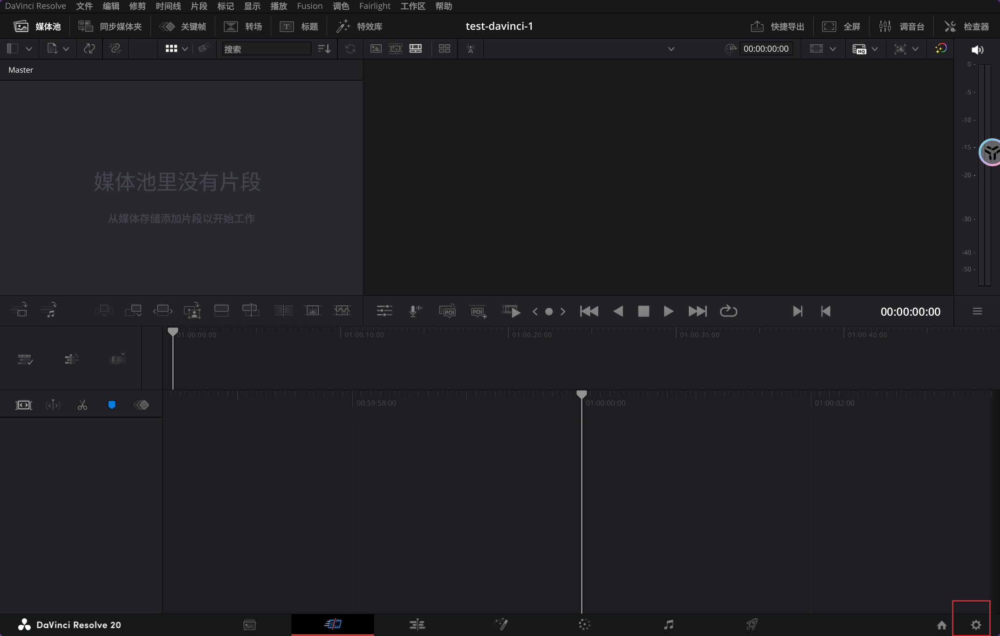

##### 3.2.1.1.系统设置

达芬奇项目默认界面字体是比较小的，不过这个问题现在比较好解决。

##### 3.2.1.1.项目设置

然后我们需要针对当前项目做一些设置，由于我们录制了一个 `4K, 29.97 帧率` 的视频，这里就需要设置：

- 时间分辨率为 `3840×2160 Ultra HD`，这里的 `3840×2160 Ultra HD` 指的是 `4K` 超高清分辨率，属于视频编辑软件（如 `Premiere Pro、Final Cut Pro` 等）中 “时间线分辨率” 的配置选项
- 同时还需要设置帧率为 `29.97`

再设置一下色彩空间和 `3D LUT` 插值，其中：

- **两个色彩空间**：简单来说这两个设置是为了让视频从剪辑到输出的色彩表现保持统一，`Rec.709-A` 是目前高清内容制作的主流标准，适用于绝大多数非 `HDR` 的视频项目。
  - **时间线色彩空间**：指视频剪辑过程中，时间线所遵循的色彩标准。`Rec.709-A` 是高清电视的色彩空间标准，规定了色彩的亮度、色度范围，确保剪辑时画面色彩的一致性和准确性，适配大多数高清视频的制作场景（如网络视频、电视节目）
  - **输出色彩空间**：指最终导出视频时所采用的色彩标准。同样选择 `Rec.709-A`，意味着导出的视频会遵循该标准，保证在支持 `Rec.709` 的设备（如电脑、电视）上播放时，色彩显示与剪辑时一致，避免出现偏色、色彩断层等问题
- **3D LUT 插值**：是一种用于色彩分级的工具，通过预设的色彩映射关系快速改变画面色调。“四面体” 是插值算法的一种，作用是 **在 3D LUT 的色彩节点之间进行平滑计算**，让色彩过渡更自然，避免出现色块或断层。常见的插值方式还有 “三角形”“立方体” 等，不同算法会影响色彩处理的精度和速度，“四面体” 在平衡精度与性能上较为常用。

#### 3.2.2.导入素材

这里的设置是根据我们的相机频率来制作的，并且注意达芬奇对苹果设备有做相当足够的适配，`Log` 画面导入后是可以进行一些自动检测的。这里我们选取一段视频，一段相当随意的视频（关闭显示 `LUT` 的视频，就是那种看起来白蒙蒙的图片）。

> [!CAUTION]
>
> 警告：如果自己的素材导入之前是空白无法显示的（这点在 `Ubuntu22.04` 上就比较容易出现），此时则可以考虑使用 `ffmpeg` 来做一个视频格式的转化（`mp4->mov`），同时利用参数保持一个接近的质量来进行导入，转化好后可以使用 `ffmpeg -i output.mov` 来进行一个视频分辨率和帧率的检查。
>

成功在文件目录中找到对应的视频资源，然后拖拽到资源池里。

> [!CAUTION]
>
> 警告：导入后的资源池中的资源不要随意移动位置或删除文件，否则就会造成视频丢失！

然后我们这只是把资源导入了资源池中，还需要导入到时间轴中处理。

#### 3.2.3.调色流程

##### 3.2.3.1.一级调色

###### 3.2.3.1.1.第一个节点（原始）

第一个节点保持不动，就用来作为恢复使用，同时作为后续的对比。

###### 3.2.3.1.2.第二个节点（还原）

通常拿到片段的时候需要确认片段属性，以套上对应机型的还原 `LUT` 来还原我们的画面，这样做的目的是为了快速定下调色基调，我们在第二个节点做这件事情就可以。

> [!WARNING]
>
> 注意：不要一开始就使用带有风格化的各种 `LUT`，而是应该吧 `Log` 恢复为标准的 `Rec.709`（或目标色彩空间），等到调色阶段结束后，才套用转向别的风格 `LUT`。

我们还需要提前导入配置文件才可以切换不同的 `LUT`，直接找到达芬奇的 `LUT` 目录地址复制粘贴即可。

> [!IMPORTANT]
>
> 补充：还有一种全局的方法，可以自动还原色彩（不过我没有测试过）。但是如果您的前期处理没有正确调整好建议不要使用。
>
> 	

这里先使用历史操作可视化工具，也就是节点图（`alt+s` 新建，`alt+z` 撤回）新建一个矫正器。并且双击左侧的 `LUTs` 列表中选定的 `LUT`，这样就可以让操作记录可视化。

> [!IMPORTANT]
>
> 补充：之前之所以让您不要把 `LUT` 烧录到视频中，主要的原因就是不愿意让您失去对 `Log` 视频调色的潜力。

用 **第一个节点** 做还原 `LUT`，这里推荐使用 `Apple Log To Rec709.cube` 的还原 `LUT`，并且可以考虑调整下面的 `LUT` 增幅效果。

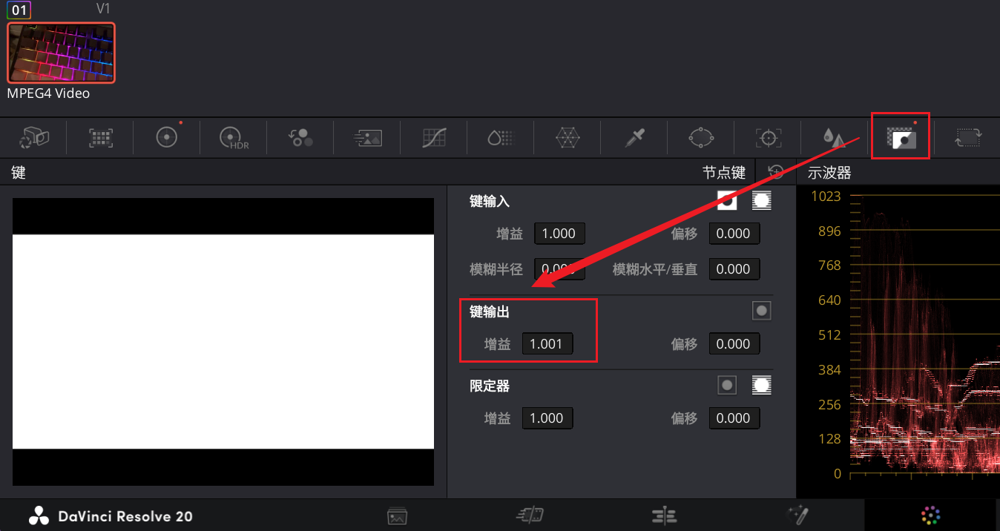

###### 3.2.3.1.3.第三个节点（调曝）

实际上所有的调色都只是对同一个像素点调整下面三个参数：

- 亮度
- 色相
- 饱和

我们需要先使用 `LUT` 简单做个还原后，下面就要开始对上面三个参数做调整。要掌握调色的技巧，其实在大部分情况下只需要掌握下方 `四个图 + 校色轮 + 曲线` 就可以了。在调色之前，我们需要先弄清楚我们的 [四个图](https://www.blackmagicdesign.com/cn/products/blackmagicvideoassist/scopes) 以及工具。

**图像**

接下来需要一一给您解释下四个图的含义所在，上面图只是一个测试图（简单看看就可以）：

- **亮度（波形图）**：`X:画面的从左到右, Y:亮度`，主要用途是：==可以用来“调整曝光”==
- **通道（分量图）**：`X:画面的从左到右, Y:通道亮度`，主要用途是：==判断 `RGB` 三通道亮度是否平衡，精准定位偏色原因，进而校正色彩达到“正确对白”的效果==
- **色彩（矢量图）**：首先可以看到 [矢量图](https://www.bilibili.com/video/BV1Ke4y1u7a4?spm_id_from=333.788.recommend_more_video.2&trackid=web_related_0.router-related-2206146-mbfvr.1763190323655.46&vd_source=c92c89dbfcf9cc30c48086469621f35b) 有 `R(红), G(绿), B(蓝), C(青), M(品), Y(黄)` 六个点位，也就是三原色与三补色，而这个图上的矢量中，大小代表饱和度，方向代表色相，其实就是一个颜色分布地图。实际上电视机以前某些电视台停播某些节目出现的彩条故障就会刚刚好打在这些点位上，打的越准画面色度的保真就会越高。如果往高深的说，实际上就是 `YUV` 色彩空间六面体在 `UV` 平面上的投影。不过这个图还有个“肤色指示线”可以打开，不同的皮肤都会在附近进行显示。主要用途是：==[“颜色分布、正确对白、肤色参考、镜头匹配、广播安全”](https://www.bilibili.com/video/BV1MM411z7EK?spm_id_from=333.788.recommend_more_video.2&trackid=web_related_0.router-related-2206146-pkt2c.1763190328831.204&vd_source=c92c89dbfcf9cc30c48086469621f35b)==
- **分布（直方图）**：[直方图](https://www.bilibili.com/video/BV1Ve41157pm?spm_id_from=333.788.recommend_more_video.2&trackid=web_related_0.router-related-2206146-j9vhc.1763141285888.55&vd_source=c92c89dbfcf9cc30c48086469621f35b) 分布其实就是我们之前在摄影机中提及的直方图，几乎就是一样，并且更加细化一些。实际上直方图的原理就是横轴为 `X:亮度`，从暗到亮。纵轴为 `Y:数量`，为某个亮度下的像素数量，而三条曲线实际上就是把亮度拆分为 `RGB` 三种来进行亮度统计，并且直方图大致可以理解为四个均等区域（黑色、阴影、高光、白色）。举一些比较简单理解的例子，如果直方图中的红色曲线基本都在“高光”区域，就说明画面高光显示红色；如果直方图中的红色曲线基本都在“阴影”区域，就说明画面中高亮显示青色（这是根据补色的原理）。主要用途是：==可以用来“调整曝光、色相矫正、察觉对比”==

**色轮**

首先这里我们需要调整校色轮来达到矫正的目的，不过需要先补充一下校色轮的一些知识。由于任何一张图像的亮度都能自然划分为三个核心区间（这是光学和人眼视觉的客观规律），校色轮根据这个概念划分了三个功能，同时给出一个偏移的总功能。校色器的作用就是让画面中不同区间的地方 “颜色准、颜色匀”，解决您肉眼看着不舒服的偏色问题。

| 概念 | 调整范围           | 数值                                                         | 解释                                                         |
| ---- | ------------------ | ------------------------------------------------------------ | ------------------------------------------------------------ |
| 暗部 | 低亮度区域（阴影） | `RGB` 数值 `≈0-200`（画面里偏黑、阴影的像素，比如傍晚的墙角、物体暗面） | 画面中最暗的部分（如物体投影、黑夜背景），人眼对这里的色彩偏色（如阴影发绿、发蓝）非常敏感，且暗部色彩容易 “沉底”，需要单独校正； |
| 中灰 | 中间调区域（细节） | `RGB` 数值 `≈400-600`（画面主体、最常见的亮度，比如人脸、墙面、路面） | 画面的核心主体区域（如人脸、景物细节），是视觉焦点，人眼对中间调的色彩平衡要求最高，需要最精细的色彩校准（比如肤色偏红、景物偏黄，都要在中间调修正）。 |
| 亮部 | 高亮度区域（高光） | `RGB` 数值 `≈800-1023`（画面里偏白、高光的像素，比如太阳、灯光、白色衣服） | 画面中最亮的部分（如阳光、灯光、白色物体），高光容易出现 “过曝偏色”（如高光发黄、发灰），且高光色彩会直接影响画面的 “通透感”，必须独立调整； |
| 偏移 | 全画面区域（所有） | `0-1023`（所有亮度的像素，从最暗到最亮）                     | 同时影响 `RGB` “通道” 的全局色彩平衡                         |

前三个分区是 “自然存在” 的，就像给画面做 “亮度切片”，每个切片的色彩问题需要单独处理——这是暗部、亮部、中灰三个功能的由来。为什么需要第四个功能 “偏移”？有了三个分区调整，为什么还要 “偏移”（全画面色彩调整）？核心是解决 “全局色彩统一” 的需求：

- 分区调整的局限性：暗部、亮部、中灰的调整是 “局部修正”，如果画面整体存在严重偏色（比如整体偏冷、整体偏暖），单独调三个分区会效率极低，且容易导致各区域色彩脱节（比如暗部调暖了，亮部还是冷的，画面割裂）
- 全局校正的必要性：偏移功能直接作用于全画面所有亮度区域，相当于给整个画面 “统一染色” 或 “统一校色”，比如拍摄时白平衡设置错误导致全片偏蓝，用 “偏移” 一键拉回中性色，再用三个分区微调细节，效率更高
- 与基础概念的呼应：偏移本质是调整 `RGB` 通道的全局平衡（比如增加红色通道、减少蓝色通道），而暗部 / 亮部 / 中灰是在这个 “全局平衡” 的基础上，对不同亮度区间做精细修正 —— 先全局再局部，符合调色的逻辑流程

标准基本就是需要让示波图“顶天立地”，但是又不能完全贴边，也就是“暗部不碰底、亮部不顶天，中间调均匀分布”。不过这只是调整亮度，如果需要修改色相和饱和度，可以移动色轮中的小白点。朝哪个方向就决定色相，越靠近颜色就越是饱和。

而且色轮还附带一些参数可以使用，这些参数可以弥补一些前期处理没有处理到位的地方

> [!IMPORTANT]
>
> 补充：总结来说，色轮具备调色的三要素。

**曲线**

也可以使用 [S 曲线来调整](https://www.bilibili.com/video/BV1zY4y1h75Y?spm_id_from=333.788.recommend_more_video.-1&trackid=web_related_0.router-related-2206146-8qdn5.1763141294339.16&vd_source=c92c89dbfcf9cc30c48086469621f35b)，增加一些对比度（这里只是简单提及一下）。实际上曲线的原理不难，这里简单说下原理和一些应用。曲线的横轴就是原片的所有像素的旧亮度（越来越亮），曲线的纵轴就是调整后所有像素的新亮度（越来越亮）。而默认的曲线是一个线性映射函数，如果我们修改函数的图像，就可以修改输入像素亮度和输出像素亮度的映射关系，进而影响图片的亮度。而其他三条曲线也有类似的原理，可以调整颜色。

- 只创建一个调整点的话，向上就是整体加大亮度，向下就是整体减小亮度

- 若创建两个调整点的话（也可以在第一个中心调整点的基础上继续添加两个调整点）

  - 正 `N` 状曲线就是“暗的地方变亮、亮的地方变暗，最终就是变得柔和”
  - 反 `N` 状曲线就是“暗的地方更暗、亮的地方更亮，最终就是变得反差”
  - 把曲线开头作为调整节点映射为最亮，把曲线结尾作为调整节点映射为最暗，就可以得到所谓“负片”的效果

- 不过除了直接调整 `Y` 曲线，也可以单独调整其他三条曲线：

  - 如果希望画面偏向某个颜色，则可以使用对应的原色来增加叠加得到效果，但是亮度偏高（比如要偏向黄色就拉高红色绿色）

    

  - 如果希望画面偏向某个颜色，则可以使用对应的补色来减少叠加得到效果，但是亮度偏低（比如要偏向黄色就拉低蓝色曲线）

    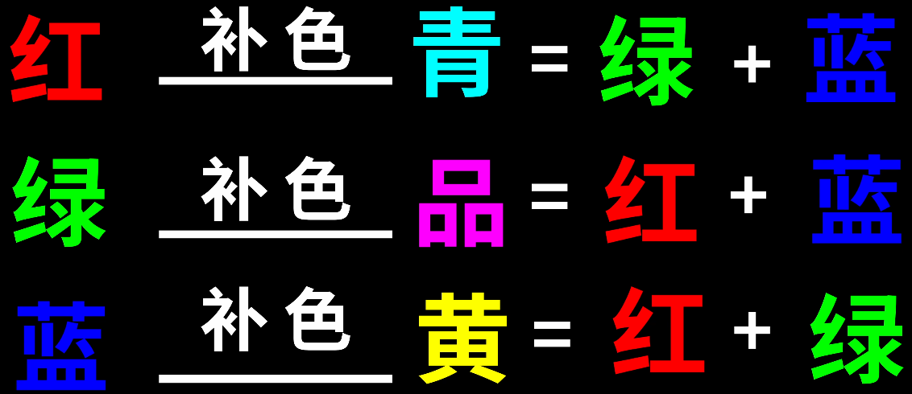

> [!IMPORTANT]
>
> 补充：总结来说，曲线具备调色的三要素。

**比较**

使用 `[ctrl+f]` 则可以全屏观看视频。使用 `[ctrl+d]` 则可以启用/关闭一个节点，可以迅速对比是否开启节点的区别。或者可以考虑使用静帧来查看调色后的前后对比，右键视频展示区点击“抓取静帧”，这样就可以做对比了。另外，静帧的功能可以把处理好的视频分享给他人，可以选择 `[调色->画廊]`，然后右键画面选择 `[抓取所有静帧->从第一帧/从中间帧]`，来一次性获取所有处理好的媒体的静帧做对比和分享。分享则需要右键静帧来选择 `[导出]`，同时选择为 `.png` 格式的图片。

下面简单演示一下静帧的一个使用，不过这里只是简单创建了一下，没有用尚未调色之前的视频来制作静帧，因此就没什么对比感。

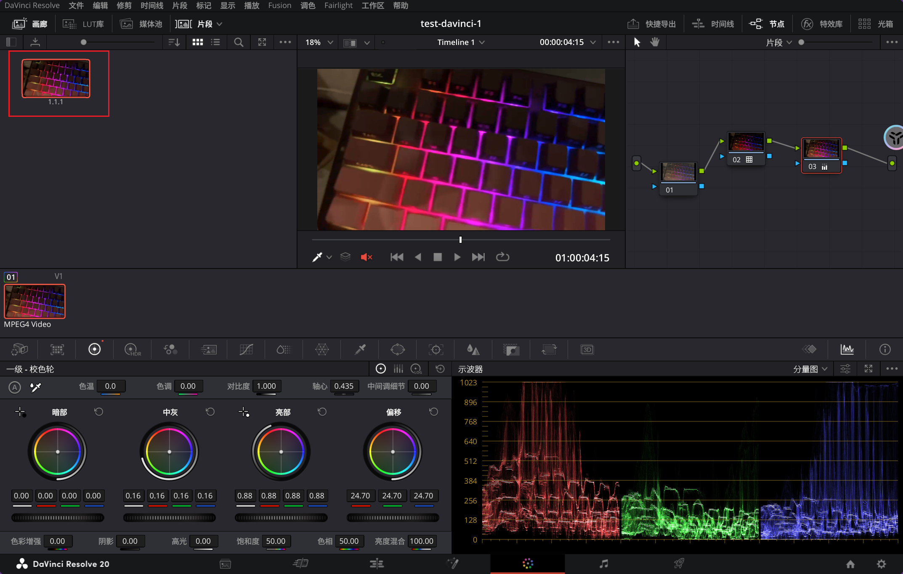

不过其实右键也可以一次性抓取出所有视频素材的静帧，但是我这里素材不多，只有一个视频就不演示了。

在选中某个带处理视频后，如果有多个镜头，就可以先选择一个想要做相同调整的视频，然后使用 `鼠标中键` 或右键点击之前已经做过节点调整的视频，然后点“应用调色”，即可套用节点应用到需要相同调整的视频上。

**曝光**

`ok`，现在该有的基础我们都有了，但是实际上我们还没有开始调色，还处于第二个节点处，现在我们新建立一个节点。这第三个节点专门用来调整过曝和欠曝的问题，只需要保证波形图或分量图中的曲线总体差不多顶天立地就可以了（可以顶地，但是不要太顶天）。

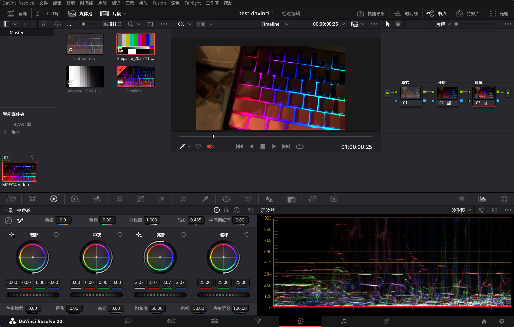

###### 3.2.3.1.4.第四个节点（对白）

专门用来对白，也就是让本该白色的地方恢复白色，这么做可以避免后期调色到处乱飞。不过正常来说，前期处理的时候就应该做到这件事情，这样后期才不用特别去调整。不过前期的不确定确实多，只能尽可能保持对白，因此就需要后期来进行调整。怎么样才是白色呢？直接看波形图就可以，我们需要保证波形图尽可能出现白色波纹。

不过这个其实主要调整色轮中的额外参数“色温”和“色调”就可以。

当然，我们也可以参考达芬奇的软件算法来调整白平衡，点击色轮的“白平衡”吸管工具就可以。

然后也可以检查下矢量图，看看中间的白点是否足够集中，调得越是集中就越是正确对白。

可以打开“显示限定器焦点环/线”来检查是否正确对白，如果正确对白的话，鼠标到视频的某处位置也应该对照到矢量图的中心位置。

###### 3.2.3.1.5.第五个节点（调色）

我们可以直接利用色轮来调整颜色的“饱和”和“色相”。这个就比较简单，就是选择画面偏向的颜色和浓度而已，可以使用色轮实现，也可以使用曲线实现。

这里就简单演示做一个胶片的感觉。

##### 3.2.3.2.二级调色

基本就是一些细节部分的东西了：

- 亮度二级调色
- 色相二级调色
- 饱和二级调色
- 人像二级调色

最后再套一个符合自己个性的风格 `LUT` 就可以啦。二级调色大部分调整的都是一些特殊的情况，这里简单用其他例子提及一下。

###### 3.2.3.2.1.第六个节点（主体）

有些时候我们不管怎么调，都会出现非主体区域过亮的问题，我们先来到窗口工具中。

我们使用圆形窗口框住主体后，调整一下羽化。

然后使用反向选择，然后使用 `[shift+h]` 来打开高亮显示，这里就会清晰看到没有被选中的部分都是灰色的。

然后可以使用曲线来压低背景的亮度。

当然这里只是对整个背景，如果还是觉得某处的亮度太高，继续使用窗口来框选也是一样的效果（甚至可以使用校色轮来继续调出好看的亮度，避免偏向某个颜色）。

这里由于示波器中的分量图显示的颜色有些许偏向绿色和蓝色，因此朝相反方向去拉。

###### 3.2.3.2.3.第七个节点（饱和）

分析问题，通过矢量图可以知道橙色已经超出了范围，这里橘子的饱和度特别高，因此我们需要单独调整一下，但是我们之前大部分操作都是一些全局的修改，如果只为了这点导致我们的其他颜色混乱那就太得不偿失了。

有一个快捷的方式是，打开色相饱和度曲线。

然后吸一下想要修改饱和度的地方。

然后吧对应曲线的饱和度调低就可以了。

此时的饱和度就在矢量图以内了。

> [!IMPORTANT]
>
> 补充：第二种方式就是使用饱和度对饱和度曲线，这曲线最左边代表的是低饱和的部分，最右边代表的是高饱和的部分。
>
> 
>
> 我们可以把高饱和部分的曲线向下拉，同时调高中低饱和度的曲线，也可以达到类似的效果。
>
> 

> [!IMPORTANT]
>
> 补充：第三种方式就是打开色彩扭曲器（色相精度可以选择 `16`，这个具体分析具体判断）。
>
> 
>
> 然后吸取一下高饱和的橘子部分，再用固定按钮固定住扭曲图中的低饱和度橘色。
>
> 
>
> 然后再高饱和度的橘色朝向中心拉动，就可以完成相同的需求。
>
> 

###### 3.2.3.2.4.第八个节点（皮肤）

有些时候人的脸部会出现发黄的情况，这种我们一般都希望调亮一些。可以先使用限定器来吸取脸部的地方。

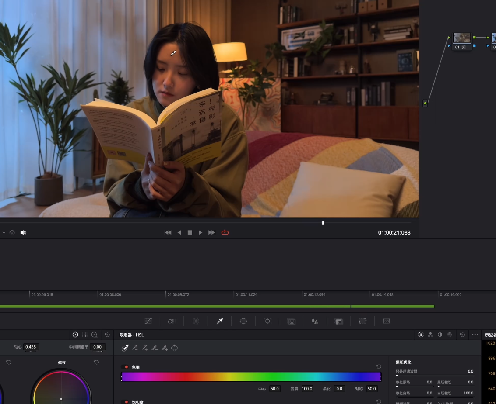

然后使用 `[shift+h]` 来做高亮显示，可以继续使用 `[鼠标左键]` 来吸取所有和皮肤相同的颜色。

但是这样会把画面中所有和皮肤相同的颜色都一起被选中进来。

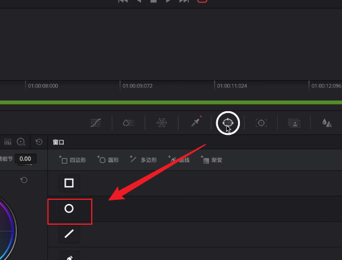

然后可以拉大一点点羽化。

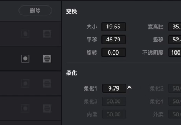

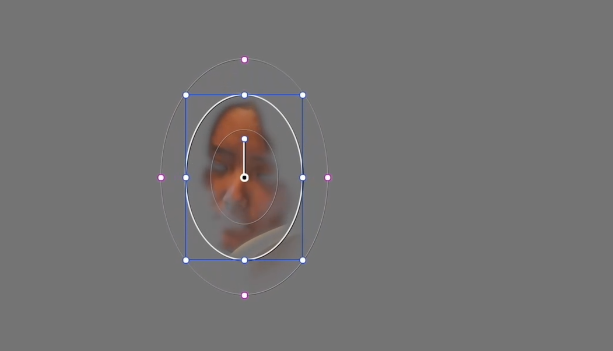

然后可以继续用 `HSL` 吸取直到整个面部都被选中。

可以取消高亮显示后，使用曲线把肤色提亮，同时检查在矢量图中检查肤色是否正常。

如果觉得有些死白，则可以考虑稍微调高饱和度来红润一些。

###### 3.2.3.2.5.第九个节点（电影）

如果您需要画面具备电影感，则可以尝试这个节点的修改。

横容易让人有电影荧屏的效果。

#### 3.2.4.声音处理

##### 3.2.4.1.音轨问题

如果两个小蜜蜂的声音被放在左右两端，这个我们就需要先调整。先选中素材，然后右键打开片段属性，就需要设置为 `mono` 模式，同时选择在达芬奇中想要对应的音轨声道。其他不同声道的视频也可以调整为 `mono` 模式，并且放在不同的音轨声道上。还可以修改下音频的名字，方便后续辨识修改。

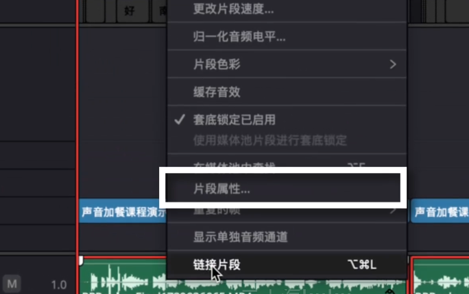

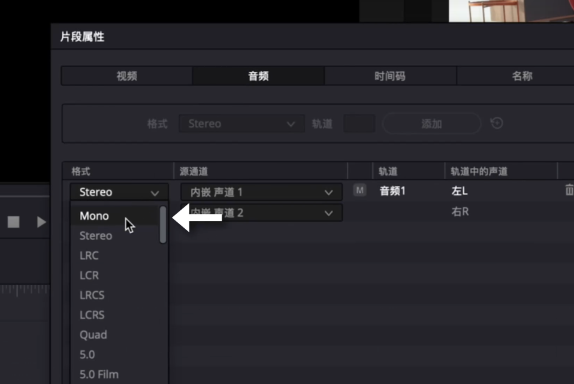

##### 3.2.4.2.音量问题

我们还需要把太小的声音调大，太大的声音调小，也就是所谓调整电平，并且去除被放大的杂音。

可以先使用指针模式选中某个轨道中的所有音频，右键打开归一化电平。将目标电平改为 `-3` 然后点击归一化。在 `Fairlight` 中打开右上角的调音台，找到需要压缩的轨道，这里的轨道是一一对应的。点击对应轨道的曲线得到动态，同时勾选动态和压缩器，这里设置一些常用的参数即可（这会让声音更加紧实）。

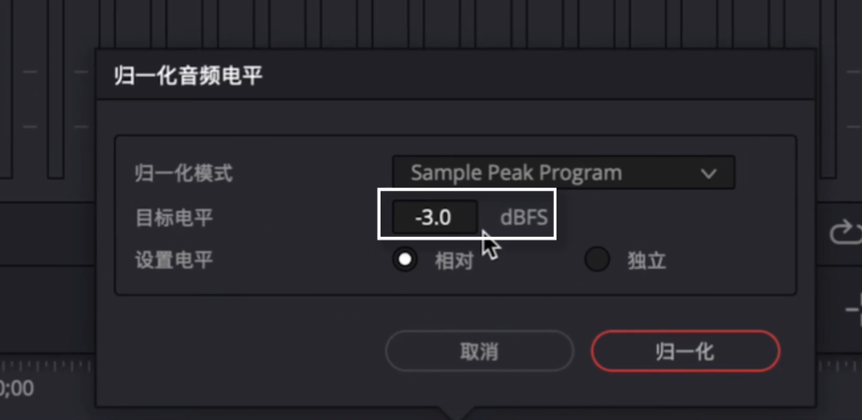

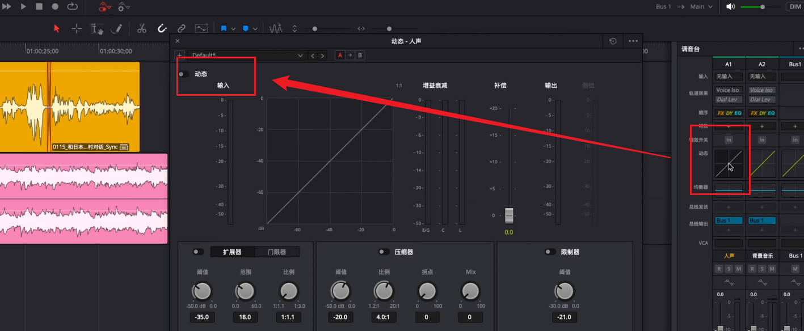

这里对调整的参数再做一些解释，待补充...

- 阈值：阈值越小，被压缩的声音就越多；阈值越大，被压缩的声音就越少
- 比例：声音压掉多少
- 启动：待补充...
- 释放：待补充...

这个时候我们就需要修正噪音了。点击需要降噪的音轨，开启智能减噪。并且悬浮在按钮里点击右侧的调整来调整降噪的效果，数值越大降噪效果就越明显。

> [!IMPORTANT]
>
> 补充：`Voice Iso, 人声分离` 貌似是收费版本才有的

然后我们还需要根据人声的大小来调整音乐的电平，将特效拉到音乐的轨道上，此时就会自动打开效果器，点击右上角的三个点，选择 `Absolute Soale`，然后在下拉菜单中的测量标准。同意在人声轨道也需要指定一个相同的效果器。先播放一边音频得出效果器的整体相差结果，一般音乐需要比人声小 `15LUFS` 左右，这样声音就不会强走人声。

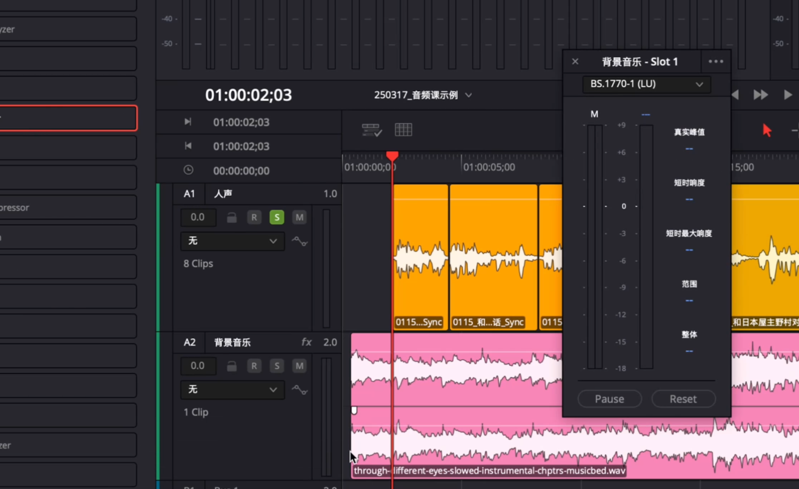

最后我们需要调整“整体响度”，一般定义在 `-16LUFS` 这个大小，需要在输出总线上加挂一个限制器插件。调整为 `-1dBTP` 就可以确保输出的声音电平，然后我们节目调整输入模块中的程度旋钮。一边测量响度一边调整输出响度的大小。

##### 3.2.4.3.底噪问题

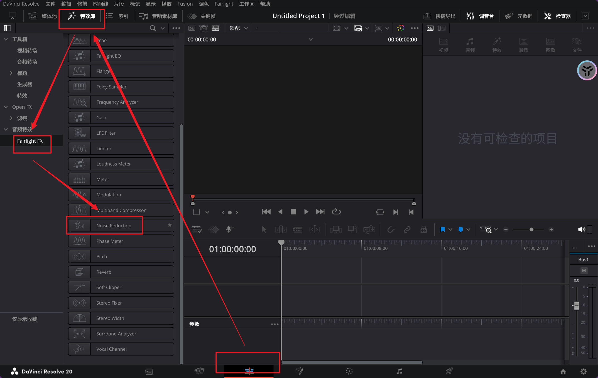

可以选择自动，也可以手动录制噪音的片段后把 `干/湿` 和 `敏感度` 调整到最大，当然也可以自己适当调整。

#### 3.2.5.机位防抖

有些时候，如果出现一些轻微抖动的情况，后期处理就需要做一些补救（这种情况最好少发生，因为一般都有比较稳定的三脚架可以辅助拍摄）。

首先我们需要选择剪辑工作区，然后选中需要稳定的一段视频，接着打开检查器，开启视频面板里面的“稳定”开关，然后我们需要做的就是在这里进行调整。

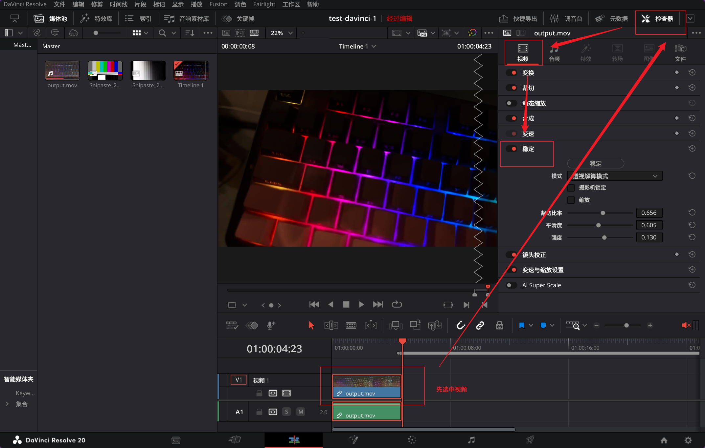

我们先来调整参数，每次调整参数后都需要点击“稳定”按钮生成稳定后的视频，如果对参数有反悔，则可以点击每个参数选项右侧的旋转箭头回复原状。

这里的“摄影机锁定”一般很少使用，有的时候会放大画面，导致效果哪怕是稳定的都不太好，主要原因是因为这个东西的原理就是：达芬奇稳定器会对视频帧中的不同元素进行追踪。比如，场景中的特征点（如边缘、角点等），系统会通过分析这些点在连续帧中的位置变化来捕捉摄影机的运动。根据这些追踪点的变化，软件会计算出摄影机的移动轨迹。包括平移、旋转、缩放等运动。稳定器可以识别这些运动并为后期进行修正。当开启“摄影机锁定”时，稳定器的工作目标就是“锁定”或“固定”这些特征点的位置。也就是说，系统会通过对视频进行平移、缩放、旋转等调整，来消除因为摄影机本身的不稳定而导致的偏移，从而让画面中这些特征点在屏幕上的位置保持稳定。

通常来讲会把缩放勾选上，不过您可以不勾选来观察平稳的程度（可以看到视频的周边都产生了边缘的变化）。

- **裁切比率**：可以控制画面裁剪的比例。该参数决定了画面稳定时裁剪的程度，较高的裁切比率意味着画面会进行更多的裁剪，以确保画面中的不稳定部分被移除。如果选择较高的裁切比率，稳定效果会更强，但可能会造成更多的画面丢失，显示画面范围变小。低裁切比率则保留更多的画面，但可能会牺牲稳定效果
- **平滑度**：控制稳定器平滑运动的强度。平滑度较高时，稳定器会消除更多的不规则抖动，使得画面更加平稳。增加平滑度可以减少画面的突兀运动，使得画面更自然，但如果过高也可能会让镜头动作显得过于“机械”或者失去某些动态感
- **强度**：设置稳定效果的强度。该参数控制稳定器应用稳定效果的力度，数值越高，稳定效果越强，反之则越弱。增加强度可以使得抖动更彻底地消除，但如果过强，可能会导致画面失真或产生过度的裁剪。较低的强度则可能无法有效去除画面中的抖动

#### 3.2.6.视频导出

然后点击“添加到渲染队列”，再点击“渲染所有”，视频导出就完成了。

>  [!IMPORTANT]
>
> 补充：一些可以用来做为调色练习的 [影视素材](https://film-grab.com/)。

#### 3.2.7.调色模板

实际上，每次调色结束后，如果您觉得自己调的还不错，就可以保留作为一份 `LUT` 为后续快速调整节点。当然，具体问题还是需要具体分析。在达芬奇中处理新导入的视频，选直接套自己做的 `LUT` 还是重新调整，核心看新视频的素材基础、项目风格需求，两种方式各有适配场景，具体可结合以下情况判断，同时搭配对应的优化技巧使用：

1. **优先直接套用自制 LUT 的场景**：这种方式适合追求效率、需要统一风格的情况，能大幅减少重复调色工作，尤其适配以下场景：
   - **同批次同参数素材**：如果新视频和之前调色的视频是同一台相机拍摄，且拍摄参数（比如都是索尼 `S-Log3` 或富士 `F-Log2` 格式）、光线环境（同一场景的自然光、同一室内灯光）一致，套用自制 `LUT` 基本能快速得到统一风格的画面。比如同一时段拍摄的旅行 `vlog`、同一场景的短视频，套 `LUT` 后可能只需微调 `1-2` 个参数。
   - **强风格化 / 品牌化项目**：若项目有固定风格要求，比如暖调的美食视频、冷调的科技短片，自制 LUT 本身就是为匹配这种风格打造的。新视频导入后套 `LUT`，能避免风格跑偏，比如系列美妆教程、品牌宣传短片，统一的色调还能增强观众记忆点。
   - **快速出片的轻量化需求**：像短视频、日常 `vlog` 这类不需要极致调色的内容，套用 `LUT` 能节省大量时间。而且套 `LUT` 后还能通过调整输出增益、偏移参数控制风格浓度，若效果稍显夸张，微调即可达标，不用重新调整整套调色参数。
2. **建议具体问题具体分析、重新调整的场景**：`LUT` 本质是固定的颜色映射公式，无法适配所有差异素材，遇到以下情况时，重新针对性调整更能保证画面质量：
   - **素材基础差异大**：若新视频和之前的素材来自不同相机（比如之前是索尼，新的是佳能），色彩空间、伽马曲线不同；或者光线条件差异明显（比如之前是晴天户外，新视频是阴天或夜晚灯光），直接套 `LUT` 容易出现偏色、高光过曝或暗部无细节的问题。例如阴天素材套晴天制作的 `LUT`，可能会让画面更暗、色彩发闷，这时需要先校正白平衡、曝光，再考虑是否叠加 `LUT` 做风格化。
   - **素材存在特殊瑕疵**：新视频若有明显拍摄问题，比如镜头眩光、局部过曝、肤色失真等，直接套 `LUT` 会让瑕疵更突出。比如人物访谈视频中肤色偏黄，此时应先在一级调色节点修复肤色、调整曝光，再根据需求决定是否套 `LUT`，而非依赖 `LUT` 掩盖问题。
   - **追求个性化画面效果**：如果新视频是整个项目中的特殊片段，需要突出画面重点，比如短片中的特写镜头、转场镜头，套统一 `LUT` 可能会让画面失去特色。这时重新调整能针对性强化细节，比如提高特写镜头的锐度、调整转场镜头的色调过渡，让画面更有层次感。

另外还有个折中技巧：可以先套自制 `LUT` 做基础风格铺垫，再新建调色节点，针对新视频的问题做局部微调（比如修正白平衡、找回高光 / 暗部细节）。这种方式既保留了 `LUT` 的效率优势，又能解决素材差异带来的问题，兼顾效率和画面质量，是多数场景下的稳妥选择。

这样就可以了，`LUT` 也可以导出到 `BC` 中去使用。

## 4.深入研究

### 4.1.前期深入

实际上我认为我前面对于一些工具的描写不算深入，因此这里需要稍微写细一些。针对前期工具和后期工具，我们来学得更加仔细学习一些知识，我们需要了解不同的专业相机的区别。但是您如果要学习这个部分，必须拥有一台相机，随便一台就可以，但是不要是那种懒人相机。

待补充...预计会看这个课程：

- [单反拍摄教程](https://www.bilibili.com/video/BV1Bf4y1T74X/?spm_id_from=333.1007.top_right_bar_window_custom_collection.content.click&vd_source=c92c89dbfcf9cc30c48086469621f35b)
- [常见场景拍摄](https://www.bilibili.com/video/BV1x4411F7bs/?spm_id_from=333.1007.top_right_bar_window_custom_collection.content.click&vd_source=c92c89dbfcf9cc30c48086469621f35b)

### 4.2.后期深入

这里我们对我们的达芬奇再做一个系统性的学习，我主要也是根据 [飓风影视的这个系列视频](https://www.bilibili.com/video/BV1s7411F7JV/?vd_source=c92c89dbfcf9cc30c48086469621f35b) 来进行学习的。

## 5.插件推荐

待补充...

## 6.开发能力

待补充...
