# 动画加成

## 1.环境安装

待补充...

## 2.基础工具

设置宽度 `3840px` 和 `2160px` 即所谓的 `4k`，然后设置像素长宽比为 `方形像素`，帧速率为 `30`，分辨率为 `完整`，开始时间设置为 `0:00:00:00`，结束时间 `0:00:30:00`，背景颜色改为，然后保存为一个名为 `4k30` 的预设。

## 3.快速体验

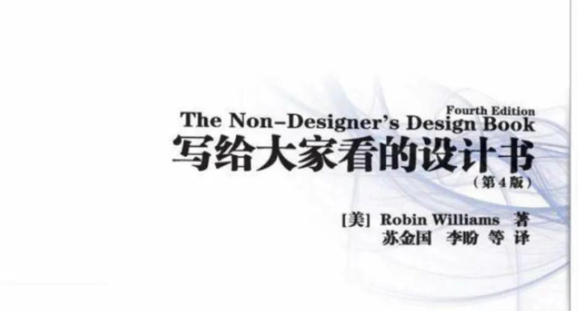

对齐、对比、亲密、重复

> [!IMPORTANT]
>
> 补充：这里补充未来我将作为 `UP` 主之前的计划思路
>
> 1. **平台矩阵**：野心大一些，争取在主流平台都发布视频 `Bilibili/Youtube/Tiktok`，其中主要平台是 `Bilibili`
> 2. **个人风格**：需要研究考虑自己的五件套（昵称、头像、顶态、简介、封面），以及使用便当盒风格
> 3. **确定内容**：这里将为您展示我是如何确定自己的 `UP` 主风格的，首先我希望我的视频是具备酷炫的风格的，最好带点极客，毕竟我的第一份职业是程序员，这种酷酷的风格我也比较喜欢。而我的制作内容我认为是可以多项的：
>    - 技术分享：可以是我在日常技术工作的分享
>    - 事物探索：可以是我在某些陌生领域的探索
>    - 生活内容：可以是我在各种毫无厘头的日常
> 4. **地区语言**：毕竟我不满足于一些视频的限制，而成为一个长视频的 `UP` 主的话，则需要包含两种语言，我需要制作双语适配，因为不满足于国内平台（属于是野心比较大的）。尽管我不太懂英语，但是这个点可以使用 `AI` 工具来进行搭配
> 5. **资源合集**：做视频如果需要考虑商用，则需要进一步考虑一些可商用的素材的使用，并且还需要维护一个属于自己的素材库，同时需要具备一个素材嗅探的能力：
>    - [智能工具合集](https://top.aibase.com/discover)
>    - [代码精美图片](https://carbon.now.sh/?bg=rgba%28171%2C+184%2C+195%2C+1%29&t=seti&wt=none&l=auto&width=680&ds=true&dsyoff=20px&dsblur=68px&wc=true&wa=true&pv=56px&ph=56px&ln=false&fl=1&fm=Hack&fs=14px&lh=133%25&si=false&es=2x&wm=false)
>    - [微信聊天模拟](https://www.11fx.cn/tool/wx/)
>    - [宣传插画绘制](https://www.canva.cn/)
>    - [日本职场小人](https://www.irasutoya.com/)
>    - [图片转字符画](https://playground.z.wiki/char-paint/index.html)
>    - [可以商用字体](https://www.100font.com/)
>    - [风格化制视频](https://freedesigntool.online/tonekit)
>    - 制取色彩素材
>
>      - [纯色制作](https://uutool.cn/pure-color-img/)
>      - [中国色](https://zhongguose.com/)
>      - [palettemaker](https://palettemaker.com/app)
>    - 抠取图片素材
>    
>      - [改图鸭](https://www.gaituya.com/jiashuiyin/)
>      - [removebg](https://www.remove.bg/zh)
>    - 爬取视频素材
>    
>      - [cobalt](https://cobalt.tools/)
>      - [tubedown](https://tubedown.cn/youtube)
>      - [snapany](https://snapany.com/zh/bilibili)
>    - 获取媒体素材
>
>      - [pexels](https://www.pexels.com/zh-cn/)
>      - [pixabay](https://pixabay.com/#login)
>      - [黑罐头](https://www.heycan.com/home?from=search_result_page)
>    
>      - [iconfont](https://www.iconfont.cn/?spm=a313x.illustrations_index.i3.2.59c13a81hbxC06)
>      - [icons.download](https://icons.download/)
>      - [appicon-forge](https://zhangyu1818.github.io/appicon-forge/)
>      - [icon-icons](https://icon-icons.com/)
>      - [flaticon](https://www.flaticon.com/?k=1764340818109&sign-up=google)
>      - [淘声 toSound](https://www.tosound.com/)
>    - 流程图标绘制
>    
>      - [excalidraw](https://excalidraw.com/)
>      - [processon](https://www.processon.com/diagrams)
>    - 表情包集装箱
>    
>      - [symbl](https://symbl.cc/cn/)
>      - [emojipedia](https://emojipedia.org/telegram)
>      - [emojiall](https://www.emojiall.com/zh-hans)
>      - [hehuan](http://www.hehuan.co/tag/kaixin-1-5.html)
> 6. **人声配音**：考虑找同学配音，或者自己配音，或者 `AI` 配音（其实最好是自己配音，这里我还是先考虑自己配音）
> 7. **视频封面**：视频需要一个符合主题的封面，同时又要有个人的风格
> 8. **动画模板**：作为一个长视频的一个 `UP` 主，需要有一个动画模板覆盖一整个系列
>    - 简介动画（切入自己的头像以及，要个简介关注）
>    - 开头动画（采用便当盒来快速切入片段、时间、概要、标题）
>    - 内容动画（剧情高潮需要，要个高潮关注）
>      - 全场背景动画（对空缺场景的替补）
>      - 定稿标题动画（对文案标题的展示）
>      - 间隔转场动画（对场景切换的特效）
>      - 运动跟踪动画（对物体简单的概括）
>      - 动态拼贴动画（对某些故事的描述）
>      - 数据图标动画（对数据图表的可视）
>      - 扁平原理动画（对原理解析的处理）
>      - 粒子效果动画（对特殊节日的氛围）
>      - 文字特效动画（对）
>    - 结算动画（制作过程、拍摄花絮、互动数据、文献列表）
> 9. **商业合作**：所有的商业活动（包括花火）都需要在到达 `1000` 粉，因此需要到达这个目标后才可以，故我判断第一个视频必须质量做到最好，然后使用付费工具投粉丝！

### 3.1.联动动画✅

先使用钢笔工具绘制曲线笔画路径。

然后添加修建路径动画，并且设置动画以符合笔画长度和形状。

绘制完成所有笔画后，就添加弹性表达式。

hai yoh

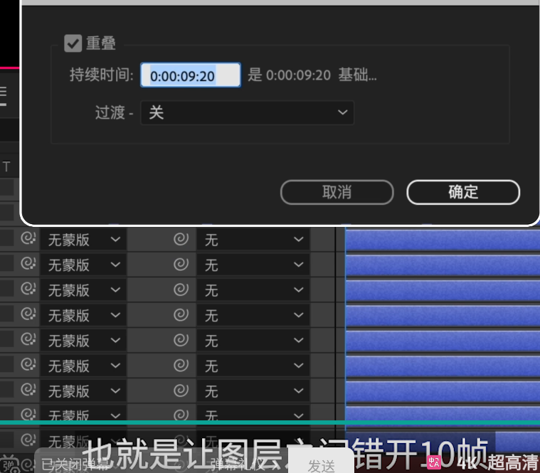

### 3.2.简介动画✅

需要做一个封面模板，然后把视频的主要内容做个快速剪辑，同时作为视频的封面来使用。

### 3.4.开头动画✅

新建合成

保存文件

双击矩形工具创建和合成界面大小相同的矩形

导入视频

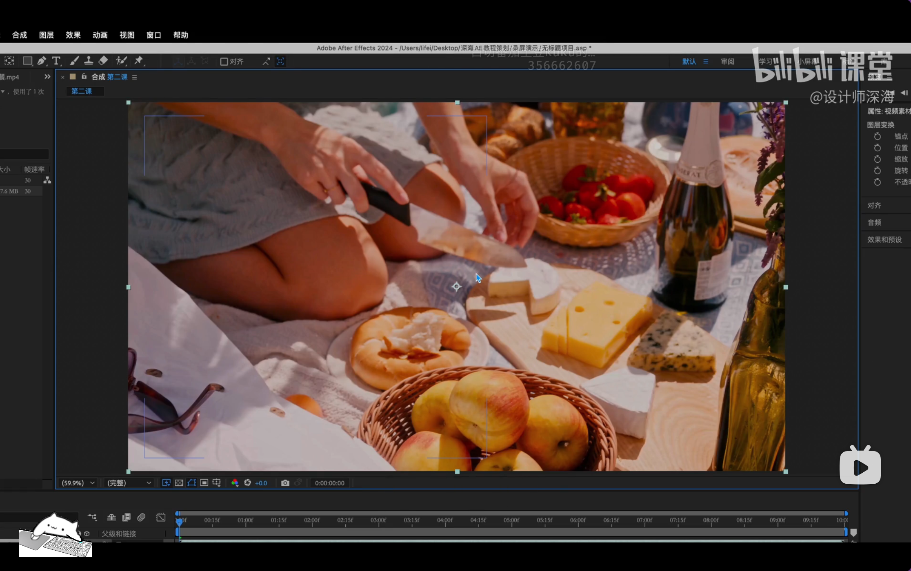

确保对齐。

移动使得中心对齐

打开蒙版

设置主颜色

对齐文字。

图形内锚点居中使用 `[ctrl+alt+home]`，整个图形设置锚点居中使用 `[ctrl+home]`。

> 或者使用移动的概念。
>
> 
>
> 上面是相对于合成左上角或父亲锚点的位置来说的位置，下面的是图形本身中心点对于锚点的位置。

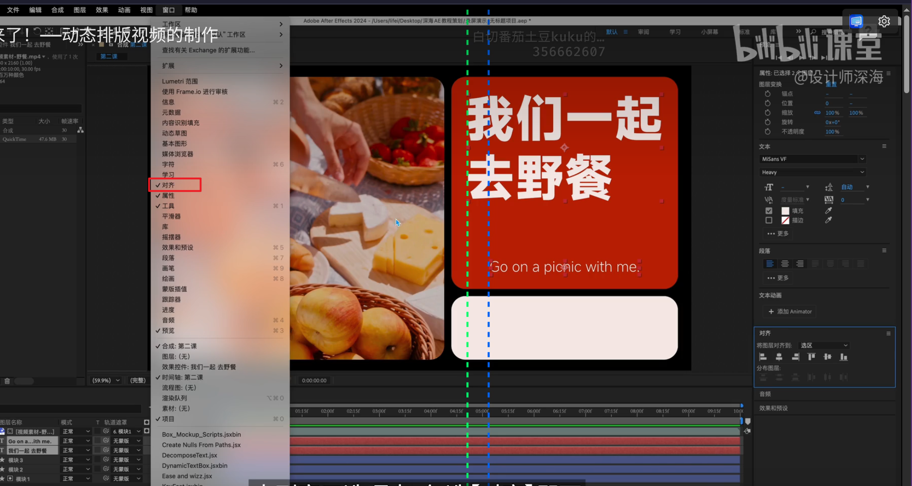

居中锚点。

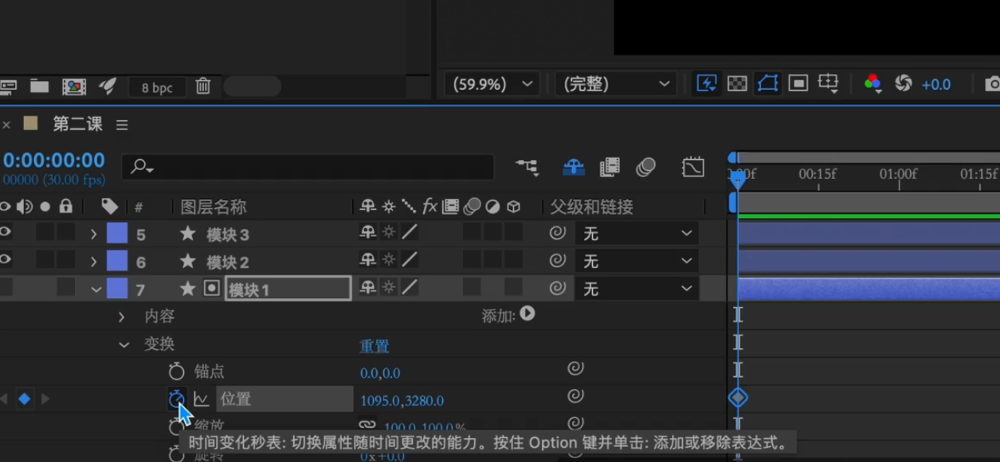

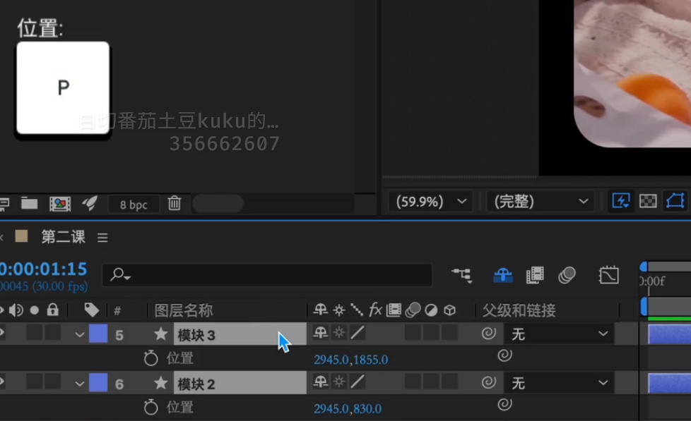

缓入（画面外进入可以选择）-缓动（画面之中移动可以选择）-缓出（画面内外出可以选择）

然后选中所有关键帧（快捷键 `U` 可以查看所有的关键帧）

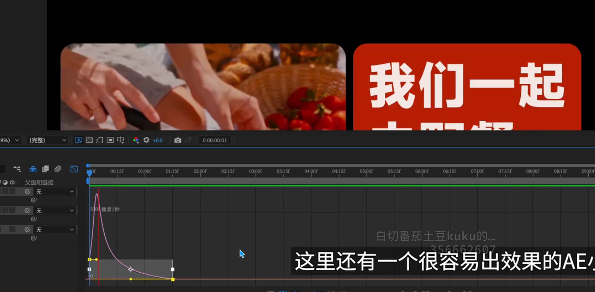

相差 `1/3 s` 比较容易出效果。

不使用变换中的缩放是因为不好控制。

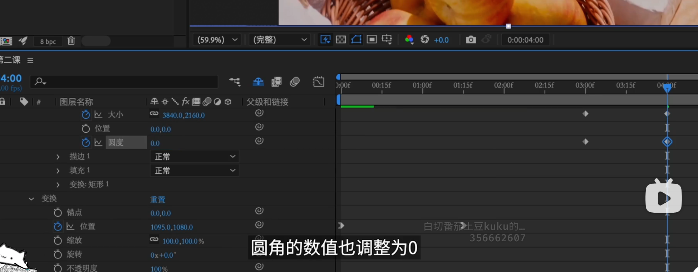

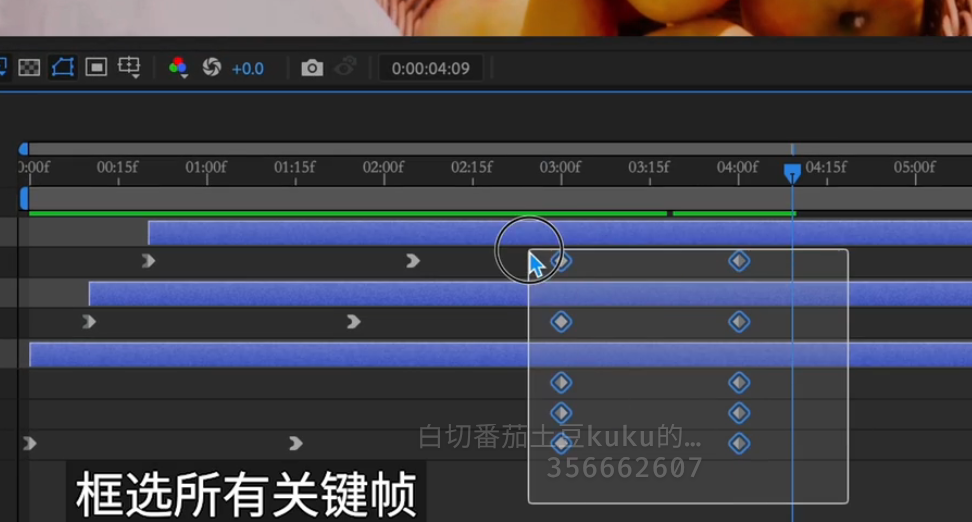

锁定是为了方便有些时候无需调整高度的关键帧。

> [!IMPORTANT]
>
> 补充：

### 3.4.内容动画✅

#### 3.4.1.全场背景动画✅

这个黑色背景没有什么思路就用下面的颜色。

阶梯式灰色调。

这个配色尽量不要配非常接近的颜色，缺失对比感，当然也要看情况。

#### 3.4.2.定稿标题动画✅

#### 3.4.3.间隔转场动画✅

- 直接硬切：最为直接，但是效果最为单调
- 出现消失：利用透明、缩放、位置来作为转场
- 演出清场：类似落幕和开幕的感觉
- 混乱关联：视觉效果最为冲击
- 运动镜头：适合关联程度比较高的转化
- 风格转化：使用一些特定的素材来进行切换

#### 3.4.4.运动跟踪动画✅

#### 3.4.5.动态拼贴动画✅

#### 3.4.6.数据图表动画✅

#### 3.4.7.扁平原理动画✅

#### 3.4.8.粒子效果动画✅

#### 3.4.9.立体文字动画✅

#### 3.4.10.时钟加载动画✅

#### 3.4.11.笔画拆分动画✅

### 3.4.结算动画✅

这个还需要拉长时间，时间看文献的长度，并且需要缩小一下展示的大小，方便展示文献。

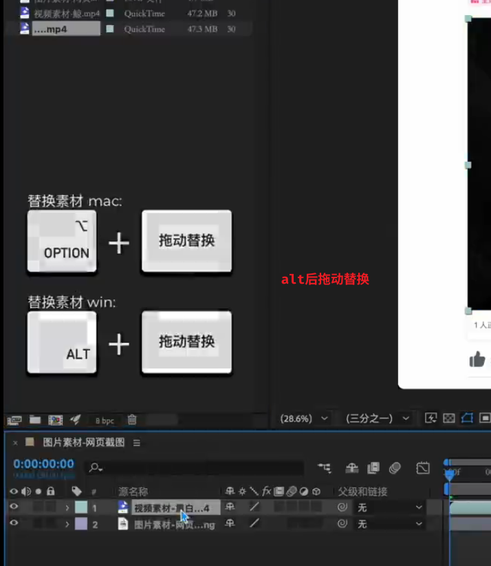

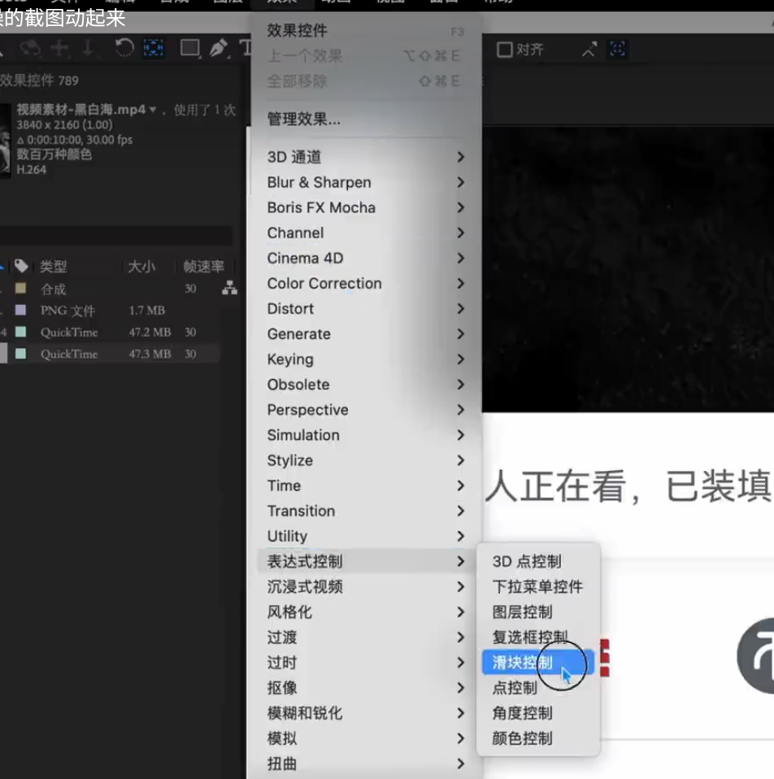

## 4.深入研究

待补充...

## 5.插件推荐

实际上脚本更加偏向快捷实现本来就可以实现的功能

而插件则是在 AE 中拓展原本难以实现的功能

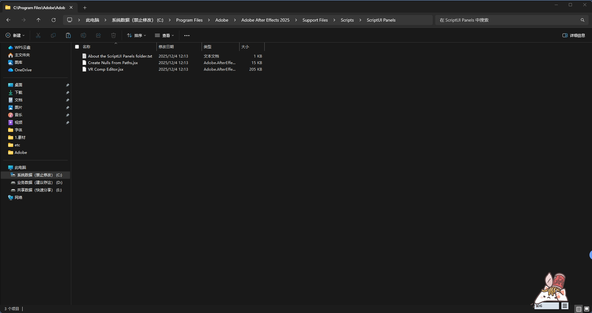

## 6.开发能力

待补充...

