# 毕业生法律问题

法律问题超级容易过时...因此这里只是简单写一下而已，后续会删除。

## 1.三方协议

三方协议全称《全国普通高等学校毕业生就业协议书》，由：

- 学校
- 用人单位
- 毕业生

三方共同签订。它是明确三方在就业择业过程中权利义务关系的书面协议，对签约三方均有约束力。主要解决毕业生档案、户口迁移等就业手续问题，保障用人单位用人权和毕业生就业权。对于广东省的毕业生来说，毕业生与用人单位双向选择，确定聘录用关系的，可通过 “广东大学生就业创业” 微信小程序申请《普通高等学校毕业生、毕业研究生就业协议书》（以下简称 “电子协议书”）。

签订三方协议本身不影响考公考编，但需确保不签订劳动合同、不缴纳社保（具体看用人单位要求）、妥善处理档案。报考时需结合招录公告的应届生认定标准，如实申报就业状态，避免因操作失误或隐瞒信息导致资格问题。**电子就业协议通常就是指三方协议的电子版本**，下面是申请就业协议的过程。

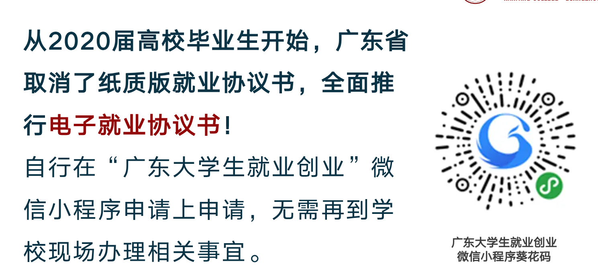

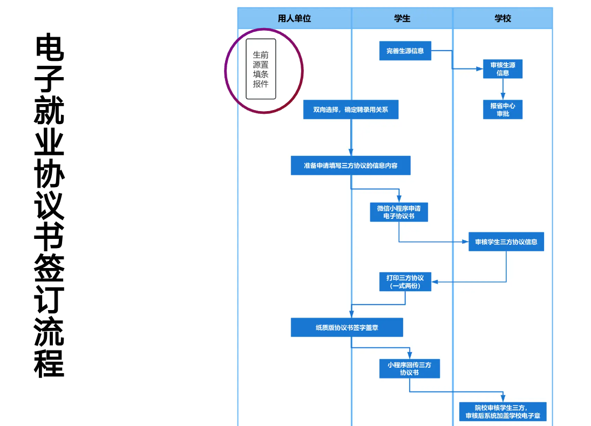

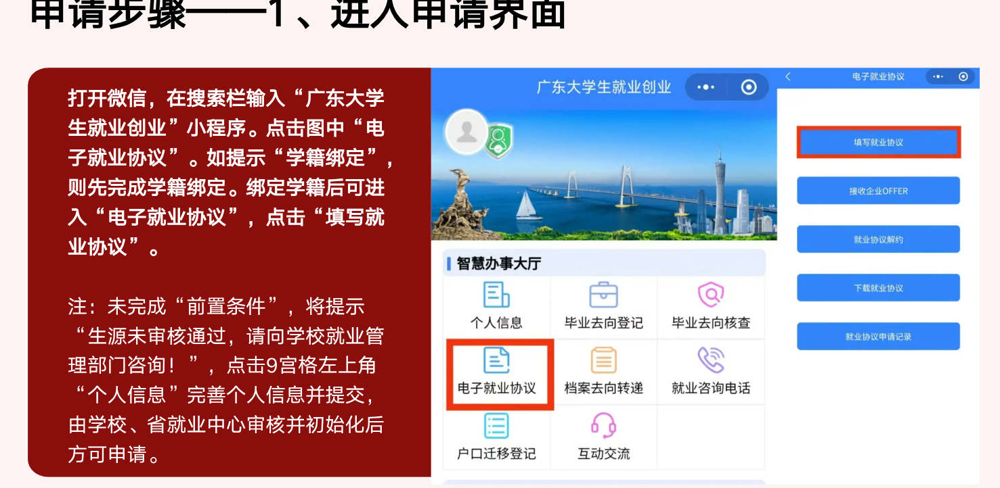

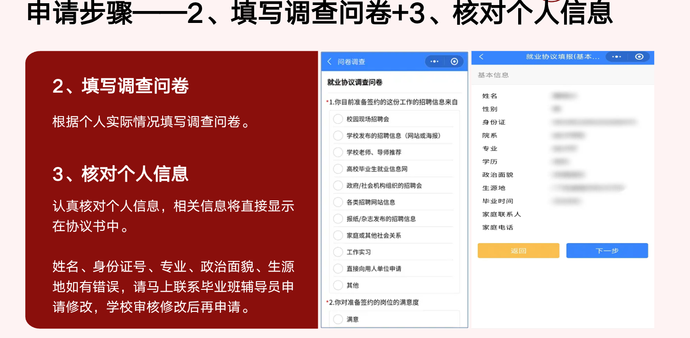

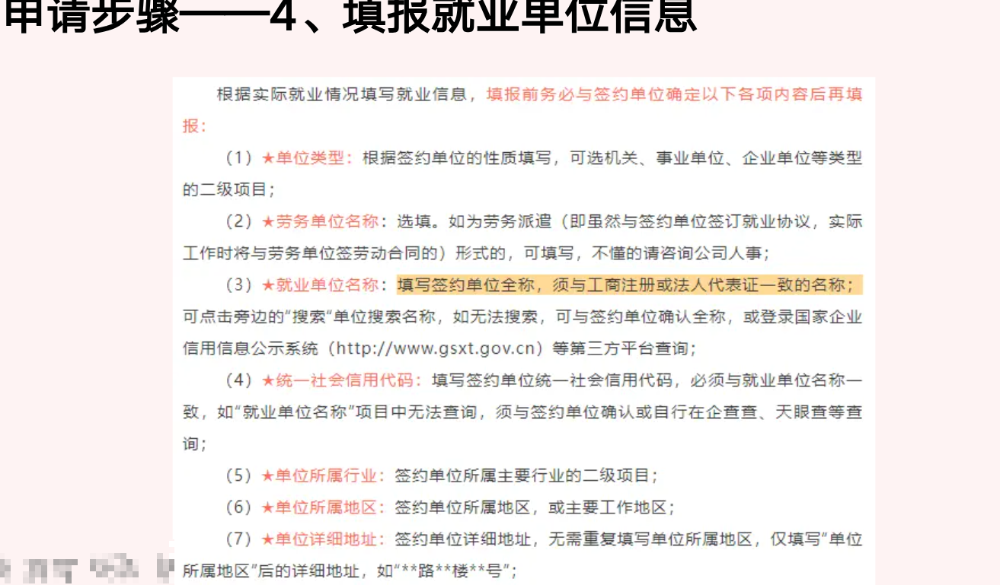

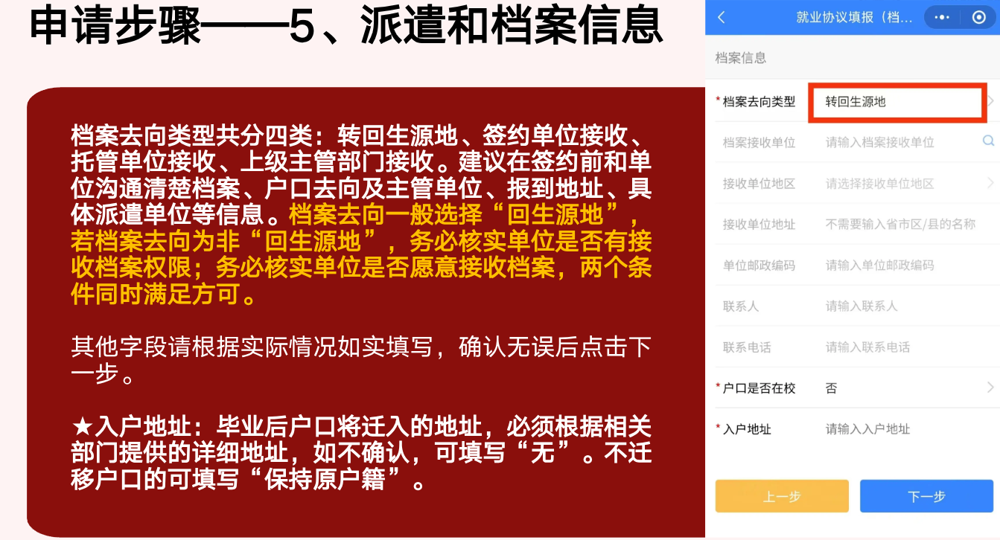

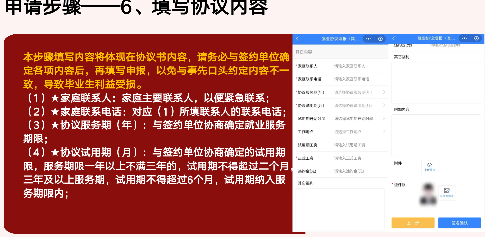

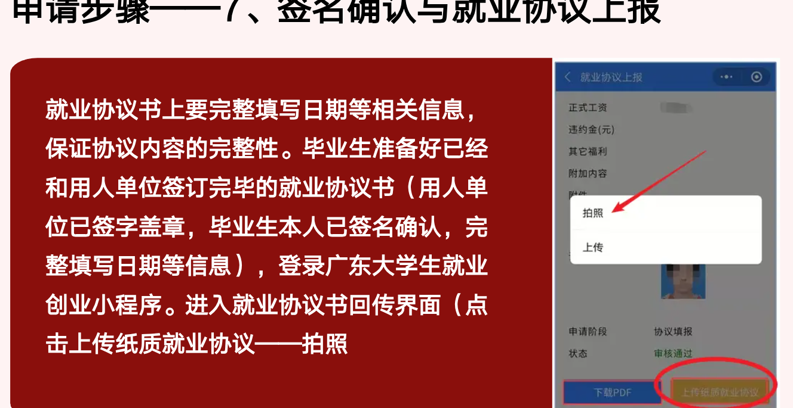

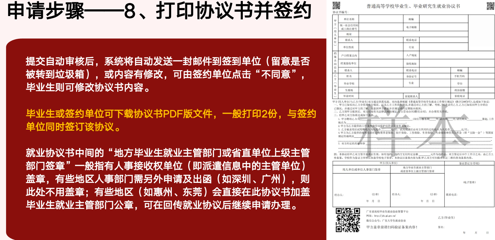

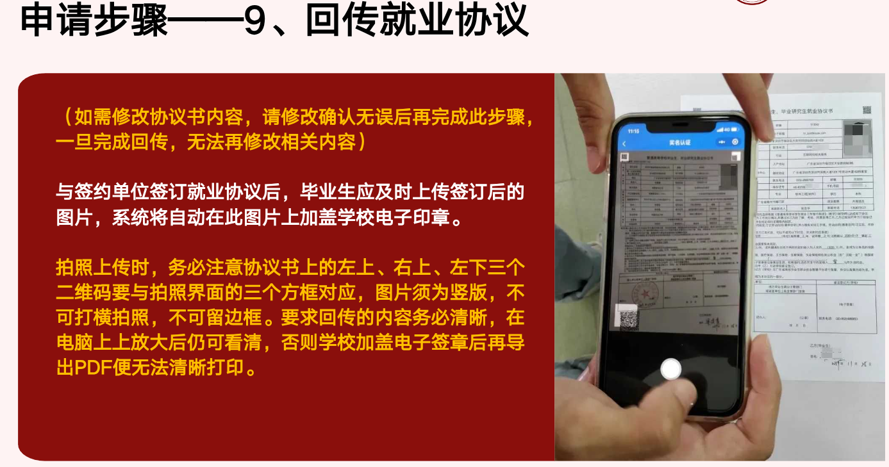

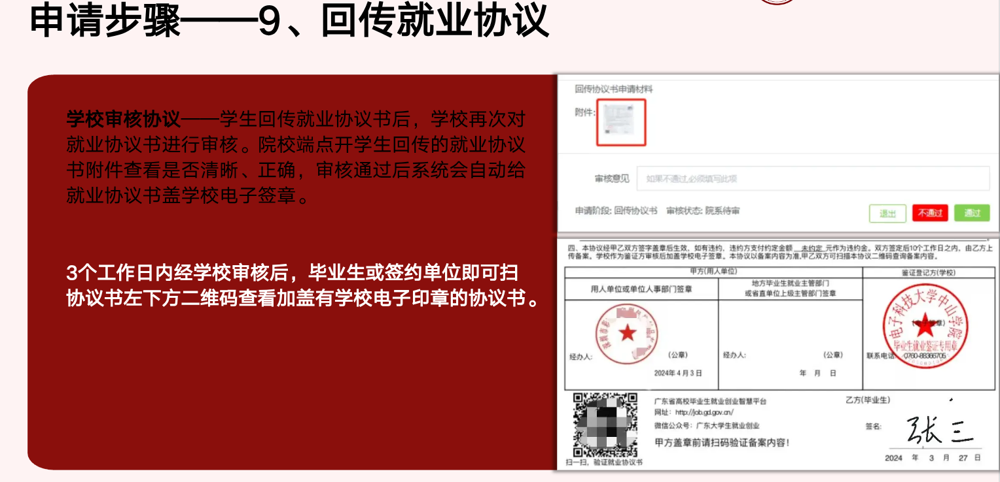

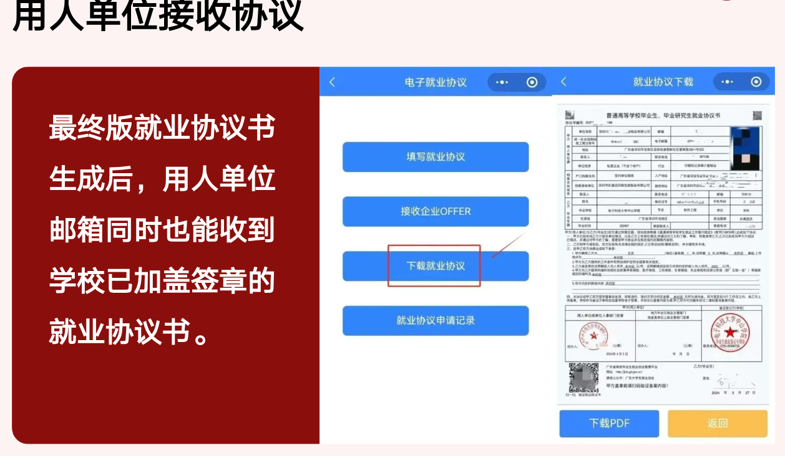

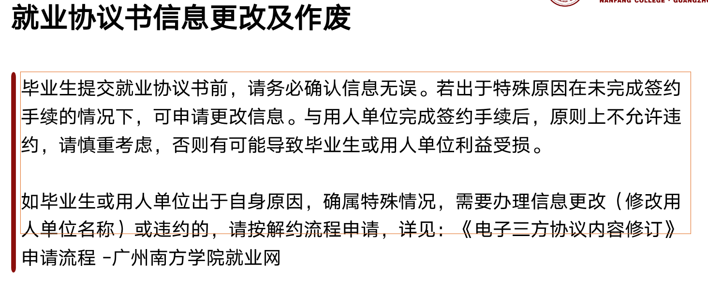

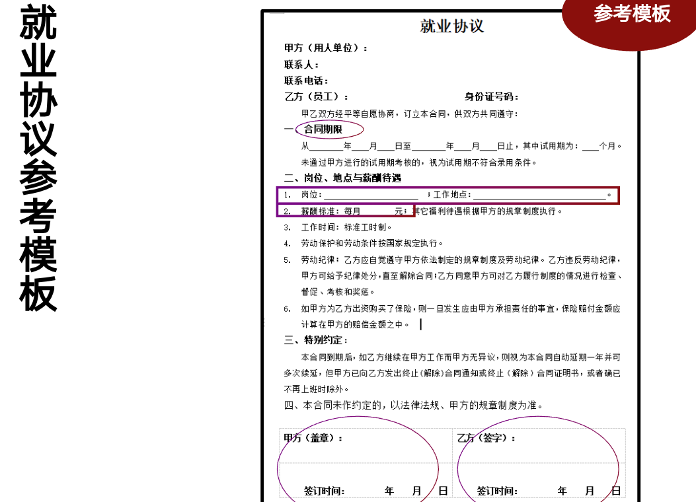

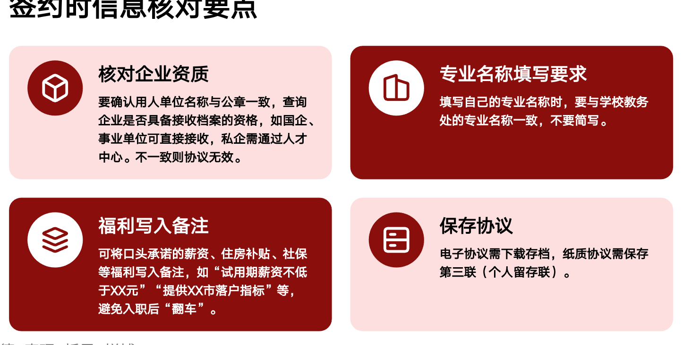

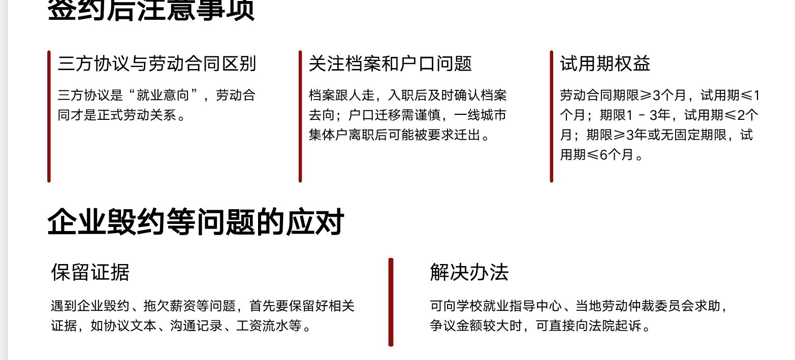