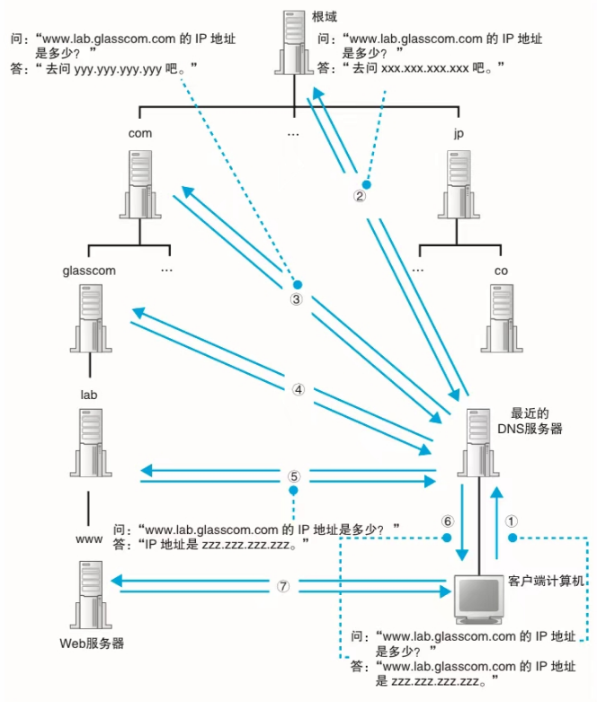
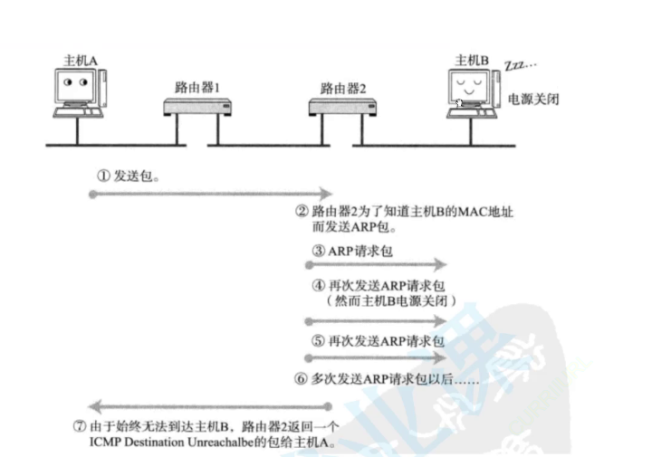
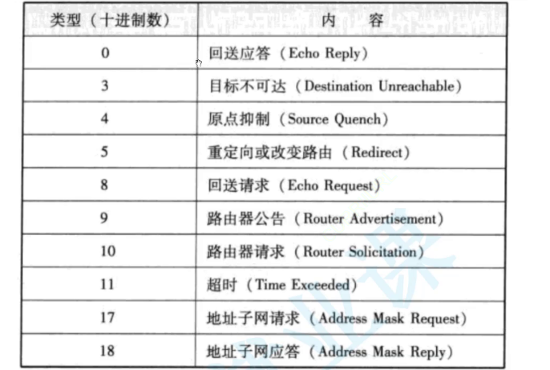

# 其他协议

## 1.应用层

### 1.1.DNS 协议

#### 1.1.1.域名解析概念

`DNS` 是一套从域名映射到 `IP` 的系统，属于应用层协议。内部大多使用 `UDP` 协议，并且多用于浏览器的 `URL` 解析中。主要是方便人们使用容易记忆的域名来访问难以记忆的 `ip` 地址字符串。因此域名其实不是因为技术诞生的，只是为了方便不了解技术的人们使用。而一个完整域名一般可以切分为几类：

1.  **顶级域名(TLD)**：
    -   **通用顶级域名(gTLD)**，如 `.com`、`.net`、`.org` 等，可以被任何人注册使用
    -   **赞助顶级域名(sTLD)**，由某些组织或行业赞助，如 `.jobs`、`.travel`
    -   **国家代码顶级域名(ccTLD)**，由各个国家或地区管理，如 `.cn`（中国）、`.us`（美国）、`.uk`（英国）
    -   **新顶级域名(nTLD)**，随着互联网的发展，新引入的顶级域名，如 `.blog`、`.online`
    -   **保留域名**，根据 `DNS` 规范，某些域名被保留，不能被注册或使用，如 `.test`、`.example`
2.  **二级域名(SLD)**，这是位于顶级域名之下的域名，如在 `google.com` 中的 `google` 就是二级域名
3.  **子域名(Subdomain)**，位于二级域名之下，可以用于组织内部的不同部门或服务，如 `mail.google.com` 中的 `mail`

而域名解析就需要根域名服务器，只要这个服务器挂掉，所有的域名解析都会停止（但是能使用 `ip` 地址访问）。在 `Linux` 下也有域名解析的工具 `dig`，您可以稍微使用一下。

#### 1.1.2.域名解析原理

域名是根据 `.` 来分级的，域名越靠右边，层级越高，而一个层级就被称作域。而 `DNS` 服务器也会分级，这些域名的信息会被注册到 `DNS` 服务器中，这里我们假设一个 `DNS` 服务器只存储一个域的信息。

- 没有域名解析的服务器，访问各个服务器上的文件数据、服务程序、远程操作...时，都需要使用 `ip + port` 来访问。
- 我们尝试解析一个域名 `http://limou.work.com`，我们需要向最近的 `DNS` 服务器请求，`DNS` 服务器会接受 `http://limou.work.com.` 作为解析
- 这里有个前提，根域 `DNS` 服务器的 `IP + PORT` 每个下载好的浏览器都是知道的
- 开始请求，客户端最近的 `DNS` 服务器根据 `URL` 最后一个 `.` 会向根域服务器请求，根域服务器解析自己的键值表，找到 `com` 对应的域服务器的 `IP` 地址，就会返回这个 `IP` 给上面那台离客户端最近的 `DNS` 服务器
- 继续请求，客户端最近的 `DNS` 服务器根据 `URL` 最后一个 `com` 会向较下级域服务器请求，较下级域服务器解析自己的键值表，找到 `work` 对应的域服务器的 `IP` 地址，就会返回这个 `IP` 给上面那台离客户端最近的 `DNS` 服务器
- 继续请求，客户端最近的 `DNS` 服务器根据 `URL` 最后一个 `work` 会向更下级域服务器请求，更下级域服务器解析自己的键值表，找到 `limou` 对应的域服务器的 `IP` 地址，就会返回这个 `IP` 给上面那台离客户端最近的 `DNS` 服务器
- 这样逐步解析，就会找到另外一台主机的 `IP` 地址，条件允许的话，就可以开始通信了
- 不过这样的消耗是很大的，因此就需要做缓存机制，在距离客户端机器最近的 `DNS` 服务器中，会把常用的 `IP` 和 `域名` 键值对数据缓存起来，方便快速访问，降低解析压力

#### 1.1.3.域名解析图解

下图非常简要解释了这个原理。

### 1.2.SMTP

邮件传输协议。

### 1.3.FTP

文件传输协议。

### 1.4.Telnet

明文登陆远程主机。

### 1.5.SSH

加密登陆远程主机。                         

## 2.传输层

待补充...

## 3.网络层

### 3.1.ICMP 协议

网络层中最主要的协议就是 `IP` 协议，但是在测试网络的时候，还可能会使用到 `ICMP` 和 `IGMP` 这两种网络层协议，我们这里先重点讲解 `ICMP`。有可能组建局域网的管理员需要检查网络健康状态，就可能需要使用这种不以数据传输作为目的的协议。单纯发送 `IP` 报文时，如果对端主机掉线导致丢包，组建子网的路由器不会给发送方主机任何响应。因此这种情况下就很难检查网路的健康状态，一旦网络出现问题，只能得到丢包的粗浅结论（但是无法得知具体是哪一个设备丢包了）。

因此操作系统会提供特殊的套接字接口，允许绕过传输层，直接使用网络层的 `ICMP` 协议发送 `icmp` 报文，但是这种报文正文中放的就是 `ARP` 的报文。此时发送方发送 `icmp` 报文给路由器后，如果接收端出现丢包问题，路由器不会直接把 `icmp` 报文丢弃，而是会进行响应。响应中会携带网络传输出错的具体原因（设置在报头中），这样检查网络状态就会比较方便。

`ping` 命令经常用来检测网络状态，这个命令底层的实现逻辑就是一个应用层程序通过特殊的套接字接口直接绕到网络层使用 `ICMP` 协议的例子。而这种特殊套接字就是原始套接字，常用于编写一些常见的网络工具（我们之前用的大部分都是网络套接字）。而由于这一层没有端口号的概念，那么原始套接字的调用中也绝对不用用到端口号的设置...

>   [!IMPORTANT]
>
>   补充：要实现这种机制，路由器本身也需要支持在网络层的 `ICMP` 协议的实现。

>   [!IMPORTANT]
>
>   补充：`ICMP` 协议目前只支持 `ipv4`，想使用 `ipv6` 就只能使用 `ICMPv6` 协议。

### 3.2.IGMP 协议

`IGMP` 专注于多播通信的管理，是一种组管理协议，主要服务于局域网内的多播流量。

### 3.3.DHCP 协议

动态分配 `ip` 地址用的。

**RIP**（Routing Information Protocol）和 **OSPF**（Open Shortest Path First）是两种常见的 **路由协议**，它们用于在计算机网络中动态选择和维护路由。它们的主要区别在于工作原理、适用范围、效率和扩展性等方面。

### 3.4.RIP 协议

`RIP` 是一种基于 **距离向量** 的路由协议，它通过交换路由表来选择最佳路径。`RIP` 使用跳数作为路由的度量标准，最多支持 `15` 跳，超过 `15` 跳的目标被认为不可达。适用于小型或中型网络，特别是当网络规模不大，拓扑变化不频繁时。

### 3.5.OSPF 协议

`OSPF` 是一种 **链路状态** 路由协议，它使用 `Dijkstra` 算法计算最短路径，并且能够提供更快速的收敛和更好的扩展性。`OSPF` 是 **开放标准**，广泛应用于企业和大型网络中。适用于中型到大型网络，尤其是在需要高效收敛、可扩展性和更高网络稳定性的环境中。

## 4.链路层

### 4.1.CSMA/CD

带有冲突检测的 **载波侦听多路存取**，这是早期以太网（同轴电缆和早期版本双绞线这样的半双工网络）所使用的访问方式。

其工作原理就是每一台电脑先感知线缆是否空载，如果是才发送数据，这样就可以防止任何碰撞。不过如果 `CSMA/CD` 报文本身发生了碰撞，就会导致双方电脑等待一个随机的时间，并且向所有同网络上的主机发送拥塞信号，然后再重新发送数据。这样数据发送就可以是错开发送的，避免在同一点上进行碰撞。

但是如今的网络大部分都可以全双工网络，数据允许双向同时沟通。

### 4.2.CSMA/CA

**载波侦听多路访问**，这中访问方式是在无线网络中给载波传输使用的，和有线网络一样，无线网络也需要避免碰撞。但是由于无法使用电缆来直接检测碰撞，因此 `CSMA/CA` 会使用最大尝试来避免碰撞。这个方法里当一台电脑通过无线发送数据时，会先感知有没有其他计算机的传输在进行，如果它检测到其他传输，就会等待一段短的时间。

再次检查频段时，如果没有任何传输进行，就会随机等待一会，然后开始传输数据。接受者就会返回响应，如果没有重复上述过程。

> [!IMPORTANT]
>
> 补充：可以看这个 [讲解视频](https://www.bilibili.com/video/BV1UE411F7o7/?spm_id_from=333.337.search-card.all.click&vd_source=c92c89dbfcf9cc30c48086469621f35b) 进行学习。

## 5.物理层

待补充...

## 6.两层间

### 6.1.网络层和链路层之间

#### 6.1.1.ARP 协议

方便 `ip` 地址映射到 `mac` 地址的协议。

#### 6.1.2.RARP 协议

方便 `mac` 地址映射到 `ip` 地址的协议。

