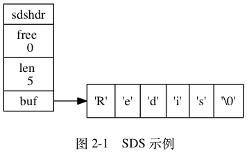
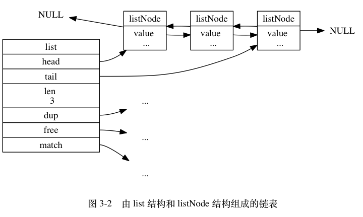
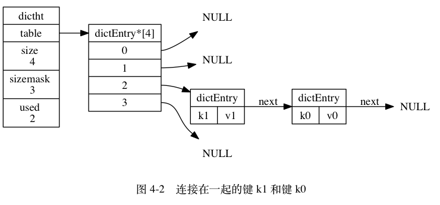
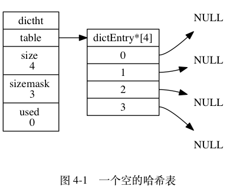
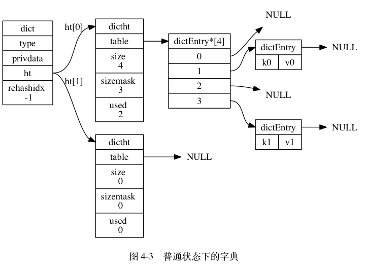

# 源码阅读

## 1.结构和对象

下面的内容是通过 [W3C](https://www.w3cschool.cn/hdclil/qkd72cqm.html) 阅读而来的内容，我做了一些整理和修改，并且参考的是加上 [注解的 Redis3.0 的这份源代码](https://github.com/huangzworks/redis-3.0-annotated)。这里复制了一份源码文件内容解读：

| 文件                                                         | 作用                                                         |
| ------------------------------------------------------------ | ------------------------------------------------------------ |
| `adlist.c`、`adlist.h`                                       | 双端链表数据结构的实现。                                     |
| `ae.c`、`ae.h`、`ae_epoll.c`、`ae_evport.c`、`ae_kqueue.c`、`ae_select.c` | 事件处理器，以及各个具体实现。                               |
| `anet.c`、`anet.h`                                           | `Redis` 的异步网络框架，内容主要为对 `socket` 库的包装。     |
| `aof.c`                                                      | `AOF` 功能的实现。                                           |
| `asciilogo.h`                                                | 保存了 `Redis` 的 `ASCII LOGO`。                             |
| `bio.c`、`bio.h`                                             | `Redis` 的后台 `I/O` 程序，用于将 `I/O` 操作放到子线程里面执行， 减少 `I/O` 操作对主线程的阻塞。 |
| `bitops.c`                                                   | 二进制位操作命令的实现文件。                                 |
| `blocked.c`                                                  | 用于实现 `BLPOP` 命令和 `WAIT` 命令的阻塞效果。              |
| `cluster.c`、`cluster.h`                                     | `Redis` 的集群实现。                                         |
| `config.c`、`config.h`                                       | `Redis` 的配置管理实现，负责读取并分析配置文件， 然后根据这些配置修改 `Redis` 服务器的各个选项。 |
| `crc16.c`、`crc64.c`、`crc64.h`                              | 计算 `CRC` 校验和。                                          |
| `db.c`                                                       | 数据库实现。                                                 |
| `debug.c`                                                    | 调试实现。                                                   |
| `dict.c`、`dict.h`                                           | 字典数据结构的实现。                                         |
| `endianconv.c`、`endianconv.h`                               | 二进制的大端、小端转换函数。                                 |
| `fmacros.h`                                                  | 一些移植性方面的宏。                                         |
| `help.h`                                                     | `utils/generate-command-help.rb` 程序自动生成的命令帮助信息。 |
| `hyperloglog.c`                                              | `HyperLogLog` 数据结构的实现。                               |
| `intset.c`、`intset.h`                                       | 整数集合数据结构的实现，用于优化 `SET` 类型。                |
| `lzf_c.c`、`lzf_d.c`、`lzf.h`、`lzfP.h`                      | `Redis` 对字符串和 `RDB` 文件进行压缩时使用的 `LZF` 压缩算法的实现。 |
| `Makefile`、`Makefile.dep`                                   | 构建文件。                                                   |
| `memtest.c`                                                  | 内存测试。                                                   |
| `mkreleasehdr.sh`                                            | 用于生成释出信息的脚本。                                     |
| `multi.c`                                                    | `Redis` 的事务实现。                                         |
| `networking.c`                                               | `Redis` 的客户端网络操作库，用于实现命令请求接收、发送命令回复等工作，文件中的函数大多为 `write、read、close` 等函数的包装，以及各种协议的分析和构建函数。 |
| `notify.c`                                                   | `Redis` 的数据库通知实现。                                   |
| `object.c`                                                   | `Redis` 的对象系统实现。                                     |
| `pqsort.c`、`pqsort.h`                                       | 快速排序（`QuickSort`）算法的实现。                          |
| `pubsub.c`                                                   | 发布与订阅功能的实现。                                       |
| `rand.c` 、 `rand.h`                                         | 伪随机数生成器。                                             |
| `rdb.c` 、 `rdb.h`                                           | `RDB` 持久化功能的实现。                                     |
| `redisassert.h`                                              | `Redis` 自建的断言系统。                                     |
| `redis-benchmark.c`                                          | `Redis` 的性能测试程序。                                     |
| `redis.c`                                                    | 负责服务器的启动、维护和关闭等事项。                         |
| `redis-check-aof.c`、`redis-check-dump.c`                    | `RDB` 文件和 `AOF` 文件的合法性检查程序。                    |
| `redis-cli.c`                                                | `Redis` 客户端的实现。                                       |
| `redis.h`                                                    | `Redis` 的主要头文件，记录了 `Redis` 中的大部分数据结构， 包括服务器状态和客户端状态。 |
| `redis-trib.rb`                                              | `Redis` 集群的管理程序。                                     |
| `release.c`、`release.h`                                     | 记录和生成 `Redis` 的释出版本信息。                          |
| `replication.c`                                              | 复制功能的实现。                                             |
| `rio.c`、`rio.h`                                             | `Redis` 对文件 `I/O` 函数的包装， 在普通 `I/O` 函数的基础上增加了显式缓存、以及计算校验和等功能。 |
| `scripting.c`                                                | 脚本功能的实现。                                             |
| `sds.c`、`sds.h`                                             | `SDS` 数据结构的实现，`SDS` 为 `Redis` 的默认字符串表示。    |
| `sentinel.c`                                                 | `Redis Sentinel` 的实现。                                    |
| `setproctitle.c`                                             | 进程环境设置函数。                                           |
| `sha1.c`、`sha1.h`                                           | `SHA1` 校验和计算函数。                                      |
| `slowlog.c`、`slowlog.h`                                     | 慢查询功能的实现。                                           |
| `solarisfixes.h`                                             | 针对 `Solaris` 系统的补丁。                                  |
| `sort.c`                                                     | `SORT` 命令的实现。                                          |
| `syncio.c`                                                   | 同步 `I/O` 操作。                                            |
| `testhelp.h`                                                 | 测试辅助宏。                                                 |
| `t_hash.c`、`t_list.c`、`t_set.c`、`t_string.c`、`t_zset.c`  | 定义了 `Redis` 的各种数据类型，以及这些数据类型的命令。      |
| `util.c`、`util.h`                                           | 各种辅助函数。                                               |
| `valgrind.sup`                                               | `valgrind` 的 `suppression` 文件。                           |
| `version.h`                                                  | 记录了 `Redis` 的版本号。                                    |
| `ziplist.c`、`ziplist.h`                                     | `ZIPLIST` 数据结构的实现，用于优化 `LIST` 类型。             |
| `zipmap.c`、`zipmap.h`                                       | `ZIPMAP` 数据结构的实现，在 `Redis 2.6` 以前用与优化 `HASH` 类型， `Redis 2.6` 开始已经废弃。 |
| `zmalloc.c`、`zmalloc.h`                                     | 内存管理程序。                                               |

### 1.1.结构

#### 1.1.1.字符

##### 1.1.1.1.实现原理

`Redis` 没有直接使用 `C` 语言传统的字符串表示（即以 [空字符 \0 结尾的字符数组](https://en.wikipedia.org/wiki/Null-terminated_string)，以下简称 `C` 字符串）， 而是自己构建了一种名为简单动态字符串（`simple dynamic string, SDS`）的抽象类型， 并将 `SDS` 用作 `Redis` 的默认字符串表示。

在 `Redis` 里面， `C` 字符串只会作为字符串字面量（`string literal`），用在一些无须对字符串值进行修改的地方。比如打印日志：`redisLog(REDIS_WARNING,"Redis is now ready to exit, bye bye...");`。

当 `Redis` 需要的不仅仅是一个字符串字面量，而是一个可以被修改的字符串值时，`Redis` 就会使用 `SDS` 来表示字符串值。比如在 `Redis` 的数据库里面，包含字符串值的键值对在底层都是由 `SDS` 实现的。

```bash
redis> SET msg "hello world"
OK
```

那么 `Redis` 将在数据库中创建一个新的键值对，其中：

*   键值对的键是一个字符串对象，对象的底层实现是一个保存着字符串 `"msg"` 的 `SDS`
*   键值对的值是一个字符串对象，对象的底层实现是一个保存着字符串 `"hello world"` 的 `SDS`

```bash
redis> RPUSH fruits "apple" "banana" "cherry"
(integer) 3
```

那么 `Redis` 将在数据库中创建一个新的键值对，其中：

*   键值对的键是一个字符串对象，对象的底层实现是一个保存了字符串 `"fruits"` 的 `SDS`。
*   键值对的值是一个列表对象，列表对象包含了三个字符串对象，这三个字符串对象分别由三个 `SDS` 实现：第一个 `SDS` 保存着字符串 `"apple"`，第二个 `SDS` 保存着字符串 `"banana"`，第三个 `SDS` 保存着字符串 `"cherry"`。

除了用来保存数据库中的字符串值之外，`SDS` 还被用作缓冲区（`buffer`）：

-   `AOF` 模块中的 `AOF` 缓冲区
-   以及客户端状态中的输入缓冲区
-   ...

针对 `C` 字符串的痛点 `Redis` 提出的 `SDS` 实现如下：

```cpp
/*
 * 保存字符串对象的结构
 */
struct sdshdr {
    
    // buf 中已占用空间的长度
    int len;

    // buf 中剩余可用空间的长度
    int free;

    // 数据空间
    char buf[];
};

```



虽然 `Redis` 避开直接操作 `C` 字符串，但是还是在 `SDS` 实现内部保留了 `\0` 结尾的风格，好处就是可以直接兼容 `C` 字符串库中的某些实用函数，比如我们需要某些时候在 `Redis` 中打印 `buf`，不过仅限于文本类型的数据，毕竟还有 `\0` 这种限制。

>   [!IMPORTANT]
>
>   补充：`C` 式字符串有很多缺点，和 `SDS` 相比很多地方都显得有些“设计缺陷”。
>
>   -   **常数级获取串长度**：
>       -   必须每次 `strlen` 遍历一遍，效率低；
>       -   而 `SDS` 没有这个问题，可以直接获取到记录的长度，并且内存单位和长度单位都可以使用字节表示。
>   -   **杜绝缓冲区的溢出**：
>       -   没有边界检查，容易崩。尤其在使用 `strcat()` 时会假设目的字符串有足够多内存来容纳源头字符串的所有字符，这就是没有记录长度的另外一个后果；
>       -   而由于 `SDS` 有记录长度，就可以根据 `free` 是否合适，来决定是否新增加内存空间，除此以外 `SDS` 还实现了 `sdscat()` 把一个字符串拼接到目的 `SDS` 中，其内部就有做这样的检查。
>   -   **减少内存分配次数**：
>       -   因为 `C` 字符串并不记录自身的长度，所以对于一个包含了 `N` 个字符的 `C` 字符串来说，这个 `C` 字符串的底层实现总是一个 `N+1` 个字符长的数组（额外的一个字符空间用于保存空字符），而由于需要保持这种长度上的同步关联，因此每次修改字符串内就得重新分配内存、复制（否则无法达到字符串长度和数组长度相同的目的）；
>       -   而 `SDS` 中没有这个问题，可以预先分配字符内存大小，`SDS` 通过未使用空间解除了字符串长度和底层数组长度之间的关联。尽管在一般程序中，修改字符串长度的情况不太常出现，每次修改都执行一次内存重分配是可以接受的。但是 `Redis` 作为数据库，经常被用于速度要求严苛、数据被频繁修改的场合，如果每次修改字符串的长度都需要执行一次内存重分配的话，那么光是执行内存重分配的时间就会占去修改字符串所用时间的一大部分，如果这种修改频繁地发生的话，可能还会对性能造成影响。
>   -   **动态的空间预分配**：不会像某些 `C` 函数，当 `SDS` 的 `API` 对一个 `SDS` 进行修改，并且需要对 `SDS` 进行空间扩展的时候，程序不仅保证会为 `SDS` 分配修改所必须要的空间，还会为 `SDS` 分配额外的未使用空间。
>       -   如果对 `SDS` 进行修改之后，`SDS` 的长度（也即是 `len` 属性的值）将小于 `1 MB` ，那么程序分配和 `len` 属性同样大小的未使用空间， 这时 `SDS` 的 `len` 属性的值将和 `free` 属性的值相同。举个例子：如果进行修改之后，`SDS` 的 `len` 将变成 `13` 字节，那么程序也会分配 `13` 字节的未使用空间，`SDS` 的 `buf` 数组的实际长度将变成 `13 + 13 + 1 = 27` 字节（额外的一字节用于保存空字符）。如果大于这个 `1 MB` 再来翻倍，就会导致内存浪费。
>       -   如果对 `SDS` 进行修改之后，`SDS` 的长度将大于等于 `1 MB`，那么程序会分配 `1 MB` 的未使用空间（固定的 `1MB` 空间）。举个例子，如果进行修改之后，`SDS` 的 `len` 将变成 `30 MB`，那么程序会分配 `1 MB` 的未使用空间，`SDS` 的 `buf` 数组的实际长度将为 `30 MB + 1 MB + 1 byte`。一旦 `SDS` 的 `len` 超过 `1MB`，后续所有 `realloc` 都只额外给 `1MB`，确保内存使用是线性的、可预测的。通过这种预分配策略，`SDS` 将连续增长 `N` 次字符串所需的内存重分配次数从必定 `N` 次降低为最多 `N` 次。
>   -   **惰性空间释放策略**：通过惰性空间释放策略，`SDS` 避免了缩短字符串时所需的内存重分配操作，并为将来可能有的增长操作提供了优化。与此同时，`SDS` 也提供了相应的 `API`，让我们可以在有需要时，真正地释放 `SDS` 里面的未使用空间，所以不用担心惰性空间释放策略会造成内存浪费。
>   -   **对二进制不够友好**：
>       -   `\0` 表示字符串结尾，不能存任意二进制数据。`C` 字符串中的字符必须符合某种编码（比如 `ASCII`），并且除了字符串的末尾之外，字符串里面不能包含空字符，否则最先被程序读入的空字符将被误认为是字符串结尾。这些限制使得 `C` 字符串只能保存文本数据，而不能保存像图片、音频、视频、压缩文件这样的二进制数据。
>       -   作为数据库还是需要保证多场景的适配性，为了确保 `Redis` 可以适用于各种不同的使用场景，`SDS` 的 `API` 都是 [二进制安全](https://en.wikipedia.org/wiki/Binary-safe) 的（`binary-safe`）：所有 `SDS API` 都会以处理二进制的方式来处理 `SDS` 存放在 `buf` 数组里的数据，程序不会对其中的数据做任何限制、过滤、或者假设，数据在写入时是什么样的，它被读取时就是什么样。

##### 1.1.1.2.相关接口

相关的 `API` 您可以学习以下：

| 函数          | 作用                                                         | 时间复杂度                                                   |
| :------------ | :----------------------------------------------------------- | :----------------------------------------------------------- |
| `sdsnew`      | 创建一个包含给定 `C` 字符串的 `SDS`。                        |  ，`N` 为给定 `C` 字符串的长度。 |
| `sdsempty`    | 创建一个不包含任何内容的空 `SDS`。                           |  |
| `sdsfree`     | 释放给定的 `SDS`。                                           |  |
| `sdslen`      | 返回 `SDS` 的已使用空间字节数。                              | 这个值可以通过读取 `SDS` 的 `len` 属性来直接获得， 复杂度为  。 |
| `sdsavail`    | 返回 `SDS` 的未使用空间字节数。                              | 这个值可以通过读取 `SDS` 的 `free` 属性来直接获得，复杂度为  。 |
| `sdsdup`      | 创建一个给定 `SDS` 的副本（`copy`）。                        |  ，`N` 为给定 `SDS` 的长度。 |
| `sdsclear`    | 清空 `SDS` 保存的字符串内容。                                | 因为惰性空间释放策略，复杂度为  。 |
| `sdscat`      | 将给定 `C` 字符串拼接到 `SDS` 字符串的末尾。                 |  ，`N` 为被拼接 `C` 字符串的长度。 |
| `sdscatsds`   | 将给定 `SDS` 字符串拼接到另一个 `SDS` 字符串的末尾。         |  ，`N` 为被拼接 `SDS` 字符串的长度。 |
| `sdscpy`      | 将给定的 `C` 字符串复制到 `SDS` 里面，覆盖 `SDS` 原有的字符串。 |  ，`N` 为被复制 `C` 字符串的长度。 |
| `sdsgrowzero` | 用空字符将 `SDS` 扩展至给定长度。                            |  ，`N` 为扩展新增的字节数。 |
| `sdsrange`    | 保留 `SDS` 给定区间内的数据，不在区间内的数据会被覆盖或清除。 |  ，`N` 为被保留数据的字节数。 |
| `sdstrim`     | 接受一个 `SDS` 和一个 `C` 字符串作为参数， 从 `SDS` 左右两端分别移除所有在 `C` 字符串中出现过的字符。 |  ，`M` 为 `SDS` 的长度， `N` 为给定 `C` 字符串的长度。 |
| `sdscmp`      | 对比两个 `SDS` 字符串是否相同。                              |  ，`N` 为两个 `SDS` 中较短的那个 SDS 的长度。 |

#### 1.1.2.链表

##### 1.1.2.1.实现原理

```cpp
typedef struct listNode {

    // 前置节点
    struct listNode *prev;

    // 后置节点
    struct listNode *next;

    // 节点的值
    void *value;

} listNode;

```

每个链表节点使用一个 `adlist.h/listNode` 结构来表示，这个结构和我们日常使用的双向链表接口是相同的，唯一的不同是，为了使链表存储各类类型的数据，使用 `void*` 这种类似泛型的策略。


虽然仅仅使用多个 `listNode` 结构就可以组成链表， 但使用 `adlist.h/list` 来持有链表的话， 操作起来会更方便：

```cpp
typedef struct list {

    // 表头节点
    listNode *head;

    // 表尾节点
    listNode *tail;

    // 链表所包含的节点数量
    unsigned long len;

    // 节点值复制函数
    void *(*dup)(void *ptr);

    // 节点值释放函数
    void (*free)(void *ptr);

    // 节点值对比函数
    int (*match)(void *ptr, void *key);

} list;

```

具体来说 `list` 和 `listNode` 的关系如下。



总结来说 `Redis` 的链表 `list` 实现的特性可以总结如下：

- 双端：链表节点带有 `prev` 和 `next` 指针，获取某个节点的前置节点和后置节点的复杂度都是 $O(1)$。
- 无环：表头节点的 `prev` 指针和表尾节点的 `next` 指针都指向 `NULL` ，对链表的访问以 `NULL` 为终点。
- 带表头指针和表尾指针：通过 `list` 结构的 `head` 指针和 `tail` 指针，程序获取链表的表头节点和表尾节点的复杂度为 $O(1)$。
- 带链表长度计数器：程序使用 `list` 结构的 `len` 属性来对 `list` 持有的链表节点进行计数，程序获取链表中节点数量的复杂度为 $O(1)$。
- 多态：链表节点使用 `void*` 指针来保存节点值，并且可以通过 `list` 结构的 `dup` 、 `free` 、 `match` 三个属性为节点值设置类型特定函数，所以链表可以用于保存各种不同类型的值。

##### 1.1.2.2.相关接口

| 函数                 | 作用                                                         | 时间复杂度                                                   |
| :------------------- | :----------------------------------------------------------- | :----------------------------------------------------------- |
| `listSetDupMethod`   | 将给定的函数设置为链表的节点值复制函数。                     |  。 |
| `listGetDupMethod`   | 返回链表当前正在使用的节点值复制函数。                       | 复制函数可以通过链表的 `dup` 属性直接获得，  |
| `listSetFreeMethod`  | 将给定的函数设置为链表的节点值释放函数。                     |  。 |
| `listGetFree`        | 返回链表当前正在使用的节点值释放函数。                       | 释放函数可以通过链表的 `free` 属性直接获得，  |
| `listSetMatchMethod` | 将给定的函数设置为链表的节点值对比函数。                     |  |
| `listGetMatchMethod` | 返回链表当前正在使用的节点值对比函数。                       | 对比函数可以通过链表的 `match` 属性直接获得， |
| `listLength`         | 返回链表的长度（包含了多少个节点）。                         | 链表长度可以通过链表的 `len` 属性直接获得，  。 |
| `listFirst`          | 返回链表的表头节点。                                         | 表头节点可以通过链表的 `head` 属性直接获得，  。 |
| `listLast`           | 返回链表的表尾节点。                                         | 表尾节点可以通过链表的 `tail` 属性直接获得，  。 |
| `listPrevNode`       | 返回给定节点的前置节点。                                     | 前置节点可以通过节点的 `prev` 属性直接获得，  。 |
| `listNextNode`       | 返回给定节点的后置节点。                                     | 后置节点可以通过节点的 `next` 属性直接获得，  。 |
| `listNodeValue`      | 返回给定节点目前正在保存的值。                               | 节点值可以通过节点的 `value` 属性直接获得，  。 |
| `listCreate`         | 创建一个不包含任何节点的新链表。                             |  |
| `listAddNodeHead`    | 将一个包含给定值的新节点添加到给定链表的表头。               |  |
| `listAddNodeTail`    | 将一个包含给定值的新节点添加到给定链表的表尾。               |  |
| `listInsertNode`     | 将一个包含给定值的新节点添加到给定节点的之前或者之后。       |  |
| `listSearchKey`      | 查找并返回链表中包含给定值的节点。                           |  ， `N` 为链表长度。 |
| `listIndex`          | 返回链表在给定索引上的节点。                                 |  ， `N` 为链表长度。 |
| `listDelNode`        | 从链表中删除给定节点。                                       |  。 |
| `listRotate`         | 将链表的表尾节点弹出，然后将被弹出的节点插入到链表的表头， 成为新的表头节点。 |  |
| `listDup`            | 复制一个给定链表的副本。                                     |  ， `N` 为链表长度。 |
| `listRelease`        | 释放给定链表，以及链表中的所有节点。                         |                |

#### 1.1.3.字典

##### 1.1.3.1.实现原理

`Redis` 的字典使用哈希表（不是 `Redis` 中的哈希类型）作为底层实现，因此在讲解字典之前，我们必须先来了解哈希。

一个哈希表里面可以有多个哈希表节点，而每个哈希表节点就保存了字典中的一个键值对。

哈希表节点使用 `dictEntry` 结构表示，每个 `dictEntry` 结构都保存着一个键值对。

```cpp
typedef struct dictEntry {

    // 键
    void *key;

    // 值
    union {
        void *val;
        uint64_t u64;
        int64_t s64;
    } v;

    // 指向下个哈希表节点, 形成链表
    struct dictEntry *next;

} dictEntry;

```



`Redis` 字典所使用的哈希表由 `dict.h/dictht` 结构定义。

```cpp
typedef struct dictht {

    // 哈希表数组
    dictEntry **table;

    // 哈希表大小
    unsigned long size;

    // 哈希表大小掩码, 用于计算索引值
    // 总是等于 size - 1
    unsigned long sizemask;

    // 该哈希表已有节点的数量
    unsigned long used;

} dictht;

```



`table` 属性是一个数组，数组中的每个元素都是一个指向 `dict.h/dictEntry` 结构的指针，每个 `dictEntry` 结构保存着一份键值对。`size` 属性记录了哈希表的大小，也即是 `table` 数组的大小，而 `used` 属性则记录了哈希表目前已有节点（键值对）的数量。`sizemask` 属性的值总是等于 `size - 1`，这个属性和哈希值一起决定一个键应该被放到 `table` 数组的哪个索引上面。

> [!IMPORTANT]
>
> 补充：一般来说，`哈希表索引 = 哈希值 % 表大小`，尽管存在各种不同的复杂的哈希算法，但是这种算法是最为经典的算法。不过这里的 `%` 的运算开销是比较大的，我们可以通过更加高效的位运算来解决这个事情。
>
> ```cpp
> index = hash & (size - 1) // 等价于 hash % size(仅限 size 是 2^n)
> 
> ```
>
> ```cpp
> sizemask = size - 1;
> index = hash & sizemask;
> 
> ```
>
> 这样可以大大提升性能，特别是在高频插入、查找中。另外您也不必担心 `Redis` 中的哈希冲突，从结构上来看，如果经过哈希映射后的两个元素处于同一个索引之处，那么是会使用单向链表来解决冲突问题——将元素向后延伸出去。值得注意的是，我们存储的是键值对而不是简单一个元素，后续利用哈希表查询时，哪怕是在相同的索引下，也可以通过 `key` 来找唯一的 `value`。这就是所谓的 `链地址法`，是一种有效解决冲突的做法。
>
> `Redis` 的字典底层使用哈希表实现，而哈希表内部每个元素使用的是 `kv` 键值对链表，这个机制不就是使用 `Redis` 过程设置键值对的过程？如果是相同的 `key` 就会实现覆盖，在底层实现上就是找到某个链表的某个 `key`，然后把 `value` 进行替换，在上层表现为键值对的值被更新。

字典最为基础的作用就是把一些东西映射为哈希值，最终达到查找为 $O(1)$ 的快速效果，`Redis` 中的字典由 `dict.h/dict` 结构表示。初次以外还有一个 `dict.h/dictType` 您也需要了解一下。

```cpp
typedef struct dictType {

    // 计算哈希值的函数
    unsigned int (*hashFunction)(const void *key);

    // 复制键的函数
    void *(*keyDup)(void *privdata, const void *key);

    // 复制值的函数
    void *(*valDup)(void *privdata, const void *obj);

    // 对比键的函数
    int (*keyCompare)(void *privdata, const void *key1, const void *key2);

    // 销毁键的函数
    void (*keyDestructor)(void *privdata, void *key);

    // 销毁值的函数
    void (*valDestructor)(void *privdata, void *obj);

} dictType;

```

```cpp
typedef struct dict {

    // 类型特定函数
    dictType *type;

    // 私有数据
    void *privdata;

    // 哈希表
    dictht ht[2];

    // rehash 索引
    // 当 rehash 不再进行时, 值为 -1
    int rehashidx; /* rehashing not in progress if rehashidx == -1 */

} dict;

```



`type` 属性和 `privdata` 属性是针对不同类型的键值对，为创建多态字典而设置的：

- `type` 属性是一个指向 `dictType` 结构的指针，每个 `dictType` 结构保存了一簇用于操作特定类型键值对的函数， `Redis` 会为用途不同的字典设置不同的类型特定函数。
- 而 `privdata` 属性则保存了需要传给那些类型特定函数的可选参数。

`ht` 属性是一个包含两个项的数组，数组中的每个项都是一个 `dictht` 哈希表。一般情况下，字典只使用 `ht[0]` 哈希表，`ht[1]` 哈希表只会在对 `ht[0]` 哈希表进行 `rehash` 时使用。除了 `ht[1]` 之外， 一个和 `rehash` 有关的属性就是 `rehashidx`。它记录了 `rehash` 目前的进度，如果目前没有在进行 `rehash` ，那么它的值为 `-1`。

> [!IMPORTANT]
>
> 补充：如果字典需要扩容或缩容，那么就必然需要重新进行哈希映射，这就会要求哈希表做 `rehash, 重新散列`。

最重要的哈希算法实现位于字典中的 `dictType` 中。举个例子，如果我们要将一个键值对 `k0` 和 `v0` 添加到字典里面， 那么程序会先使用语句：

1. `hash = dict->type->hashFunction(k0)` 计算出 `k0` 的哈希值
2. 假设计算得出的哈希值为 `8`，那么程序会继续使用语句 `index = hash & dict->ht[0].sizemask = 8 & 3 = 0` 以确保最终映射到哈希表中，并且不会越界

当字典被用作数据库的底层实现，或者哈希键的底层实现时，`Redis` 使用 `MurmurHash` 算法来计算键的哈希值。

[MurmurHash 算法](https://github.com/aappleby/smhasher) 最初由 `Austin Appleby` 于 `2008` 年发明， 这种算法的优点在于，即使输入的键是有规律的，算法仍能给出一个很好的随机分布性，并且算法的计算速度也非常快。

> [!NOTE]
>
> 吐槽：`MurmurHash` 算法目前的最新版本为 `MurmurHash3`，而 `Redis` 使用的是 `MurmurHash2`，我个人还没具体考究过，但是简单搜索了一下应该是为了稳定，并且原算法也足够使用了？

重新散列的过程也值的细细评味一下，随着操作的不断执行，哈希表保存的键值对会逐渐地增多或者减少，为了让哈希表的 `load factor, 负载因子 = 已用元素数量 / 哈希表槽位数量` 维持在一个合理的范围之内（过高频繁冲突，过低浪费内存），当哈希表保存的键值对数量太多或者太少时，程序需要对哈希表的大小进行相应的扩展或者收缩。

扩展和收缩哈希表的工作可以通过执行 `rehash` 操作来完成，`Redis` 对字典的哈希表执行 `rehash` 的步骤如下：

1. 首先需要慢煮足够的条件才能开始重新散列
   - 服务器目前没有在执行 `bgSave` 命令或者 `bgReWriteAop` 命令，并且哈希表的负载因子大于等于 `1` 进行扩容操作；
   - 服务器目前正在执行 `bgSave` 命令或者 `bgReWriteAop` 命令，并且哈希表的负载因子大于等于 `5` 进行扩容操作（注意字典链表的设计，让元素数量可以远超过哈希表槽位数量）；
   - 另一方面，当哈希表的负载因子小于 `0.1` 时，程序自动开始对哈希表执行收缩操作。
2. 为字典的 `ht[1]` 哈希表分配空间，这个哈希表的空间大小取决于要执行的操作，以及 `h[0]` 当前包含的键值对数量（即 `ht[0].used` 属性的值）
   - 如果执行的是扩展操作，那么 `ht[1]` 的大小为第一个大于等于 `ht[0].used * 2` 的 $2^n$；
   - 如果执行的是收缩操作，那么 `ht[1]` 的大小为第一个大于等于 `ht[0].used` 的 $2^n$。
3. 将保存在 `ht[0]` 中的所有键值对重新计算哈希和索引到 `ht[1]` 上。
4. 当 `ht[0]` 包含的所有键值对都迁移到了 `ht[1]` 之后 （`ht[0]` 变为空表），释放 `ht[0]`，将 `ht[1]` 设置为 `ht[0]`，并在 `ht[1]` 新创建一个空白哈希表，为下一次 `rehash` 做准备。
5. 更为重要的是，这个重新散列的过程不是一次性就完成的, 而是分多次、渐进式地完成的。否则过大的重新散列有可能使 `Redis` 处于停止相当长一段时间的服务。`Redis` 的做法是把重新散列的时间分摊在 `CURD` 接口上：
   1. 为 `ht[1]` 分配空间，让字典同时持有 `ht[0]` 和 `ht[1]` 两个哈希表。
   2. 在字典中维持一个索引计数器变量 `rehashidx`，并将它的值设置为 `0`（原本这个值设置为 `-1` 代表没有处于 `rehash` 的状态），表示 `rehash` 工作正式开始。
   3. 在 `rehash` 进行期间，每次对字典执行添加、删除、查找、更新操作时，程序除了执行指定的操作以外，还会顺带将 `ht[0]` 哈希表在 `rehashidx` 索引上的所有键值对 `rehash` 到 `ht[1]`，当 `rehash` 工作完成之后，程序将 `rehashidx` 属性的值增一。
   4. 随着字典操作的不断执行，最终在某个时间点上，`ht[0]` 的所有键值对都会被 `rehash` 至 `ht[1]` ，这时程序将 `rehashidx` 属性的值设为 `-1`，表示 `rehash` 操作已完成。
   5. 而在这个过程没有完成之前，字典会同时使用 `h[0]` 和 `h[1]` 两个哈希表，所以 `CURD` 操作会作用在两个表上，不是在 `h[0]` 就是在 `h[1]` 上操作。这期间也可以做一些优化，例如新添加到字典的键值对一律会被保存到 `ht[1]` 里面，而 `ht[0]` 则不再进行任何添加操作。这一措施保证了 `ht[0]` 包含的键值对数量会只减不增，并随着 `rehash` 操作的执行而最终变成空表。

> [!IMPORTANT]
>
> 补充：根据 `bgSave, 后台生成 RDB 快照` 命令或 `bgReWriteAop, 后台重写 AOF 文件` 命令是否正在执行，服务器执行扩展操作所需的负载因子并不相同，这是因为在执行 `bgSave` 命令或 `bgReWriteAop` 命令的过程中，`Redis` 需要创建当前服务器进程的子进程（`Redis` 确实是单线程、单进程处理客户端命令的主流程，但它在某些后台操作，比如持久化中确实会使用多个进程）。
>
> 而大多数操作系统都采用写时拷贝技术来优化子进程的使用效率，所以在子进程存在期间，服务器会提高执行扩展操作所需的负载因子，从而尽可能地避免在子进程存在期间进行哈希表扩展操作，这可以避免不必要的内存写入操作，最大限度地节约内存。

##### 1.1.3.2.相关接口

| 函数               | 作用                                                         | 时间复杂度                                                   |
| :----------------- | :----------------------------------------------------------- | :----------------------------------------------------------- |
| `dictCreate`       | 创建一个新的字典。                                           |  |
| `dictAdd`          | 将给定的键值对添加到字典里面。                               |  |
| `dictReplace`      | 将给定的键值对添加到字典里面， 如果键已经存在于字典，那么用新值取代原有的值。 |  |
| `dictFetchValue`   | 返回给定键的值。                                             |  |
| `dictGetRandomKey` | 从字典中随机返回一个键值对。                                 |  |
| `dictDelete`       | 从字典中删除给定键所对应的键值对。                           |  |
| `dictRelease`      | 释放给定字典，以及字典中包含的所有键值对。                   |  ， `N` 为字典包含的键值对数量。 |

#### 1.1.4.跳表

#### 1.1.5.整数集合

#### 1.1.6.压缩列表

### 1.2.对象

## 2.单机数据库

### 2.1.数据库

### 2.2.持久化

### 2.3.事件

### 2.4.客户端

### 2.5.服务端

## 3.多机数据库

### 3.1.复制

### 3.2.哨兵

### 3.3.集群

## 4.独立的功能

### 4.1.发布订阅

### 4.2.事务功能

### 4.3.运行脚本

### 4.4.键值排序

### 4.5.二进制数组

### 4.6.慢查询日志

### 4.7.监视器

