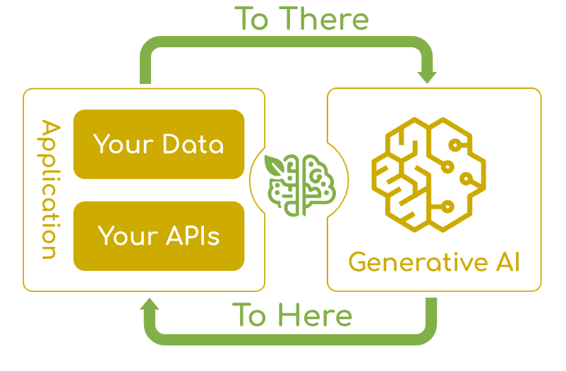
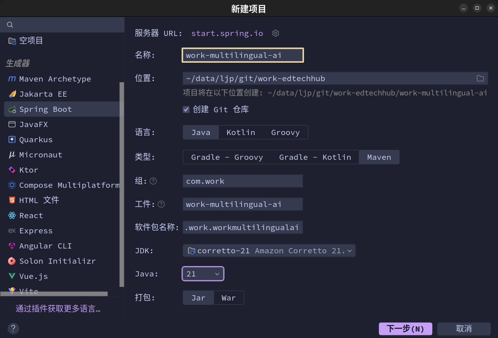

## 1.Spring AI 的全面概述

`Spring AI` 项目旨在简化包含人工智能功能的应用程序的开发，而不会产生不必要的复杂性。该项目从著名的 `Python` 项目（如 `LangChain` 和 `LlamaIndex`）中汲取灵感，但 `Spring AI` 并不是这些项目的直接移植。该项目的成立理念是，下一波生成式 `AI` 应用程序将不仅适用于 `Python` 开发人员，而且将在许多编程语言中无处不在。

官方文档认为，`Spring AI` 解决的痛点问题是：将企业数据和 `api` 与 `AI` 模型连接起来。



## 2.Spring AI 的基本功能

-   支持所有主要 [的 AI 模型提供商 ](https://docs.spring.io/spring-ai/reference/api/index.html)，例如 `Anthropic、OpenAI、Microsoft、Amazon、Google 和 Ollama`
-   支持的模型类型包括：

    *   [Chat Completion 聊天完成](https://docs.spring.io/spring-ai/reference/api/chatmodel.html)

    *   [Embedding 嵌入](https://docs.spring.io/spring-ai/reference/api/embeddings.html)

    *   [Text to Image 文本到图像](https://docs.spring.io/spring-ai/reference/api/imageclient.html)

    *   [Audio Transcription 音频转录](https://docs.spring.io/spring-ai/reference/api/audio/transcriptions.html)

    *   [Text to Speech 文本到语音](https://docs.spring.io/spring-ai/reference/api/audio/speech.html)

    *   [Moderation 适度](https://docs.spring.io/spring-ai/reference/api/index.html#api/moderation)
-   支持跨 `AI` 提供商的同步处理 `API` 和流式处理 `API` 选项，并且可移植，还可以访问特定于模型的高级功能（说白了就是有些 `AI` 厂家提供了一些独有的功能）
-   [结构化输出](https://docs.spring.io/spring-ai/reference/api/structured-output-converter.html)，从 `AI` 模型输出到 `POJO` 的映射
-   支持所有主要的 [矢量数据库提供商](https://docs.spring.io/spring-ai/reference/api/vectordbs.html)，例如 `Apache Cassandra、Azure Vector Search、Chroma、Milvus、MongoDB Atlas、Neo4j、Oracle、PostgreSQL/PGVector、PineCone、Qdrant、Redis、Weaviate`
-   ...

## 3.Spring AI 的使用教程

### 3.1.基本知识

首先我们需要了解一些基础的 `AI` 知识才能开始使用 `Spring AI`，我们不着急使用。

#### 3.1.1.模型

`AI` 模型是旨在处理和生成信息的算法，通常模仿人类的认知功能。通过从大型数据集中学习模式和见解，这些模型可以进行预测、文本、图像或其他输出，从而增强跨行业的各种应用程序。有许多不同类型的 `AI` 模型，每种模型都适用于特定的使用案例。虽然 `ChatGPT` 及其生成式 `AI` 功能通过文本输入和输出吸引了用户，但许多模型和公司都提供了不同的输入和输出。在 `ChatGPT` 之前，许多人对 `Midjourney` 和 `Stable Diffusion` 等文本到图像生成模型着迷。根据用途，常见的模型可以分为四种：

-   语言模型
-   图像模型
-   音频模型
-   嵌入模型


`Spring AI` 对这些模型都做了相应的支持，不过类似 `GPT` 这种模型会比较特殊一些，`GPT` 的 `P` 代表预训练，预训练让 `AI` 更容易用。而因为它是预训练的，您不需要训练它、您不需要懂机器学习、您只要提供 `Prompt, 提示` 就能做很多事。

#### 3.1.2.提示

提示是基于语言的输入的基础，这些输入可指导 `AI` 模型生成特定输出。对于熟悉 `ChatGPT` 的人来说，提示可能看起来只是在发送到 `API` 的对话框中输入的文本。然而，它包含的远不止于此。在许多 `AI` 模型中，提示的文本不仅仅是一个简单的字符串。

`ChatGPT` 的 `API` 在一个提示中有多个文本输入，每个文本输入都分配了一个角色。例如，有 `system` 角色，它告诉模型如何行为并设置交互的上下文。还有 `user role`，通常是来自用户的 `Importing`。

>   [!IMPORTANT]
>
>   补充：也就是说，`ChatGPT API` 的提示是“消息列表”组成的，不是纯字符串。因此每个消息是一个对象，有两个关键字段：
>
>   *   `role`：角色（告诉模型这句话是谁说的）
>   *   `content`：具体内容（这句话的文本）
>
>   | 常见角色名  | 含义                       | 示例用途                     |
>   | ----------- | -------------------------- | ---------------------------- |
>   | `system`    | 系统提示，用来设定模型行为 | 你是一个乐于助人的编程助手。 |
>   | `user`      | 用户说的话                 | 怎么用 `Python` 写个排序？   |
>   | `assistant` | `AI` 的回复                | 你可以用 `sorted()` 函数。   |

制作有效的提示既是一门艺术，也是一门科学。`ChatGPT` 专为人类对话而设计。这与使用 `SQL` 之类的东西来 `ask a question`（细致判断后的精确回答）完全不同。一个人必须与 `AI` 模型进行交流，类似于与另一个人交谈。正是这种交互方式的重要性，以至于 `Prompt Engineering, 提示词工程` 一词已经成为一门独立的学科。有一系列新兴的技术可以提高提示的有效性。投入时间制作提示可以大大提高结果输出。

分享提示已成为一种公共实践，并且正在积极地进行关于这一主题的学术研究。例如，创建有效的提示（例如，与 `SQL` 形成对比）是多么违反直觉，[最近的一篇研究论文](https://arxiv.org/abs/2205.11916) 发现，您可以使用的最有效的提示之一以短语“深呼吸并逐步完成此工作”开头。这应该可以告诉你为什么语言如此重要。我们还不完全了解如何最有效地利用这项技术的先前迭代，例如 `ChatGPT 3.5`，更不用说正在开发的新版本了。

创建有效的提示包括建立请求的上下文，并将请求的各个部分替换为特定于用户输入的值。此过程使用传统的基于文本的模板引擎进行提示创建和管理。`Spring AI` 为此使用了 `OSS` 库 [StringTemplate](https://www.stringtemplate.org/)。例如，考虑简单的提示模板：

```none
Tell me a {adjective} joke about {content}.
Copied!
```

在 `Spring AI` 中，提示模板可以比作 `Spring MVC` 架构中的 “视图”。提供模型对象（通常是 `java.util.Map`）来填充模板中的占位符。提示模板加数据模型合成的 `rendered` 最终字符串成为提供给 `AI` 模型的提示的内容。

不过就像之前说的提示的文本不再是单纯的消息字符串，也可能是消息对象，现在发送到模型的提示的特定数据格式存在相当大的变化。提示最初从简单字符串开始，现在已经发展到包含多条消息，其中每条消息中的每个字符串代表模型的不同角色。

#### 3.1.3.嵌入

这里的嵌入就是指 `文本、图像、视频` 的数字表示形式，用于捕获输入之间的关系（人话就是对比两个输入之前的关系，比如相似度）。嵌入的工作原理是将文本、图像、视频转换为浮点数数组（称为向量）。这些矢量旨在捕获文本、图像、视频的含义。嵌入数组的长度称为向量的维数。通过计算两段文本的向量表示之间的数值距离，应用程序可以确定用于生成嵌入向量的对象之间的相似性。


嵌入在 `RAG, Retrieval Augmented Generation, 检索增强生成` 模式等实际应用中尤其相关。它们能够将数据表示为语义空间中的点，这类似于欧几里得几何的二维空间，但维度更高。这意味着就像欧几里得几何中平面上的点可以根据其坐标来接近或远一样，在语义空间中，点的接近反映了含义的相似性。在这个多维空间中，关于相似主题的句子被放置在更近的位置，就像图表上彼此靠近的点一样。这种接近有助于文本分类、语义搜索甚至产品推荐等任务，因为它允许 `AI` 根据相关概念在这个扩展的语义环境中的 “位置” 来识别和分组。

#### 3.1.4.令牌

`Token` 是 `AI` 模型工作原理的构建块（其实就是处理时的基本元素）。在输入时，模型将单词转换为 `Token`。在输出时，他们将 `Token` 转换回单词。在英语中，一个标记大约相当于一个单词的 `75%`。作为参考，莎士比亚全集总计约 `900,000` 字，翻译成大约 `120` 万个代币。


通常在一些 `AI` 厂家中，您的费用由使用的令牌数量决定，输入和输出都会影响总令牌计数。此外，模型还受令牌限制的约束，这些限制限制了在单个 `API` 调用中处理的文本量。此阈值通常称为 `上下文窗口`。模型不会处理任何超过此限制的文本。例如，`ChatGPT3` 有 `4K` 限制，而 `GPT4` 提供不同的选项，例如 `8K、16K、32K`。`Anthropic` 的 `Claude AI` 模型具有 `100K` 限制，而 `Meta` 最近的研究产生了 `1M` 限制模型。

要使用 `GPT4` 总结莎士比亚的收藏作品，您需要制定软件工程策略来切碎数据并在模型的上下文窗口限制内呈现数据。`Spring AI` 项目可帮助您完成此任务。

#### 3.1.5.结构化输出

在语言模型中，有一个麻烦的问题，无论您让模型返回什么格式（比如 `JSON`），它本质上返回的始终是 `String`，即文本，不是程序中的“`JSON` 对象”或“`Map`”。它只是看起来像 `JSON` 的字符串，你还需要手动再 `parse, 解析` 一次，才能变成可操作的数据结构。比如 **“请以 JSON 格式回答” ≠ 保证一定是 JSON**，这原因也有很多个：

*   模型可能输出不完整的 `JSON`（少了大括号）
*   有时候还会额外加说明文字
*   ...

这些模型本质是“语言模型”，是根据词来预测的，没真正理解数据结构。这种复杂性导致了一个专业领域的出现，该领域涉及创建提示以产生预期的输出，然后将生成的简单字符串转换为可用于应用程序集成的数据结构。

#### 3.1.6.自定义模型

如何为 `AI` 模型配备尚未训练的信息？请注意，`GPT 3.5/4.0` 数据集仅延长至 `2021` 年 `9` 月。因此，该模型表示它不知道该日期之后问题的答案。一个有趣的琐事是，这个数据集大约有 `650GB`。有三种技术可用于自定义 `AI` 模型以合并您的实时数据：

-   **参数微调**：本质是改模型本身，把它“重新训练”成你的私有模型。就像拿一个 `GPT` 模型，然后继续训练它，让它学会你自己的数据。不过这会直接修改模型内部的权重参数，非常消耗 `GPU`，并且专业性非常强，工程复杂。
-   **提示填充**：不改模型，而是“骗它”在对话中去理解您的数据。您把自己的知识，作为提示词拼进去。这样模型不需要训练，它只是临时参考上下文。而加强的方案就是检索增强，也就是之前提到的 `RAG`，把您的资料（`PDF`、文档、网页、代码）提前整理好后，存到向量数据库里，当用户提问时，找出“相关资料片段”，再和问题一起塞给大语言模型回答。而之所以使用向量数据库，是因为我们可以利用 `RAG` 模糊找出相关的矢量，而不是使用普通数据库的精确查询
-   **工具调用**：该技术允许注册将大型语言模型连接到外部系统 `API` 的工具（用户定义的服务）。`Spring AI` 大大简化了您需要编写以支持工具调用的代码。

#### 3.1.7.评估回答效果

想知道 `AI` 回答得靠不靠谱？就得对它的回答进行“评估”，而 `Spring AI` 提供了对应的 `API` 工具来帮你这么做。此评估过程包括分析生成的响应是否与用户的意图和查询的上下文一致。相关性、连贯性和事实正确性等指标用于衡量 `AI` 生成的响应的质量。一种方法是把 `用户问题 + AI 回答` 再交给 `AI` 来判断对不对，也就是自己批判自己。

### 3.2.依赖安装

`Spring AI` 的核心依赖分为里程版本和快照版本，这里我们采用更加稳定的里程版本。并且建立项目最好使用 `Java21 + Spring Boot3.4.4`，这是官方文档中（`2025.04.22`）提到的版本，我接下来的测试也会使用这个版本。

我们直接使用 `IDEA` 默认提供的就可以，不用自己再引入依赖了。




我把我的依赖交给您阅读，您可以查阅一下。

```xml
<?xml version="1.0" encoding="UTF-8"?>
<project xmlns="http://maven.apache.org/POM/4.0.0" xmlns:xsi="http://www.w3.org/2001/XMLSchema-instance"
         xsi:schemaLocation="http://maven.apache.org/POM/4.0.0 https://maven.apache.org/xsd/maven-4.0.0.xsd">
    <!-- 元数描述 -->
    <modelVersion>4.0.0</modelVersion>
    <packaging>jar</packaging>
    <name>work-multilingual-ai</name>
    <description>work-multilingual-ai</description>
    <url>https://github.com/limou3434</url>
    <licenses>
        <license>
            <name>MIT License</name>
            <url>https://opensource.org/licenses/MIT</url>
            <distribution>repo</distribution>
        </license>
    </licenses>

    <!-- 标识描述 -->
    <groupId>cn.com.edtechhub</groupId>
    <artifactId>work-multilingual-ai</artifactId>
    <version>0.0.1</version>

    <!-- 版本描述 -->
    <properties>
        <java.version>21</java.version>
        <spring-ai.version>1.0.0-M7</spring-ai.version>
    </properties>

    <!-- 继承描述 -->
    <parent>
        <groupId>org.springframework.boot</groupId>
        <artifactId>spring-boot-starter-parent</artifactId>
        <version>3.4.4</version>
        <relativePath/>
    </parent>

    <!-- 依赖描述 -->
    <dependencyManagement>
        <dependencies>
            <dependency>
                <groupId>org.springframework.ai</groupId>
                <artifactId>spring-ai-bom</artifactId>
                <version>${spring-ai.version}</version>
                <type>pom</type>
                <scope>import</scope>
            </dependency>
        </dependencies>
    </dependencyManagement>
    <dependencies>

        <!-- Spring: https://spring.io/ -->
        <dependency>
            <groupId>org.springframework.boot</groupId>
            <artifactId>spring-boot-starter-web</artifactId>
        </dependency>
        <dependency>
            <groupId>org.springframework.ai</groupId>
            <artifactId>spring-ai-starter-model-ollama</artifactId>
        </dependency>

        <!-- Lombok: https://projectlombok.org/ -->
        <dependency>
            <groupId>org.projectlombok</groupId>
            <artifactId>lombok</artifactId>
            <optional>true</optional>
        </dependency>
    </dependencies>

    <!-- 插件描述 -->
    <build>
        <plugins>
            <plugin>
                <groupId>org.apache.maven.plugins</groupId>
                <artifactId>maven-compiler-plugin</artifactId>
                <configuration>
                    <annotationProcessorPaths>
                        <path>
                            <groupId>org.projectlombok</groupId>
                            <artifactId>lombok</artifactId>
                        </path>
                    </annotationProcessorPaths>
                </configuration>
            </plugin>
            <plugin>
                <groupId>org.springframework.boot</groupId>
                <artifactId>spring-boot-maven-plugin</artifactId>
                <configuration>
                    <excludes>
                        <exclude>
                            <groupId>org.projectlombok</groupId>
                            <artifactId>lombok</artifactId>
                        </exclude>
                    </excludes>
                </configuration>
            </plugin>
        </plugins>
    </build>

</project>

```

这里稍微解释一下，官方文档说有两种版本，一种是里程版本、一种是快照版本，这里我们延用 `IDEA` 给我们的版本就可以。

### 3.3.通信对象

在我们的 `Spring AI` 中有一个类 `ChatClient`，用于提供与 `AI` 模型通信的 `Fluent API`，它支持：

-   同步编程模型：您发一个消息，等 `AI` 回复
-   流式编程模型：`AI` 边生成边返回，比如 `OpenAI` 的流式回复一样

>   [!IMPORTANT]
>
>   补充：`Fluent API` 是一种编程风格（不是框架、不是库），它通过方法链式调用来实现更可读、流畅、自然语言化的配置或构建逻辑。

该 `Fluent API` 具有构建提示词组成部分的方法 `prompt()`，后续链式调用的部分作为输入传递给 `AI` 模型。`AI` 模型处理两种主要类型的消息：

-   系统消息（由系统生成以指导对话）
-   用户消息（来自用户的直接输入）

这些消息通常包含占位符，这些占位符在运行时根据用户输入进行替换，以自定义 `AI` 模型对用户输入的响应。除了构建提示词内容外，还可以设置一些额外选项，例如模型名字、温度（随机性和创造性）等。

`ChatClient` 是使用 `ChatClient.Builder` 对象创建的。您可以把任何 [ChatModel](https://docs.spring.io/spring-ai/reference/api/chatmodel.html) 接入 `Spring Boot` 中（本教程我们使用 `Ollama`），将获取自动配置的 `ChatClient.Builder` 实例，或者以编程方式创建一个实例。在最简单的用例中，创建一个原型 `ChatClient.Builder bean` 供您注入到您的类中，下面是检索对简单用户请求的 `String` 响应的简单示例。

这里我们开始我们第一次的实践，我决定使用 `Spring AI + Ollama`并且拉取语言模型开始，无他因为更好入门。在上面其实我们就接入了模型依赖，在引入 `Spring AI` 后引入了支持 `Ollama` 的依赖。

```xml
<dependency>
   <groupId>org.springframework.ai</groupId>
   <artifactId>spring-ai-starter-model-ollama</artifactId>
</dependency>
```

然后我们需要部署一下 `Ollama`，这在之前的章节中提到过，这里留个 [部署链接](https://github.com/ollama/ollama/blob/main/docs/docker.md) 给您即可，个人推荐使用 `Docker` 进行部署，并且推荐在 `Docker` 中使用宿主的 `GPU` 资源，并且一定要部署到 `http://127.0.0.1:11434` 中，同时在容器内部运行 `ollama run llama3.2` 拉取并运行模型。

然后配置我们的应用配置文件，简单配置一下就可以。

```yaml
# 配置框架(使用 java -jar app.jar --spring.profiles.active=develop | release | production 来启动项目, 其中 release 有时间就拿来测试, 而 production 存储在 Github 上, 每次修改 Github 配置就需要刷新(这个有时间可以优化为无需重启))
spring:
  ## 配置环境
  profiles:
    active: ${SPRING_PROFILES_ACTIVE:develop} # 默认启动开发环境
  ## 配置名称
  application:
    name: work-multilingual-ai
  ## 配置智能
  ai:
    ollama:
      base-url: http://127.0.0.1:11434
      chat:
        model: llama3.2 # DeepSeek-R1

# 配置服务
server:
  ## 项目名称
  project-name: work-multilingual-ai
  ## 配置地址
  address: 127.0.0.1
  ## 配置端口
  port: 8000
  ## 配置路由
  servlet:
    context-path: /work_multilingual_ai_api # 这样所有接口都会带上前缀

```

```java
package cn.com.edtechhub.workmultilingualai;

import org.springframework.ai.chat.client.ChatClient;
import org.springframework.web.bind.annotation.GetMapping;
import org.springframework.web.bind.annotation.RequestParam;
import org.springframework.web.bind.annotation.RestController;

import java.util.Map;

@RestController
public class ChatController {

    private final ChatClient chatClient;

    public ChatController(ChatClient.Builder chatClientBuilder) {
        this.chatClient = chatClientBuilder.build(); // 这里自动加载了我们配置文件中写的模型类型
    }

    @GetMapping("/ai/generate")
    public Map<String, String> generate(@RequestParam(value = "message", defaultValue = "你是谁") String message) {
        String result = chatClient.prompt() // 开始链式构造提示词
                .user(message) // 用户消息
                .call() // 向 AI 模型发送请求
                .content() // 将 AI 模型的响应作为 String 返回
                ;

        if (result != null) {
            return Map.of("generation", result);
        }
        return Map.of();
    }

}

```

>   [!IMPORTANT]
>
>   补充：如果您希望手动加载多种不同的模型，则可以使用 `spring.ai.chat.client.enabled:false` 关掉自动导入，然后在调用 `ChatClient.builder()` 时填入模型参数，对应到 `Ollama` 中就是 `run` 后拉取了不同的模型时可以填入不同模型以支持多模型需求。

### 3.4.接入模型

#### 3.4.1.语言模型


#### 3.4.2.图像模型


#### 3.4.3.音频模型


#### 3.4.4.嵌入模型


### 3.4.审核模型


### 3.6.矢量数库

### 3.7.结构输出

### 3.8.自定模型

#### 3.8.1.参数微调

#### 3.8.2.提示填充

#### 3.8.3.工具调用

### 3.9.模型评估


