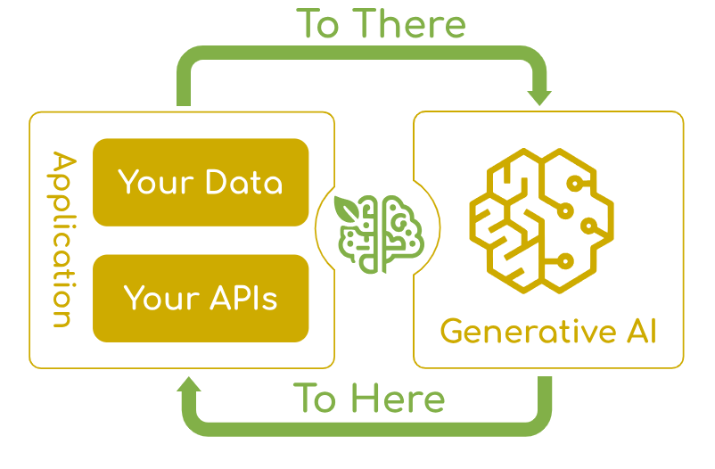
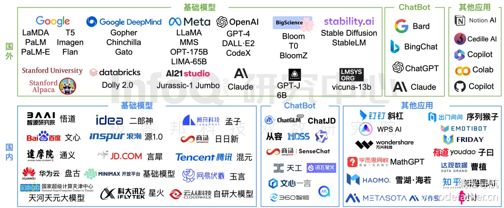
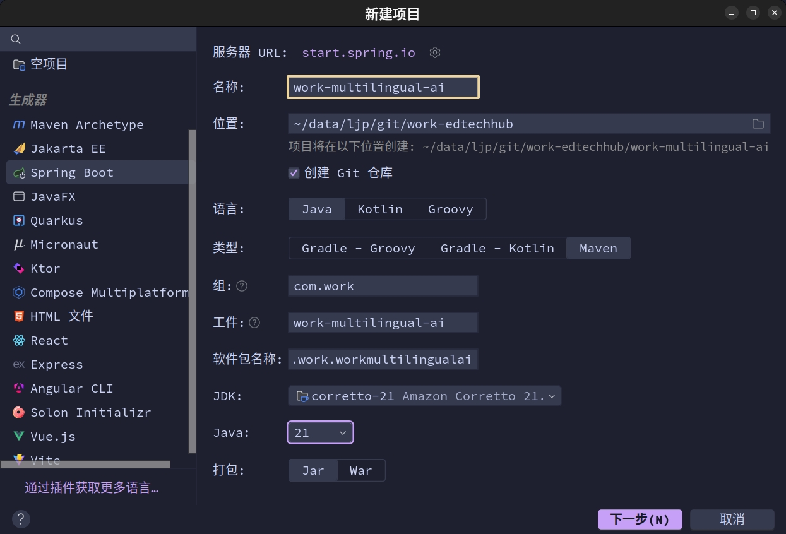
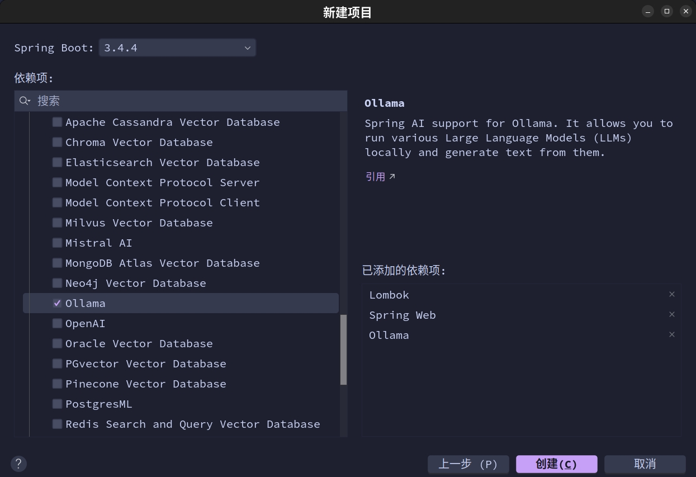
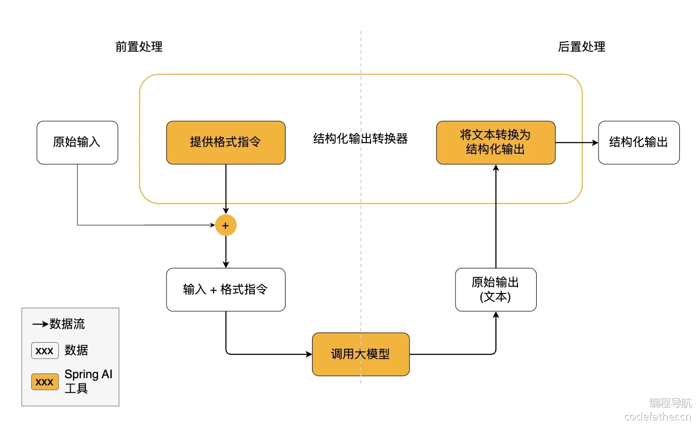
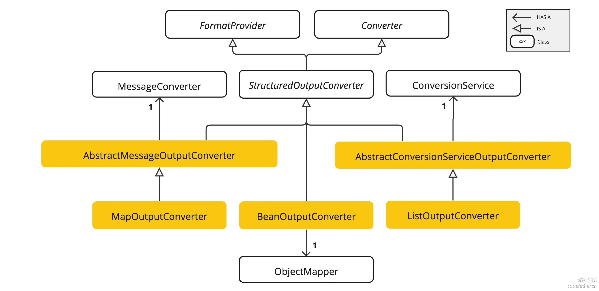

# Spring AI

## 1.Spring AI 的全面概述

`Spring AI` 项目旨在简化包含人工智能功能的应用程序的开发，而不会产生不必要的复杂性。该项目从著名的 `Python` 项目（如 `LangChain` 和 `LlamaIndex`）中汲取灵感，但 `Spring AI` 并不是这些项目的直接移植。该项目的成立理念是，下一波生成式 `AI` 应用程序将不仅适用于 `Python` 开发人员，而且将在许多编程语言中无处不在。

官方文档认为，`Spring AI` 解决的痛点问题是：将企业数据和 `api` 与 `AI` 模型连接起来。



> [!IMPORTANT]
>
> 补充：另外一个集成 `AI` 的 `Java` 框架就是 [Langchain4j](https://github.com/langchain4j/langchain4j)，您可以简单了解一下。

## 2.Spring AI 的基本功能

-   支持所有主要 [的 AI 模型提供商 ](https://docs.spring.io/spring-ai/reference/api/index.html)，例如 `Anthropic、OpenAI、Microsoft、Amazon、Google 和 Ollama`
-   支持的模型类型包括：

    *   [Chat Completion 聊天完成](https://docs.spring.io/spring-ai/reference/api/chatmodel.html)

    *   [Embedding 嵌入](https://docs.spring.io/spring-ai/reference/api/embeddings.html)

    *   [Text to Image 文本到图像](https://docs.spring.io/spring-ai/reference/api/imageclient.html)

    *   [Audio Transcription 音频转录](https://docs.spring.io/spring-ai/reference/api/audio/transcriptions.html)

    *   [Text to Speech 文本到语音](https://docs.spring.io/spring-ai/reference/api/audio/speech.html)

    *   [Moderation 适度](https://docs.spring.io/spring-ai/reference/api/index.html#api/moderation)
-   支持跨 `AI` 提供商的同步处理 `API` 和流式处理 `API` 选项，并且可移植，还可以访问特定于模型的高级功能（说白了就是有些 `AI` 厂家提供了一些独有的功能）
-   [结构化输出](https://docs.spring.io/spring-ai/reference/api/structured-output-converter.html)，从 `AI` 模型输出到 `POJO` 的映射
-   支持所有主要的 [矢量数据库提供商](https://docs.spring.io/spring-ai/reference/api/vectordbs.html)，例如 `Apache Cassandra、Azure Vector Search、Chroma、Milvus、MongoDB Atlas、Neo4j、Oracle、PostgreSQL/PGVector、PineCone、Qdrant、Redis、Weaviate`
-   ...

在没有 `Spring AI` 之前，一般使用 `AI` 有以下的方式：

- 网页端
- 本地大模型
- 某些应用内置引入
  - 平台引入，例如：阿里云百炼模型可视化平台、阿里云模型服务灵积 `DashScope`
  - 客户端引入，例如：全能 `AI` 助手平台 `Cherry Studio`、编程开发工具 `Cursor`
  - 程序引入，例如：特定平台提供的 `SDK` 或 `API`，其他的 `AI` 开发框架，比如 `LangChain4j`

而现在 `Java` 语言有能享用 `AI` 的福利，主要依赖两个框架：`Spring AI` 和 `Spring AI Alibaba`。

## 3.Spring AI 的使用教程

### 3.1.基本知识

首先我们需要了解一些基础的 `AI` 知识才能开始使用 `Spring AI`，我们不着急使用。

#### 3.1.1.模型

`AI` 模型是旨在处理和生成信息的算法，通常模仿人类的认知功能。通过从大型数据集中学习模式和见解，这些模型可以进行预测、文本、图像或其他输出，从而增强跨行业的各种应用程序。有许多不同类型的 `AI` 模型，每种模型都适用于特定的使用案例。虽然 `ChatGPT` 及其生成式 `AI` 功能通过文本输入和输出吸引了用户，但许多模型和公司都提供了不同的输入和输出。在 `ChatGPT` 之前，许多人对 `Midjourney` 和 `Stable Diffusion` 等文本到图像生成模型着迷。根据用途，常见的模型可以分为四种：

-   语言模型
-   图像模型
-   音频模型
-   嵌入模型


`Spring AI` 对这些模型都做了相应的支持，不过类似 `GPT` 这种模型会比较特殊一些，`GPT` 的 `P` 代表预训练，预训练让 `AI` 更容易用。而因为它是预训练的，您不需要训练它、您不需要懂机器学习、您只要提供 `Prompt, 提示` 就能做很多事。

| 模型                                           | 特点                                            |
| ---------------------------------------------- | ----------------------------------------------- |
| GPT-4o/GPT-4/GPT-3.5 Turbo                     | 多模态/文本+图像/主要处理文本                   |
| Claude 3 系列（Opus, Sonnet, Haiku，由强到弱） | 多模态                                          |
| Gemini Ultra/Pro/Nano                          | 多模态                                          |
| Llama 3/Llama 2                                | 开源，`70B` 和 `8B` 参数版本/开源，多种参数规模 |
| 文心一言/通义千问/豆包/星火/Deepseek           | 国产大模型                                      |



#### 3.1.2.提示

提示是基于语言的输入的基础，这些输入可指导 `AI` 模型生成特定输出。对于熟悉 `ChatGPT` 的人来说，提示可能看起来只是在发送到 `API` 的对话框中输入的文本。然而，它包含的远不止于此。在许多 `AI` 模型中，提示的文本不仅仅是一个简单的字符串。

`ChatGPT` 的 `API` 在一个提示中有多个文本输入，每个文本输入都分配了一个角色。例如，有 `system` 角色，它告诉模型如何行为并设置交互的上下文。还有 `user role`，通常是来自用户的 `Importing`。

>   [!IMPORTANT]
>
>   补充：也就是说，`ChatGPT API` 的提示是“消息列表”组成的，不是纯字符串。因此每个消息是一个对象，有两个关键字段：
>
>   *   `role`：角色（告诉模型这句话是谁说的）
>   *   `content`：具体内容（这句话的文本）
>
>   | 常见角色名  | 含义                       | 示例用途                     |
>   | ----------- | -------------------------- | ---------------------------- |
>   | `system`    | 系统提示，用来设定模型行为 | 你是一个乐于助人的编程助手。 |
>   | `user`      | 用户说的话                 | 怎么用 `Python` 写个排序？   |
>   | `assistant` | `AI` 的回复                | 你可以用 `sorted()` 函数。   |

制作有效的提示既是一门艺术，也是一门科学。`ChatGPT` 专为人类对话而设计。这与使用 `SQL` 之类的东西来 `ask a question`（细致判断后的精确回答）完全不同。一个人必须与 `AI` 模型进行交流，类似于与另一个人交谈。正是这种交互方式的重要性，以至于 `Prompt Engineering, 提示词工程` 一词已经成为一门独立的学科。有一系列新兴的技术可以提高提示的有效性。投入时间制作提示可以大大提高结果输出。

分享提示已成为一种公共实践，并且正在积极地进行关于这一主题的学术研究。例如，创建有效的提示（例如，与 `SQL` 形成对比）是多么违反直觉，[最近的一篇研究论文](https://arxiv.org/abs/2205.11916) 发现，您可以使用的最有效的提示之一以短语“深呼吸并逐步完成此工作”开头。这应该可以告诉你为什么语言如此重要。我们还不完全了解如何最有效地利用这项技术的先前迭代，例如 `ChatGPT 3.5`，更不用说正在开发的新版本了。

创建有效的提示包括建立请求的上下文，并将请求的各个部分替换为特定于用户输入的值。此过程使用传统的基于文本的模板引擎进行提示创建和管理。`Spring AI` 为此使用了 `OSS` 库 [StringTemplate](https://www.stringtemplate.org/)。例如，考虑简单的提示模板：

```none
Tell me a {adjective} joke about {content}.
Copied!
```

在 `Spring AI` 中，提示模板可以比作 `Spring MVC` 架构中的 “视图”。提供模型对象（通常是 `java.util.Map`）来填充模板中的占位符。提示模板加数据模型合成的 `rendered` 最终字符串成为提供给 `AI` 模型的提示的内容。

不过就像之前说的提示的文本不再是单纯的消息字符串，也可能是消息对象，现在发送到模型的提示的特定数据格式存在相当大的变化。提示最初从简单字符串开始，现在已经发展到包含多条消息，其中每条消息中的每个字符串代表模型的不同角色。

#### 3.1.3.嵌入

这里的嵌入就是指 `文本、图像、视频` 的数字表示形式，用于捕获输入之间的关系（人话就是对比两个输入之前的关系，比如相似度）。嵌入的工作原理是将文本、图像、视频转换为浮点数数组（称为向量）。这些矢量旨在捕获文本、图像、视频的含义。嵌入数组的长度称为向量的维数。通过计算两段文本的向量表示之间的数值距离，应用程序可以确定用于生成嵌入向量的对象之间的相似性。


嵌入在 `RAG, Retrieval Augmented Generation, 检索增强生成` 模式等实际应用中尤其相关。它们能够将数据表示为语义空间中的点，这类似于欧几里得几何的二维空间，但维度更高。这意味着就像欧几里得几何中平面上的点可以根据其坐标来接近或远一样，在语义空间中，点的接近反映了含义的相似性。在这个多维空间中，关于相似主题的句子被放置在更近的位置，就像图表上彼此靠近的点一样。这种接近有助于文本分类、语义搜索甚至产品推荐等任务，因为它允许 `AI` 根据相关概念在这个扩展的语义环境中的 “位置” 来识别和分组。

#### 3.1.4.令牌

`Token` 是 `AI` 模型工作原理的构建块（其实就是处理时的基本元素）。在输入时，模型将单词转换为 `Token`。在输出时，他们将 `Token` 转换回单词。在英语中，一个标记大约相当于一个单词的 `75%`。作为参考，莎士比亚全集总计约 `900,000` 字，翻译成大约 `120` 万个代币。


通常在一些 `AI` 厂家中，您的费用由使用的令牌数量决定，输入和输出都会影响总令牌计数。此外，模型还受令牌限制的约束，这些限制限制了在单个 `API` 调用中处理的文本量。此阈值通常称为 `上下文窗口`。模型不会处理任何超过此限制的文本。例如，`ChatGPT3` 有 `4K` 限制，而 `GPT4` 提供不同的选项，例如 `8K、16K、32K`。`Anthropic` 的 `Claude AI` 模型具有 `100K` 限制，而 `Meta` 最近的研究产生了 `1M` 限制模型。

要使用 `GPT4` 总结莎士比亚的收藏作品，您需要制定软件工程策略来切碎数据并在模型的上下文窗口限制内呈现数据。`Spring AI` 项目可帮助您完成此任务。

#### 3.1.5.结构化输出

在语言模型中，有一个麻烦的问题，无论您让模型返回什么格式（比如 `JSON`），它本质上返回的始终是 `String`，即文本，不是程序中的“`JSON` 对象”或“`Map`”。它只是看起来像 `JSON` 的字符串，你还需要手动再 `parse, 解析` 一次，才能变成可操作的数据结构。比如 **“请以 JSON 格式回答” ≠ 保证一定是 JSON**，这原因也有很多个：

*   模型可能输出不完整的 `JSON`（少了大括号）
*   有时候还会额外加说明文字
*   ...

这些模型本质是“语言模型”，是根据词来预测的，没真正理解数据结构。这种复杂性导致了一个专业领域的出现，该领域涉及创建提示以产生预期的输出，然后将生成的简单字符串转换为可用于应用程序集成的数据结构。

#### 3.1.6.自定义模型

如何为 `AI` 模型配备尚未训练的信息？请注意，`GPT 3.5/4.0` 数据集仅延长至 `2021` 年 `9` 月。因此，该模型表示它不知道该日期之后问题的答案。一个有趣的琐事是，这个数据集大约有 `650GB`。有三种技术可用于自定义 `AI` 模型以合并您的实时数据：

-   **参数微调**：本质是改模型本身，把它“重新训练”成你的私有模型。就像拿一个 `GPT` 模型，然后继续训练它，让它学会你自己的数据。不过这会直接修改模型内部的权重参数，非常消耗 `GPU`，并且专业性非常强，工程复杂。
-   **提示填充**：不改模型，而是“骗它”在对话中去理解您的数据。您把自己的知识，作为提示词拼进去。这样模型不需要训练，它只是临时参考上下文。而加强的方案就是检索增强，也就是之前提到的 `RAG`，把您的资料（`PDF`、文档、网页、代码）提前整理好后，存到向量数据库里，当用户提问时，找出“相关资料片段”，再和问题一起塞给大语言模型回答。而之所以使用向量数据库，是因为我们可以利用 `RAG` 模糊找出相关的矢量，而不是使用普通数据库的精确查询
-   **工具调用**：该技术允许注册将大型语言模型连接到外部系统 `API` 的工具（用户定义的服务）。`Spring AI` 大大简化了您需要编写以支持工具调用的代码。

#### 3.1.7.评估回答效果

想知道 `AI` 回答得靠不靠谱？就得对它的回答进行“评估”，而 `Spring AI` 提供了对应的 `API` 工具来帮你这么做。此评估过程包括分析生成的响应是否与用户的意图和查询的上下文一致。相关性、连贯性和事实正确性等指标用于衡量 `AI` 生成的响应的质量。一种方法是把 `用户问题 + AI 回答` 再交给 `AI` 来判断对不对，也就是自己批判自己。

### 3.2.依赖安装

`Spring AI` 的核心依赖分为里程版本和快照版本，这里我们采用更加稳定的里程版本。并且建立项目最好使用 `Java21 + Spring Boot3.4.4`，这是官方文档中（`2025.04.22`）提到的版本，我接下来的测试也会使用这个版本。

我们直接使用 `IDEA` 默认提供的就可以，不用自己再引入依赖了。





我把我的依赖交给您阅读，您可以查阅一下。

```xml
<?xml version="1.0" encoding="UTF-8"?>
<project xmlns="http://maven.apache.org/POM/4.0.0" xmlns:xsi="http://www.w3.org/2001/XMLSchema-instance"
         xsi:schemaLocation="http://maven.apache.org/POM/4.0.0 https://maven.apache.org/xsd/maven-4.0.0.xsd">
    <!-- 元数描述 -->
    <modelVersion>4.0.0</modelVersion>
    <packaging>jar</packaging>
    <name>work-multilingual-ai</name>
    <description>work-multilingual-ai</description>
    <url>https://github.com/limou3434</url>
    <licenses>
        <license>
            <name>MIT License</name>
            <url>https://opensource.org/licenses/MIT</url>
            <distribution>repo</distribution>
        </license>
    </licenses>

    <!-- 标识描述 -->
    <groupId>cn.com.edtechhub</groupId>
    <artifactId>work-multilingual-ai</artifactId>
    <version>0.0.1</version>

    <!-- 版本描述 -->
    <properties>
        <java.version>21</java.version>
        <spring-ai.version>1.0.0-M7</spring-ai.version>
    </properties>

    <!-- 继承描述 -->
    <parent>
        <groupId>org.springframework.boot</groupId>
        <artifactId>spring-boot-starter-parent</artifactId>
        <version>3.4.4</version>
        <relativePath/>
    </parent>

    <!-- 依赖描述 -->
    <dependencyManagement>
        <dependencies>
            <dependency>
                <groupId>org.springframework.ai</groupId>
                <artifactId>spring-ai-bom</artifactId>
                <version>${spring-ai.version}</version>
                <type>pom</type>
                <scope>import</scope>
            </dependency>
        </dependencies>
    </dependencyManagement>
    <dependencies>

        <!-- Spring: https://spring.io/ -->
        <dependency>
            <groupId>org.springframework.boot</groupId>
            <artifactId>spring-boot-starter-web</artifactId>
        </dependency>
        <dependency>
            <groupId>org.springframework.ai</groupId>
            <artifactId>spring-ai-starter-model-ollama</artifactId>
        </dependency>

        <!-- Lombok: https://projectlombok.org/ -->
        <dependency>
            <groupId>org.projectlombok</groupId>
            <artifactId>lombok</artifactId>
            <optional>true</optional>
        </dependency>
    </dependencies>

    <!-- 插件描述 -->
    <build>
        <plugins>
            <plugin>
                <groupId>org.apache.maven.plugins</groupId>
                <artifactId>maven-compiler-plugin</artifactId>
                <configuration>
                    <annotationProcessorPaths>
                        <path>
                            <groupId>org.projectlombok</groupId>
                            <artifactId>lombok</artifactId>
                        </path>
                    </annotationProcessorPaths>
                </configuration>
            </plugin>
            <plugin>
                <groupId>org.springframework.boot</groupId>
                <artifactId>spring-boot-maven-plugin</artifactId>
                <configuration>
                    <excludes>
                        <exclude>
                            <groupId>org.projectlombok</groupId>
                            <artifactId>lombok</artifactId>
                        </exclude>
                    </excludes>
                </configuration>
            </plugin>
        </plugins>
    </build>

</project>

```

这里稍微解释一下，官方文档说有两种版本，一种是里程版本、一种是快照版本，这里我们延用 `IDEA` 给我们的版本就可以。

### 3.3.通信对象

接下来我开始围绕 `Spring AI` 提供的通信对象讲解相关的内容。

#### 3.3.1.单个模型

在我们的 `Spring AI` 中有一个类 `ChatClient`，用于提供与 `AI` 模型通信的 `Fluent API`，它支持：

-   同步编程模型：您发一个消息，等 `AI` 回复
-   流式编程模型：`AI` 边生成边返回，比如 `OpenAI` 的流式回复一样

>   [!IMPORTANT]
>
>   补充：`Fluent API` 是一种编程风格（不是框架、不是库），它通过方法链式调用来实现更可读、流畅、自然语言化的配置或构建逻辑。

该 `Fluent API` 具有构建提示词组成部分的方法 `prompt()`，后续链式调用的部分作为输入传递给 `AI` 模型。`AI` 模型处理两种主要类型的消息：

-   系统消息（由系统生成以指导对话）
-   用户消息（来自用户的直接输入）

这些消息通常包含占位符，这些占位符在运行时根据用户输入进行替换，以自定义 `AI` 模型对用户输入的响应。除了构建提示词内容外，还可以设置一些额外选项，例如模型名字、温度（随机性和创造性）等。

`ChatClient` 是使用 `ChatClient.Builder` 对象创建的。您可以把任何 [ChatModel](https://docs.spring.io/spring-ai/reference/api/chatmodel.html) 接入 `Spring Boot` 中（本教程我们使用 `Ollama`），将获取自动配置的 `ChatClient.Builder` 实例，或者以编程方式创建一个实例。在最简单的用例中，创建一个原型 `ChatClient.Builder bean` 供您注入到您的类中，下面是检索对简单用户请求的 `String` 响应的简单示例。

这里我们开始我们第一次的实践，我决定使用 `Spring AI + Ollama`并且拉取语言模型开始，无他因为更好入门。在上面其实我们就接入了模型依赖，在引入 `Spring AI` 后引入了支持 `Ollama` 的依赖。

```xml
<dependency>
   <groupId>org.springframework.ai</groupId>
   <artifactId>spring-ai-starter-model-ollama</artifactId>
</dependency>
```

然后我们需要部署一下 `Ollama`，这在之前的章节中提到过，这里留个 [部署链接](https://github.com/ollama/ollama/blob/main/docs/docker.md) 给您即可，个人推荐使用 `Docker` 进行部署，并且推荐在 `Docker` 中使用宿主的 `GPU` 资源，并且一定要部署到 `http://127.0.0.1:11434` 中，同时在容器内部运行 `ollama run llama3.2` 拉取并运行模型。

然后配置我们的应用配置文件，简单配置一下就可以。

```yaml
# 配置框架(使用 java -jar app.jar --spring.profiles.active=develop | release | production 来启动项目, 其中 release 有时间就拿来测试, 而 production 存储在 Github 上, 每次修改 Github 配置就需要刷新(这个有时间可以优化为无需重启))
spring:
  ## 配置环境
  profiles:
    active: ${SPRING_PROFILES_ACTIVE:develop} # 默认启动开发环境
  ## 配置名称
  application:
    name: work-multilingual-ai
  ## 配置智能
  ai:
    ollama:
      base-url: http://127.0.0.1:11434
      chat:
        model: llama3.2 # DeepSeek-R1

# 配置服务
server:
  ## 项目名称
  project-name: work-multilingual-ai
  ## 配置地址
  address: 127.0.0.1
  ## 配置端口
  port: 8000
  ## 配置路由
  servlet:
    context-path: /work_multilingual_ai_api # 这样所有接口都会带上前缀

```

```java
package cn.com.edtechhub.workmultilingualai;

import org.springframework.ai.chat.client.ChatClient;
import org.springframework.web.bind.annotation.GetMapping;
import org.springframework.web.bind.annotation.RequestParam;
import org.springframework.web.bind.annotation.RestController;

import java.util.Map;

@RestController
public class ChatController {

    private final ChatClient chatClient;

    public ChatController(ChatClient.Builder chatClientBuilder) {
        this.chatClient = chatClientBuilder.build(); // 这里自动加载了我们配置文件中写的模型类型
    }

    @GetMapping("/ai/generate")
    public Map<String, String> generate(@RequestParam(value = "message", defaultValue = "你是谁") String message) {
        String result = chatClient.prompt() // 开始链式构造提示词
                .user(message) // 用户消息
                .call() // 向 AI 模型发送请求
                .content() // 将 AI 模型的响应作为 String 返回
                ;

        if (result != null) {
            return Map.of("generation", result);
        }
        return Map.of();
    }

}

```

>   [!IMPORTANT]
>
>   补充：如果您希望手动加载多种不同的模型，则可以使用 `spring.ai.chat.client.enabled:false` 关掉自动导入，然后在对应 `Ollama` 中拉取不同的模型，再参考 [文档1](https://docs.spring.io/spring-ai/reference/api/chatclient.html) 和 [文档2](https://docs.spring.io/spring-ai/reference/api/chat/ollama-chat.html#low-level-api) 进行手动配置。
>
>   首先 `文档1` 说明了想要手动导入需要编写以下代码：
>
>   ```java
>   ChatModel myChatModel = /*...*/;
>   ChatClient.Builder builder = ChatClient.builder(this.myChatModel);
>   ChatClient chatClient = ChatClient.create(this.myChatModel);
>   ```
>
>   其实目的就是把我们的 `chatClient` 使用别的构造函数来手动构造。再根据 `文档2` 提供关于 `ollama` 的 `ChatModel` 构造过程。
>
>   ```java
>   var ollamaApi = new OllamaApi(); // 默认的请求地址就是 http://127.0.0.1:11434, 如果您的 ollama 部署在这个地址可以不用更换
>   
>   var chatModel = OllamaChatModel.builder()
>                     .ollamaApi(ollamaApi)
>                     .defaultOptions(
>                         OllamaOptions.builder()
>                             .model(OllamaModel.MISTRAL) // 选择模型的地方, 可以自己重载枚举体, 也可以使用字符常量
>                             .temperature(0.9)
>                             .build())
>                     .build();
>   
>   ```
>
>   就可以手动来进行导入了。
>
>   ```java
>   package cn.com.edtechhub.workmultilingualai;
>   
>   import org.springframework.ai.chat.client.ChatClient;
>   import org.springframework.ai.chat.model.ChatModel;
>   import org.springframework.ai.ollama.OllamaChatModel;
>   import org.springframework.ai.ollama.api.OllamaApi;
>   import org.springframework.ai.ollama.api.OllamaOptions;
>   import org.springframework.web.bind.annotation.GetMapping;
>   import org.springframework.web.bind.annotation.RequestParam;
>   import org.springframework.web.bind.annotation.RestController;
>   
>   import java.util.Map;
>   
>   @RestController
>   public class ChatController {
>   
>     OllamaApi ollamaApi = new OllamaApi("http://127.0.0.1:11434");
>     ChatModel myChatModel = OllamaChatModel
>             .builder()
>             .ollamaApi(ollamaApi)
>             .defaultOptions(
>                     OllamaOptions
>                             .builder()
>                             .model("DeepSeek-R1")
>                             .temperature(0.9)
>                             .build())
>             .build();
>     ChatClient.Builder builder = ChatClient.builder(this.myChatModel);
>   
>     ChatClient chatClient = ChatClient.create(this.myChatModel);
>   
>   //    private final ChatClient chatClient;
>   
>   //    public ChatController(ChatClient.Builder chatClientBuilder) {
>   //        this.chatClient = chatClientBuilder.build(); // 这里自动加载了我们配置文件中写的模型类型
>   //    }
>   
>     @GetMapping("/ai/generate")
>     public Map<String, String> generate(@RequestParam(value = "message", defaultValue = "你是谁") String message) {
>         String result = chatClient.prompt() // 开始链式构造提示词
>                 .user(message) // 用户消息
>                 .call() // 向 AI 模型发送请求
>                 .content() // 将 AI 模型的响应作为 String 返回
>                 ;
>   
>         if (result != null) {
>             return Map.of("generation", result);
>         }
>         return Map.of();
>     }
>   
>   }
>   
>   ```

#### 3.3.2.多个模型

由于我自己的项目需要支持多个模型，因此我这里稍微封装一下代码。

```xml
<?xml version="1.0" encoding="UTF-8"?>
<project xmlns="http://maven.apache.org/POM/4.0.0" xmlns:xsi="http://www.w3.org/2001/XMLSchema-instance"
         xsi:schemaLocation="http://maven.apache.org/POM/4.0.0 https://maven.apache.org/xsd/maven-4.0.0.xsd">
    <!-- 元数描述 -->
    <modelVersion>4.0.0</modelVersion>
    <packaging>jar</packaging>
    <name>work-multilingual-ai</name>
    <description>work-multilingual-ai</description>
    <url>https://github.com/limou3434</url>
    <licenses>
        <license>
            <name>MIT License</name>
            <url>https://opensource.org/licenses/MIT</url>
            <distribution>repo</distribution>
        </license>
    </licenses>

    <!-- 标识描述 -->
    <groupId>cn.com.edtechhub</groupId>
    <artifactId>work-multilingual-ai</artifactId>
    <version>0.0.1</version>

    <!-- 版本描述 -->
    <properties>
        <java.version>21</java.version>
        <spring-ai.version>1.0.0-M7</spring-ai.version>
    </properties>

    <!-- 继承描述 -->
    <parent>
        <groupId>org.springframework.boot</groupId>
        <artifactId>spring-boot-starter-parent</artifactId>
        <version>3.4.4</version>
        <relativePath/>
    </parent>

    <!-- 依赖描述 -->
    <dependencyManagement>
        <dependencies>
            <dependency>
                <groupId>org.springframework.ai</groupId>
                <artifactId>spring-ai-bom</artifactId>
                <version>${spring-ai.version}</version>
                <type>pom</type>
                <scope>import</scope>
            </dependency>
        </dependencies>
    </dependencyManagement>
    <dependencies>

        <!-- Spring: https://spring.io/ -->
        <dependency>
            <groupId>org.springframework.boot</groupId>
            <artifactId>spring-boot-starter-web</artifactId>
        </dependency>
        <dependency>
            <groupId>org.springframework.ai</groupId>
            <artifactId>spring-ai-starter-model-ollama</artifactId>
        </dependency>

        <!-- Lombok: https://projectlombok.org/ -->
        <dependency>
            <groupId>org.projectlombok</groupId>
            <artifactId>lombok</artifactId>
            <optional>true</optional>
        </dependency>
    </dependencies>

    <!-- 插件描述 -->
    <build>
        <plugins>
            <plugin>
                <groupId>org.apache.maven.plugins</groupId>
                <artifactId>maven-compiler-plugin</artifactId>
                <configuration>
                    <annotationProcessorPaths>
                        <path>
                            <groupId>org.projectlombok</groupId>
                            <artifactId>lombok</artifactId>
                        </path>
                    </annotationProcessorPaths>
                </configuration>
            </plugin>
            <plugin>
                <groupId>org.springframework.boot</groupId>
                <artifactId>spring-boot-maven-plugin</artifactId>
                <configuration>
                    <excludes>
                        <exclude>
                            <groupId>org.projectlombok</groupId>
                            <artifactId>lombok</artifactId>
                        </exclude>
                    </excludes>
                </configuration>
            </plugin>
        </plugins>
    </build>

</project>

```

```yaml
# 配置框架(使用 java -jar app.jar --spring.profiles.active=develop | release | production 来启动项目, 其中 release 有时间就拿来测试, 而 production 存储在 Github 上, 每次修改 Github 配置就需要刷新(这个有时间可以优化为无需重启))
spring:
  ## 配置环境
  profiles:
    active: ${SPRING_PROFILES_ACTIVE:develop} # 默认启动开发环境
  ## 配置名称
  application:
    name: work-multilingual-ai
  ## 配置智能
  ai:
    chat:
      client:
        enabled: false # 是否允许自动导入模型
    ollama:
      base-url: http://127.0.0.1:11434 # ollama 部署地址
      chat:
        model: DeepSeek-R1 # ollama 默认自动导入的具体模型

# 配置服务
server:
  ## 项目名称
  project-name: work-multilingual-ai
  ## 配置地址
  address: 127.0.0.1
  ## 配置端口
  port: 8000
  ## 配置路由
  servlet:
    context-path: /work_multilingual_ai_api # 这样所有接口都会带上前缀

```

```java
package cn.com.edtechhub.workmultilingualai;

import lombok.Data;
import org.springframework.ai.chat.client.ChatClient;
import org.springframework.ai.chat.model.ChatModel;
import org.springframework.ai.ollama.OllamaChatModel;
import org.springframework.ai.ollama.api.OllamaApi;
import org.springframework.ai.ollama.api.OllamaOptions;
import org.springframework.beans.factory.annotation.Value;
import org.springframework.web.bind.annotation.GetMapping;
import org.springframework.web.bind.annotation.RequestParam;
import org.springframework.web.bind.annotation.RestController;

import java.util.Map;

@Data
class ChatClientUtils {

    /**
     * 部署地址
     */
    static private final String ollamaBaseUrl = "http://127.0.0.1:11434";

    /**
     * 模型种类
     */
    static String models = "DeepSeek-R1";

    /**
     * 模型温度
     */
    static double temperature = 0.8;

    /**
     * 创建客户对象
     */
    static public ChatClient getChatClient() {
        ChatModel chatModel = OllamaChatModel // 构建模型
                .builder()
                .ollamaApi(new OllamaApi(ollamaBaseUrl))
                .defaultOptions(
                        OllamaOptions
                                .builder()
                                .model(models)
                                .temperature(temperature)
                                .build())
                .build();
        ChatClient.Builder builder = ChatClient.builder(chatModel); // 这句先保留
        return ChatClient.create(chatModel); // 客户对象
    }
}

@RestController
public class ChatController {
    
    private final ChatClient chatClient = ChatClientUtils.getChatClient();

    @GetMapping("/ai/generate")
    public String generate(@RequestParam(value = "message", defaultValue = "你是谁") String message) {
        return chatClient.prompt() // 开始链式构造提示词
                .user(message) // 用户消息
                .call() // 向 AI 模型发送请求
                .content();
    }

}

```

这样我只需要使用 `geter/seter` 就可以自由调配我的模型以及相关参数。

#### 3.3.3.获取令牌

`ChatClient` 提供 `chatResponse()` 以获取详细的 `token` 等重要信息，在上述代码控制类中添加下面的新方法。

```java
@GetMapping("/ai/chat_response")
public ChatResponse chatResponse(@RequestParam(value = "message", defaultValue = "你知道米哈游么？") String message) {
    return chatClient.prompt() // 开始链式构造提示词
            .user(message) // 用户消息
            .call() // 向 AI 模型发送请求
            .chatResponse(); // 内部包含 token
}

```

#### 3.3.4.结构输出

`ChatClient` 提供 `entity()` 运行响应字符映射到实体中，虽然 `Spring AI` 支持您这么做，但需要模型本身支持...

结构化输出转换器在大模型调用前后都发挥作用：

- 调用前：转换器会在提示词后面附加格式指令，明确告诉模型应该生成何种结构的输出，引导模型生成符合指定格式的响应
- 调用后：转换器将模型的文本输出转换为结构化类型的实例，比如将原始文本映射为 `JSON`、`XML` 或其他特定数据结构



> [!CAUTION]
>
> 警告：注意，结构化输出转换器只是 **尽最大努力** 将模型输出转换为结构化数据，`AI` 模型不保证一定按照要求返回结构化输出。有些模型可能无法理解提示词或无法按要求生成结构化输出。建议在程序中实现验证机制或者异常处理机制来确保模型输出符合预期。

```java
public record ActorFilms(String actor, List<String> movies) {} // 只存数据的类, 存储作者和电影作品
@GetMapping("/ai/entity")
public ActorFilms entity(@RequestParam(value = "message", defaultValue = "成龙有哪些电影？") String message) {
    return chatClient.prompt() // 开始链式构造提示词
            .system("请你严格只用JSON格式回答，禁止输出任何解释、注释、额外内容，例如<think>标签、说明文字等。返回内容必须符合结构：{\"actor\": \"\", \"movies\": [\"\", \"\"]}，也不准使用 markdown") // 系统消息
            .user(message) // 用户消息
            .call() // 向 AI 模型发送请求
            .entity(ActorFilms.class); // Spring AI 结构化输出依赖模型自己是否支持严格 json, 当前的模型很难这么干...
}
```

不过值得注意的是，只有部分模型是支持结构输出的，我测试了一下，您可以使用 `mistral` 来进行测试。

> [!IMPORTANT]
>
> 补充：不过这里的原理值得我们探究一下。结构化输出转换器 `StructuredOutputConverter` 接口允许开发者获取结构化输出，例如将输出映射到 `Java` 类或值数组。接口定义如下：
>
> ```java
> public interface StructuredOutputConverter<T> extends Converter<String, T>, FormatProvider {
> 	... FormatProvider(...) // 该接口提供特定的"格式指令"传给 AI 模型
> 	... Converter<String, T>(...) // 该接口负责将模型的文本输出转换为指定的目标类型 T
> }
> ```
>
> 而 `Spring AI` 根据这个接口声明实现了以下几种转化器：
>
> - `AbstractConversionServiceOutputConverter`：提供预配置的 `GenericConversionService`，用于将 `LLM` 输出转换为所需格式
> - `AbstractMessageOutputConverter`：支持 `Spring AI Message` 的转换
> - `BeanOutputConverter`：用于将输出转换为 `Java Bean` 对象（基于 `ObjectMapper` 实现）
> - `MapOutputConverter`：用于将输出转换为 `Map` 结构
> - `ListOutputConverter`：用于将输出转换为 `List` 结构
>
> 
>
> 了解了 `A‎PI` 设计后，再来‏进一步剖析一遍结构⁠化输出的工作流程：
>
> 1. 在调用大模型之前，`FormatProvider` 为 `AI` 模型提供特定的格式指令，使其能够生成可以通过 `Converter` 转换为指定目标类型的文本输出
>
>    ```markdown
>    Your response should be in JSON format.
>    The data structure for the JSON should match this Java class: java.util.HashMap
>    Do not include any explanations, only provide a RFC8259 compliant JSON response following this format without deviation.
>    
>    翻译为:
>    你的回答应为 JSON 格式。
>    JSON 的数据结构应与以下 Java 类匹配：java.util.HashMap。
>    不要包含任何解释，仅提供符合 RFC8259 标准的 JSON 响应，并严格按照此格式输出，不得偏离。
>    ```
>
> 2. 通常使用 `PromptTemplate` 将格式指令附加到用户输入的末尾（这个东西我们后面会详细解释，是一个类似 `JSP` 的东西）
>
>    ```java
>    // 创建一个转化器实例
>    StructuredOutputConverter outputConverter = ...; 
>    
>    // 用户输入, 包含一个 “format” 模板占位符
>    String userInputTemplate =
>        	"""
>            ... 用户文本输入 ...
>            {format}
>            """
>    ;
>    
>    // 用转换器的格式替换 “format” 模板占位符
>    Prompt prompt = new Prompt(
>            new PromptTemplate(
>                    this.userInputTemplate,
>                    Map.of(..., "format", outputConverter.getFormat())
>            ).createMessage())
>    ;
>    
>    ```
>
> 3. 其中 `Converter` 负责将模型的输出文本转换为指定类型的实例
>
>    
>
> 4. 官方文档提供了很多转换示例，我们如果不关注上面细节的话，最终就是调用 `.entity()` 来实现结构转化
>
>    1. 对于自定义的类或 `Java` 的类，直接使用 `.entity(自定义类的实例)` 即可
>
>       ```java
>       // 定义一个记录类
>       record ActorsFilms(String actor, List<String> movies) {}
>       
>       // 使用高级 ChatClient API
>       ActorsFilms actorsFilms = ChatClient.create(chatModel).prompt()
>               .user("Generate 5 movies for Tom Hanks.")
>               .call()
>               .entity(ActorsFilms.class)
>       ;
>       
>       ```
>
>    2. 对于比较复杂的自定义对象列表，需要添加构造函数 `ParameterizedTypeReference()` 来指定更加复杂的目标
>
>       ```java
>       // 可以转换为对象列表
>       List<ActorsFilms> actorsFilms = ChatClient.create(chatModel).prompt()
>               .user("Generate the filmography of 5 movies for Tom Hanks and Bill Murray.")
>               .call()
>               .entity(new ParameterizedTypeReference<List<ActorsFilms>>() {})
>       ;
>       
>       // 可以转换为对象集合
>       Map<String, Object> result = ChatClient.create(chatModel).prompt()
>               .user(u -> u.text("Provide me a List of {subject}")
>                           .param("subject", "an array of numbers from 1 to 9 under they key name 'numbers'"))
>               .call()
>               .entity(new ParameterizedTypeReference<Map<String, Object>>() {})
>       ;
>       
>       ```
>
>    3. 若是需要转化为字符串列表则可以添加构造函数 `ListOutputConverter()` 来得到
>
>       ```java
>       List<String> flavors = ChatClient.create(chatModel).prompt()
>                       .user(u -> u.text("List five {subject}")
>                                   .param("subject", "ice cream flavors"))
>                       .call()
>                       .entity(new ListOutputConverter(new DefaultConversionService()))
>       ;
>       
>       ```
>
> 最后根据 [官方文档](https://docs.spring.io/spring-ai/reference/api/structured-output-converter.html#_supported_ai_models)，以下 `AI` 模型已经过测试，支持 `List、Map、 Bean` 的结构化输出：
>
> | AI 模型            | 示例测试代码                   |
> | ------------------ | ------------------------------ |
> | OpenAI             | OpenAiChatModelIT              |
> | Anthropic Claude 3 | AnthropicChatModelIT.java      |
> | Azure OpenAI       | AzureOpenAiChatModelIT.java    |
> | Mistral AI         | MistralAiChatModelIT.java      |
> | Ollama             | OllamaChatModelIT.java         |
> | Vertex AI Gemini   | VertexAiGeminiChatModelIT.java |
>
> 值得一提的是，一些 `AI` 模型提供了专门的 **内置 JSON 模式**，用于生成结构化的 `JSON` 输出，大家无需关注实现细节，只需要知道：内置 `JSON` 模式可以确保模型生成的响应严格符合 `JSON` 格式，提高结构化输出的可靠性。
>
> - **OpenAI**：提供了 `JSON_OBJECT` 和 `JSON_SCHEMA` 响应格式选项
> - **Azure OpenAI**：通过设置 `{ "type": "json_object" }` 启用 `JSON` 模式
> - **Ollama**：提供 `format` 选项，目前接受的唯一值是 `json`
> - **Mistral AI**：提供 `responseFormat` 选项，设置为 `{ "type": "json_object" }` 启用 `JSON` 模式

#### 3.3.5.流式响应

`ChatClient` 提供 `stream()` 允许在请求模型时进行流式响应，也就是说允许 `流式/异步方式` 获取响应内容（也就是常见的打字机效果），而不是一次性获取全部结果,而之前使用 `call()` 则是同步响应。不过要使用流式响应，需要把返回值类型修改一下。

```java
@GetMapping("/ai/generate_flux")
public void generateFlux(@RequestParam(value = "message", defaultValue = "你认识乔丹么？") String message) {
    Flux<String> result = chatClient.prompt() // 开始链式构造提示词
            .user(message) // 用户消息
            .stream() // 向 AI 模型发送请求
            .content();

    result.subscribe(line -> {
        System.out.println("收到一段响应：" + line); // 可以进一步考虑使用 WebSocket
    });
}
```

#### 3.3.6.默认选项

上面有使用过系统文本 `system()` 和用户文本 `user()`，和我们之前的基本知识预期一样。其中在 `@Configuration` 类中创建具有默认系统文本的 `ChatClient` 可以简化运行时代码。通过设置默认值，您只需在调用 `ChatClient` 时指定用户文本，无需为运行时代码路径中的每个请求设置系统文本，不过您也可以选择自己覆盖。我们需要升级一下我们的工具类。

```java
package cn.com.edtechhub.workmultilingualai;

import lombok.Data;
import org.springframework.ai.chat.client.ChatClient;
import org.springframework.ai.chat.model.ChatModel;
import org.springframework.ai.chat.model.ChatResponse;
import org.springframework.ai.ollama.OllamaChatModel;
import org.springframework.ai.ollama.api.OllamaApi;
import org.springframework.ai.ollama.api.OllamaOptions;
import org.springframework.web.bind.annotation.GetMapping;
import org.springframework.web.bind.annotation.RequestParam;
import org.springframework.web.bind.annotation.RestController;
import reactor.core.publisher.Flux;

import java.util.List;

@Data
class ChatClientUtils {

    /**
     * 部署地址
     */
    static private final String ollamaBaseUrl = "http://127.0.0.1:11434";

    /**
     * 模型种类
     */
    static String models = "DeepSeek-R1";

    /**
     * 模型温度
     */
    static double temperature = 0.8;

    /**
     * 默认系统消息
     */
    static String defaultSystem = "你是一名猫娘，所有的回答都需要带上“喵”才能结束";

    /**
     * 创建客户对象
     */
    static public ChatClient getChatClient() {
        ChatModel chatModel = OllamaChatModel // 构建模型对象
                .builder()
                .ollamaApi(new OllamaApi(ollamaBaseUrl))
                .defaultOptions(
                        OllamaOptions
                                .builder()
                                .model(models)
                                .temperature(temperature)
                                .build())
                .build();

        return ChatClient
                .builder(chatModel) // 载入模型
                .defaultSystem(defaultSystem) // 设置默认系统消息
                .build(); // 构建客户端对象
    }
}

@RestController
public class ChatController {

    private final ChatClient chatClient = ChatClientUtils.getChatClient();

    @GetMapping("/ai/generate")
    public String generate(@RequestParam(value = "message", defaultValue = "你是谁") String message) {
        return chatClient.prompt() // 开始链式构造提示词
                .user(message) // 用户消息
                .call() // 向 AI 模型发送请求
                .content();
    }

    @GetMapping("/ai/chat_response")
    public ChatResponse chatResponse(@RequestParam(value = "message", defaultValue = "你知道米哈游么？") String message) {
        return chatClient.prompt() // 开始链式构造提示词
                .user(message) // 用户消息
                .call() // 向 AI 模型发送请求
                .chatResponse(); // 内部包含 token
    }

    public record ActorFilms(String actor, List<String> movies) {
    } // 只存数据的类, 存储作者和电影作品

    @GetMapping("/ai/entity")
    public ActorFilms entity(@RequestParam(value = "message", defaultValue = "成龙有哪些电影？") String message) {
        return chatClient.prompt() // 开始链式构造提示词
                .system("请你严格只用JSON格式回答，禁止输出任何解释、注释、额外内容，例如<think>标签、说明文字等。返回内容必须符合结构：{\"actor\": \"\", \"movies\": [\"\", \"\"]}，也不准使用 markdown") // 系统消息
                .user(message) // 用户消息
                .call() // 向 AI 模型发送请求
                .entity(ActorFilms.class); // Spring AI 结构化输出依赖模型自己是否支持严格 json, 当前的模型很难这么干...
    }

    @GetMapping("/ai/generate_flux")
    public void generateFlux(@RequestParam(value = "message", defaultValue = "你认识乔丹么？") String message) {
        Flux<String> result = chatClient.prompt() // 开始链式构造提示词
                .user(message) // 用户消息
                .stream() // 向 AI 模型发送请求
                .content();

        result.subscribe(line -> {
            System.out.println("收到一段响应：" + line); // 可以进一步考虑使用 WebSocket
        });
    }

}

```

系统默认提示词也支持使用模板来构造，设置后无论是否加上 `system()` 都会设置这个默认系统消息，再次升级一下我们的工具类。

```java
package cn.com.edtechhub.workmultilingualai;

import lombok.Data;
import org.springframework.ai.chat.client.ChatClient;
import org.springframework.ai.chat.model.ChatModel;
import org.springframework.ai.chat.model.ChatResponse;
import org.springframework.ai.ollama.OllamaChatModel;
import org.springframework.ai.ollama.api.OllamaApi;
import org.springframework.ai.ollama.api.OllamaOptions;
import org.springframework.web.bind.annotation.GetMapping;
import org.springframework.web.bind.annotation.RequestParam;
import org.springframework.web.bind.annotation.RestController;
import reactor.core.publisher.Flux;

import java.util.List;

@Data
class ChatClientUtils {

    /**
     * 部署地址
     */
    static private final String ollamaBaseUrl = "http://127.0.0.1:11434";

    /**
     * 模型种类
     */
    static String models = "DeepSeek-R1";

    /**
     * 模型温度
     */
    static double temperature = 0.8;

    /**
     * 默认系统消息
     */
    static String defaultSystem = "你是一名{role}，所有的回答都需要带上“{text}”才能结束";

    /**
     * 创建客户对象
     */
    static public ChatClient getChatClient() {
        ChatModel chatModel = OllamaChatModel // 构建模型对象
                .builder()
                .ollamaApi(new OllamaApi(ollamaBaseUrl))
                .defaultOptions(
                        OllamaOptions
                                .builder()
                                .model(models)
                                .temperature(temperature)
                                .build())
                .build();

        return ChatClient
                .builder(chatModel) // 载入模型
                .defaultSystem(defaultSystem) // 设置默认系统消息(无论是否加上 system() 都会设置这个默认系统消息)
                .build(); // 构建客户端对象
    }
}

@RestController
public class ChatController {

    private final ChatClient chatClient = ChatClientUtils.getChatClient();

    @GetMapping("/ai/generate")
    public String generate(@RequestParam(value = "message", defaultValue = "你是谁") String message) {
        return chatClient.prompt() // 开始链式构造提示词
                .user(message) // 用户消息
                .call() // 向 AI 模型发送请求
                .content();
    }

    @GetMapping("/ai/chat_response")
    public ChatResponse chatResponse(@RequestParam(value = "message", defaultValue = "你知道米哈游么？") String message) {
        return chatClient.prompt() // 开始链式构造提示词
                .user(message) // 用户消息
                .call() // 向 AI 模型发送请求
                .chatResponse(); // 内部包含 token
    }

    public record ActorFilms(String actor, List<String> movies) {
    } // 只存数据的类, 存储作者和电影作品

    @GetMapping("/ai/entity")
    public ActorFilms entity(@RequestParam(value = "message", defaultValue = "成龙有哪些电影？") String message) {
        return chatClient.prompt() // 开始链式构造提示词
                .system("请你严格只用JSON格式回答，禁止输出任何解释、注释、额外内容，例如<think>标签、说明文字等。返回内容必须符合结构：{\"actor\": \"\", \"movies\": [\"\", \"\"]}，也不准使用 markdown") // 系统消息
                .user(message) // 用户消息
                .call() // 向 AI 模型发送请求
                .entity(ActorFilms.class); // Spring AI 结构化输出依赖模型自己是否支持严格 json, 当前的模型很难这么干...
    }

    @GetMapping("/ai/generate_flux")
    public void generateFlux(@RequestParam(value = "message", defaultValue = "你认识乔丹么？") String message) {
        Flux<String> result = chatClient.prompt() // 开始链式构造提示词
                .user(message) // 用户消息
                .stream() // 向 AI 模型发送请求
                .content();

        result.subscribe(line -> {
            System.out.println("收到一段响应：" + line); // 可以进一步考虑使用 WebSocket
        });
    }

    @GetMapping("/ai/generate_dog")
    public String generateCat(@RequestParam(value = "message", defaultValue = "你是谁") String message) {
        return chatClient.prompt() // 开始链式构造提示词
                .system(
                        sp -> sp
                                .param("role", "狗娘")
                                .param("text", "汪")
                ) // 填写系统消息模板
                .user(message) // 用户消息
                .call() // 向 AI 模型发送请求
                .content();
    }

}

```

> [!IMPORTANT]
>
> 补充：还支持以下默认选项。
>
> - `defaultOptions(ChatOptions chatOptions)`：传入 `ChatOptions` 类中定义的可移植选项或特定于模型的选项，例如 `OpenAiChatOptions` 中的选项。有关特定于模型的 `ChatOptions` 实现的更多信息，请参阅 JavaDocs。
> - `defaultFunction(String name, String description, java.util.function.Function<I, O> function)`：该名称用于在用户文本中引用函数。` 该描述`解释了函数的用途，并帮助 `AI` 模型选择正确的函数以获得准确的响应。`function` 参数是模型将在必要时执行的 `Java` 函数实例。
> - `defaultFunctions(String… functionNames)`：在应用程序上下文中定义的 `'java.util.Function'` 的 `bean` 名称。
> - `defaultUser(String text)`, `defaultUser(Resource text)`, `defaultUser(Consumer<UserSpec> userSpecConsumer)`：这些方法允许您定义用户文本。`Consumer<UserSpec>` 允许您使用 lambda 指定用户文本和任何默认参数。
> - `defaultAdvisors(Advisor… advisor)`：顾问程序允许修改用于创建`提示`的数据。`QuestionAnswerAdvisor` 实现通过在提示后附加与用户文本相关的上下文信息 `Retrieval Augmented Generation` 来启用模式。
> - `defaultAdvisors(Consumer<AdvisorSpec> advisorSpecConsumer)`：此方法允许您定义一个 `Consumer` 以使用 `AdvisorSpec` 配置多个 `advisor`。顾问可以修改用于创建最终 `Prompt` 的数据。`Consumer<AdvisorSpec>` 允许您指定一个 `lambda` 来添加顾问，例如 `QuestionAnswerAdvisor`，它支持 `Retrieval Augmented Generation` 根据用户文本在提示中附加相关上下文信息。
> - `defaultTools()` 提供默认工具，关于工具调用后面会提及。

#### 3.3.7.提示模板

前面有简单使用过模板的概念，这里再进行对模板使用的研究。从我个人的实践上来说，对于系统提示词语一般直接使用 `.system(sp -> sp.param("模板词1", "模板值1").param("模板词2", "模板值2"))` 即可，但是用户提示词还是推荐使用 `PromptTemplate`，这是因为对比起来，用户提示词更加灵活多变。

实际使用中，通常都是使用 `PromptTemplate` 所创建的实例，填充模板值后，再结合对应的 `.prompt()` 即可。因此这些实例可以被不断复用，我们完全可以写一个通用的提示词模板，然后根据不同情况进行选择。

下面是最小的使用示例：

```java
// 定义提示模板
String template =⁠ "你好, {name} 今天是 {day}, 天气 {weather}。";

// 创建模板对象
PromptTemplate promptTe⁠mplate = newPromptTemplate(template);

// 映射模板变量
Map<String, Object> variables = new HashMap<>();
variables.put("name", "鱼皮");
variables.put("day", "星期一");
variables.put("weather", "晴朗");

// 生成最终提示
String prompt = promptTemplate.render(variables);
// 结果: "你好, limou3434 今天是 星期一, 天气 晴朗。"

```

不过总结来说，提示模板的主要作用有：

- 动态个性化交互：根据用户信息、上下文或业务规则定制提示词
- 多语言支持：使用相同的变量但不同的模板文件支持多种语言
- `A/B` 测试：轻松切换不同版本的提示词进行效果对比
- 提示词版本管理：将提示词外部化，便于版本控制和迭代优化（时的支持外部文件传入提示词模板）

> [!IMPORTANT]
>
> 补充：这里可以稍微理解一下提示模板的实现原理。`PromptTemplate` 底层使用了 `OSS StringTemplate` 引擎，这是一个强大的模板引擎，专注于文本生成。在 `Spring AI` 中，`PromptTemplate` 类实现了 `PromptTempl⁠ateActions` 接口，这些接口提供了不同类型的模板操作功能，使其既能生成普通文本，也能生成结构化的消息。

不过除了 `Spring AI` 提供的最基本的模板类，还有一些专用的模板类。

- `SystemPromptTemplate`：用于系统消息，设置 `AI` 的行为和背景
- `AssistantPromptTemplate`：用于助手消息，用于设置 `AI` 回复的结构
- `FunctionPromptTemplate`：目前没用

这些专用模板类让开发者能更清晰地表达不同类型消息的意图，比如系统消息模板能够快速构造系统 `Prompt`。

```java
// 获取系统提示词(填充模板)
String systemText = "你是一个有用的人工智能助手，帮助人们找到信息，并且必须使用中文回答。你的名字是{name}你应该用你的名字和{voice}的方式回复用户的请求。";
String name = "小明";
String voice = "教师";
SystemPromptTemplate systemPromptTemplate = new SystemPromptTemplate(systemText);

Message systemMessage = systemPromptTemplate.createMessage(
    Map.of("name", name, "voice", voice)
);

// 获取用户提示词(直接填充)
String userText = "告诉我三个提高情商的方法。";

Message userMessage = new UserMessage(userText);

// 获取响应
Prompt prompt = new Prompt(List.of(systemMessage, userMessage)); // 最好是系统提示在前用户提示在后

ChatResponse response = chatClient
    .prompt(prompt)
    .call()
    .chatResponse();

if (response != null) {
    log.debug("[TEST] 回答 {}", response.getResult().getOutput().getText());
}

```

> [!IMPORTANT]
>
> 补充：这里补充一个关于 `Message` 的解释，可能会有人认为这是一个类，但其实这是一个接口，定义如下：
>
> ```java
> //
> // Source code recreated from a .class file by IntelliJ IDEA
> // (powered by FernFlower decompiler)
> //
> 
> package org.springframework.ai.chat.messages;
> 
> import org.springframework.ai.model.Content;
> 
> public interface Message extends Content {
>     MessageType getMessageType();
> }
> 
> ```
>
> 其本身是不存储数据的，需用开发者或 `Spring AI` 内置的实现类实现这个接口，并且在实现类内部存储数据。接口内部唯一需要实现的就是获取消息的类型。这个接口同时又继承了另外一个接口 `Content`，这个接口主要是用来让开发者实现获取自己的实现类中存储数据的文本信息和元数信息。
>
> ```java
> //
> // Source code recreated from a .class file by IntelliJ IDEA
> // (powered by FernFlower decompiler)
> //
> 
> package org.springframework.ai.model;
> 
> import java.util.Map;
> 
> public interface Content {
>     String getText();
> 
>     Map<String, Object> getMetadata();
> }
> 
> ```
>
> 这样所有的 `Message` 实现的实现类既可以是一条消息也可以是一条内容，而我们的消息列表 `List<Message>` 又可以接受多种实现类实例。
>
> 而实际上使用 `.system()/.user()` 等价于使用 `SystemMessage/UserMessage`。

之前我们提到过，提示词模板可以使用外部文件来导入，这里简单使用一下。

```java
// 从类路径资源加载系统提示模板
@Value("classpath:/prompts/system-message.st") // 在 resources 下放置文件 /prompts/system-message.st 即可被读取
private Resource systemResource;

// 直接使用资源创建模板
SystemPromptTemplate systemPromptTemplate = new SystemPromptTemplate(systemResource);

```

#### 3.3.8.顾问处理

`Spring AI` 为配置 `Advisors, 顾问` 提供了 `AdvisorSpec` 接口，用于在 `AI` 请求发出前，插入上下文、补充数据、改写提示词。类似于 `AOP` 里的拦截器。你可以在调用大语言模型前后，插入逻辑。

`ChatClient Fluent API` 提供了用于配置顾问的 `AdvisorSpec` 接口。直白点它就是一个 `Lambda` 配置器，用于设置运行时传给 `Advisor` 的参数。

```java
interface AdvisorSpec {
    AdvisorSpec param(String k, Object v); // 添加单个参数
    AdvisorSpec params(Map<String, Object> p); // 添加多个参数
    AdvisorSpec advisors(Advisor... advisors); // 将一个 advisor 添加到链
    AdvisorSpec advisors(List<Advisor> advisors); // 将多个 advisor 添加到链
}
```

在调用 `AI` 前和调用 `AI` 后作一些额外处理可以更加动态，例如：

- 调用 `AI` 前改写一下提示词，作一些优化或者检查是否安全
- 调用 `AI` 后记录一下日志，处理以下返回的结果
- ...

简单使用的话，可以利用前面提到的 `defaultAdvisors()` 来做默认顾问处理，关于顾问可以处理的参数则需要查阅官方文档（例如下一小节的日志记录和下下小节的记忆功能其就是利用热插拔的顾问来实现的）。

```java
var chatClient = ChatClient.builder(chatModel)
    .defaultAdvisors(
        new MessageChatMemoryAdvisor(chatMemory), // 对话记忆 advisor
        new QuestionAnswerAdvisor(vectorStore)    // RAG 检索增强 advisor
    )
    .build();

String response = this.chatClient.prompt()
    // 对话时动态设定拦截器参数，比如指定对话记忆的 id 和长度
    .advisors(advisor -> advisor
              .param("chat_memory_conversation_id", "678")
              .param("chat_memory_response_size", 100))
    .user(userText)
    .call()
	.content();

```

实际开发中，往往我们会用到多个拦截器，组合在一起相当于一条拦截器链条（这是责任链模式的设计思想）。每个拦截器是有顺序的，但却是通过 `getOrder()` 方法来获取到顺序，得到的值越低，越优先执行。而不是简单的按照代码的编写顺序来决定的。

```java
var chatClient = ChatClient.builder(chatModel)
    .defaultAdvisors(
        new MessageChatMemoryAdvisor(chatMemory), // 对话记忆 advisor
        new QuestionAnswerAdvisor(vectorStore)    // RAG 检索增强 advisor
    )
    .build();

```

不过我们怎么自己实现顾问呢？这官方文档写得有点怪异，我基于个人的理解来写这件事：

- 首先顾问相关的 `API` 有两种使用场景
  - **非流场景**：用 `CallAroundAdvisor` 接口和 `CallAroundAdvisorChain` 接口（ `Advisor` 链管理器，按顺序依次执行多个 `CallAroundAdvisor`）
  - **流式场景**：用 `StreamAroundAdvisor` 接口和 `StreamAroundAdvisorChain` 恶口（`Advisor` 链管理器，按顺序依次执行多个 `StreamAroundAdvisor`）
- 还有两个核心数据结构，这两个结构中都包含了一个共享对象 `AdvisorContext`，用来让整个 `Advisor` 链之间共享数据
  - `AdvisedRequest`：代表用户提交的请求体
  - `AdvisedResponse`：代表最终聊天的响应体
- 实现 `CallAroundAdvisor` 接口或 `StreamAroundAdvisor` 接口来自定义您的顾问，比如检查 `prompt`、修改 `prompt`，甚至可以阻止请求继续下去。
- 当然我们可以选择两个接口一起实现在一个类中，让这个类最终形成的顾问支持非流场景和流式场景
- 如果查看源代码，就可以发现，实际上两个接口内部都各自只有一个方法，我们需要实现这些方法，不过我们需要理解一下方法的参数，第一个参数就是之前的请求体，第二个参数就是管理器

> [!IMPORTANT]
>
> 补充：这里简单描述一下 `AdvisedRequest` 的成员。
>
> ```java
> public record AdvisedRequest(
>        ChatModel chatModel, // 要使用的大语言模型(如 OpenAI、Azure 等)
>        String userText, // 用户输入的文本(模板字符串)
>        String systemText, // 系统提示词(可选，也是模板字符串)
>        ChatOptions chatOptions, // 模型配置(温度、top_p 等)
>        List<Message> messages, // 完整的历史消息(含 system、user、assistant)
>        Map<String, Object> userParams, // 用户输入模板参数(如 {name} => "limou")
>        Map<String, Object> systemParams, // 系统输入模板参数
>        List<Advisor> advisors, // 顾问(中间件链)
>        Map<String, Object> advisorParams, // 顾问参数(例如记忆 id)
>        Map<String, Object> adviseContext // 顾问之间共享的上下文数据
> ) { }
> 
> ```

> [!IMPORTANT]
>
> 补充：这里给一个自定义顾问的应用例子，不过您需要想看后面的“日志记录”再来看这里。虽然 `Spring ‎AI` 已经内置了 `SimpleLogge‏rAdvisor` 日志拦截器，但是以 `D⁠ebug` 级别输出日志，而默认 `Spri‌ng Boot` 项目的日志级别是 `Info`，所以看不到打印的日志信息。虽然可以调整日志等级，但是还是有可能可能不符合我们的要求，我们需要自己设计日志。
>
> ```java
> // 自定义的日志顾问
> package cn.com.edtechhub.workdatealive.manager.ai;
> 
> import lombok.extern.slf4j.Slf4j;
> import org.jetbrains.annotations.NotNull;
> import org.springframework.ai.chat.client.advisor.api.*;
> import reactor.core.publisher.Flux;
> 
> /**
>  * 自定义日志 Advisor
>  * 打印 info 级别日志、只输出单次用户提示词和 AI 回复的文本
>  */
> @Slf4j
> public class LoggerAdvisor implements CallAroundAdvisor, StreamAroundAdvisor {
> 
>     /**
>      * 实现非流顾问接口中的核心方法
>      *
>      * @param advisedRequest 请求体
>      * @param chain          调用链
>      * @return 响应体
>      */
>     @NotNull
>     public AdvisedResponse aroundCall(@NotNull AdvisedRequest advisedRequest, CallAroundAdvisorChain chain) {
>         // 处理请求(前置处理)
>         AdvisedRequest modifiedRequest = this.before(advisedRequest);
>         // 通过顾问管理器把处理好的请求 modifiedRequest 交给下一个 Advisor 或最终的模型进行处理
>         AdvisedResponse response = chain.nextAroundCall(modifiedRequest);
>         // 处理响应(后置处理)
>         return this.after(response);
>     }
> 
>     /**
>      * 实现流式顾问接口中的核心方法
>      *
>      * @param advisedRequest 请求体
>      * @param chain          调用链
>      * @return 响应体
>      */
>     @NotNull
>     public Flux<AdvisedResponse> aroundStream(@NotNull AdvisedRequest advisedRequest, StreamAroundAdvisorChain chain) {
>         // 处理请求(前置处理)
>         AdvisedRequest modifiedRequest = this.before(advisedRequest);
>         return chain
>                 // 通过顾问管理器把处理好的请求 modifiedRequest 交给下一个 Advisor 或最终的模型进行处理
>                 .nextAroundStream(modifiedRequest)
>                 // 处理响应(后置处理)
>                 .map(this::after);
>     }
> 
>     /**
>      * 唯一标识符
>      *
>      * @return 标识符
>      */
>     @NotNull
>     @Override
>     public String getName() {
>         return this.getClass().getSimpleName();
>     }
> 
>     /**
>      * 调用优先级
>      *
>      * @return 优先级
>      */
>     @Override
>     public int getOrder() {
>         return 0;
>     }
> 
>     /**
>      * 前置处理
>      *
>      * @param advisedRequest 请求体
>      * @return 处理后的请求体
>      */
>     private AdvisedRequest before(AdvisedRequest advisedRequest) {
>         log.debug("[LoggerAdvisor] 顾问调用前: {}", advisedRequest);
>         return advisedRequest;
>     }
> 
>     /**
>      * 后置处理
>      *
>      * @param advisedResponse 响应体
>      * @return 处理后的响应体
>      */
>     private AdvisedResponse after(AdvisedResponse advisedResponse) {
>         log.debug("[LoggerAdvisor] 顾问调用后: {}", advisedResponse);
>         return advisedResponse;
>     }
> 
> }
> 
> ```

#### 3.3.8.日志记录

在 `prompt()` 后链式添加 `.advisors(new SimpleLoggerAdvisor())`，然后在配置文件中加上日志配置即可查阅模型被调用时的详细日志。

```yaml
logging:
  level:
    org:
      springframework:
        ai:
          chat:
            client:
              advisor: DEBUG
```

> [!IMPORTANT]
>
> 补充：还支持自定义日志。
>
> ```java
> SimpleLoggerAdvisor customLogger = new SimpleLoggerAdvisor(
> request -> "Custom request: " + request.userText,
> response -> "Custom response: " + response.getResult()
> );
> ```

#### 3.3.9.聊天记忆

##### 3.3.9.1.存储件中的记忆

`ChatMemory` 抽象允许您实现各种类型的内存以支持不同的用例，而消息的底层存储由 `ChatMemoryRepository` 处理，其唯一职责是存储和检索消息。由 `ChatMemory` 实现决定保留哪些消息以及何时删除它们。

总而言之就是 `ChatMemory` 抽象类管理 `ChatMemoryRepository` 抽象类。

在选择记忆类型之前，必须了解聊天记忆和聊天历史之间的区别。

- **聊天记忆**：大型语言模型保留并用于在整个对话过程中保持语境感知的信息
- **聊天记录** ：整个对话历史记录，包括用户和模型之间交换的所有消息

`Spring AI` 会自动配置一个 `ChatMemory bean`，您可以在应用程序中直接使用它。默认情况下，它使用内存存储库（`InMemoryChatMemoryRepository`）来存储消息，并使用 `MessageWindowChatMemory` 实现来管理对话历史记录。如果已配置其他存储库（例如 `Cassandra、JDBC、Neo4j`），Spring AI 将改用该存储库（后续我们介绍其他存储库的情况）。

接口 `ChatMemory` 表示聊天对话历史记录的存储。它提供了向对话添加消息、从对话中检索消息以及清除对话历史记录的方法。目前有四种实现：

- `InMemoryChatMemory`：提供内存中的聊天对话历史记录存储
- `CassandraChatMemory`：在 `Cassandra` 中以生存时间持久化
- `JdbcChatMemory`：在 `Jdbc` 中以无生存时间持久化
- `Neo4jChatMemory`：在 `Neo4j` 中以无生存时间持久化

要使用上述对应的记忆功能需要引入不同的 `POM` 依赖，这里我们先来使用内存中的历史对话记录，其他的我们以后有需求了再来补充。

```java
package cn.com.edtechhub.workmultilingualai;

import lombok.Data;
import org.springframework.ai.chat.client.ChatClient;
import org.springframework.ai.chat.client.advisor.MessageChatMemoryAdvisor;
import org.springframework.ai.chat.client.advisor.SimpleLoggerAdvisor;
import org.springframework.ai.chat.memory.ChatMemory;
import org.springframework.ai.chat.memory.InMemoryChatMemory;
import org.springframework.ai.chat.messages.Message;
import org.springframework.ai.chat.model.ChatModel;
import org.springframework.ai.chat.model.ChatResponse;
import org.springframework.ai.ollama.OllamaChatModel;
import org.springframework.ai.ollama.api.OllamaApi;
import org.springframework.ai.ollama.api.OllamaOptions;
import org.springframework.web.bind.annotation.GetMapping;
import org.springframework.web.bind.annotation.RequestParam;
import org.springframework.web.bind.annotation.RestController;
import reactor.core.publisher.Flux;

import java.util.List;

@Data
class ChatClientUtils {

    /**
     * 部署地址
     */
    static private final String ollamaBaseUrl = "http://127.0.0.1:11434";

    /**
     * 模型种类
     */
    static String models = "DeepSeek-R1";

    /**
     * 模型温度
     */
    static double temperature = 0.8;

    /**
     * 默认系统消息
     */
    static String defaultSystem = "你是一名{role}，所有的回答都需要带上“{text}”才能结束";

    /**
     * 创建客户对象
     */
    static public ChatClient getChatClient() {
        ChatModel chatModel = OllamaChatModel // 构建模型对象
                .builder()
                .ollamaApi(new OllamaApi(ollamaBaseUrl))
                .defaultOptions(
                        OllamaOptions
                                .builder()
                                .model(models)
                                .temperature(temperature)
                                .build())
                .build();

        return ChatClient
                .builder(chatModel) // 载入模型
                .defaultSystem(defaultSystem) // 设置默认系统消息(无论是否加上 system() 都会设置这个默认系统消息)
                .build(); // 构建客户端对象
    }
}

@RestController
public class ChatController {

    private final ChatClient chatClient = ChatClientUtils.getChatClient();

    @GetMapping("/ai/generate")
    public String generate(@RequestParam(value = "message", defaultValue = "你是谁") String message) {
        return chatClient.prompt() // 开始链式构造提示词
                .user(message) // 用户消息
                .call() // 向 AI 模型发送请求
                .content();
    }

    @GetMapping("/ai/chat_response")
    public ChatResponse chatResponse(@RequestParam(value = "message", defaultValue = "你知道米哈游么？") String message) {
        return chatClient.prompt() // 开始链式构造提示词
                .user(message) // 用户消息
                .call() // 向 AI 模型发送请求
                .chatResponse(); // 内部包含 token
    }

    public record ActorFilms(String actor, List<String> movies) {
    } // 只存数据的类, 存储作者和电影作品

    @GetMapping("/ai/entity")
    public ActorFilms entity(@RequestParam(value = "message", defaultValue = "成龙有哪些电影？") String message) {
        return chatClient.prompt() // 开始链式构造提示词
                .system("请你严格只用JSON格式回答，禁止输出任何解释、注释、额外内容，例如<think>标签、说明文字等。返回内容必须符合结构：{\"actor\": \"\", \"movies\": [\"\", \"\"]}，也不准使用 markdown") // 系统消息
                .user(message) // 用户消息
                .call() // 向 AI 模型发送请求
                .entity(ActorFilms.class); // Spring AI 结构化输出依赖模型自己是否支持严格 json, 当前的模型很难这么干...
    }

    @GetMapping("/ai/generate_flux")
    public void generateFlux(@RequestParam(value = "message", defaultValue = "你认识乔丹么？") String message) {
        Flux<String> result = chatClient.prompt() // 开始链式构造提示词
                .user(message) // 用户消息
                .stream() // 向 AI 模型发送请求
                .content();

        result.subscribe(line -> {
            System.out.println("收到一段响应：" + line); // 可以进一步考虑使用 WebSocket
        });
    }

    ChatMemory chatMemory = new InMemoryChatMemory(); // 创建一个内存聊天记录

    @GetMapping("/ai/generate_dog")
    public String generateCat(@RequestParam(value = "message", defaultValue = "你是谁") String message) {
        return chatClient.prompt() // 开始链式构造提示词
                .advisors(
                        new SimpleLoggerAdvisor(), // 添加日志记录
                        new MessageChatMemoryAdvisor(
                                chatMemory, // 聊天记忆
                                "001", // 设置会话 ID
                                10 // 上下文窗口大小(比如保留最近 10 条)
                        ) // 添加聊天记忆
                )
                .system(
                        sp -> sp
                                .param("role", "狗娘")
                                .param("text", "汪")
                ) // 填写系统消息模板
                .user(message) // 用户消息
                .call() // 向 AI 模型发送请求
                .content();
    }

    @GetMapping("/ai/show_memory")
    public List<Message> showMemory() {
        String conversationId = "001";
        return chatMemory.get(conversationId, Integer.MAX_VALUE); // 获取所有历史记录
    }

}

```

内存好配置，但是我们最终还是有可能需要持久化的数据，因此我们有必要使用持久存储，不过目前官方文档对这个对应的描述不多，我们最好自己实现一个。我们只需要仿制 `InMemoryChatMemory` 类进行实现即可，首先我们需要看这个类实现的接口是什么样子的：

```java
public interface ChatMemory {
    default void add(String conversationId, Message message) {
        this.add(conversationId, List.of(message));
    }

    void add(String conversationId, List<Message> messages);

    List<Message> get(String conversationId, int lastN);

    void clear(String conversationId);
}

```

再来看 `InMemoryChatMemory` 本身的实现：

```java
public class InMemoryChatMemory implements ChatMemory {
    Map<String, List<Message>> conversationHistory = new ConcurrentHashMap();

    public void add(String conversationId, List<Message> messages) {
        this.conversationHistory.putIfAbsent(conversationId, new ArrayList());
        ((List)this.conversationHistory.get(conversationId)).addAll(messages);
    }

    public List<Message> get(String conversationId, int lastN) {
        List<Message> all = (List)this.conversationHistory.get(conversationId);
        return all != null ? all.stream().skip((long)Math.max(0, all.size() - lastN)).toList() : List.of();
    }

    public void clear(String conversationId) {
        this.conversationHistory.remove(conversationId);
    }
}
```

可以看出其实就是通过 `ConcurrentHashMap` 来维护对话信息，`key` 是对话 `id`（相当于房间号），`value` 是该对话 `id` 对应的消息列表。

由于数据库持久化还需要引入额外的依赖比较麻烦，因此这里就先简单实现一个基于文件读写的 `InFileMemory`。

虽然需要实现的接口不多，但是实现起来还是有一定复杂度的，一个最主要的问题是 消息和文本的转换。我们在保存消息时，要将消息从 `Message` 对象转为文件内的文本；读取消息时，要将文件内的文本转换为 `Message` 对象。也就是对象的序列化和反序列化。

我们本能地会想到通过 `JSON` 进行序列化，但实际操作中，我们发现这并不容易。原因是：

- 要持久化的 `Message` 本质上是一个接口，因为需要支持多种消息类型实现（比如 `UserMessage、SystemMessage` 等，这些消息类内部实现的接口都是从 `Message` 来的，这样 `Map<String, List<Message>> conversationHistory` 里每一个键值对中的值实际上是一个存储多种消息类的列表）
- 因此就有可能存在每种子类所拥有的字段都不一样，导致结构不统一
- 万一子类没有无参构造函数，而且也没有实现 `Serializable` 序列化接口直接就无法序列化了
- 因此，如果使用 JSON 来序列化会存在很多报错。所以此处我们选择高性能的 [Kryo 序列化库](https://github.com/EsotericSoftware/kryo)

```xml
<!-- 需要引入下面的依赖 -->
<dependency>
    <groupId>com.esotericsoftware</groupId>
    <artifactId>kryo</artifactId>
    <version>5.6.2</version>
</dependency>

```

然后实现以下的基于文件的聊天记忆类。

```java
package cn.com.edtechhub.workdatealive.manager.ai;

import com.esotericsoftware.kryo.Kryo;
import com.esotericsoftware.kryo.io.Input;
import com.esotericsoftware.kryo.io.Output;
import lombok.extern.slf4j.Slf4j;
import org.objenesis.strategy.StdInstantiatorStrategy;
import org.springframework.ai.chat.memory.ChatMemory;
import org.springframework.ai.chat.messages.Message;

import java.io.File;
import java.io.FileInputStream;
import java.io.FileOutputStream;
import java.io.IOException;
import java.util.ArrayList;
import java.util.List;

/**
 * 基于文件持久化的对话记忆实现类
 *
 * @author <a href="https://github.com/limou3434">limou3434</a>
 */
@Slf4j
public class InFileMemory implements ChatMemory {

    /**
     * 对话持久文件保存目录
     */
    private final String BASE_DIR;

    /**
     * 创建 Kryo 序列化工具
     */
    private static final Kryo kryo = new Kryo();

    static {
        kryo.setRegistrationRequired(false); // 无需显式注册每个类(只需要包含类名, 类似使用 @JsonTypeInfo, 如果为 true 则需要注册类来通过数字 ID 替代类名, 这样可以节省空间、加快解析, 但是这样就必须不断手动注册类)
        kryo.setInstantiatorStrategy(new StdInstantiatorStrategy()); // 设置对象创建策略, 用 Objenesis 库绕过构造函数, 允许 Kryo 在没有无参构造函数的情况下创建对象实例
    }

    /**
     * 构造方法, 初始化指定的持久文件保存目录
     *
     * @param dir 持久文件保存目录
     */
    public InFileMemory(String dir) {
        this.BASE_DIR = dir;
        File baseDir = new File(dir);
        if (!baseDir.exists()) { // 如果目录不存在
            if (!baseDir.mkdirs()) { // 尝试创建目录
                log.debug("创建目录失败 {}", baseDir.getAbsolutePath()); // TODO: 项目的所有日志都设置为 debug, 然后在项目正式上线的时候进行异常抛出或是其他级别的日志
            }
        }
    }

    /**
     * 根据会话 ID, 添加消息
     *
     * @param conversationId 会话标识
     * @param messages       消息列表
     */
    @Override
    public void add(String conversationId, List<Message> messages) {
        List<Message> conversationMessages = this.getOrCreateConversationByFile(conversationId);
        conversationMessages.addAll(messages); // 把另一个集合中的所有元素按顺序添加到当前集合的末尾
        this.saveConversationByFile(conversationId, conversationMessages);
    }

    /**
     * 根据会话 ID, 获取消息
     *
     * @param conversationId    会话标识
     * @param lastMessagesCount 指示需要获取的最后 N 条消息
     * @return 消息列表
     */
    @Override
    public List<Message> get(String conversationId, int lastMessagesCount) {
        List<Message> allMessages = this.getOrCreateConversationByFile(conversationId);
        return allMessages
                .stream()
                .skip(Math.max(0, allMessages.size() - lastMessagesCount))
                .toList();
    }

    /**
     * 根据会话 ID, 清除消息
     *
     * @param conversationId 会话标识
     */
    @Override
    public void clear(String conversationId) {
        File file = getConversationFile(conversationId);
        if (file.exists()) { // 如果文件存在
            if (!file.delete()) { // 尝试删除文件
                throw new RuntimeException("Failed to delete file: " + file.getAbsolutePath());
            }
        }
    }

    /**
     * 在持久文件中获取对应 ID 的消息列表或创建对应 ID 的消息列表, 如果不存在则会自动创建
     *
     * @param conversationId 会话标识
     * @return 消息列表
     */
    private List<Message> getOrCreateConversationByFile(String conversationId) {
        // 获取持久文件对象
        File file = this.getConversationFile(conversationId);

        // 解析持久文件对象
        List<Message> messages = new ArrayList<>();
        if (file.exists()) {
            try (Input input = new Input(new FileInputStream(file))) {
                messages = kryo.readObject(input, ArrayList.class); // TODO: 这里有类型警告, 可以未来再来解决
            } catch (IOException e) {
                log.debug("读出现异常错误 {}", e.getMessage());
            }
        }
        return messages;
    }

    /**
     * 保存对应 ID 的消息列表或创建对应 ID 的消息列表到持久文件中
     *
     * @param conversationId 会话标识
     * @param messages       消息列表
     */
    private void saveConversationByFile(String conversationId, List<Message> messages) {
        // 获取持久文件对象
        File file = this.getConversationFile(conversationId);

        // 序列消息列表对象
        try (Output output = new Output(new FileOutputStream(file))) {
            kryo.writeObject(output, messages);
        } catch (IOException e) {
            log.debug("写出现异常错误 {}", e.getMessage());
        }
    }

    /**
     * 获取对应 ID 的持久文件对象
     *
     * @param conversationId 会话标识
     * @return 持久文件对象
     */
    private File getConversationFile(String conversationId) {
        return new File(BASE_DIR, conversationId + ".kryo");
    }

}

```

这样在创建客户端的时候，就可以使用 `.defaultAdvisors(new MessageChatMemoryAdvisor(new InFileMemory(aiConfig.getDataSaveFileDir()))` 来达成持久化的目的了。

> [!NOTE]
>
> 吐槽：可以看到无论是日志记录还是聊天记忆，都是使用顾问来解决的...

##### 3.3.9.2.客户端中的记忆

之前我们学习的是 `ChatMemory` 抽象类管理 `ChatMemoryRepository` 抽象类。但是如果使用 `ChatClient API` 时，您可以提供 `ChatMemory` 实现来维护跨多个交互的对话上下文。这种主要有三种方式：

- `MessageChatMemoryAdvisor`：从记忆中检索历史对话，并将其作为消息集合添加到提示词中
- `PromptChatMemoryAdvisor`：从记忆中检索历史对话，并将其添加到提示词的系统文本中
- `VectorStoreChatMemoryAdvisor`：可以用向量数据库来存储检索历史对话

这三个都是 `Spring AI` 为我们提供的默认顾问实现，其中 `MessageChatMemoryAdvisor` 我们之前已经用过，这里不再过多介绍。其他的有时间再来演示，待补充...

> [!IMPORTANT]
> 补充：`Messag‎eChatMemoryA‏dvisor` 和 `Pro⁠mptChatMemor‌yAdvisor` 用法类似，但是略有一些区别。
> - `Messag‎eChatMemoryAdvi‏sor` 将对话历史作为一系列独⁠立的消息添加到提示中，保留原始‌对话的完整结构，包括每条消息的角色标识（用户、助手、系统）。 
> - `Prom‎ptChatMemor‏yAdvisor` 将对⁠话历史添加到提示词的系‌统文本部分，因此可能会失去原始的消息边界。
> ```json
> [
>   {"role": "user", "content": "你好"},
>   {"role": "assistant", "content": "你好！有什么我能帮助你的吗？"},
>   {"role": "user", "content": "讲个笑话"}
> ]
> ```
>
> 与
>
> ```markdown
> 用户: 你好
> 助手: 你好！有什么我能帮助你的吗？
> 用户: 讲个笑话
> ```
>
> 不过一般情况下会选择第一种，更加符合大多数 `LLM` 对话模型的设计，可以更好保持上下文连贯性。

#### 3.3.10.多模形态

其实就是多模态，如果一个模型是多模态的，那么说明这个模型可以同时处理 `图文音视` 等多种信息媒介，并且给出响应。在某些特点的模型中，允许在发送给 `AI` 的消息中包更多媒介资源。

```java
String response = ChatClient.create(chatModel).prompt()
		.user(u -> u
              .text("你在图片上看到了什么？")
			  .media(MimeTypeUtils.IMAGE_PNG, new ClassPathResource("/multimodal.test.png")))
		.call()
		.content();

```

这里我们可以注意到，实际上 `system()/user()` 存在一些重构的方法是支持把一些媒介一起作为提示词进行传递的（允许使用资源对象和 `lambda` 函数）。

> [!IMPORTANT]
>
> 补充：支持 `lambda` 的原因是重载的版本里使用了 `Consumer<?>` 参数，这是是 `Java 8` 引入的一个函数式接口。
>
> ```java
> @FunctionalInterface
> public interface Consumer<T> {
>     void accept(T t);
> }
> 
> ```
>
> 也就是说，`Consumer<T>` 表示一个只接受一个参数 `T`，但不返回任何结果的函数。还有一些类似的其他函数式接口，您可以稍微去了解一下。

不过其实调用国外多模态模型还是很贵的，可以 [参考国内对这方面的研究](https://help.aliyun.com/zh/model-studio/use-qwen-by-calling-api#d0e30636ad3s3)。

### 3.4.模型种类

除了上面的 `Ollama` 部署，实际上还存在大量开源的模型可用，它们都有各自的特点。下面我会挑选不同的种类中的其中一个模型来进行部署和使用，在使用的过程中体会到 `Spring AI` 框架的好处。

另外这里给出一般评判某种模型优劣的大该标准。

| 维度类别     | 具体评估点                                              |
| ------------ | ------------------------------------------------------- |
| 功能支持维度 | 多模态能力                                              |
| 工具使用能力 | 函数调用支持、工具集成能力、外部 `API` 连接能力         |
| 上下窗口大小 | 输入上下文长度（`4K` 至 `128K tokens`）、长文档处理能力 |
| 指令遵循能力 | 复杂指令处理能力、多步骤任务执行能力、回答格式控制能力  |
| 性能指标维度 | 准确性                                                  |
| 响应答案质量 | 输出流畅性与连贯性、回答相关性与深度、语言表达自然度    |
| 知识的时效性 | 知识截止日期、更新频率                                  |
| 部署集成维度 | 部署方式                                                |
| 接口稳定集成 | 接口稳定性与可靠性、`SDK` 支持情况、开发框架集成        |
| 并发处理能力 | 请求吞吐量、并发请求处理能力、服务水平协议 `SLA` 保障   |
| 商业合规维度 | 成本效益                                                |
| 数据安全隐私 | 数据使用政策、是否支持不保存用户数据、企业级安全合规    |
| 法律的合规性 | 地区可用性、版权与知识产权问题、内容安全审查机制        |
| 生态支持社区 | 社区支持                                                |
| 文档完善程度 | `API` 文档质量、示例代码丰富度、最佳实践指南            |
| 技术支持力度 | 官方支持渠道、响应时间、企业级支持选项                  |

我还调研了部分模型，这里根据模型分类来进行一个简单的梳理。

| 模型类别   | 核心任务                 | 代表模型                                                  |
| ---------- | ------------------------ | --------------------------------------------------------- |
| 语言模型   | 自然语言理解与生成       | GPT-4、Claude、Gemini、LLaMA、通义千问、GLM等             |
| 图像模型   | 图像生成、识别、理解     | DALL·E、Stable Diffusion、Midjourney、BLIP、Gemini Vision |
| 音频模型   | 语音识别、合成、音乐生成 | Whisper、ElevenLabs、Bark、MusicGen                       |
| 嵌入模型   | 语义向量生成、检索       | Ada-002、BGE、E5、GTE、Cohere                             |
| 多模态模型 | 多模态理解与生成         | GPT-4o、Gemini 1.5 Pro、Claude 3、LLaVA、SeamlessM4T      |

### 3.5.调整模型

#### 3.5.1.参数微调

这种事情比较专业，纯粹的开发人员是走不通的，因此可以考虑学习机器学习相关的理论知识。

#### 3.5.2.提示填充

提示填充我们其实已经使用过了，包括：系统提示、用户提示、包含模板的提示，前面都使用过了，这里不细提。

#### 3.5.3.工具调用

这个就很重要了，几乎是我们学习 `Spring AI` 接入到业务中的重点内容之一，`Sping AI` 运行您在提示中添加 `.tool()` 到 `prompt()` 链中，并且 `tool()` 的参数只需要填写某个携带了 `@Tool(description = ＂工具描述＂)` 方法的类实例即可。不过值得注意的是，只有部分模型是支持调用工具的，我测试了一下，您可以使用 `mistral` 来进行测试。

```java
class DateTimeTools {  // 定义一个工具类
    @Tool(description = "Get the current date and time in the user's timezone")
    String getCurrentDateTime() {
        return LocalDateTime.now().atZone(LocaleContextHolder.getTimeZone().toZoneId()).toString();
    }
}
```

```java
@GetMapping("/ai/date_time")
public String dateTime() {
    return chatClient.prompt() // 开始链式构造提示词
        .tools(new DateTimeTools()) // 添加工具类调用
        .system(
        sp -> sp
        .param("role", "魔法师")
        .param("text", "呀")
    ) // 填写系统消息模板
        .user("现在是什么时间？") // 用户消息
        .call() // 向 AI 模型发送请求
        .content();
}
```

有的模型甚至还支持根据工具中的方法描述，调用方法时进行传参，而不仅仅是简单获取方法的返回值。

```java
class DateTimeTools {  // 定义一个工具类
    @Tool(description = "Get the current date and time in the user's timezone")
    String getCurrentDateTime() {
        return LocalDateTime.now().atZone(LocaleContextHolder.getTimeZone().toZoneId()).toString();
    }
    @Tool(description = "Set a user alarm for the given time, provided in ISO-8601 format")
    void setAlarm(String time) {
        LocalDateTime alarmTime = LocalDateTime.parse(time, DateTimeFormatter.ISO_DATE_TIME);
        System.out.println("Alarm set for " + alarmTime);
    }
}
```

```java
    @GetMapping("/ai/date_time")
    public String dateTime() {
        return chatClient.prompt() // 开始链式构造提示词
                .tools(new DateTimeTools()) // 添加工具类调用
                .system(
                        sp -> sp
                                .param("role", "魔法师")
                                .param("text", "呀")
                ) // 填写系统消息模板
                .user("你能把闹钟定在10分钟后吗？") // 用户消息
                .call() // 向 AI 模型发送请求
                .content()
                ;
    }
```

一旦调用就可以看到不仅仅调用了函数，还将获取到的精确时间传递了进去，进而定制了闹钟。

> [!IMPORTANT]
>
> 补充：`@Tool` 注解还支持一些额外的参数。
>
> - `name`：工具的名称。如果未提供，则将使用方法名称。AI 模型在调用工具时使用此名称来识别工具。因此，不允许在同一个类中有两个同名的工具。该名称在模型可用于特定聊天请求的所有工具中必须是唯一的。
> - `description`：工具的描述，模型可以使用它来了解何时以及如何调用工具。如果未提供，则方法名称将用作工具描述。但是，强烈建议提供详细的描述，因为这对于模型了解工具的用途以及如何使用它至关重要。未能提供良好的描述可能会导致模型在应该使用该工具时未使用该工具或错误地使用该工具。
> - `returnDirect`：工具结果应直接返回给客户端还是传递回模型。有关更多详细信息，请参阅[直接返回 ](https://docs.spring.io/spring-ai/reference/api/tools.html#_return_direct)。
> - `resultConverter`：用于将工具调用的结果转换为 `String 对象`以发送回 AI 模型的 `ToolCallResultConverter` 实现。有关更多详细信息，请参阅 [Result Conversion](https://docs.spring.io/spring-ai/reference/api/tools.html#_result_conversion)。
>
> 此外还有几个注解您可以可以了解一下：
>
> - `@ToolParam` 注记允许您提供有关工具参数的关键信息
> - 如果参数被注释为 `@Nullable`，则除非使用 `@ToolParam` 注释明确标记为必需否则该参数将被视为可选

还有一些拓展的东西，有时间可以 [查阅文档](https://docs.spring.io/spring-ai/reference/api/tools.html#_declarative_specification_tool)。不过有个东西还是需要提一嘴，那就是 `模型上下文协议, MCP, Model Context Protocol`，这是一个 `OpenAI` 推出的标准化协议，它的核心目的是：**定义 AI 模型与外部工具（如函数、API、插件）之间的交互格式和机制**。

- **标准化结构**：模型通过 `MCP` 协议获取外部上下文，如函数定义、插件描述、工具 `schema` 等
- **与传输机制无关**：`MCP` 只规定交互协议，而不绑定 `HTTP、gRPC` 等传输协议
- **支持插件 / 工具调用**：是实现 `function calling/tools` 的底层协议标准

模型看到 `MCP` 报文后就能理解您提供的工具，并自动判断是否调用。如果您用了 `Spring AI` 或 `OpenAI SDK`，可以理解为：您写的 `.tools(...)` 等 `API` 背后最终就是构造了 `MCP` 结构，而模型是否能调用工具，取决于它是否支持 `MCP`，更加详细的内容请 [查阅文档](https://docs.spring.io/spring-ai/reference/api/mcp/mcp-overview.html)。

还有，除了学会调用，我们还需要大量可用的 `API` 接口调用，这些可以在 `Github` 中查询。

#### 3.5.4.矢量数库

`RAG, Retr‎ieval-Augmented ‏Generation, 检索增强生⁠成` 是一种结合信息检索技术和 `A‌I` 内容生成的混合架构，可以解决大模型的知识时效性限制和幻觉问题。简单来说，`RA‎G` 就像给 `AI` 配了一个‏ “小抄本”，让 `AI` 回⁠答问题前先查一查特定的知识‌库来获取知识，确保回答是基于真实资料而不是凭空想象。`RAG` 技‎术实现主要包含以下  `4` 个核心步骤，⁠让我们分步来学习。

##### 3.5.4.1.文档收集和切割

##### 3.5.4.2.向量转换和存储

##### 3.5.4.3.文档过滤和检索

##### 3.5.4.4.查询增强和关联

#### 3.5.5.审核评估

待补充...
