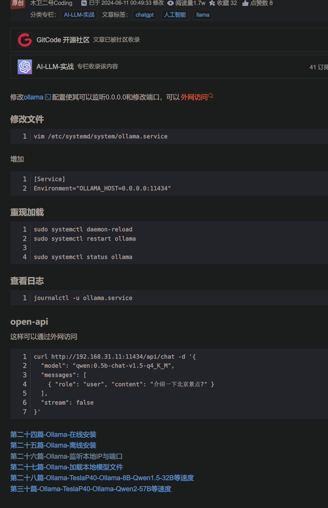

# 项目

-   没钱用 https://github.com/deepseek-ai/DeepSeek-R1
-   有钱用 https://github.com/deepseek-ai/DeepSeek-V3

其中 `R1` 的有以下分类：

| 模型版本         | 参数量 | 显存需求（FP16） | 推荐 GPU（单卡）                     | 多卡支持 | 量化支持 | 适用场景                                                     |
| ---------------- | ------ | ---------------- | ------------------------------------ | -------- | -------- | ------------------------------------------------------------ |
| DeepSeek-R1-1.5B | 15亿   | 3GB              | GTX 1650（4GB显存）                  | 无需     | 支持     | 低资源设备部署（树莓派、旧款笔记本）、实时文本生成、嵌入式系统 |
| DeepSeek-R1-7B   | 70亿   | 14GB             | RTX 3070/4060（8GB显存）             | 可选     | 支持     | 中等复杂度任务（文本摘要、翻译）、轻量级多轮对话系统         |
| DeepSeek-R1-8B   | 80亿   | 16GB             | RTX 4070（12GB显存）                 | 可选     | 支持     | 需更高精度的轻量级任务（代码生成、逻辑推理）                 |
| DeepSeek-R1-14B  | 140亿  | 32GB             | RTX 4090/A5000（16GB显存）           | 推荐     | 支持     | 企业级复杂任务（合同分析、报告生成）、长文本理解与生成       |
| DeepSeek-R1-32B  | 320亿  | 64GB             | A100 40GB（24GB显存）                | 推荐     | 支持     | 高精度专业领域任务（医疗/法律咨询）、多模态任务预处理        |
| DeepSeek-R1-70B  | 700亿  | 140GB            | 2x A100 80GB/4x RTX 4090（多卡并行） | 必需     | 支持     | 科研机构/大型企业（金融预测、大规模数据分析）、高复杂度生成任务 |

```shell
# 安装 Ollama
$ curl -fsSL https://ollama.com/install.sh | sh
$ ollama -v # 检查指令版本
ollama version is 0.5.11
$ systemctl status ollama # 检查服务状态
$ cat /etc/systemd/system/ollama.service # 检查服务配置
[Unit]
Description=Ollama Service
After=network-online.target

[Service]
ExecStart=/usr/local/bin/ollama serve
User=ollama
Group=ollama
Restart=always
RestartSec=3
Environment="PATH=/home/ljp/.local/bin:/usr/local/sbin:/usr/local/bin:/usr/sbin:/usr/bin:/sbin:/bin:/usr/games:/usr/local/games:/snap/bin"

[Install]
WantedBy=default.target

# 拉取 DeepSeek 模型进行测试
$ ollama pull deepseek-r1:1.5b # 可以 ollama pull deepseek-r1:1.5b 一下这个模型尝试在本地问答, 或更换 ollama pull deepseek-r1:8b, 另外可以尝试修改存储地址, 需要通过 OLLAMA_MODELS 环境变量的设置

# 拉取代码仓库
$ git clone https://github.com/ErSanSan233/prose-polish.git

# 配置项目
$ cd prose-polish
$ cp config.example.js config.js
$ vim config.js
export const CONFIG = {
    // 自定义模型配置
    CUSTOM_MODEL: {
        BASE_URL: 'http://127.0.0.1',
        API_KEY: '', // 你的 API Key
        MODEL: 'deepseek-r1:1.5b' // 例如：gpt-3.5-turbo
    },

    // AI 助手的系统设定
    SYSTEM_MESSAGE: {
        role: 'system',
        content: '你是一个专业的文字编辑，熟知中国的出版规范，精通编校质量标准。同时，对于任何请求，你都会直接给出结果，不会做过多的解释。'
    }
}; 

# 启动项目
$ ./start.sh
# 检查环境
# 安装依赖
# 启动服务

# 访问 http://127.0.0.1:3000 开始享受

```


更改

要么环境变量？


要么使用服务？



要么容器重定？

可以考虑 [使用容器](https://hub.docker.com/r/ollama/ollama)，这个很好，第一次教我使用容器来管理 `GPU`。