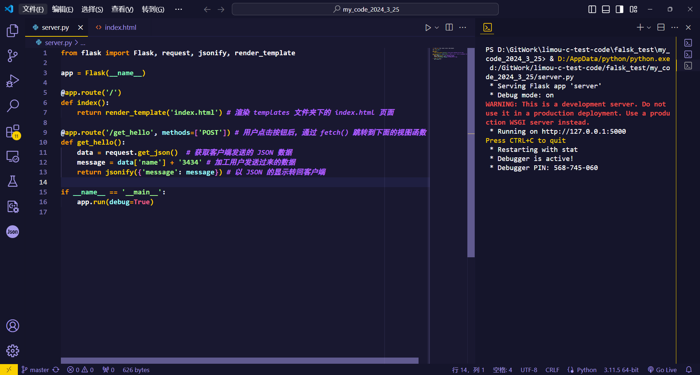
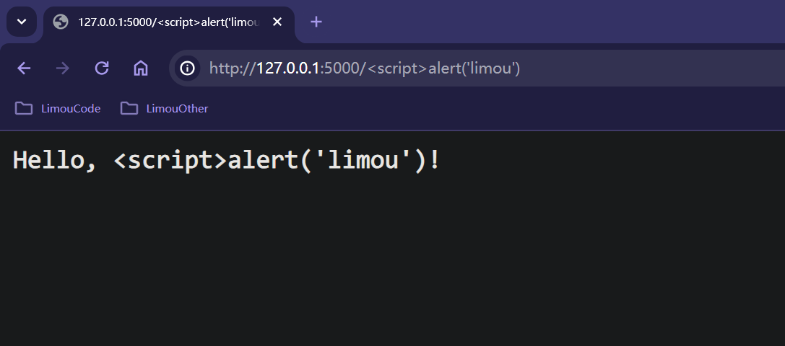
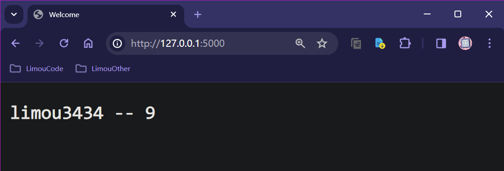
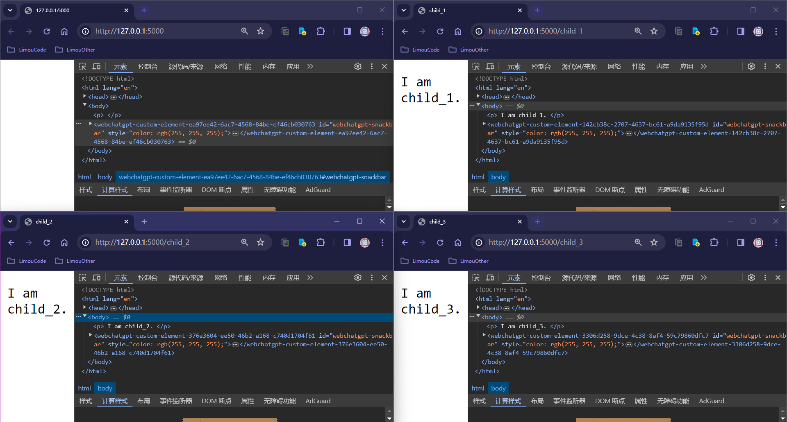

>   前要：使用 `Flask` 实在是我的无奈之举，本人的技术栈在写这篇文章时还没有怎么深入网络编程，而在学校接手了一个小的项目却需要一定的 `BS` 模型开发基础。在一番“市场调研”后，最终选择了这个小而美的 `Web` 框架。
>
>   但是实际上我并不知道这个框架是否好用，只是作为学习方便日后的知识拓展（我希望通过 `Flask` 的学习让我更加了解从前端到后端过程中中缺失的那一部分知识）。
>
>   至少从 `Github` 的 `star` 数量来看，这个框架还是值得学习的！

>   基础：首先提醒一下，在学习 `Flask` 前，您至少需要以下知识（我已给出学习链接）
>
>   -   使用过一段时间的 [Python 语言](https://docs.python.org/zh-cn/3/)，至少 `python` 的列表、元组、集合、字典以及函数、控制语...还有一些常见的模块，例如 `pathlib`...
>
>   -   对一些命令行的基本操作和理解，至少会使用 `pip` 包管理器吧？
>
>   -   [基础的 Web 开发知识](https://developer.mozilla.org/zh-CN/docs/Learn)（尤其是 `HTML、CSS、JS` 三大件），这些不需要精通，但是需要了解一二，尤其是 `JS`...
>
>   -   一些网络知识，这一部分您直接 `Google` 一下最快，或者直接跟着我后续的教程来学习也可以，您至少应该知道：
>
>       (1)服务端和客户端应该怎么绑定套接字
>
>       (2)明白一个 `host` 可以有多个 `ip`
>
>       (3)`ip` 和 `port` 组成一个套接字
>
>       (4)`port` 对于进程的作用是什么
>
>   -   一些 [关于 JSON 的知识](https://www.json.org/json-en.html)，这部分很容易学习，尤其是配合 `python` 的使用...
>
>   -   如果可以，您还需要具备一定的 `MySQL` 基础，您可以去看看我写的 [MySQL 文章](../../../SQL_Database_Note\MySQL实践)，或者是 [MySQL 官方文档](https://dev.mysql.com/doc/)，亦或是 [MySQL 中文文档](https://www.mysqlzh.com/)...
>

>   资料：这里我给出一些常用的学习文档
>
>   -   [Flask 的 Github 地址](https://github.com/pallets/flask)，在这里我也给出 [Flask 相关文档](https://flask.palletsprojects.com/en/3.0.x/)。
>   -   经常和 `Flask` 一起比较的 `Web` 框架 `Django`，这里我也给其出 [Django 的 Github 地址](https://github.com/django/django)
>   -   另外，您还需要了解 [Jinja2 相关文档](https://jinja.palletsprojects.com/en/2.10.x/)，以及 [Jinja2 的 Github 地址](https://github.com/pallets/jinja) 我们在后续会细细讲这个模块和 `flask` 之间的关系。 
>
>   我选择先 `Flask` 后再拓展到 `Django`，前者是一个微框架，会更加容易学习。

# 1.环境准备

## 1.1.编辑环境和配置

建议下载专业版的 `pycharm-professional`，虽然收费但是内部具有更多功能（或者使用 `VSCode` 替代，这个是免费的）。

-   [pycharm-professional 下载地址](https://www.jetbrains.com/pycharm/)
-   [VSCode 下载地址](https://code.visualstudio.com/)



>   注意：我主要使用 `VSCode`，您可以跟着我来，但是 `VSCode` 的插件配置有些许繁琐，这里我不提及，有机会在补上，待补充...

## 1.2.Python 版本

我建议使用 `python 3.9` 以上的 `python` 版本，以及 `Flask 2.0.1` 以上的 `Flask` 版本（使用 `pip install flask` 下载），下面是我使用的版本。


# 2.测试代码

在学习一门技术前，还有什么比彻底运行完一个程序并且成功得到想要的结果更加令人兴奋的事情呢？我来试试使用 `Flask` 框架在本地运行一个和网页端代码进行交互的例子。

```mermaid
graph TD;
    A[project_folder] --> B[app.py]
    A --> C[templates]
    C --> D[index.html]
```

一个 `Flask` 框架下前后端交互的 `app` 文件会按照上述目录进行编写，我们先来写一个简单的 `app.py` 后端应用，并且结合一个 `index.html` 前端页面来进行简单的数据交互，期间数据使用 `JSON` 来传递（而其他细节我暂时忽略或者写在注释中）。

```python
# app.py
from flask import Flask, request, jsonify, render_template

app = Flask(__name__)

@app.route('/')
def index():
    return render_template('index.html') # 渲染 templates 文件夹下的 index.html 页面

@app.route('/get_hello', methods=['POST']) # 用户点击按钮后，通过 fetch() 跳转到下面的视图函数
def get_hello():
    data = request.get_json()  # 获取客户端发送的 JSON 数据
    message = data['name'] + '3434' # 加工用户发送过来的数据
    return jsonify({'message': message}) # 以 JSON 的显示转回客户端

if __name__ == '__main__':
    app.run(debug=True)

```

```html
<!-- index.html -->
<!DOCTYPE html>
<html lang="en">
<head>
    <meta charset="UTF-8">
    <meta name="viewport" content="width=device-width, initial-scale=1.0">
    <title>Button Click</title>
</head>
<body>
    <h1>Click the button to get "hello"</h1>
    <button id="myButton">Click Me</button>

    <script>
        document.getElementById('myButton').addEventListener('click', function() { //设置事件监听，监听点击类型的事件，一旦点击就会立刻执行接下来的匿名函数
            const data = { name: 'limou'}; //需要发送给服务端的 JSON 数据
            //发送 POST 请求把 data 发送到 Flask 服务器
            fetch('/get_hello', {
                method: 'POST',
                headers: {  'Content-Type': 'application/json' },
                body: JSON.stringify(data)
            })
            .then(response => response.json()) //接受服务端的返回值，并且将其转化为 JSON 数据
            .then(data => { alert(data.message); }); //在收到服务器响应后，弹出消息框打印消息
        });
    </script>
</body>
</html>

```

注意前端文件的放置位置，不要放错目录，要放在 `templates` 中！然后直接运行这个 `app.py` 代码（或者在命令行中使用 `flask --app app run`，实际上改命令就是代码中的 `app.run()` 的另一种命令行写法），运行窗口出现如下结果证明后端程序运行成功。


然后直接根据提示，在浏览器中访问 `http://127.0.0.1:5000`（可以手动在浏览器的地址栏中输入，或者直接长按 `[ctrl]` 后鼠标左键控制台中的地址，这会使用您计算机中默认的浏览器打开这个网址）。

`http://127.0.0.1:5000` 是一个本地 `ip` 的默认 `port`（简单来说，通过一个 `ip` 地址和端口号，就可以确定一台计算机上的一个进程，粗暴理解的话，端口号 `port` 就是网络上的一种进程编号）。

浏览器成功渲染 `templates/index.html` 即可显示出一个网页（如果您得到其他的网页，那就说明您的程序有些问题）：


点击 `Click Me` 按钮，就会在浏览器中弹出一个弹窗，这就是从服务端发送回来的经过加工的数据，而在服务端的运行窗口中，就会获得以下的日志。

```cmd
127.0.0.1 - - [25/Mar/2024 23:34:57] "POST /get_hello HTTP/1.1" 200 -
```

到这里，我相信您一定能深刻理解 `Flask` 框架是在做什么的了，这就是一个和前端进行交互的后端框架。

# 3.代码细节

```python
from flask import Flask, request, jsonify, render_template

app = Flask(__name__)

@app.route('/')
def index():
    return render_template('index.html') # 渲染 templates 文件夹下的 index.html 页面

@app.route('/get_hello', methods=['POST']) # 用户点击按钮后，通过 fetch() 跳转到下面的视图函数
def get_hello():
    data = request.get_json()  # 获取客户端发送的 JSON 数据
    message = data['name'] + '3434' # 加工用户发送过来的数据
    return jsonify({'message': message}) # 以 JSON 的显示转回客户端

if __name__ == '__main__':
    app.run(debug=True)
```

## 3.1.创建 Flask 对象 app

首先我们从上面这个后端程序开始分析，`form flask import Flask` 其实就是导入了 `flask` 模块中的 `Flask` 类，在后面 `app = Flask(__name__)` 中，实际上就是使用用当前文件（也就是编写这段代码的 `.py` 文件）的名字来创建一个 `Flask` 类类型的对象 `app`。

然后使用 `run()` 方法：

```python
if __name__ == '__main__':
    app.run(debug=True)
```

就可以让这个 `app` 应用成功运行起来。

>   补充：为什么需要给 `Flask` 的实例化对象传递 `__name__` 来构造呢？这涉及到我后面内容会提及的模板文件和静态文件，传入这个参数就是为了指定应用的根路径（类似工作路径），方便 `Flask` 对象知道在哪里寻找模板文件和静态文件等资源，这个之后您就明白了...

## 3.2.路由和视图函数的使用

>   补充：首先我们来扫一个盲，或许有人不清楚装饰器的作用，这里补充以下。
>
>   ```python
>   # 装饰器的使用
>   def logger(func):
>       def wrapper(*args, **kwargs): # args 是直接传参的元组参数包，kwargs 是关键字传参的字典参数包
>           print(f'Function {func.__name__} is running, carry two parameters {args}...') # 打印函数启动的信息
>           result = func(*args, **kwargs) # 真正开始调用函数的时候，先把结果存储起来
>           print(f'Function {func.__name__} finished running.') # 打印函数结束的信息
>           return result # 返回调用结果
>       return wrapper # 返回一个函数而不是 wrapper() 的调用结果
>   
>   @logger
>   def add_numbers(a, b):
>       return a + b
>   
>   if __name__ == '__main__':
>       result = add_numbers(10, 20)
>       print(result) 
>   
>       # 输出结果：
>       # Function add_numbers is running, carry two parameters (10, 20)...
>       # Function add_numbers finished running.
>       # 30
>   ```
>
>   实际上，**您可以简单理解为，装饰器是一种特殊类型的函数，它可以用来修改其他函数的行为，本质上是一个接受函数作为参数并返回一个新函数的高阶函数，是一种函数的拓展**。
>
>   修饰器的工作就是让定义在其后面的函数在修饰器内部进行调用，函数不是直接被调用的，而是通过修饰器来返回一个被修饰过的新函数。这样的函数可以复用之前原有的函数。最典型的应用就是在函数的执行前后加上日志消息。您在后面可以看到，一个函数经过修饰器的声明后，除了完成自己本身的功能，还会实现一些您没有加入函数体的其他功能...
>
>   另外类装饰器还可以应用来类上，也就是类装饰器，这些您也可以去了解一些...

```python
@app.route('/')
def index():
    return render_template('index.html') # 渲染 templates 文件夹下的 index.html 页面
```

`@app.route('/')` 绑定一个路由（其实就是路径），后续带上一个被装饰的函数，告诉 `Flask` 前端程序访问哪一个路由时，就应该执行哪一个被装饰过的函数。

>   补充：这里其实做了省略，原本 `/` 应该写成完整的 `url` 为 `http或https://域名:端口号`。但是由于实际部署中的 `url` 是一直确定的，用户只是在这个 `url` 上做不同的跳转，因此在这里我们可以直接把 `/` 理解为一个网站链接的默认主页面。

这里绑定这个 `/` 路由后，一旦用户申请访问这个主页面（也就是访问 `http://127.0.0.1:5000`）时，就会自动执行 `index()` 这个视图函数（也就是一个被装饰的函数罢了，没什么特殊的）。

而在用户在浏览器上访问 `http://127.0.0.1:5000` 后，该函数会使用 `flask` 模块中的一个函数 `render_template('index.html')` 作为返回值，这样可以让浏览器渲染 `templates` 文件夹下的 `index.html` 页面文件（实际上您可以理解为，这个函数把这个 `index.html` 页面发送给浏览器进行页面展示/页面渲染）。

>   注意：这里的 `templates` 是默认的文件夹，您需要自己自定义一个文件夹（有些智能的编辑器会帮您做这件事），然后在里面放入您需要交给浏览器渲染的 `.html` 文件。

当然，如果 `index()` 直接进行返回，就会被自动解析为 `HTML` 类型的数据。

>   补充：实际上在浏览器的 `URL` 地址栏中也可以向后端程序中传递参数，而无需通过 `request` 对象，只需要给路由加上 `'<...>'` 参数即可。
>
>   还可以给传递的参数限定默认值，例如 `'/<int:args>'`，还有一些其他的类型限定，您可以自己进行查看。
>
>   ```python
>   # 视图函数从 URL 中获取参数
>   from flask import Flask, render_template
>   
>   app = Flask(__name__)
>   
>   @app.route('/')
>   def index():
>       return render_template('index.html')
>   
>   @app.route('/<int:args>') # 这里会把 args 解释为 int 类型
>   def detail(args):
>       return args
>   
>   if __name__ == '__main__':
>       app.run(debug=True)
>   ```
>
>   
>
>
>   另外，在 `JS` 中直接使用 `fetch(url/)` 发送数据和使用 `URL` 参数的形式传递数据是不同的，它们有以下区别：
>
>   1.   **直接使用 Fetch() 发送数据**：使用 `fetch()` 函数发送数据通常是在前端（客户端）的 `JavaScript` 代码中完成的，它是通过浏览器的 `Fetch API` 来发送网络请求的。通过 `fetch()` 函数发送的数据，可以包含在请求的 `body` 中，可以是 `JSON` 格式、`FormData` 对象、文本...发送数据更加灵活，更适合传递敏感信息
>   2.   **URL 参数传递数据**：`URL` 参数（一般是公开的）传递数据通常是在 `URL` 中添加参数的方式，在浏览器中直接访问带有参数的 `URL` 即可传递数据。这种方式通常用于 `GET` 请求中，通过查询字符串（`query string`）将数据附加在 `URL` 的末尾。例如，可以通过访问 `http://example.com/data?param1=value1&param2=value2` 这样的 `URL` 来传递参数 `param1` 和 `param2` 的值（查询字符串通常位于 `URL` 的末尾，使用问号（`?`）开始，多个参数之间使用和号（`&`）分隔，有关的信息您可以稍微 `Googl` 一下）。
>
>   在本系列博文中，主要采用第一种方式。另外，您可能还需要注意使用 `escape()` 来避免一些安全问题（`XSS` 攻击）。
>
>   ```py
>   # 演示一个具有安全隐患的代码
>   from flask import Flask
>   app = Flask(__name__)
>   
>   @app.route("/<string:name>")
>   def hello(name):
>       return f"Hello, {name}!" 
>   
>   if __name__ == "__main__":
>       app.run()
>   ```
>
>   在这个例子中，我们没有使用 `escape()` 函数。如果用户输入的 `name` 包含恶意代码，例如 `alert('XSS')`，那么这段代码将被执行，有可能会导致跨站脚本攻击（`XSS`）。为了避免这种情况，我们应该使用 `escape()` 函数对用户提供的数据进行转义。
>
>   但是，这里有个我自己也没搞懂的地方，上述例子在我的 `Google` 浏览器中没有显示出来，但是我用来另外一种方式显示出来，虽然怪异，但是能说明这些安全问题。
>
>   ```python
>   # 演示一个具有安全隐患的代码(修改后)
>   from flask import Flask
>   from markupsafe import escape
>   app = Flask(__name__)
>   
>   @app.route("/<string:name>")
>   def hello(name):
>       return f"Hello, {name}</script>!" 
>   
>   if __name__ == "__main__":
>       app.run(debug=True)
>   ```
>
>   
>
>   这意味着用户可以通过 `URL` 来注入恶意代码，达到跨站脚本攻击的目的。攻击者将恶意代码注入到某个网站或 `Web` 应用中，当其他用户访问这个被注入的网站时，这些恶意代码会在用户的浏览器上执行。这种攻击可以导致用户数据的泄露，甚至控制用户的浏览器行为。
>
>   ```python
>   # 没有问题的代码
>   from flask import Flask
>   from markupsafe import escape
>   app = Flask(__name__)
>   
>   @app.route("/<string:name>")
>   def hello(name):
>       return f"Hello, {escape(name)}</script>!" 
>   
>   if __name__ == "__main__":
>       app.run(debug=True)
>   ```
>
>   
>
>   这样就可以直观看出有没有加上 `escape()` 的区别了。

## 3.3.前端页面发送网络请求

在我的前端代码 `index.html` 中，给 `Clicky me` 按钮添加了一个 `JS` 事件，内部使用 `fetch()` 向后端程序 `app.py` 网络请求。

```html
<script>
    document.getElementById('myButton').addEventListener('click', function() { //设置事件监听，监听点击类型的事件，一旦点击就会立刻执行接下来的匿名函数
        const data = { name: 'limou'}; //需要发送给服务端的 JSON 数据
        //发送 POST 请求把 data 发送到 Flask 服务器
        fetch('/get_hello', {
            method: 'POST',
            headers: {  'Content-Type': 'application/json' },
            body: JSON.stringify(data)
        })
            .then(response => response.json()) //接受服务端的返回值，并且将其转化为 JSON 数据
            .then(data => { alert(data.message); }); //在收到服务器响应后，弹出消息框打印消息
    });
</script>
```

`fetch()` 向 `'/get_hello'` 路由发送请求，同时把其他的参数也一并传递（包括方法 `method`、请求头 `headers`、请求体 `body`）。

其中需要注意的是，请求体的数据是用 `JSON.stringify(data)`，也就是 `JSON` 的形式来进行传输，因此后续的后端代码也需要使用 `JSON` 来进行接受。

## 3.4.后端代码响应页面请求

后端代码就根据客户端请求的是哪一个路由，执行哪一个视图函数：

```python
@app.route('/get_hello', methods=['POST']) # 用户点击按钮后，通过 fetch() 跳转到下面的视图函数
def get_hello():
    data = request.get_json()  # 获取客户端发送的 JSON 数据
    message = data['name'] + '3434' # 加工用户发送过来的数据
    return jsonify({'message': message}) # 以 JSON 的显示转回客户端
```

同时您还需要注意到，我还引入了 `flask` 模块中的 `request` 对象，该对象可以提供访问客户端请求的各种信息和功能，以便服务器端程序对请求进行加工处理。通过这个对象的 `get_json()` 方法，就可以从 `request` 中读取前端发送的 `JSON` 数据。

可以看到，在这个视图函数的过程中，将前端发送过来的数据进行解析后（得到 `limou` 这一串字符串），进行了字符串拼接（`'limou' + '3434'`），再直接通过 `flask` 模块中 `jsonify()` 就可以再次打包为 `JSON` 数据返回前端代码中。、

## 3.4.页面显示后端代码结果

因此，我们来逐步分析 `<script>` 标签中的链式调用：


这段代码展示了一个典型的使用 `fetch()` 发起网络请求并处理响应的流程，它采用了 Promise 的链式调用方法来处理异步操作。

让我们逐步解释这个链式调用的过程：

1.  `fetch('/get_hello', { ... })`：首先，使用 `fetch()` 函数向指定的 `URL` 即 `/get_hello` 发送一个 `POST` 请求，配置对象中包括请求方法为 `POST`、请求头为 `JSON` 格式、请求体为经过 `JSON` 序列化后的数据（`JSON.stringify(data)`）。
2.  `.then(response => response.json())`：`.then()` 方法在前一个操作完成和服务端的响应后开始执行，将服务器返回的响应对象（`response`）先转换为 `JSON` 格式，并返回一个新的 `Promise` 对象（这里使用箭头函数对 `response` 进行转化处理，箭头函数是 `JS` 中的一种语法糖，以 `(形参 => 方法调用)` 的形式来快速得到一个匿名函数的返回结果）。
3.  `.then(data => { alert(data.message); })`：最后，又调用了一个 `.then()` 方法，用于处理上一步返回的 `JSON` 数据（`data`）。在这里，使用箭头函数将 `data` 中的 `message` 属性值通过 `alert()` 方法弹出显示。

至此，整个代码的运行流程结束，尽管有些细节没有完全解释清楚，但我认为您完全可以开始着手写一些基本的 `Web` 程序了。

# 4.可选做法

## 4.1.热加载

另外，值得一提的是，`VSCode` 和 `Flask` 联合具有热加载的功能，所谓的“热加载”实际上就是在调试代码时，即便程序员修改了代码，只需进行保存即可，无需再次启动运行，编译器会自动进行重新加载（本质应该是检查文件的修改时间是否发生改动）。

该设置默认是启动的，我们可以在 `app.run()` 方法中进行设置，给 `app()` 添加 `debug=False` 即可关闭这一加载特性（设置 `True` 即可打开）。

运行后端程序后，控制台就会输出如下的日志信息，显示是否开启热加载功能：

```shell
 * Debug mode: on
```

>   补充：也可以使用 `flask --app app run --debug` 的方式，如果不加 `--debug` 直接启动，就不会有热加载的效果。

## 4.2.主机端口

`Flask` 默认给我们分配的 `ip` 和端口号是 `127.0.0.1:5000`，我们可以进行手动修改，同样是在 `app.run()` 中使用参数 `host='ip地址'` 和 `port='port端口号'`。一般我们在实际开发中 `ip地址` 设置为 `0.0.0.0` 表示服务端进程使用本主机上的任意一个网卡的 `ip地址`，而端口号一般设置为 `8` 开头的 `4` 位数字。

>   注意：上述 `host='ip地址'` 和 `port='port端口号'` 的设置，如果您了解过网络的话就能理解，如果没有，这里解释还需要花很多的字数。因此，如果您只是在一台电脑上编写您的 `BS` 代码的话，直接按照默认设置即可，其他等以后学习了网络知识再说。

>   补充：您还可以使用命令行 `flask run --host='ip地址'` 的形式来启动，如果您看过我之前的 `Linux` 下的网路编程代码，绝对会觉得亲切起来，您一定会意识到，所谓的 `flask` 框架下的 `python` 代码，不过就是一个服务端代码罢了。

## 4.3.模板文件

我们可以在创建 `Flask` 对象之前，更换默认模板文件的路径（默认是和 `app.py` 同级目录下的 `templates\`），只需要 `app = Flask(__name__, template_folder='自定义的模板文件路径')` 即可。

## 4.4.静态文件

创建 `Flask` 对象后，默认值也可以用 `static_folder='自定义的静态文件路径'` 来修改（默认值就是 `static\`）。

然后把 `HTML` 内的 `CSS/JS` 外部链接使用后面将要的 `Jinja2` 的向 `HTML` 传参的方式，使用 `"{{ url_for('static', filename='静态文件对于您设置的静态文件夹下的相对路径(不要加 . 符号)') }}"`，则这个函数会在渲染时就被自动调用（实际上这里的 `'static'` 就是视图函数的名称，该函数可以把视图函数转化为路径）。

>   补充：我这时一边学习 `flask` ，一边在项目中采用的是前后端分离的目录结构（没有采用 `flask` 默认的工作路径）进行编码实践。如下，您可以尝试和我一样，也可以采用 `flask` 推荐的（因为我还没看过官方对于这块的阐述，您可以前去一看，这里我只是为了个人方便这么设置的）。
>
>   ```shell
>   # 我的目录树
>   my_app/
>   ├── .git			# git 本地仓库相关文件
>   ├── .gitee/github	# 远端仓库配置文件
>   ├── .gitignore		# Git 忽略配置文件
>   ├── assets/       	# 说明文件资源
>   ├── README.md       # 项目说明文件
>   │
>   ├── app_name/       # 项目说明文件
>   │   ├── backend/		# 后端代码
>   │   │   ├── app.py      	# Flask 后端应用代码
>   │   │   └── ...
>   │   │
>   │   └── frontend/		# 前端代码
>   │       ├── templates/  	# Flask 模板目录
>   │       ├── static/		  	# Flask 静态目录
>   │ 	    │   ├── css/        	# 前端 CSS 样式文件
>   │       │   ├── js/				# 前端 JavaScript 脚本文件
>   │       │ 	├── assets/         # 存放资源文件夹
>   │       │   │   ├── images/     	# 图片资源文件夹
>   │       │   │   └── fonts/          # 字体文件夹
>   │       └── ...
>   │
>   └── other
>   ```
>
>   而在我的代码片段如下，您可以参考一下：
>
>   ```python
>   # 在 app.py 中，修改模板文件和静态文件的路径
>   work_path = Path.cwd() # 工作路径
>   frontend_path = work_path / 'frontend' # 前端路径
>   
>   app = Flask(
>       __name__,
>       template_folder=str(frontend_path / 'templates'), # 模板文件
>       static_folder=str(frontend_path / 'static') # 静态文件
>   )
>   ```
>
>   ```html
>   <!-- 在 html 文件中 CSS/JS 的相对路径设置 -->
>   <link rel="stylesheet" href="{{ url_for('static', filename='css/test.css') }}" type="text/css"/>
>   <script src="{{ url_for('static', filename='js/test.js') }}"></script>
>   ```


>   前要：`Jinja2` 是一个流行的 `Python` 模板引擎，用于生成动态的文本内容，通常用于 `Web` 开发中辅助生成 `HTML` 页面。
>
>   `Jinja2` 与 `Flask` 之间有着密切的关系，因为 `Flask` 框架默认使用 `Jinja2` 作为其模板引擎（两者也是同一个作者）。
>
>   并且安装 `Flask` 时就会自动安装 `Jinja2` 模块，无需您再次下载。

# 1.渲染完整的 HTML 页面

在之前的编码中 `render_template()` 实际上就是使用 `Jinja2` 模板引擎来渲染模板文件并生成 `HTML` 页面，参数给一个 `.html` 文件即可。

# 2.Jinja2 的基本语法形式

## 2.1.传递参数

```python
from flask import Flask, render_template

app = Flask(__name__)

@app.route('/')
def index():
    user_name = 'Alice'
    age = '<h1>25<h1>'
    interests = ['Reading', 'Cooking', 'Hiking']
    return render_template('index.html', name=user_name, age=age, interests=interests) # 使用 “参数名=参数值” 的形式传递

if __name__ == '__main__':
    app.run(debug=True)
```

```html
<!DOCTYPE html>
<html lang="en">
<head>
    <meta charset="UTF-8">
    <meta name="viewport" content="width=device-width, initial-scale=1.0">
    <title>Welcome</title>
</head>
<body>
    <h1>Welcome, {{ name }}!</h1>
    Your age is {{ age }} years old.
    <p>Your interests are:</p>

    <ul>
        <li>{{ interests[0] }}</li>
        <li>{{ interests[1] }}</li>
        <li>{{ interests[2] }}</li>
    </ul>

    <ul>
        
            <li>{{ interest }}</li>
        
    </ul>
</body>
</html>
```


可以看到，我们不仅仅使用 `render_template()` 渲染了一个完整的页面，还可以传递其他的参数交给 `HTML` 模板进行渲染（可以看到是通过类似 `{{ ... }}` 的模式进行获取的），这里我故意传递了一个 `<h1>` 标签，只是为了检验参数的传递是直接按照字符类型进行渲染的。

还可以在 `{{ ... }}` 中像使用 `python` 数组或字典一样来使用传递过来的参数。

>   补充：使用 `Jinja2` 模板引擎结合 `Flask` 的 `render_template()` 函数来传递参数到 `HTML` 文档的主要原因有以下几点：
>
>   1.  **模板渲染**：`Jinja2` 允许在 `HTML` 模板中嵌入动态内容，这样可以在服务器端通过 `Flask` 的 `render_template()` 函数将动态数据传递给模板，并最终生成渲染好的 `HTML` 页面，然后再返回给客户端浏览器。这种方式可以实现更灵活和动态的页面生成。对 `SEO` 和搜索引擎友好，搜索引擎可以直接解析服务器端渲染的 HTML 内容，有利于页面的搜索引擎优化（SEO）。
>   2.  **模板继承**：`Jinja2` 支持模板继承，可以创建基础模板并在其他模板中扩展或覆盖它，这样可以提高页面代码的复用性和可维护性。
>   3.  **上下文处理**：`Jinja2` 允许在模板中使用上下文处理，比如循环、条件判断等，这样可以根据后端传递的数据动态生成页面内容，使页面更加丰富和交互性强。
>   4.  **防止 XSS 攻击**：使用 `Jinja2` 模板引擎可以有效防止跨站脚本攻击（`XSS`），因为 `Jinja2` 会自动对输出的内容进行转义，避免恶意脚本注入（这点您看看就行，不理解也没关系），这点适用于数据安全性要求较高的项目。
>
>   相比之下，直接使用 `return` 返回不同的数据，然后在客户端使用 `JavaScript` 的 `fetch().then()` 接受数据也是可行的，有优势，也存在一些限制和不足：
>
>   1.   **客户端渲染**：使用 `JavaScript` 在客户端接收数据并动态更新页面内容属于客户端渲染，这样的方式可能会增加客户端的工作量和页面加载时间，特别是在处理大量数据或复杂页面时可能影响性能。但是在客户端使用 `JavaScript` 处理数据并动态更新页面内容，也有可能会减轻服务器负担，提高页面响应速度。
>   2.   **SEO 和搜索引擎爬虫**：部分搜索引擎爬虫可能无法正确解析 `JavaScript` 渲染的内容，这可能会影响到页面的搜索引擎优化（`SEO`）。
>   3.   **可维护性和灵活性**：直接在客户端处理数据并更新页面可能会导致代码结构不够清晰和维护困难，尤其是对于复杂的页面结构和数据交互，使用服务器端模板渲染会更加方便和灵活。
>   4.   **前后端分离**：适用于前后端分离开发模式，提高了前端和后端的独立性和灵活性。
>   5.   **动态交互**：适用于需要频繁交互和异步加载数据的页面。
>
>   在本系列博文中，多用第一种传递方式。

不过可惜的是，`Jinja2` 不支持 `break` 和 `continue` 语句。

## 2.2.控制语句

并且，还可以看到 `Jinja2` 还具备一定的语法，这里我使用了一个 ` ... `  来实现遍历参数进行渲染的操作，这实际上就是 `Jinja2` 的控制语句。

相关的控制语句还有 `if` 语句，其形式为 `  `。

```python
from flask import Flask, render_template

app = Flask(__name__)

# 路由定义
@app.route('/')
def index():
    # data = 'limou'    
    # return render_template('index.html', data=data)
    return render_template('index.html')

if __name__ == '__main__':
    app.run(debug=True)
```

```html
<!DOCTYPE html>
<html lang="en">
<head>
  <meta charset="UTF-8">
  <meta name="viewport" content="width=device-width, initial-scale=1.0">
  <title>Conditional Statement Example</title>
</head>
<body>
  
    <p>Hello, {{ data }}!</p>
  
    <p>Welcome!</p>
  
</body>
</html>
```

>   吐槽：`Jinja2` 的控制语句还挺像命令行脚本的...

>   补充：这里可以看到，`Jinja2` 如果需要使用一个自定义的变量，就可以使用 `{{ ... }}`，如果是关键字则使用 ``

## 2.3.过滤器

使用 `render_template()` 传递给 `HTML` 页面后，还可以经过一道过滤器，类似 `Linux` 里的管道，也是使用管道操作符 `|` 来使用。

我们先来试试内置的一些管道命令：

```python
from flask import Flask, render_template

app = Flask(__name__)

@app.route('/')
def index():
    return render_template('index.html', data='limou3434')

if __name__ == '__main__':
    app.run(debug=True)
```

```html
<!DOCTYPE html>
<html lang="en">
<head>
    <meta charset="UTF-8">
    <meta name="viewport" content="width=device-width, initial-scale=1.0">
    <title>Welcome</title>
</head>
<body>
    <p>{{ data }} -- {{ data | length }}</p>
</body>
</html>
```



>   补充：其他的内置过滤器您可以直接查看 [Jinja2 的内置过滤器清单](https://docs.jinkan.org/docs/jinja2/templates.html#builtin-filters)，这里就不再补充...

那么我们能不能自己定义一个过滤器呢？可以，只需要使用 `@app.template_filter('过滤器名称') ...` 装饰器或者 `app.template_filter('过滤器名称', 回调方法)` 方法就可以把函数注册为 `Jinja2` 能使用的过滤器，直接看代码吧。

>   补充：过滤器的名称也可以不传入，这样将默认过滤器的名字为回调函数的函数名。

```python
from flask import Flask, render_template

app = Flask(__name__)

# 1.使用 @app.template_filter()
@app.template_filter('upper_custom_filter')
def upper_custom_filter(value):
    return value.upper() # 在这里编写您的过滤器逻辑，例如将字符串转换为大写

# 2.或者使用 app.template_filter() 方法
def lower_custom_filter(value): # 先定义一个调用函数
    return value.lower() # 这里是过滤器的具体逻辑，例如将字符串转换为小写

app.template_filter('lower_custom_filter')(lower_custom_filter)
# app.add_template_filter(lower_custom_filter, 'lower_custom_filter') 也可以

# 路由定义
@app.route('/')
def index():
    data = 'limou'    
    return render_template('index.html', data=data)

if __name__ == '__main__':
    app.run(debug=True)
```

```html
<!DOCTYPE html>
<html lang="en">
<head>
    <meta charset="UTF-8">
    <meta name="viewport" content="width=device-width, initial-scale=1.0">
    <title>Welcome</title>
</head>
<body>
    <p>{{ data | upper_custom_filter }}</p>
    <p>{{ data | upper_custom_filter | lower_custom_filter }}</p>
</body>
</html>
```


>   补充：为什么不直接在后端中处理完数据再返回，而是选择使用过滤器么？
>
>   `Jinja2` 中的过滤器语法是为了方便在模板中对数据进行处理和格式化。尽管可以在后端处理完数据后再返回给前端，但在实际开发中，经常会遇到需要在模板中对数据进行一些简单的处理或格式化的情况，这时候使用过滤器语法就显得非常方便和直观（但是实际上也是后端程序在执行这个代码，只是为了方便和直观）。
>
>   以下是几个使用过滤器语法的场景和优点：
>
>   1.  **数据格式化**：过滤器可以帮助将数据以特定的格式显示，比如日期格式化、数值格式化等。
>   2.  **数据截断**：可以通过过滤器截断过长的字符串，使其在页面上显示更加美观。
>   3.  **数据转换**：可以将数据转换为特定的类型或格式，比如将字符串转换为大写或小写、将数字格式化为货币形式等。
>   4.  **数据过滤**：可以使用过滤器来过滤数据，只显示符合条件的数据。
>   5.  **数据排序**：可以对列表或字典等数据进行排序，并在模板中以指定的顺序显示数据。
>   6.  **数据处理**：可以进行简单的数据处理操作，比如求和、求平均值等。
>
>   通过在模板中使用过滤器语法，可以使模板更加灵活和可复用，降低后端处理数据的复杂度，同时也提高了模板的可读性和维护性。因此，`Jinja2` 提供过滤器语法是为了让模板更加强大、灵活和易用。

## 2.4.模板继承

大部分网站的骨架是类似的，完全没有必要让前端工程师多次编写相似的 `HTML` 文件，可以考虑让一个基本网页文件继承到多份子文件。当然，这种情况只适用于页面重复性高的情况，如果网站较小，就完全没有必要这么做。

先编写一个后端程序：

```python
from flask import Flask, render_template

app = Flask(__name__)

# 路由定义
@app.route('/')
def father():
    return render_template('father.html')

@app.route('/child_1')
def child_1():
    return render_template('child_1.html')

@app.route('/child_2')
def child_2():
    return render_template('child_2.html')

@app.route('/child_3')
def child_3():
    return render_template('child_3.html')

if __name__ == '__main__':
    app.run(debug=True)
```

在 `templates` 文件夹中制作一个 `father.html` 作为父模板。

```html
<!DOCTYPE html>
<html lang="en">
<head>
    <meta charset="UTF-8">
    <meta name="viewport" content="width=device-width, initial-scale=1.0">
    <title> </title>
</head>
<body>
    <p> </p>
</body>
</html>
```

然后和父模版同级下写三个子模板。

```jinja2



child_1



I am child_1.

```

```jinja2



child_2



I am child_2.

```

```jinja2



child_3



I am child_3.

```

运行程序后，就可以访问到三个不同但相似的子文件，但我们却没有真的编写三个子文件。




>   前要：关于 `MySQL` 的基础命令行使用，其相关的学习资料我在前面已经指出，这里我不再提及数据库安装和数据库操作的问题，默认您看到这里时，已经看过我给的 `MySQL` 资料并且对数据库有一定的操作实践了...当然，您可以尝试看下去，因为本篇对于 `MySQL` 的原生命令行操作比较少，而是使用 `ORM` 框架来操作数据库。

# 1.Flask 连接数据库

连接数据库就需要安装有关 `Python` 操作 `MySQL` 的数据库驱动模块，这里我推荐两款模块（`2024-3-27`）：

-   `MySQL` 官方 `mysql-connector-python`，有专门的团队进行更新，如果需要使用最新的 `MySQL` 功能，可以选择
-   纯 `Python` 编写的 `pymysql`，虽然效率稍微低了些，但是基本是无缝衔接 `Python` 的编码过程
-   纯 `C` 编写的 `mysqlclient`，执行效率高，但却是第三方模块，在 `Linux` 下部署会相对容易

>   注意：`MySQL-python` 已被 `python3` 淘汰，`python3` 已不支持使用该模块，但是该模块的另外一个分支模块 `mysqlclient`，是由以往的习惯使用 `MySQL-python` 的开发者维护的第三方模块, `python3` 支持使用该模块（该模块是纯 `C` 项目，因此执行效率比较高，但是安装很容易出错，这点不太友好）。

综合考虑，我决定使用 `pymysql` 较为稳妥（单纯只是易安装，并且对于小项目来说也够用了）。当然，您完全可以在您的程序中封装一个软件层，主程序中使用这个封装的接口，封装内部调用驱动模块的函数。这样就实现了软件设计上的一种解耦，后续替换驱动模块也会比较容易。

使用下面的命令行指令安装 `pymysql` 驱动模块：

```python
pip install pymysql
```

# 2.ORM 技术简化 SQL 操作

**ORM(Object Relational Mapping)，即“对象关系映射”**，这是一种常见的编程技术，它主要用来在面向对象的编程语言和关系数据库之间建立一座桥梁。

其核心功能是将编程语言中的 **类和对象** 与数据库中的 **表和记录** 之间建立起一种 **映射关系**。程序员可以用面向对象的方式来操作数据库，而无需编写复杂的 `SQL` 语句。可以简化数据库操作，提高开发效率，让代码更易于维护。

`ORM` 框架通常会提供一些基本的功能，包括但不限于：

- **类的映射**：将程序中的数据模型（通常是类）映射到数据库的表结构。
- **可持久化**：将内存中的对象保存到数据库中，或者从数据库中读取数据并转换为对象。
- **对象抽象**：允许使用面向对象的方式构建数据库查询，而不是直接编写 `SQL` 语句，可以很快更换不同的数据库，而无需修改对数据库的操作。
- **事务管理**：提供事务控制的功能，确保数据的一致性和完整性。
- **安全性高**：无需担心 `SQL` 注入的问题，这方面具有安全性，减低开发成本

在 `Flask` 中，一般不会直接使用原生的 `SQL` 语句，我也不推荐您这么做，更多是使用 `sqlalchemy` 中提供的 `ORM` 技术，可以和使用 `python` 对象一样实现对数据库的增删查改。

而 `Flask` 的内部又把 `sqlalchemy` 封装为 `flask-sqlalchemy`，而由于不是所有 `Flask` 都需要数据库，因此这个模块需要您自己安装。

```python
pip install flask-sqlalchemy
```

>   补充：由于 `flask-sqlalchemy` 是 `sqlalchemy` 的封装，因此安装的同时也会安装 `sqlalchemy`。

## 2.1.连接数据库

我们先来尝试连接一下，至于具体的操作细节我在代码中有给出注释，您简单看一下即可：

```python
from flask import Flask, render_template
from flask_sqlalchemy import SQLAlchemy
from sqlalchemy import text
import os

# 通过当前文件名创建 Flask 对象
app = Flask(__name__)

# 配置 app.config 内连接数据库的信息
app.config['SQLALCHEMY_DATABASE_URI'] = (
    f"mysql+pymysql://"
    f"{os.getenv('EIMOU_DATABASE_USER')}:{os.getenv('EIMOU_DATABASE_PASSWORD')}@"
    f"{os.getenv('EIMOU_DATABASE_HOST')}:3306/{os.getenv('EIMOU_DATABASE_NAME')}"
    "?charset=utf8mb4"
)

# 通过 Flask 对象创建 SQLAlchemy 对象
db = SQLAlchemy(app)

# 对 SQLAlchemy 对象进行 SQL 操作
with app.app_context(): # 第一个 with 语句结束时，应用上下文将被销毁，这意味着应用程序的状态将恢复到原始状态
    with db.engine.connect() as conn: # 第二个 with 语句则用于确保在执行完数据库操作后，连接对象 conn 会被正确关闭和释放，避免资源泄漏。其中 db.engine.connect() 和数据库建立了连接
        rs = conn.execute(text("select 1+1")) # conn.execute() 用于执行数据库操作，它接受一个 SQL 语句作为参数，而 text() 可以将字符串转换为 SQL 表达式对象
        print(rs.fetchone()) # 由于 rs 是一个查询结果对象，它包含了执行 SQL 查询后返回的结果集，使用 fetchone() 就可以从结果集中获取一行数据

# 路由和视图函数的定义
@app.route('/')
def index():
    return 'I am a test...'

if __name__ == '__main__':
    app.run(debug=True) # 启动 Web 后端服务
```

这里提一嘴，在使用 `Flask-SQLAlchemy` 进行数据库操作时，通常情况下是需要使用应用上下文（`Application Context`）的，这是因为 `Flask-SQLAlchemy` 依赖于 `Flask` 的应用上下文来管理数据库连接和事务。

## 2.2.操作数据表

首先您需要明白，具有可以映射到数据表能力的 `python` 类我们称为一个 `ORM` 模型，一个 `ORM` 模型和一个数据库中的表进行对应，模型的类属性分别对应表的每一个字段，模型的每个实例对象对应表中的记录。

>   吐槽：而实际上，所谓的 `ORM` 模型，就是一个继承过来的子类，每个子类就是对一张数据表的描述。

```mermaid
flowchart TD
sql["MySQL"] --> database["Database"] --> table_1["table_1"] & table_2["table_2"] & table_3["table_3"] & table_n["..."]
table_1 -->|"映射"| orm_1["ORM_1"] -->|"实例化"| record_1["record_1"] & record_2["record_2"] & record_n["..."]
```

我们来尝试在内存中创建一个“数据表/`ORM` 模型”，并且和数据库上的数据表进行同步（没有对应的数据表就进行创建），然后进行 `SQL` 语句中常用的 `CRUD(增删查改)` 操作。

```python
# ORM 的 CRUD 操作
from flask import Flask
from flask_sqlalchemy import SQLAlchemy
import os

# 通过当前文件名创建 Flask 对象
app = Flask(__name__)

# 配置 app.config 内连接数据库的信息
app.config['SQLALCHEMY_DATABASE_URI'] = (
    f"mysql+pymysql://"
    f"{os.getenv('EIMOU_DATABASE_USER')}:{os.getenv('EIMOU_DATABASE_PASSWORD')}@"
    f"{os.getenv('EIMOU_DATABASE_HOST')}:3306/{os.getenv('EIMOU_DATABASE_NAME')}"
    "?charset=utf8mb4"
)

# 通过 Flask 对象创建 SQLAlchemy 对象
db = SQLAlchemy(app)

# 创建模板
class User(db.Model):
    __tablename__ = "user" # 设置数据库的名字
    id = db.Column(db.Integer, primary_key=True, autoincrement=True) # id 字段，必须使用方法来设置类属性，否者无法映射到数据表的字段，只能是一个普通的类属性
    username = db.Column(db.String(100), nullable=False) # 用户名字段
    password = db.Column(db.String(100), nullable=False) # 用户密码字段

# 同步创建
with app.app_context():
    # (1)检查模型：create_all() 会检查 SQLAlchemy ORM 模型以确定哪些表需要被创建
    # (2)创建缺失表：对于每个需要创建的表，create_all() 会在数据库中生成相应的 SQL 语句来创建该表
    db.create_all() # 同步数据库
    
# 路由和视图函数的定义
@app.route('/')
def index():
    return 'Switch paths to operate databases...'

# 添加记录
@app.route('/add/<string:username>/<string:password>')
def add_user(username, password):
    user = User(username=username, password=password)
    db.session.add(user)
    db.session.commit() # 这里的提交和 MySQL 的事务有关，这里不过多解释，您学了 MySQL 事务就明白为什么需要提交
    return "Add succeed!"

# 查询记录（主键查询）
@app.route('/primary_key_query/<int:id>')
def primary_key_query_user(id):
    a_user = User.query.get(id) # User.query 是继承来的类属性，get() 则是根据主键查找，返回的结果就是 User 对象，可以当作字典来使用
    return f"Query succeed: {a_user.id}-{a_user.username}-{a_user.password}!"

# 查询记录（子句查询）
@app.route('/query/<string:name>')
def query_user(name):
    user_array = User.query.filter_by(username=name) # User.query 是继承来的类属性，get() 则是根据主键查找，但是返回的是一个 Query 对象，相当于一个对象数组，可以做切片操作
    all = {}
    for a_user in user_array:
        all[a_user.username] = a_user.password
    return f"Query succeed: {all}!"

# 修改记录
@app.route('/updata/<string:name>/<string:password>')
def updata(name, password):
    a_user = User.query.filter_by(username=name).first() # 也可以使用 a_user = User.query.filter_by(username=name)[0] 但是记录不存在时会发生报错
    a_user.password = password
    db.session.commit()
    return f"Updata succeed!"

# 删除记录
@app.route('/delete/<int:id>')
def delete(id):
    user = User.query.get(id)
    db.session.delete(user)
    db.session.commit()
    return "Delete succeed!"

# 启动 Web 后端服务
if __name__ == '__main__':
    app.run(debug=True)
```

那最重要的外键怎么做到呢（这是关系数据库最重要的功能之一）？可以通过 `SQLAlchemy` 对象的 `ForeignKey('外表.外键字段')` 来实现。

```python
from flask import Flask
from flask_sqlalchemy import SQLAlchemy
import os

# 通过当前文件名创建 Flask 对象
app = Flask(__name__)

# 配置 app.config 内连接数据库的信息
app.config['SQLALCHEMY_DATABASE_URI'] = (
    f"mysql+pymysql://"
    f"{os.getenv('EIMOU_DATABASE_USER')}:{os.getenv('EIMOU_DATABASE_PASSWORD')}@"
    f"{os.getenv('EIMOU_DATABASE_HOST')}:3306/{os.getenv('EIMOU_DATABASE_NAME')}"
    "?charset=utf8mb4"
)

# 通过 Flask 对象创建 SQLAlchemy 对象
db = SQLAlchemy(app)

# 创建模板
class User(db.Model):
    __tablename__ = "user"
    id = db.Column(db.Integer, primary_key=True, autoincrement=True) # id
    username = db.Column(db.String(100), nullable=False) # 用户名字段
    password = db.Column(db.String(100), nullable=False) # 用户密码字段

class Article(db.Model):
    __tablename__ = "article"
    id = db.Column(db.Integer, primary_key=True, autoincrement=True) # id
    title = db.Column(db.String(100), nullable=False)
    content = db.Column(db.Text, nullable=False)
    author_id = db.Column(db.Integer, db.ForeignKey('user.id'))
    author = db.relationship('User', backref='art') # 反向给 User 添加 art 引用

# 同步创建
with app.app_context():
    # (1)检查模型：create_all() 会检查 SQLAlchemy ORM 模型以确定哪些表需要被创建
    # (2)创建缺失表：对于每个需要创建的表，create_all() 会在数据库中生成相应的 SQL 语句来创建该表
    db.create_all() # 同步数据库
    
# 路由和视图函数的定义
@app.route('/')
def index():
    return 'Switch paths to operate databases...'

# 添加记录
@app.route('/add/<string:username>/<string:password>')
def add_user(username, password):
    user = User(username=username, password=password)
    db.session.add(user)
    db.session.commit() # 这里的提交和 MySQL 的事务有关，这里不过多解释，您学了 MySQL 事务就明白为什么需要提交
    return "Add succeed!"

# 查询记录（主键查询）
@app.route('/primary_key_query/<int:id>')
def primary_key_query_user(id):
    a_user = User.query.get(id) # User.query 是继承来的类属性，get() 则是根据主键查找，返回的结果就是 User 对象，可以当作字典来使用
    return f"Query succeed: {a_user.id}-{a_user.username}-{a_user.password}!"

# 查询记录（子句查询）
@app.route('/query/<string:name>')
def query_user(name):
    user_array = User.query.filter_by(username=name) # User.query 是继承来的类属性，get() 则是根据主键查找，但是返回的是一个 Query 对象，相当于一个对象数组，可以做切片操作
    all = {}
    for a_user in user_array:
        all[a_user.username] = a_user.password
    return f"Query succeed: {all}!"

# 修改记录
@app.route('/updata/<string:name>/<string:password>')
def updata(name, password):
    a_user = User.query.filter_by(username=name).first() # 也可以使用 a_user = User.query.filter_by(username=name)[0] 但是记录不存在时会发生报错
    a_user.password = password
    db.session.commit()
    return f"Updata succeed!"

# 删除记录
@app.route('/delete/<int:id>')
def delete(id):
    user = User.query.get(id)
    db.session.delete(user)
    db.session.commit()
    return "Delete succeed!"

# 设置外表
@app.route('/set')
def set():
    article = Article(title='myblog', content='I learned a little about python...', author_id=5)
    db.session.add(article)
    db.session.commit() # 这里的提交和 MySQL 的事务有关，这里不过多解释，您学了 MySQL 事务就明白为什么需要提交
    return f"Set succeed!"

# 启动 Web 后端服务
if __name__ == '__main__':
    app.run(debug=True)
```

>   补充：还有一种方法，可以在绑定外键后，直接通过属性来访问外键，就是使用 `SQLAlchemy` 类的 `relationship('外表')`。这个方法返回的对象作为属性时，在类外使用对象访问这个属性，就可以找到外键对应的值。
>
>   这个函数还有一个 `backref='属性'` 参数，会反向给外表添加一个属性，方便外表进行关联查询本表，该属性如果被外表的实例化拿到，就是一个可迭代对象（或者叫对象数组），每一个对象都是外表的一个记录，每一个记录都是被本表关联的记录。
>
>   此外还有一些关于级联的操作，您可以去查询一番。

这里还有一点要重新说明一下，同步模型和数据库时，使用的 `db.create_all()` 是具有局限性的。如果您感觉类的设计不够好，需要修改字段时，就无法识别到修改。

因此我们基本不会使用这个函数，最好是使用模块 `flask-migrate` 的（使用 `pip install flask-migrate` 下载）。

然后在代码中创建 `Migrate` 对象，即 `migrate = Migrate(app, db)`。

```python
from flask import Flask
from flask_sqlalchemy import SQLAlchemy
from flask_migrate import Migrate
import os

# 通过当前文件名创建 Flask 对象
app = Flask(__name__)

# 配置 app.config 内连接数据库的信息
app.config['SQLALCHEMY_DATABASE_URI'] = (
    f"mysql+pymysql://"
    f"{os.getenv('EIMOU_DATABASE_USER')}:{os.getenv('EIMOU_DATABASE_PASSWORD')}@"
    f"{os.getenv('EIMOU_DATABASE_HOST')}:3306/{os.getenv('EIMOU_DATABASE_NAME')}"
    "?charset=utf8mb4"
)

# 通过 Flask 对象创建 SQLAlchemy 对象
db = SQLAlchemy(app)

# 创建迁移对象
migrate = Migrate(app, db)

# 创建模板
class User(db.Model):
    __tablename__ = "user"
    id = db.Column(db.Integer, primary_key=True, autoincrement=True) # id
    username = db.Column(db.String(100), nullable=False) # 用户名字段
    password = db.Column(db.String(100), nullable=False) # 用户密码字段
    email = db.Column(db.String(100)) # 新增的字段，再做后面命令行操作
    # signature = db.Column(db.String(100)) # 再次新增的字段，再做后面命令行操作
    # age = db.Column(db.Integer) # 再再次新增的字段，再做后面命令行操作

# # 同步创建（不要用这个方式）
# with app.app_context():
#     # (1)检查模型：create_all() 会检查 SQLAlchemy ORM 模型以确定哪些表需要被创建
#     # (2)创建缺失表：对于每个需要创建的表，create_all() 会在数据库中生成相应的 SQL 语句来创建该表
#     db.create_all() # 同步数据库
    
# 路由和视图函数的定义
# ...
    
# 启动 Web 后端服务
if __name__ == '__main__':
    app.run(debug=True)
```

然后类似 `git` 三板斧一样在命令行中使用 `Migrate` 的三个指令：

-   `flask db init`：就会生成相关的 `migrations` 配置文件夹，这一步只需要执行一次

-   `flask db migrate`：识别 `ORM` 模型的改动，生成迁移脚本，`migrations` 文件夹内开始有内容，这一命令可以重复执行

-   `flask db upgrade`：运行迁移脚本，同步到数据库中，此时数据库就会出现一个新的表

    ```shell
    # 新增的 table
    mysql> desc alembic_version;
    +-------------+-------------+------+-----+---------+-------+
    | Field       | Type        | Null | Key | Default | Extra |
    +-------------+-------------+------+-----+---------+-------+
    | version_num | varchar(32) | NO   | PRI | NULL    |       |
    +-------------+-------------+------+-----+---------+-------+
    1 row in set (0.00 sec)
    
    mysql> select * from alembic_version;
    +--------------+
    | version_num  |
    +--------------+
    | fc00c9773dae | # 这里的数值就是脚本名
    +--------------+
    1 row in set (0.02 sec)
    ```

    同时可以观察到，模板对应的数据表结构发送了改变。并且每次执行 `flask db migrate、flask db upgrade` 的时候 `version_num` 下的数值就会进行更新。

>   注意：这个命令必须是和 `app.py` 同级目录下执行，这点也类似 `git`，既然很像 `git`，也一定要注意以下数据迁移的安全性，尽管这些脚本文件是可溯源的！


