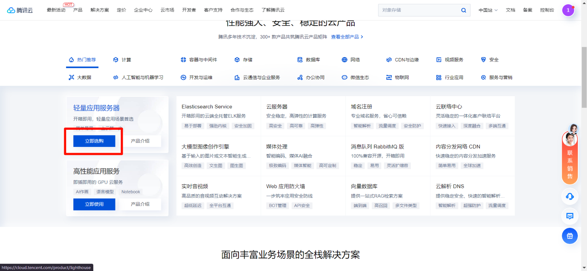
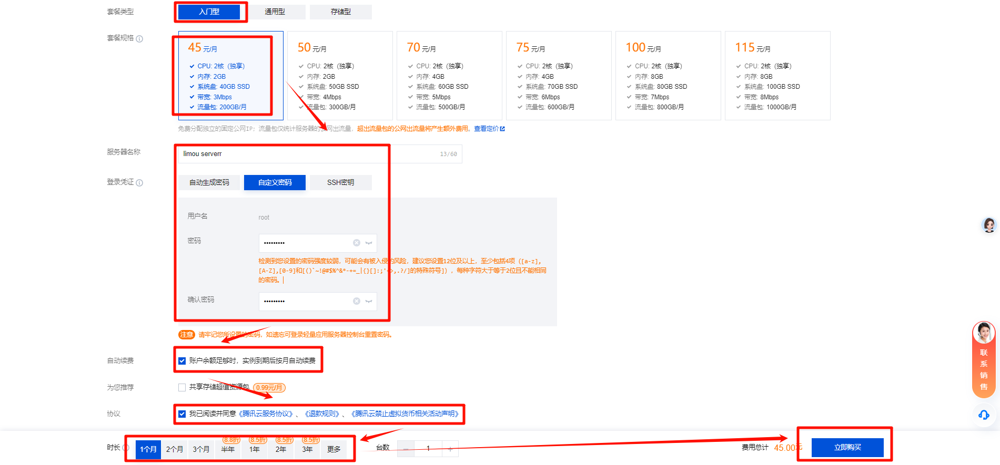
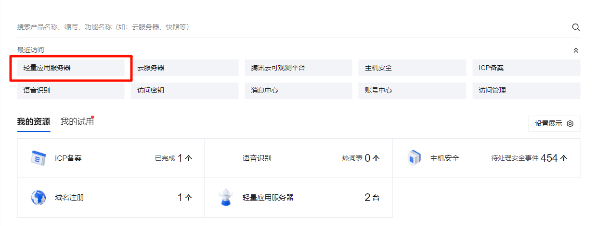
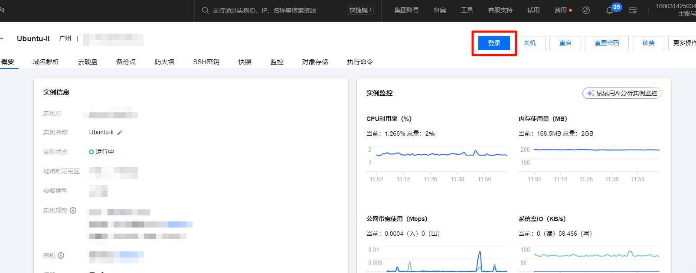
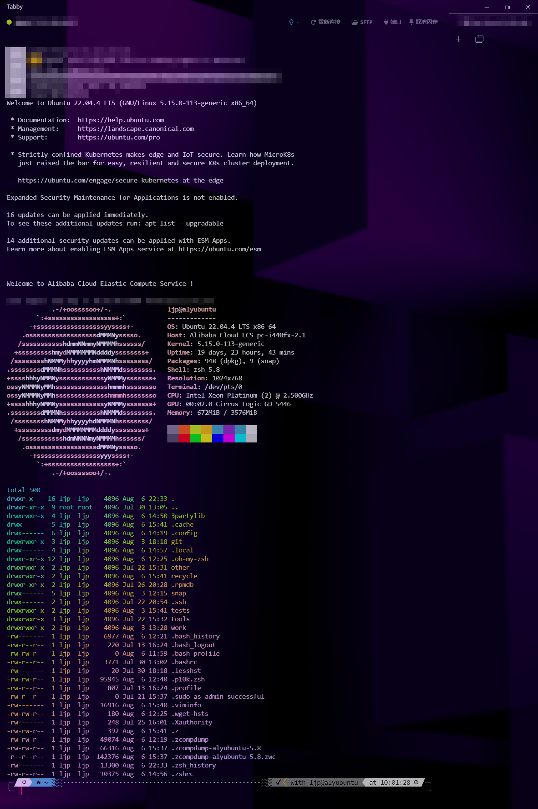
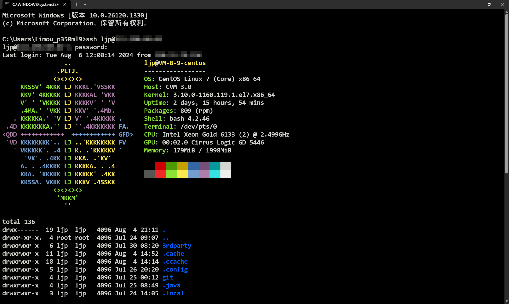

# 先导课程

## 1.划时代的 OS

这里有一个关于操作系统发展的视频，您可以观看一下 [操作系统究竟是怎么发展而来的，你真的了解吗？](https://www.bilibili.com/video/BV1Zc411D7sG?vd_source=4772b64d7a3cb1873f14bc0153c4de68) 这个视频，再来往下观看。

操作系统（`OS`）是指计算机中：

-   **控制管理** 整个计算机系统的硬件和软件资源
-   **组织调度** 整个计算机系统的工作和资源分配
-   **对外提供** 用户和软件比较方便的接口和环境

的最基本系统软件，因此操作系统是最接近电脑硬件的系统软件。现代的操作系统至少具有以下四个特征：

```mermaid
graph TD
A("操作系统特征") --> B("并发") & C("共享") & D("虚拟") & E("异步")
```

>   [!IMPORTANT]
>
>   补充：简单解释一下几个名词。
>
>   -   并发是指多个程序/执行流同时运行
>   -   共享是指共享同一台计算机内部资源
>   -   虚拟是指使用空分复用技术（内存分页）和时分复用技术（时片轮转）来使得每个执行流感觉自己独占整个计算机得所有资源
>   -   异步是指多执行流执行顺序的不确定性

>   [!IMPORTANT]
>
>   补充：管理和组织这两个词有些抽象，在 `C` 语言中，实际体现管理和组织时
>
>   1. 管理：使用 `struct` 结构体来描述硬件或者软件
>   2. 组织：使用链表等高效数据结构组织 `struct` 结构体的实例化

而操作系统可以分为：

-   手动操作的系统设备
-   脱机技术的单用户批处理操作系统
-   多用户分时操作系统
-   软硬实时操作系统
-   网路操作系统
-   分布式操作系统
-   个人操作系统

接下来我带你稍微了解一下现代的三款主流操作系统软件，分别是：

-   类 `Unix` 操作系统
-   `Windows/MacOS` 操作系统
-   `Linux` 操作系统

>   [!NOTE]
>
>   吐槽：简单了解一下就可以，历史什么的 😎...

### 1.1.第一代 60 年代 Unix 操作系统
----------------

`UNIX` 是一种多用户、多任务的操作系统，最初由贝尔实验室的 `肯·汤普逊` 和 `丹尼斯·里奇` 在 `20` 世纪 `70` 年代早期开发。它被设计用于大型计算机系统，后来也衍生出许多类 `UNIX` 系统。`UNIX` 的特点：

1. 多用户和多任务：`UNIX` 支持多个用户同时访问系统，并且能够同时执行多个任务。每个用户可以拥有自己的账户，有独立的工作空间和权限控制（现在的很多的操作系统都支持这一特性，只不过大多数用户都没有“用户管理”的概念罢了）。

2. 强大而灵活的命令行界面：`UNIX` 采用了命令行界面，用户使用命令来操作系统。这种界面提供了强大的控制和灵活性，使得 `UNIX` 适用于各种任务和需求（早期的程序员都是在命令行环境下进行工作的）。

3. 层次化的文件系统：`UNIX` 使用层次化的文件系统，通过目录（`directory`）和子目录的组织，使得文件的管理更加方便。每个文件和目录都有一个唯一的路径，方便用户进行文件的定位和访问。

4. 网络功能：`UNIX` 具有强大的网络功能，支持网络通信和远程访问。它提供了网络协议堆栈和各种网络工具，如 `Telnet`、`FTP`、`SSH` 等，使得 `UNIX` 系统可以轻松地与其他计算机进行通信和共享资源。

5. 可移植性：`UNIX` 是高度可移植的操作系统，可以在多种硬件平台上运行。这意味着开发人员可以在不同的计算机系统上使用相同的代码和应用程序，提高了软件开发的效率和跨平台兼容性。

6. 开放源代码和标准化：`UNIX` 是基于开放源代码的操作系统，许多版本都是开放源代码的。此外，`UNIX` 也通过 `POSIX`（可移植操作系统接口）标准化了一些 `API` 和功能，增强了系统之间的互操作性。

7. 稳定性和安全性：`UNIX` 系统以其稳定性和安全性而闻名。它采用了严格的权限控制和访问控制机制，保护用户的数据和系统免受未经授权的访问和损坏。

由于 `UNIX` 的灵活性和可靠性，它被广泛用于大型服务器、工作站、超级计算机等环境，尤其适用于需要高度稳定性和可扩展性的场景。此外，许多现代操作系统，如 `Linux` 和 `MacOS`，都受到了 `UNIX` 的启发并继承了它的一些设计理念和特性。

>    补充：目前被比较纯粹的 `UNIX` 系统是指 `BSD` 和 `System V` 这两个系统架构分支。

### 1.2.第二代 80 年代 Windows 操作系统、MacOS 操作系统

#### 1.2.1.Windows 操作系统

`Windows` 系统是由微软公司开发的操作系统系列，广泛应用于个人电脑和企业环境。它在全球范围内被广泛使用，并具有大量的用户和开发者基础。`Windows` 的特点：

1. 用户界面：`Windows` 系统采用了直观、易于使用的用户界面。它具有开始菜单、任务栏、桌面等经典元素，提供了丰富的可自定义选项，使用户能够按照自己的喜好来组织和访问应用程序、文件和设置。

2. 多任务管理：`Windows` 系统支持灵活的多任务管理。用户可以轻松切换和管理多个应用程序和窗口，通过任务视图、`[Alt+Tab]` 快捷键等功能实现高效的多任务操作。

3. 兼容性：`Windows` 系统具有广泛的硬件和软件兼容性，支持各种 PC 设备和外部设备的连接和使用。大多数软件和游戏都有 `Windows` 版本，使用户可以方便地进行工作、学习和娱乐。不过这点也蛮能被吐槽的，兼容性好到有的时候会卡出远古的 `Windows` 界面……

4. 应用程序生态系统：`Windows` 系统拥有庞大的应用程序生态系统。用户可以从 `Microsoft Store`、第三方应用商店和官方网站上下载各种应用程序、工具和游戏。这使得用户可以根据自己的需求和兴趣来扩展和定制系统功能。

5. 安全性：`Windows` 系统注重安全性，提供了多层次的安全防护措施。它有 `Windows Defender` 防病毒软件、实时防护、防火墙和安全更新等功能，帮助用户保护计算机免受恶意软件和网络威胁。

6. 网络和互联网功能：`Windows` 系统内置了各种网络和互联网功能，包括浏览器（如 `Internet Explorer` 和 `Microsoft Edge`）、电子邮件客户端、远程桌面连接等。这使得用户可以方便地上网浏览、发送电子邮件、进行远程访问等操作。

7. 支持与社区：`Windows` 系统得到了广泛的支持和社区参与。微软公司提供了丰富的文档、支持服务和在线社区，使用户能够获取帮助、解决问题和分享经验。

#### 1.2.2.MacOS 操作系统

`MacOS` 是由苹果公司开发的操作系统，专为苹果电脑（`Mac`）设计。它提供了用户友好的界面、强大的功能和稳定的性能，成为了许多苹果用户的首选操作系统，`MacOS` 的特点如下：

1. 用户界面：`MacOS` 具有直观、美观和易于使用的用户界面。它采用了苹果独特的图标、菜单栏和任务栏，以及流畅的动画效果，确保用户的操作体验更加愉快。

2. `Spotlight` 搜索：`MacOS` 内置了强大的 `Spotlight` 搜索功能，可以快速查找文件、应用程序、联系人、日历事件等。用户只需要在搜索框中输入关键词，就能快速找到所需内容。

3. 多任务管理：`MacOS` 提供了灵活的多任务管理功能。用户可以通过 `Mission Control` 查看和切换不同的应用程序、窗口和虚拟桌面，使工作更加高效。

4. 内置应用程序：`MacOS` 内置了一系列实用的应用程序，如 `Safari` 浏览器、Mail 邮件客户端、`iTunes` 音乐播放器、`iMessage` 即时通信工具等。这些应用程序被精心设计，与操作系统紧密集成，提供优秀的用户体验。

5. `iCloud` 集成：`MacOS` 与苹果的云服务 `iCloud` 紧密集成。用户可以通过 `iCloud` 在不同设备上同步和共享文件、照片、联系人、日历等数据，方便实用。

6. 安全性：`MacOS` 注重安全性，在硬件和软件层面都提供了多种安全功能和保护机制。例如，`FileVault` 可以加密用户的硬盘数据，`Gatekeeper` 可以防止恶意软件的运行，内置的防火墙可以保护网络连接等。

7. 应用生态系统：`MacOS` 拥有丰富的应用程序生态系统。用户可以从 `Mac App Store` 下载各种应用程序，涵盖从生产工具到创作软件、娱乐应用等各个领域。

### 1.3.第三代 90 年代 Linux 操作系统
----------------

`Linux` 是一个基于 `POSIX` 和 `Unix` 的多用户、多任务、支持多线程和多 CPU 的性能稳定的操作系统，可免费使用并自由传播。

`Linux` 继承了 `Unix` 以网络为核心的设计思想，它同时也是一个类 `Unix` 操作系统，能运行主要的 `Unix` 工具软件、应用程序和网络协议，支持 `32` 位及 `64` 位硬件，可安装在比如手机、平板电脑、路由器、台式计算机、超级计算机等各种计算机硬件设备中。

>   吐槽：在很多你觉得不可思议的古老设备中，都能搭载 `Linux` 操作系统。

`Linux` 操作系统最初由一位名为 `Linus Torvalds` 的芬兰赫尔辛基大学的学生编制内核，随后由全世界各地的成千上万的程序员设计和实现。其目的是建立不受任何商品化软件的版权制约的、全世界都能自由使用的类 `Unix` 兼容产品。因为 `Linux` 是本系列文章的围绕点，因此 `Linux` 这一部分我们后面详细解读。

>   吐槽：`Linus Torvalds` 这人非常的有趣 <span class="heimu" title="你知道的太多了"> !!比如竖中指骂人!! </span> 😏，坊间一直流传和谈论和他有关的事物...

## 2.Linux 的认知

### 2.1.Linux 是什么

`Linux` 系统和 `Ubuntu` 系统、`Windows` 系统、`MacOS` 系统一样，都是一种操作系统。下面是 `Linux` 的官网：[The Linux Kernel Archives](https://www.kernel.org/)，您可以简单前去查看一下。

1. 简单讲：手敲指令交互（和 `Windows` 的图形化界面是不一样的）基于命令行的适合程序员的操作系统。

2. 复杂讲：`Linux` 是一种开源的、类 `Unix` 操作系统内核，广泛应用于各种设备和计算机系统中。它由芬兰计算机科学家 `Linus Torvalds` 在 `1991` 年开发，并得到了全球范围内的众多开发者的贡献和支持。`Linux` 的核心设计理念是以稳定、高性能和开放性为目标。具有许多优点，如良好的可移植性、可定制性、多用户支持等。作为一个开源操作系统，`Linux` 可以被任何人免费使用、修改和分发，这使得它成为了许多服务器、超级计算机、移动设备和嵌入式系统的首选操作系统。

### 2.2.Linux 的特点
----------------

1. 开源性：`Linux` 的源代码是开放的，任何人都可以查看、修改和重新分发。这使得用户可以自由地定制、优化和扩展 Linux 系统。
2. 多用户、多任务支持：`Linux` 支持多用户同时登录，并且可以同时执行多个任务。这对于服务器和大规模计算机集群非常重要。
3. 稳定性、安全性：`Linux` 内核经过了长时间的测试和改进，具有高度的稳定性和安全性。它可以长时间运行而不需要重启，并提供了各种安全功能来保护系统和用户数据。
4. 良好的可移植性：`Linux` 可以在各种不同的硬件平台上运行，从个人电脑到服务器、嵌入式设备和超级计算机等。
5. 丰富的软件支持：`Linux` 拥有庞大而活跃的开源社区，提供了丰富的软件和工具。用户可以轻松获取和安装各种应用程序、开发工具和服务。
6. 命令行界面：`Linux` 提供了强大的命令行界面，使用户可以通过命令来执行各种任务和管理系统。同时，也提供了图形用户界面（`GUI`）作为可选的交互方式。
7. 多发行版：`Linux` 有许多发行版（如 `Ubuntu`、`Red` `Hat`、`CentOS`、`Debian` 等），它们基于 `Linux` 内核，并以不同的配置和软件包集合来满足不同用户的需求。无论是作为服务器操作系统、个人电脑的替代品，还是嵌入式系统的基础，`Linux` 都广泛应用于各种领域，并成为计算领域中最重要的操作系统之一
8. ...

### 2.3.Linux 的用途
------------------

作为操作系统，本身的作用就是：**可以调动一台计算机的硬件资源，合理使用计算机资源，进而使得计算机发挥出更大的作用**。由于 `Linux` 本身是开源的，全世界的程序员都在一起维护，因此其稳定性和安全性深受企业喜爱，常用在：

1. 服务器后台
2. 嵌入式设备
3. 入网家用设备
4. 车载系统手机系统（安卓）
5. 云服务，例如：腾讯云、阿里云、亚马逊 `aws` 业务等这些企业都提供了 `Linux` 后台云服务
6. ...

## 3.Linux 的版本

### 3.1.从内核角度分类

主流的操作系统几乎都有一个叫做内核（`kernel`）的组成部分，按照内核版本做分类的话，可以根据 `Linxu ` 内核存放网站的压缩包名字中进行分类，压缩包的命名规则是 `主版本.从/次版本.修正次数.压缩包格式`，一个压缩包名称就代表一个版本号，您可以 [前往 Linux 内核源码存放网站](https://mirrors.edge.kernel.org/pub/linux/kernel/) 中观察一下...

```shell
# 在 https://mirrors.edge.kernel.org/pub/linux/kernel/v6.x/ 下显示出来的页面
Index of /pub/linux/kernel/v6.x/
../
incr/                                              03-Aug-2024 07:10       -
stable-review/                                     31-Jul-2024 10:03       -
# ....
linux-6.0.1.tar.gz                                 12-Oct-2022 07:54    204M
linux-6.0.1.tar.sign                               12-Oct-2022 07:54     987
linux-6.0.1.tar.xz                                 12-Oct-2022 07:54    128M
linux-6.0.10.tar.gz                                26-Nov-2022 08:36    204M
linux-6.0.10.tar.sign                              26-Nov-2022 08:36     989
# ...
```

>   补充：一般来说从/次版本为偶数则是稳定的、可以直接使用的版本，而奇数则是测试版本。修正次数则是指修正这个版本在运行中发现的问题的次数。

### 3.2.从商业角度分类

`Linux` 操作系统最主要的部分就是 `Linux` 的内核部分，由于 `Linux` 的源码可以被人任意复制、修改、使用，于是就产生了一些厂商，在基于 `Linux` 内核之上，对 `Linux` 做一些定制化内容，由于各家厂商理念不同，也诞生出不同版本路线的 `Linux` 操作系统。

1. `Ubuntu`：由 `Canonical` 公司开发，是最为流行的 `Linux` 发行版之一，易于使用。

2. `Debian`：基于自由软件的社区开发的 `Linux` 发行版，稳定性和安全性得到广泛认可。

3. `Red Hat Enterprise Linux`：由 `Red Hat` 公司开发，主要用于企业级应用。

4. `Fedora`：由 `Red Hat` 公司推出，为开源社区提供实验性质的操作系统，新技术的试验平台。

5. `CentOS`：`CentOS` 是由社区维护的、基于 `Red Hat Enterprise Linux` 源代码构建而成的 `Linux` 发行版，适合用于服务器环境。（企业用的多）

6. `Arch Linux`：以简洁、灵活、轻量级著称，适合高级用户。

7. `openSUSE`：由 `SUSE Linux GmbH` 开发，提供易用、灵活、可扩展的操作系统。

8. `Gentoo`：由社区维护的源码型 `Linux` 发行版，极具个性化和定制性。

9. 除此之外还有很多其他的发行版，如 `Mageia`、`Puppy Linux`、`kail`、`红旗` 等

10. ...

>   吐槽：个人最尝试用的两款操作系统，一个是 `Ubuntu`，另外一个就是 `Centos`。

新手推荐下载 `Centos7` 进行学习，熟练后就可以开始使用 `Ubuntu` 进行学习了。

## 4.Linux 的安装

在学习 `Linux` 之前，首先需要有一个操作环境把？否则谈及 `Linux` 的相关知识就是白谈，因此我们需要有一个能够运行 `Linux` 操作系统的环境供我们实验，下面推荐几种常见的做法。

### 4.1.云服务器与 Shell 软件（推荐）

购买一个年租的云服务器，再下载免费版的 `Xshell` 结合使用。部署简单（实在不会还能联系提供云服务器的厂商，协助安装，官方甚至还有写游戏），只是要钱，并且一般都是月租和年租...但是购买一个服务器可以多人使用噢！推荐腾讯云、华为云、阿里云（这些云服务器厂商有时有学生优惠），并且如果服务器的配置不高，其实统计下来几年的费用甚至都超不过一台家用个人笔记本。

有了一台云服务器，您至少可以学习以下的知识模块：

- 原生态的学习一台 `Linux` 的使用，包含基本命令行操作、网络编程、操作系统概念...
- `MySQL、Redis` 等数据库的学习...
- 结合 `nginx` 和一个域名，可以在互联网上挂载自己的个人网站，不过这要求您至少会一些网络三大件的皮毛（`HTML`、`CSS`、`JS`），以及熟悉一些关于域名的备案流程，无论是静态网站还是动态网站
- 使用类似 `cpp-httplib、flask、Node.js` 等框架搭建 `Web` 应用服务器
- 一个云服务器，到处可以运行，租用云服务器后，无论是个人电脑、手机、平板、机房...都可以使用一些 `ssh` 工具来访问服务器，真正意义上的便携（我以前懒得带一台电脑出门时，就经常会使用平板远端连接服务器作为我的替代方案）
- 维护简单，哪怕自己系统挂了，可以通过厂商的控制台一键还原操作系统，也可以直接找厂商修复还原，可以无限瞎折腾...
- 可以快速体验不同的操作系统，服务器厂家一般不仅仅给您提供一种操作系统，还会给您提供重装系统的服务，可以快速体验到不同的 `Linux` 操作系统
- 您还可以体验到一些脚本语言的编写例如学习 `shell`
- 后续如果需要提高电脑性能，可以随时增加费用，给服务器添加更多的硬件资源

相信我，购买一个服务器并不贵（前提是性能不高），在学习过程中是很有性价比的。

这里简单介绍一些关于腾讯云的服务器申请流程，其他云厂商的服务器申请过程也是类似的...

>   注意：请在购买之前了解优惠活动，有时学生优惠还是挺多的...






等待操作系统实例初始化后，就可以点击控制台查看轻量级云服务器了。





我们可以快速云服务器的命令行窗口，在右上角点击登录即可，可能需要输入您的密码，忘记了也没关系，可以用您的腾讯云账号重置密码。




后续我们所输入的指令都是在这里输入的，请注意 `Linux` 从操作系统支持多个用户同时使用一个系统，其中最重要的就是记住上面的 `root` 账户密码，这是权限最高的管理员密码，除了您别人也无法知道这个密码是什么，忘记了就只能重置...

不过这种使用网页 `shell` 的体验比较一般，一般我会推荐您使用两个 `shell` 软件，一个是 `XShell`，一个是 `Tabby`。前者是部分版本免费的，运行时资源消耗较低，但是界面不怎么好看，比较古老；后者是开源免费的，界面非常好看，体验感优雅，但是运行时资源消耗可能会比较大...下面是我的 `Xshell` 和 `Tabby` 软件的界面，关于这两个软件的下载和对服务器的远端连接配置，还请您自行搜索查询...（<span style="text-emphasis:filled red;"> 或者等我以后补充叭，待补充...</span>）



顺带一提，新版本的 `Windows` 操作系统下，微软自带的 `cmd` 也支持使用 `ssh` 指令直接连接，不过这里我就不提这种了，您感兴趣自己搜索一下...




>   吐槽：我个人腾讯云和阿里云体验的比较多，不过对腾讯云的控制台会更加熟悉一些...腾讯打钱 😇！

而本系列博文的所有操作都是基于云服务器上的，包括后续的网络内容，也在云服务器上进行展开。当然，也有一些非云服务器的后备方案，但是这些方案对新手不友好，而且可能涉及对网络学习的阻碍。不过我依旧给您稍微介绍一下，感兴趣的话您也可以鼓捣鼓捣...

>   注意：第一次买 `Linux` 服务器我推荐使用 `CentOs 7` 版本的 `Linux` 服务器，这个版本的 `Linux` 最为经典也常用。而且对于云服务器来说，即便您现在选定了操作系统，未来也可以通过服务器厂商的可视化面板一键初始化系统，然后重新安装一些更为时髦的操作系统（我这个时候就流行使用 `Ubuntu`）。

### 4.2.虚拟机 VMware player（推荐）

虚拟机算是一种容器技术，可以在一台本就搭载了操作系统的主机上（例如您的 `Windows` 电脑上）运行一个虚拟出来的操作系统，这个操作系统可以是 `Linux` 或其他的操作系统。这种虚拟机运行的操作系统获取成本最低，使用简单，不过偶尔会有奇怪的 `bug`（这种情况并不多），并且安装麻烦。但如果只是学习基本命令和一些系统调用基本也还过得去。就是学习到网络编程可能会麻烦一点，包括以后要学习的 `Nginx`、`MySQL`、`Web` 等都有可能受到影响。另外还需要找到对应操作系统的镜像文件，不过这个也不难找，上操作系统的官网下录镜像文件就行，因此 `Linux` 纯新手也比较推荐直接使用这个。 

可以直接看 `CSDN` 看 [这哥们写的 Centos7 安装教程](https://blog.csdn.net/qq_45743985/article/details/121152504)。

### 4.3.Linux To Go 的使用（一般）

去网店买一个系统 `U` 盘（不是普通 `U` 盘），这里的系统 `U` 盘是一种即插即用式的 `U` 盘，只要给自己的个人计算机插上 `U` 盘就可以使用某种操作系统，不过这种直接买的有时会偏贵（当然你也可以选择自己烧录一个……不过这对 U 盘的读取速度要求比较高，也可以换一种媒介）。

我自己就有一个 `128G` 的 `Ubuntu` （一种 `Linux` 操作系统）系统 `U` 盘，使用起来还挺不错。

这个方案能进行原生态的使用一台 `Linux` 机器，并且文件能和原来的电脑一起共享，并且方便快捷，可以随身携带（我的大学的时候经常在 `U` 盘内部预先安装好各种软件和环境，到了机房就把 `U` 盘插到学校的计算机里哈哈），并且比双操作系统来得更快捷一些。

不过几个小问题：

1.  使用 `U` 盘的时候可能有点烫 <span class="meimu" title="你知道的太多了">也许会把您吓倒也说不定，我曾经被烫到手...</span>
2.  如果是自己烧录 `U` 盘可能需要一定的技术门槛
3.  `U` 盘很容易坏，万一坏掉了，很容易整个系统都无法再访问了（包括里面的文件和数据），这点很危险，因此最好还是把 `U` 盘版的 `To Go`  技术当作是开发者便携的一个小工具

感兴趣看着玩就可以。

### 4.4.直接安装 Linux 系统（一般）

如果你有闲置的电脑，可以直接烧录一个用于重装系统的系统 `U` 盘保存系统文件，给电脑直接安装一个 `Linux` 系统（或者也可以搞一个双系统），好处就是最为“原生态”，但是对于丝毫不懂系统的新手来说配置的难度比较高。

并且这台电脑以后大概率是作为开发和工作使用了，基本不会在其他娱乐的方面有所作用（因为支持 `Linux` 的大众应用软件有可能不太好用，甚至没有对于的版本支持）。

这种需要有一定的技术力，所以新手不推荐...

### 4.5.在 windows 中使用（不推荐）

在 `windows` 中可以使用类似 `Cygwin64Terminal` 这些软件模拟 `Linux` 的 `bash` 窗口，但是不太推荐。毕竟不够“原生态”，不利于您的学习，而且安装也是一个问题，并且微软貌似也不太对这方面感兴趣...

### 4.6.一些在线的命令行网站（不推荐）

新手可以提前寻找一些网站来使用 `Linux` 的系统：

1.   [Linux 在线网站 1](https://www.tutorialspoint.com/unix_terminal_online.php)
2.   [Linux 在线网站 2](https://www.tutorialspoint.com/unix_terminal_online.php)
3.   [Linux 在线网站 3](https://copy.sh/v86/?profile=linux26)

虽然这样直接打开网站就可以使用了，但是我还是不太推荐：一是您也不知道这些网站的系统完整度如何，是否有一些许久都没有维护的 `bug`，二是有部分网站响应也比较缓慢，三是部分指令不支持，四是不利于除了 `Linux` 的其他模块的学习。

对于这些网站，我的看法是：您玩玩就好了，不过有的时候拿来测试一些比较危险的命令确实不错...

>   补充：另外如果您愿意，有的时候可以去一些比较奇怪的网站上探索一些更加古老的操作系统和学习机，这有助于我们了解一些操作系统的发展历程，譬如这个：[网页里的电脑博物馆云端的计算机博物馆，在网页模拟器中重现电脑发展史](https://www.compumuseum.com/index.html?from=bwg)。您能体验到很多很多不同的操作系统，甚至可以在里面玩游戏和体验某些电脑病毒！<span class="heimu" title="你知道的太多了"> 欸你还别说还能体验到尊早期的一款东方弹幕游戏... </span>
>

## 5.Linux 的学习

关于 `Linux` 的学习通常分为三步，基本指令-> 系统原理-> 软件使用，如果对系统原理不是特别看重的话，只需要掌握基本原理和常用的软件即可。

---

<!-- @include: basic.md#comment -->
