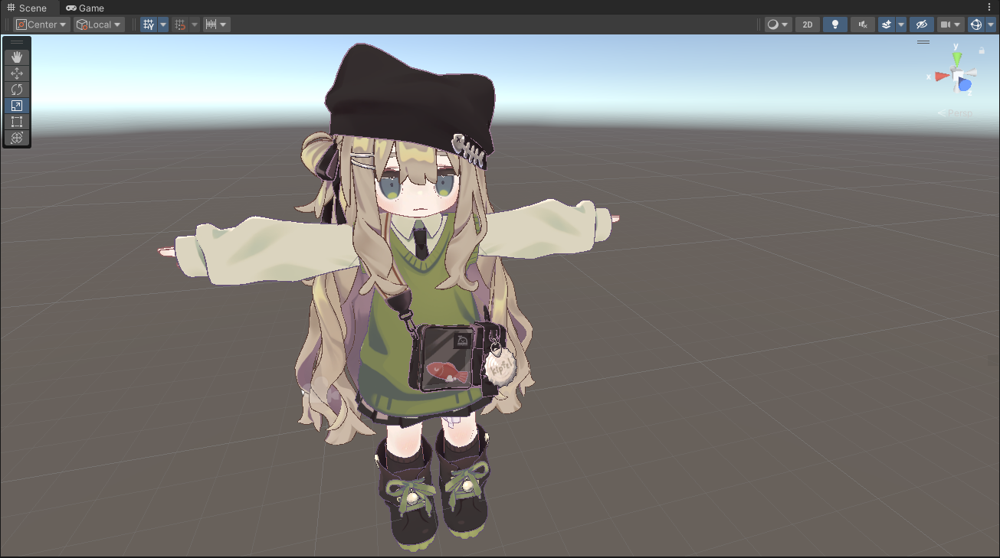

# 虚拟皮套导入和改模教程

## 1.快速导入

### 1.1.安装引擎

首先我们需要 [下载 Unity Hub](https://unity.com/download)，并且安装 [2022.3.22f1 特定版本编辑器](https://unity.com/cn/releases/editor/whats-new/2022.3.22f1)。不过由于各种原因，导致我们大概率需要在浏览器上获取编辑器，然后在本地安装编辑器指定到 `Unity Hub` 上。

### 1.2.包管理器

### 1.3.皮套导入

### 1.4.上传平台

1. )

1. 然后需要在本地安装 `Unity` 软件，并且导入到 `UnityHub` 中

1. 安装 `VCC` 工具，这个工具是 `VRChat` 官方提供的一个 `VRChat Creator Companion` ，也就是 `VRChat` 创建伴侣。，它是 `VRChat` 官方推出的、用于简化平台专属内容制作流程的 `Unity` 项目管理工具。因为 `VRChat` 的虚拟形象（`Avatar`）和虚拟场景（`World`）大多需借助 `Unity` 引擎制作，该工具能衔接两者，大幅降低创作者的初期配置和后续管理难度，不管是新手还是资深创作者都适用，简单来说就是个脚手架。但是我们不用这个一个，使用[替代品 ALCOM](https://vrc-get.anatawa12.com/zh-hans/alcom/)，因为获取 `VCC` 的限制太多（不易获取，需要魔法）

1. 注释或删除 `UnityHub` 的 `app-updata.yml`

1. 还源 https://vcc.vrczh.org/

文件夹总体作用

这是一个 **3D 角色模型资源库**，包含名叫 "Kipfel" 的角色的完整数字资产。

各部分文件说明

📦 **Kipfel_1.1.1.unitypackage** (64MB)

- Unity 游戏引擎项目包
- 包含角色在 Unity 中的完整配置（模型、材质、配置等）
- 可直接导入到 Unity 项目中使用

📁 **Blend 文件夹**

- **Kipfel_1.1.0.blend** - Blender 源文件，包含标准版角色
- **Kipfel_Mobile_1.1.0.blend** - Blender 源文件，包含移动端优化版本
- 用于 3D 模型的编辑和修改

📁 **FBX 文件夹**

- **Kipfel.fbx** - 标准版角色模型（FBX 格式）
- **Kipfel_Mobile.fbx** - 移动端优化版本
- **FishToy.fbx** - 鱼形玩具道具
- FBX 是通用 3D 模型格式，可导入各种游戏引擎或渲染软件

📁 **Texture 文件夹** (纹理资源库)

按 **PC 版本** 组织，包含多种格式：

**UV_Guide** - UV 贴图指南
- EN 版本（英文）和 JP 版本（日文）
- 指导如何在 3D 模型上应用纹理

**UV** - UV 纹理坐标图

**PSD** - Photoshop 源文件（可编辑）
- 包含所有角色部件的纹理：头发、身体、皮肤、眼睛、服装等

**PNG** - 导出的纹理文件
- 包括基础纹理和额外变体（如不同肤色版本）

**总结**：这是一套完整的角色美术资源，包含 3D 模型、纹理和各种格式的导出文件，适合游戏开发、虚拟主播、VR 应用等场景使用。

| 3D 模型项目        | 网站项目             | 说明                             |
| ------------------ | -------------------- | -------------------------------- |
| Kipfel.fbx         | index.html           | 核心产品文件（已编译的模型）     |
| Kipfel_1.1.0.blend | 源代码 (.js, .tsx)   | 原始文件，需要专门软件编辑       |
| PNG 纹理           | CSS 样式表           | 决定"外观"的文件                 |
| PSD 纹理           | .scss 源文件         | 纹理的源文件，可以编辑修改       |
| UV_Guide           | 设计文档             | 指导如何应用样式                 |
| unitypackage       | npm 包 / Docker 镜像 | 打包好的完整项目，可直接导入使用 |

具体文件用途

•  Blend - 源代码，美术师用 Blender 软件编辑，像你用 VS Code 编辑 TypeScript 一样
•  FBX - 导出版本，像网站的生产版本，其他软件可以直接读取使用
•  PNG/PSD - 图片资源，PNG 是最终版本，PSD 是可编辑的源文件
•  unitypackage - 打包好的完整项目，可以一键导入到 Unity 游戏引擎中

> ~/other/粉cc
> 12-02T03:24:54.827368+08:00 [DEBUG] vrc_get_vpm::io::tokio: initializing EnvironmentIo with config folder /home/ljp/.local/share/VRChatCreatorCompanion
> 2025-12-02T03:24:54.828192+08:00 [ INFO] ALCOM::logging: logging to file /home/ljp/.local/share/VRChatCreatorCompanion/vrc-get/gui-logs/vrc-get-2025-12-01_19-24-54.827491.log
> 2025-12-02T03:24:55.318706+08:00 [ INFO] ALCOM::commands::uri_custom_scheme: recived request: vrc-get://localhost/global-info.js
> 2025-12-02T03:24:55.600040+08:00 [ INFO] ALCOM::commands::environment::projects: migrating projects from settings.json
> 2025-12-02T03:24:55.603532+08:00 [ INFO] ALCOM::commands::environment::projects: fetching projects
> 2025-12-02T03:24:55.603546+08:00 [ INFO] ALCOM::commands::environment::projects: starting sync with real project...
> 2025-12-02T03:24:55.932683+08:00 [ INFO] ALCOM::commands::start: finished updating unity from unity hub
> 2025-12-02T03:24:56.104925+08:00 [ INFO] ALCOM::commands::start: saving window size: 2106x1271, full: false
> 2025-12-02T03:24:56.604629+08:00 [ INFO] ALCOM::commands::environment::projects: loading real project information of 1 projects
> 2025-12-02T03:24:56.606030+08:00 [ INFO] ALCOM::commands::environment::projects: updating database real project information of 1 projects
> 2025-12-02T03:24:56.608964+08:00 [ INFO] ALCOM::commands::environment::projects: updated database based on real project information
> 2025-12-02T03:28:21.286546+08:00 [ WARN] vrc_get_vpm::environment::repo_holder: Local cache for https://packages.vrchat.com/official?download does not exist
> 2025-12-02T03:28:21.286588+08:00 [ WARN] vrc_get_vpm::environment::repo_holder: Local cache for https://packages.vrchat.com/curated?download does not exist
> 2025-12-02T03:28:21.303524+08:00 [DEBUG] vrc_get_vpm::environment::repo_holder: loading repo cache took 18.816301ms
> 2025-12-02T03:28:21.810611+08:00 [DEBUG] vrc_get_vpm::environment::repo_holder: downloading remote repo 'https://vpm.vrczh.org/vpm/lilxyzw'
> 2025-12-02T03:28:21.810768+08:00 [DEBUG] vrc_get_vpm::environment::repo_holder: downloading remote repo 'https://packages.vrchat.com/official?download'
> 2025-12-02T03:28:21.810797+08:00 [DEBUG] vrc_get_vpm::environment::repo_holder: downloading remote repo 'https://vpm.vrczh.org/vpm/official'
> 2025-12-02T03:28:21.810827+08:00 [DEBUG] vrc_get_vpm::environment::repo_holder: downloading remote repo 'https://vpm.vrczh.org/vpm/curated'
> 2025-12-02T03:28:21.810860+08:00 [DEBUG] vrc_get_vpm::environment::repo_holder: downloading remote repo 'https://packages.vrchat.com/curated?download'
> 2025-12-02T03:28:21.810899+08:00 [DEBUG] vrc_get_vpm::environment::repo_holder: downloading remote repo 'https://vpm.vrczh.org/vpm/nadena'
> 2025-12-02T03:28:23.457003+08:00 [DEBUG] vrc_get_vpm::environment::repo_holder: successfully downloaded 'https://vpm.vrczh.org/vpm/official'
> 2025-12-02T03:28:23.562163+08:00 [DEBUG] vrc_get_vpm::environment::repo_holder: successfully downloaded 'https://vpm.vrczh.org/vpm/nadena'
> 2025-12-02T03:28:23.825552+08:00 [DEBUG] vrc_get_vpm::environment::repo_holder: successfully downloaded 'https://vpm.vrczh.org/vpm/curated'
> 2025-12-02T03:28:23.827359+08:00 [DEBUG] vrc_get_vpm::environment::repo_holder: successfully downloaded 'https://vpm.vrczh.org/vpm/lilxyzw'
> 2025-12-02T03:28:24.689838+08:00 [DEBUG] vrc_get_vpm::environment::repo_holder: successfully downloaded 'https://packages.vrchat.com/curated?download'
> 2025-12-02T03:28:24.718036+08:00 [DEBUG] vrc_get_vpm::environment::repo_holder: successfully downloaded 'https://packages.vrchat.com/official?download'
> 2025-12-02T03:28:24.720857+08:00 [DEBUG] vrc_get_vpm::environment::repo_holder: updating repo from remote took 2.91025046s
> 2025-12-02T03:28:25.337675+08:00 [ INFO] ALCOM::commands::environment::projects: migrating projects from settings.json
> 2025-12-02T03:28:25.340978+08:00 [ INFO] ALCOM::commands::environment::projects: fetching projects
> 2025-12-02T03:28:25.340990+08:00 [ INFO] ALCOM::commands::environment::projects: starting sync with real project...
> 2025-12-02T03:28:26.342105+08:00 [ INFO] ALCOM::commands::environment::projects: loading real project information of 1 projects
> 2025-12-02T03:28:26.344182+08:00 [ INFO] ALCOM::commands::environment::projects: updating database real project information of 1 projects
> 2025-12-02T03:28:26.346567+08:00 [ INFO] ALCOM::commands::environment::projects: updated database based on real project information
> 遇到什么问题了
> Q 根据日志内容,这个程序(ALCOM/vrc-get,一个VRChat的包管理工具)运行正常,没有明显的错误。日志显示:
>
> 正常流程:
> •  程序成功初始化并连接到配置目录
> •  成功同步项目信息(检测到1个项目)
> •  成功从多个VPM仓库下载包信息:
> ◦  VRChat官方仓库
> ◦  VRChat精选仓库  
> ◦  nadena、lilxyzw等第三方仓库
> •  所有仓库都成功下载并更新
>
> 注意的警告:
> 这两个警告表示本地缓存不存在,但程序随后成功下载了这些仓库,所以这是正常的首次运行或缓存清理后的情况。
>
> 结论: 从日志来看,程序运行正常,没有遇到问题。如果你遇到了具体的功能问题,可以详细描述一下是什么问题?比如:
> •  无法打开某个项目?
> •  无法安装包?
> •  界面显示异常?
> •  其他具体的错误提示?
> ./home/ljp/other/Unity\ 2022.3.22f1/Editor/Unity 
> bash: ./home/ljp/other/Unity 2022.3.22f1/Editor/Unity: 没有那个文件或目录
> ./home/ljp/other/Unity2022.3.22f1/Editor/Unity
> bash: ./home/ljp/other/Unity2022.3.22f1/Editor/Unity: 没有那个文件或目录
> /home/ljp/other/Unity2022.3.22f1/Editor/Unity
> /home/ljp/other/Unity2022.3.22f1/Editor/Unity
> ^C
> ~/other/粉cc
> 这个模型怎么导入到ALCOM打开的Unity编辑器中
> Q 我需要了解你的情况。几个问题:
>
> 1. 模型文件格式: 你的模型是什么格式? (.fbx, .obj, .blend, .gltf 等)
> 2. ALCOM是什么: ALCOM是VRChat Creator Companion的一部分,用于管理VRChat项目
> 3. 具体步骤: 你想要:
> ◦  把模型导入到已经在ALCOM中打开的Unity项目里?
> ◦  还是通过ALCOM来打开模型?
>
> 一般流程:
>
> 如果你想在ALCOM打开的Unity编辑器中导入模型,通常是:
>
> 1. 将模型文件放入项目: 复制模型文件到你的Unity项目的 Assets/ 文件夹中 (比如 Assets/Models/)
> 2. Unity会自动导入: Unity会自动识别并导入模型
> 3. 配置导入设置: 在Inspector中可以调整导入选项(缩放、材质等)
> 4. 拖入场景: 把导入的模型拖入场景或Hierarchy中
>
> 如果你的模型文件在 /home/ljp/other/粉cc 目录中,你可以:
> •  找到你的Unity项目的 Assets 文件夹
> •  把模型文件复制进去
> •  Unity会自动处理
>
> 能否告诉我:
> •  你的模型文件名和格式?
> •  你的Unity项目在哪个目录?
> /home/ljp/.local/share/VRChatCreatorCompanion/settings.json
> ~/other/粉cc
> 我的项目在/home/ljp/temp/test-alcom-1/中，这是个空项目
> Q 好的,我先检查一下你的Unity项目结构:
> 完美!现在我给你一个详细的导入方案。你当前有两种选择:
>
> 方案1: 使用 UnityPackage (推荐)
>
> 这是最简单的方法,因为你已经有了 Kipfel_1.1.1.unitypackage 文件。
>
> 操作步骤:
> 1. 在Unity编辑器中,点击菜单: Assets > Import Package > Custom Package...
> 2. 选择 /home/ljp/other/粉cc/Kipfel_1.1.1.unitypackage
> 3. Unity会显示导入对话框,选择要导入的内容
> 4. 点击 "Import" 完成导入
>
> 命令行方式(可选):
> bash
>
>
> 方案2: 手动复制模型和贴图文件
>
> 如果你想手动控制导入内容,可以这样做:
>
> 需要复制的文件:
> bash
> 文件说明:
> •  FBX模型: 3个FBX文件 (Kipfel.fbx, Kipfel_Mobile.fbx, FishToy.fbx)
> •  PC贴图: 高质量版本的贴图,包含身体、眼睛、头发、服装等
> •  Mobile贴图: 移动优化版本的贴图
>
> 
>
> 推荐: 使用方案1 (UnityPackage)
>
> 因为UnityPackage包含了:
> •  ✅ 已经配置好的材质和shader
> •  ✅ 已经设置好的prefab
> •  ✅ 正确的文件夹结构
> •  ✅ 所有必要的元数据
>
> 你想用哪个方案?我可以帮你执行相应的命令。
> ~/other/粉cc
> 导入了，然后怎么操作？
> Q 导入成功后,接下来的操作步骤:
>
> 1. 找到Avatar Prefab
> 在Unity的Project窗口中:
> •  展开 Assets 文件夹
> •  找到导入的模型文件夹(通常叫 Kipfel 或类似名称)
> •  找到 .prefab 文件(预制体,通常是蓝色方块图标)
>
> 2. 将Avatar添加到场景
> •  把找到的prefab文件拖拽到 Hierarchy 窗口中
> •  或者直接拖到Scene视图中
> •  模型会出现在场景里
>
> 3. 设置VRChat Avatar (如果是VRChat项目)
> 选中Hierarchy中的Avatar对象后:
>
> 1. 检查VRC Avatar Descriptor组件
> ◦  应该已经自动添加了 VRC Avatar Descriptor 组件
> ◦  如果没有,点击 Add Component > 搜索 VRC Avatar Descriptor
> 2. 配置Avatar Descriptor
> ◦  View Position: 调整眼睛位置(通常是头部前方)
> ◦  Expressions: 配置表情菜单(如果有)
> ◦  Playable Layers: 配置动画层
> 3. Build & Test
> ◦  在VRC SDK控制面板中(菜单 VRChat SDK > Show Control Panel)
> ◦  选择 Builder 标签
> ◦  点击 Build & Test 或 Build & Publish
>
> 4. 基础调试检查
> •  检查材质: 模型是否正确显示贴图
> •  检查骨骼: 在Inspector中查看Animator组件
> •  测试动画: 在Scene视图中可以预览姿势
>
> 常见问题:
> •  材质显示粉红色: shader缺失,需要导入正确的shader或切换到标准shader
> •  模型太大/太小: 调整Transform的Scale值
> •  看不到模型: 检查摄像机位置或模型的Layer设置
>
> 你现在在Unity编辑器里看到模型了吗?有遇到什么问题吗?
> ~/other/粉cc
> 你看看现在的项目test-alcome-1中哪一个文件是？
> Q 让我查看一下项目中导入后的文件结构:
> 完美!文件已经导入成功了。让我给你具体说明:
>
> 找到的Prefab文件 (Avatar预制体):
>
> 主要的Avatar文件:
>
> 1. Kipfel.prefab ⭐ PC版完整Avatar
> ◦  路径: Assets/MOCHIYAMA/Kipfel/Prefab/Kipfel.prefab
> ◦  这是PC版的完整模型,推荐使用
> 2. Kipfel_kisekae.prefab - PC版换装版本
> ◦  路径: Assets/MOCHIYAMA/Kipfel/Prefab/Kipfel_kisekae.prefab
> ◦  可以更换服装的版本
> 3. Kipfel_Mobile.prefab - 移动端优化版
> ◦  路径: Assets/MOCHIYAMA/Kipfel/Prefab/Kipfel_Mobile.prefab
> 4. Kipfel_Mobile_kisekae.prefab - 移动端换装版
> 5. AvatarDynamics.prefab - PC版动态骨骼配置
> 6. AvatarDynamics_Mobile.prefab - 移动版动态骨骼配置
>
> 
>
> 推荐操作:
>
> 在Unity编辑器中:
>
> 1. 在Project窗口中导航到:
> 2. 拖拽 Kipfel.prefab 到Hierarchy窗口
> 3. 场景文件也准备好了:
> ◦  路径: Assets/MOCHIYAMA/Kipfel/Kipfel.unity
> ◦  你可以直接双击这个场景文件打开,里面可能已经配置好了Avatar
>
> 
>
> 现在在Unity编辑器中打开 Kipfel.unity 场景或者把 Kipfel.prefab 拖到场景里就可以了!
> ~/other/粉cc
> 如何放大这个模型？
> Q 在Unity中放大模型有两种方法:
>
> 方法1: 在Inspector中调整Scale (推荐)
>
> 1. 选中模型
> ◦  在Hierarchy窗口中点击你的Kipfel模型
> 2. 找到Transform组件
> ◦  在右侧Inspector窗口最顶部有Transform组件
> 3. 修改Scale值
>    ◦  找到 Scale 一行 (有X, Y, Z三个值)
>    ◦  默认通常是 (1, 1, 1)
>    ◦  修改为更大的值,比如:
>    ▪  (1.5, 1.5, 1.5) - 放大1.5倍
>    ▪  (2, 2, 2) - 放大2倍
>
>    保持三个值相同以等比例缩放
>
> 
>
> 方法2: 在Scene视图中缩放
>
> 1. 选中模型
> 2. 按快捷键 R 或点击工具栏的Scale工具 (四个小方块图标)
> 3. 拖拽中心的白色立方体
>    ◦  向外拖拽 = 放大
>    ◦  向内拖拽 = 缩小
>
>    或者拖拽单个轴(彩色方块)单独缩放某个方向
>
> 
>
> VRChat Avatar 注意事项:
>
> 如果这是VRChat Avatar,缩放后需要:
>
> 1. 调整View Position (眼睛位置)
> ◦  选中Avatar
> ◦  找到 VRC Avatar Descriptor 组件
> ◦  调整 View Position 的值,确保视角在正确的眼睛高度
> 2. 建议的Avatar身高范围:
> ◦  人形角色: 1.4m - 2.0m 之间
> ◦  过大或过小可能在VRChat中显示异常
>
> 
>
> 推荐使用方法1,直接在Transform的Scale里输入精确的数值!
> ~/other/粉cc
> 我这个是Unity,想要快捷键放大
> Q Unity中缩放模型的快捷键:
>
> 缩放工具快捷键:
>
> R - 切换到Scale(缩放)工具
>
> 然后:
> •  拖拽中心的白色立方体 - 等比例缩放
> •  拖拽单个轴的方块 - 单轴缩放
>
> 
>
> 其他常用快捷键:
>
> •  Q - 手型工具(Hand Tool)
> •  W - 移动工具(Move)
> •  E - 旋转工具(Rotate)
> •  R - 缩放工具(Scale)
> •  T - 矩形工具(Rect Tool)
> •  Y - 组合工具(Transform Tool)
>
> 
>
> Scene视图导航快捷键:
>
> •  滚动鼠标滚轮 - 缩放视图
> •  鼠标中键拖拽 - 平移视图
> •  Alt + 鼠标左键拖拽 - 旋转视图
> •  F - 聚焦到选中物体(Frame Selected)
> •  Shift + F - 锁定视图到选中物体
>
> 
>
> 快速操作流程:
> 1. 选中模型
> 2. 按 R
> 3. 拖拽中心白色立方体放大
> ~/other/粉cc
> 怎么导入后的模型是全粉色的
> Q 粉色(洋红色)模型是Unity中最常见的问题 - Shader缺失或不兼容。
>
> 原因:
> •  材质使用的Shader在当前项目中不存在
> •  通常是缺少特定的Shader包(如lilToon, Poiyomi等)
>
> 解决方法:
>
> 方法1: 检查需要的Shader
> 找到问题了!这个模型使用的是 lilToon Shader (从材质文件的GUID可以看出)。
>
> 解决方案: 安装 lilToon Shader
>
> 通过VCC (VRChat Creator Companion/ALCOM) 安装:
>
> 1. 在ALCOM中打开你的项目
> 2. 添加lilToon包:
> ◦  在ALCOM的项目管理页面
> ◦  找到 "Manage Packages" 或类似选项
> ◦  搜索 "lilToon"
> ◦  点击安装
>
> 或者手动下载安装:
>
> 根据你的日志,你已经有 lilxyzw 仓库,但可能需要在项目中安装包:
> Grepping for the following patterns in /home/ljp/temp/test-alcom-1/Packages
>  - lilToon
>  - jp.lilxyzw.liltoon
> 确认了!项目中没有安装 lilToon。你需要添加它:
>
> 最简单的方法:
>
> 在ALCOM界面中:
> 1. 选择你的 test-alcom-1 项目
> 2. 点击 "Manage Project" 或 "管理项目"
> 3. 在包列表中找到 "lilToon"
> 4. 点击旁边的 "+" 或 "Add" 安装
> 5. 等待Unity重新编译
>
> 安装完成后,模型就会正确显示了!
>
> 
>
> 或者临时应急方案(不推荐):
>
> 如果你只是想先看看模型,可以临时切换到Unity标准Shader,但会失去很多效果:
>
> 1. 选中模型
> 2. 在Inspector中找到材质
> 3. 点击Shader下拉菜单
> 4. 选择 Standard 或 VRChat/Mobile/Toon Lit
>
> 但这只是临时方案,强烈建议安装lilToon才能看到正确的效果!
> ~/other/粉cc selected text
> 在ALCOM界面中:
> 1. 选择你的 test-alcom-1 项目
> 2. 点击 "Manage Project" 或 "管理项目"
> 3. 在包列表中找到 "lilToon"
> 4. 点击旁边的 "+" 或 "Add" 安装
> 5. 等待Unity重新编译
> 我是新手，这个没懂怎么操作
> Q 明白，用最直观的点按步骤带你在 ALCOM 里装好 lilToon。按这个顺序做就行：
>
> 一步步在 ALCOM 安装 lilToon
> 1) 打开 ALCOM（VRChat Creator Companion）。
> 2) 左侧 “Projects” 列表里找到 test-alcom-1。
> 3) 在项目卡片上点 Manage（有的版本是“管理项目”或一个齿轮/三点按钮，再点 Manage）。
> 4) 进入管理界面后，左侧选 Packages（包/依赖）。
> 5) 右上方有搜索框，输入 lilToon。
> 6) 结果里找到 “lilToon（jp.lilxyzw.liltoon）”。
> 7) 点击右侧的 + / Add / Install（按钮文字可能不同，但就是添加到项目）。
> 8) 右上角通常会出现保存/已添加的提示；切回 Unity（或点 Open in Unity），等待底部编译进度条跑完。
>
> 装完后的检查
> •  在 Project 窗口打开 Assets/MOCHIYAMA/Kipfel/Material/PC/ 任意一个材质（例如 Body_eye.mat），Inspector 里 Shader 应显示为 lilToon/lilToon，场景里的粉色应恢复正常。
> •  仍然粉色：选中这些材质，在 Shader 下拉里手动改成 lilToon/lilToon；必要时 Window > Rendering > Graphics（或 Project Settings > Graphics）确认你使用的是内置管线（VRChat仅支持内置管线）。
>
> 可能遇到的两个小坑与解决
> •  在 Packages 页搜索不到 lilToon：先切到 Repositories（仓库/源）页，看看是否有社区仓库（一般名里会带 lilxyzw 或 community/curated）。若没有，点击 Add Repository 按钮添加后再回到 Packages 搜索。（找不到按钮也没关系，告诉我你看到的页面文案，我来判断该点哪里。）
> •  Unity 长时间编译：耐心等。若报错，多半是缓存问题；可以在 Unity 顶部菜单 Assets > Reimport All 试一次。
>
> 你现在正停在哪一步？是没看到 Manage 按钮、搜索不到 lilToon，还是已经安装但仍然粉色？告诉我界面上你看到的按钮文字，我用你屏幕上的词带你点。
> ~/other/粉cc selected text
> 点击保存后为什么需要选新的文件夹或文件？
> Q 这不太正常。ALCOM 添加包时不应该弹出"选择文件夹/文件"的对话框。
>
> 可能的情况:
>
> 1. 你点错了按钮
> •  可能不小心点了"导入本地包"或"Add from disk"之类的按钮
> •  应该点: 在线包列表里 lilToon 右侧的 "+" 或 "Add to Project" 按钮
>
> 2. 缺少 lilToon 在线源
> •  如果 ALCOM 没有 lilToon 的在线仓库，可能需要手动添加
>
> 
>
> 正确操作 - 重新来一次:
>
> 第一步: 检查仓库
> 1. 在 ALCOM 中，点击左侧的 "Settings" (设置) 或 "Repositories" (仓库)
> 2. 确认有这些仓库:
> ◦  VRChat Official
> ◦  VRChat Curated  
> ◦  lilxyzw 的仓库 (从你的日志看已经有了: https://vpm.vrczh.org/vpm/lilxyzw)
>
> 第二步: 添加 lilToon
> 1. 回到项目管理界面
> 2. 点击 "Manage Project"
> 3. 在包列表中找 "lilToon"
> 4. 直接点击右侧的 "+" 号或 "Add" 按钮
> 5. 不应该出现文件选择对话框
>
> 
>
> 如果仍然弹出文件选择:
>
> 可能是 ALCOM 界面的 bug。试试这个命令行方法:
>
> 直接编辑项目配置文件添加 lilToon:
> bash
> 你现在看到的文件选择对话框是什么标题?或者截个图发给我,我看看具体是什么情况。
> ~/other/粉cc
> 没有我导入成功了，但是我现在需要保存到本地
> Q Unity项目本身就是保存在本地的，你不需要额外操作。但如果你是想：
>
> 1. 保存场景 (Scene)
> 在Unity编辑器中:
> •  按 Ctrl + S 保存当前场景
> •  或菜单: File > Save / File > Save As
> •  第一次保存会让你选择保存位置，建议保存在 Assets/Scenes/ 文件夹下
>
> 2. 保存项目 (Project)
> Unity项目自动保存，已经在 /home/ljp/temp/test-alcom-1/ 中
>
> 3. 导出/备份整个项目
> 如果想备份或分享项目:
>
> 方法A: 压缩整个项目文件夹
> bash
> 方法B: 导出为 UnityPackage
> 在Unity编辑器中:
> 1. 菜单: Assets > Export Package...
> 2. 选择要导出的内容(可以全选)
> 3. 点击 Export
> 4. 选择保存位置和文件名
>
> 
>
> 你具体想保存什么?
> •  场景文件?
> •  备份整个项目?
> •  还是导出模型/资产?
> Scenes (可选)
> ◦  输入文件名,比如: MyScene 或 Kipfel_Test
> ◦  不需要手动输入 .unity 后缀,Unity会自动添加
> 2. 推荐保存路径:
>    或直接保存在
> 3. 点击 "Save" 保存
>
> 
>
> 如果你想用已有的场景:
>
> 项目中已经有一个现成的场景:
> 你可以:
> •  选择这个文件覆盖保存 (如果你想保存到这里)
> •  或者起个新名字保存 (推荐,避免覆盖原始场景)
>
> 
>
> 简单来说: 在保存对话框里输入一个场景名字,比如 MyKipfel,然后点保存就行了!

