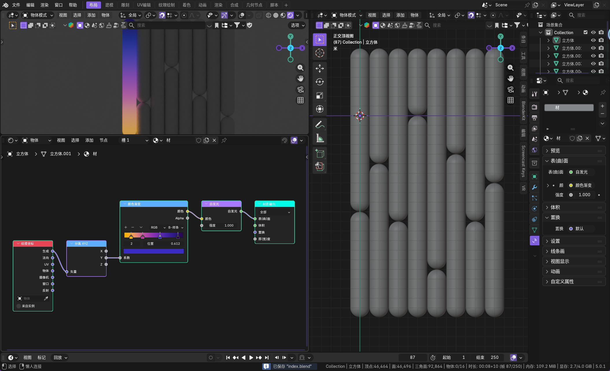
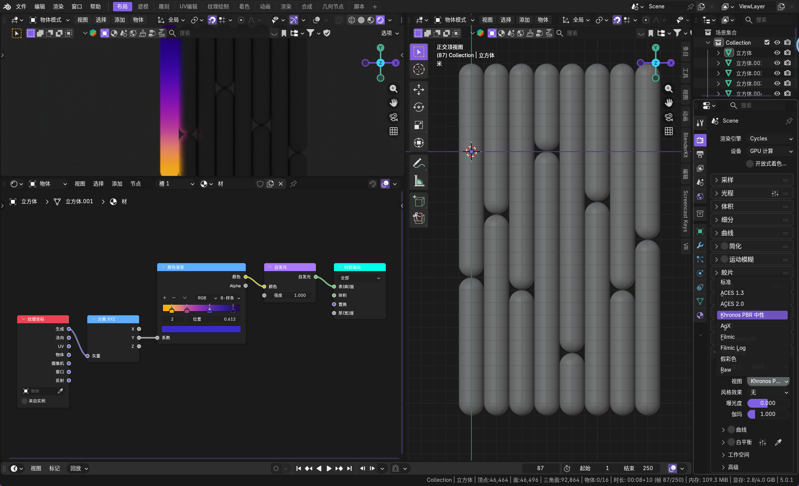
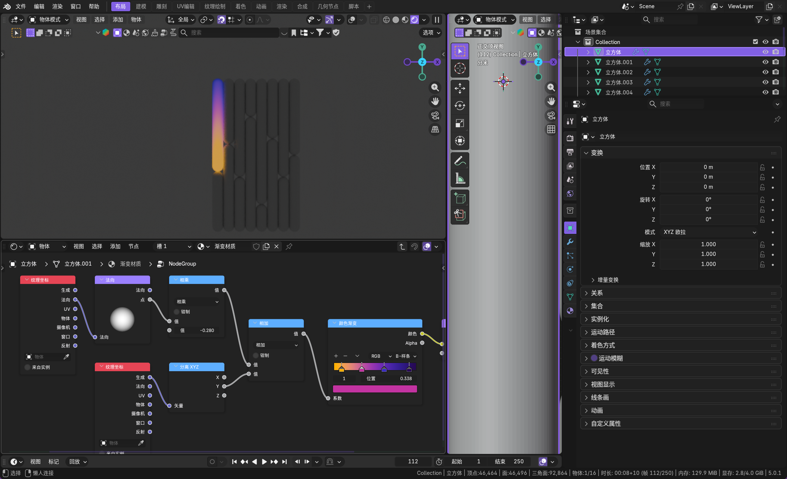
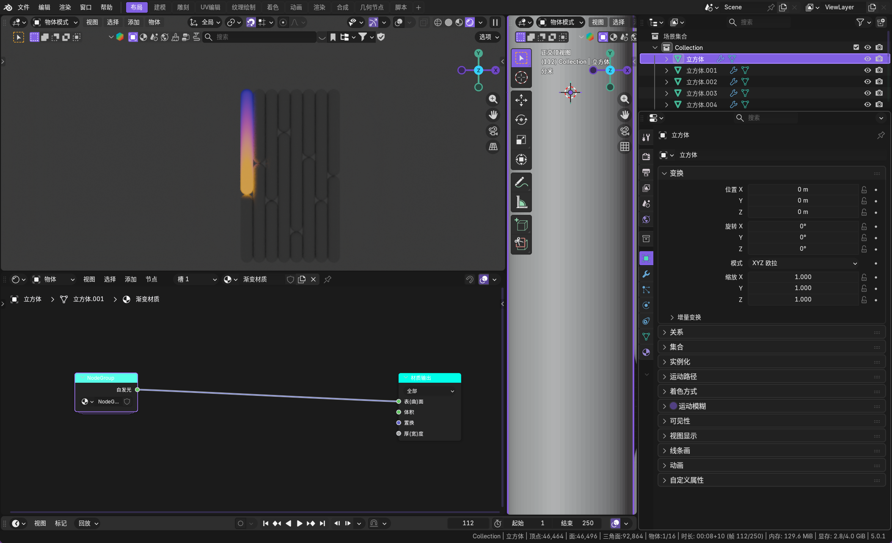
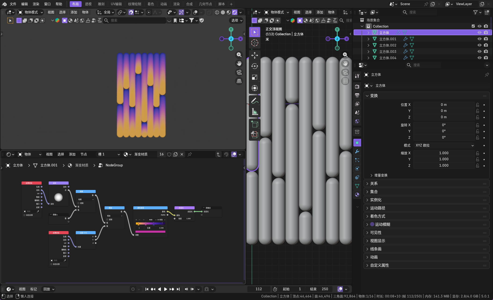

灰度图像只有亮度维度，没有色相和饱和度。灰度映射的本质是**对原图像的 RGB 通道或亮度通道进行加权计算**，生成单通道的灰度数据，公式通常为：**Gray=0.299×R+0.587×G+0.114×B**，这个加权比例是根据人眼对红、绿、蓝三种颜色的敏感度差异设定的（人眼对绿色最敏感，权重最高）。

除此之外，还有两种简化的映射方式：

- 最大值映射：Gray=max(R,G,B)，取 RGB 三个通道的最大值作为灰度值，图像整体偏亮
- 平均值映射：Gray=(R+G+B)/3，三个通道均等加权，计算简单但会丢失对比度细节

最基础的作用就是彩色照片转为黑白照片。

全选所有节点，但是去除输出节点，然后 `[ctrl+g]` 建立节点组。

使用解算闭包达到外部决定色阶的效果。

很多节点看不懂...需要仔细学习

