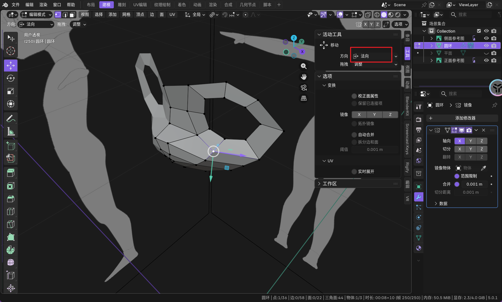
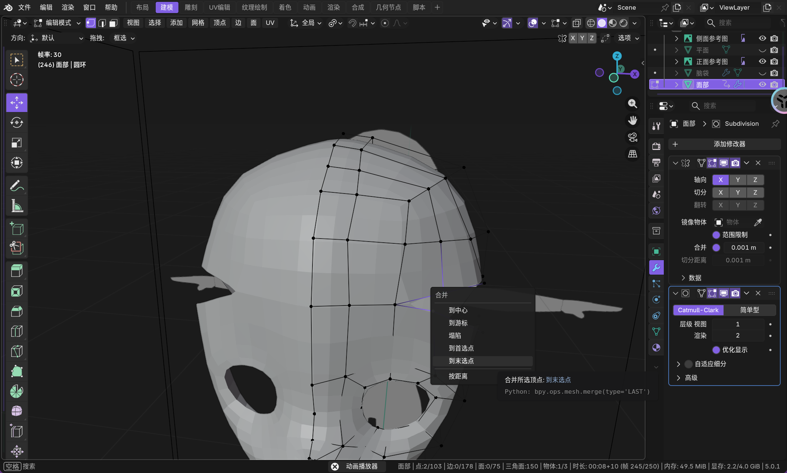
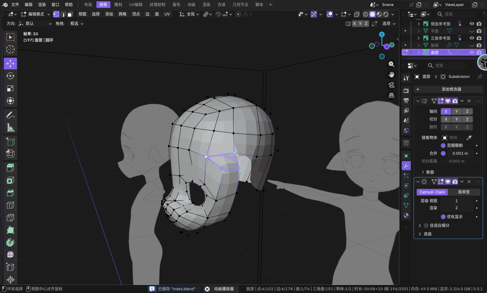
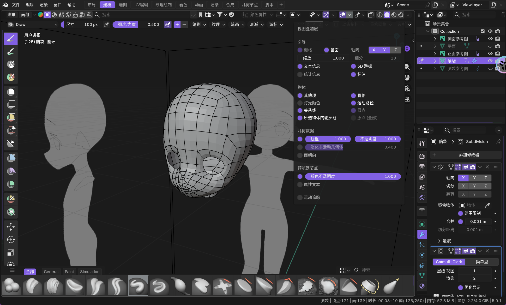
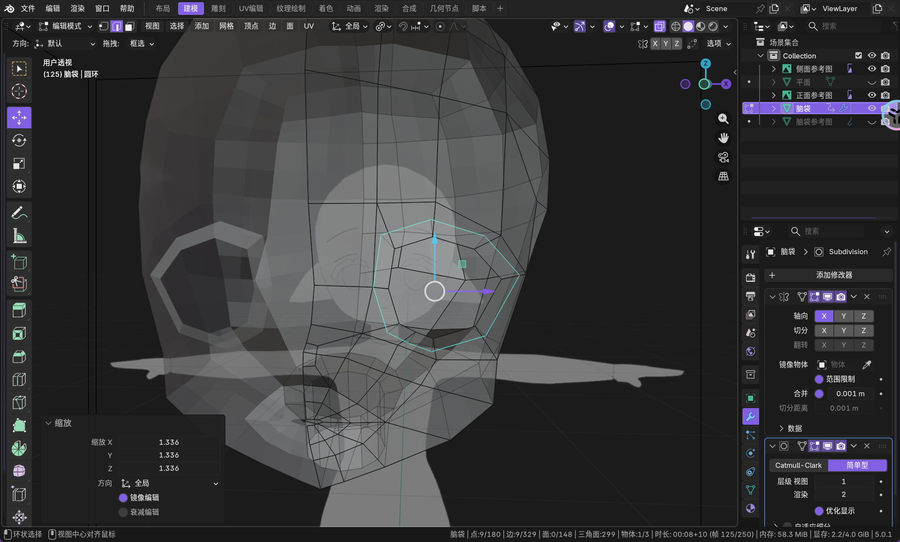
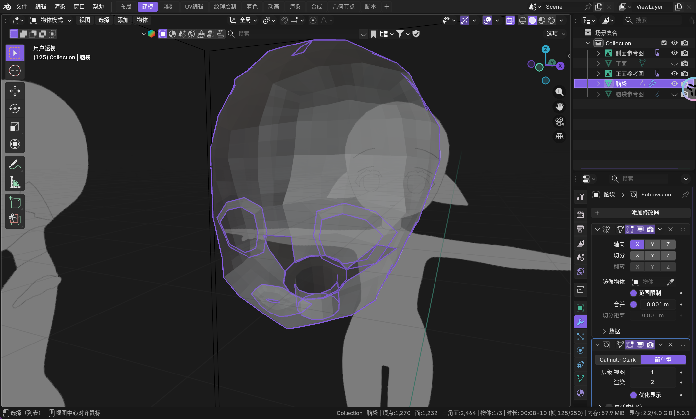

先导入参考图片

使用 `[.]` 可以调整缩放的缩放点

这个重载图片的功能还挺还用的

先从脸部开始

`[m]` 可以进行中间合并点

这里有个坑点就是，如果不小心使用了空格，就会导致无法现实移动工具的控件。

然后添加一个细分修改器。

现在鼻子不够尖，可以使用 `[k]` 来切换到刀具工具。

然后回车应用，这个东西的原理还不太清楚。

还可以右键点击选择性细分啊

这个球体使用来做参考的。

这里还需要用使用 `F2` 插件（但是我好像用不了...）。 

合并使用 `[m]`

使用 `[ctrl+j]` 把两个物体合并为一个对象。

还需要进入雕刻模式使用 `[s]` 或任意笔刷 `[+shift]` 得到平滑工具来进行平滑，避免细分出现奇怪的凹凸痕迹。

`shift+e`

`ctrl+e`

是什么...

