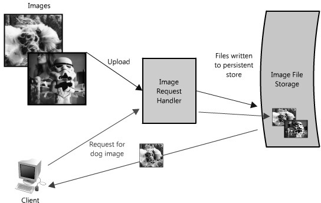
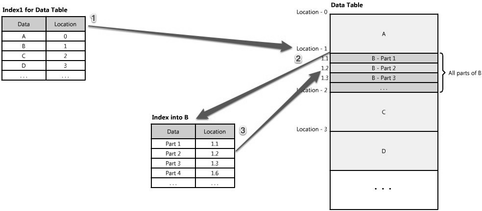

# 先导课程

## 1.所需技术

学习分布式系统跟学习其它技术非常不一样，分布式系统涵盖的面非常广，具体来说涵盖如下几方面：

- **服务调度**，涉及服务发现、配置管理、弹性伸缩、故障恢复等
- **资源调度**，涉及对底层资源的调度使用，如计算资源、网络资源和存储资源等
- **流量调度**，涉及路由、负载均衡、流控、熔断等
- **数据调度**，涉及数据复本、数据一致性、分布式事务、分库、分表等。容错处理，涉及隔离、幂等、重试、业务补偿、异步、降级等
- **自动运维**，涉及持续集成、持续部署、全栈监控、调用链跟踪等

## 2.注意要点

分布式的注意要点有很多：

- 分布式系统之所以复杂，就是因为它太容易出错了。这意味着，你要 **把处理错误的代码当成正常功能的代码** 来处理。
- 开发一个健壮的分布式系统的成本是单体系统的几百倍甚至几万倍。这意味着，我们要自己开发一个，**需要能力很强的开发者**。
- 非常健壮的 **开源的分布式系统并不多**，或者说基本没有。这意味着，如果你要用开源的，那么你需要 `hold` 得住其源码。
- 管理或是协调多个服务或机器是非常难的。这意味着，我们要去 **读很多很多的分布式系统的论文**。
- 在分布式环境下，出了问题是很难 `debug` 的。这意味着，我们需要非常好的 **监控和跟踪系统**，还需要经常做演练和测试。
- 在分布式环境下，你需要 **更科学地分析和统计**。这意味着，我们要用 `P90` 这样的统计指标，而不是平均值，我们还需要做容量计划和评估。
- 在分布式环境下，**需要应用服务化**。这意味着，我们需要一个服务开发框架，比如 `SOA` 或微服务。
- 在分布式环境下，故障不可怕，可怕的是影响面过大，时间过长。这意味着，我们需要花时间来开发我们的 **自动化运维平台**。

## 3.考虑因素

以前我在软件设计的相关笔记中其实有简单的提及过种常见的分布式应用，这里简单列出来：

- 应用服务集群架构
- 存储服务集群架构
- 数据冷热分离架构
- 垂直分库分表架构
- 微服务架构

> [!IMPORTANT]
>
> 补充：接下来我会基于 [这个著名的博文](https://aosabook.org/en/v2/distsys.html) 来进行拓展和学习。
>

但是这些只是让您清楚分布式的好处，但是具体分布式需要克服哪些困难，有哪些特征（不仅仅是多）是需要继续研究的。但是上面的应用都会告诉我们构建和运营可扩展的网站或应用程序意味着：在原始层面上，它只是通过 `Internet` 将用户与远程资源连接起来，使其具有可扩展性的部分是资源或对这些资源的访问分布在多个服务器上。

就像生活中的大多数事情一样，从长远来看，在构建 `Web` 服务时花时间提前计划会有所帮助; 了解大型网站背后的一些考虑因素和权衡可以在创建小型网站时做出更明智的决策。以下是影响大型 Web 系统设计的一些关键原则：

- **可用性：** 网站的正常运行时间对于许多公司的声誉和功能绝对至关重要。对于一些较大的在线零售网站来说，即使几分钟也不可用也可能导致数千或数百万美元的收入损失，因此将他们的系统设计为持续可用并具有故障弹性既是一项基本业务，也是一项技术要求。分布式系统中的高可用性需要仔细考虑关键组件的冗余、系统部分故障时的快速恢复以及出现问题时的优雅降级。
- **可靠性：** 系统需要可靠，以便数据请求将始终返回相同的数据。如果数据发生更改或更新，则同一请求应返回新数据。用户需要知道，如果某些内容被写入或存储到系统中，它将持续存在，并且可以依赖它来进行将来的检索。
- **可扩展性：** 对于任何大型分布式系统，大小只是需要考虑的规模的一个方面。同样重要的是增加容量以处理更多负载所需的努力，通常称为系统的可扩展性。可扩展性可以指系统的许多不同参数：它可以处理多少额外的流量，添加更多存储容量的难易程度，甚至可以处理多少个交易。
- **可管理性：** 设计一个易于作的系统是另一个重要的考虑因素。系统的可管理性等同于作的可扩展性：维护和更新。可管理性需要考虑的事项是，在问题发生时诊断和理解问题的难易程度、进行更新或修改的难易程度以及系统作的简单程度（即，它是否经常运行而没有故障或异常？）。
- **高性能：** 网站性能已成为大多数网站的重要考虑因素。网站的速度会影响使用情况和用户满意度，以及搜索引擎排名，这一因素与收入和保留率直接相关。因此，创建一个针对快速响应和低延迟进行优化的系统是关键。
- **成本：** 成本是一个重要因素。这显然可能包括硬件和软件成本，但考虑部署和维护系统所需的其他方面也很重要。开发人员构建系统所需的时间、运行系统所需的作工作量，甚至所需的培训量都应考虑在内。

> [!CAUTION]
>
> 警告：这些原则中的每一个都为设计分布式 `Web` 架构的决策提供了基础。然而，它们也可能相互矛盾，因此实现一个目标是以牺牲另一个目标为代价的。一个基本的例子：选择通过简单地添加更多服务器（可扩展性）来解决容量问题，可能会以可管理性（您必须运行额外的服务器）和成本（服务器的价格）为代价。
>
> 在设计任何类型的 `Web` 应用程序时，重要的是要考虑这些关键原则，即使它承认设计可能会牺牲其中的一个或多个。

我们先来假设一个场景：

在某个时候，您可能已经在网上发布了一张图片。对于托管和交付大量图像的大型站点，构建经济高效、高可用性和低延迟（快速检索）的架构存在挑战。想象一下一个 `Web` 系统（注意我们假设的是一个网站，但是后续的描述都可以迁移），用户能够将他们的图像上传到中央服务器，并且可以通过网络链接或 `API` 请求图像，就像 `Flickr` 或 `Picasa` 一样。为简单起见，我们假设此应用程序有两个关键部分：将图像上传（写入）到服务器的能力，以及查询图像的能力。虽然我们当然希望上传高效，但我们最关心的是当有人请求图像时（例如，可以为网页或其他应用程序请求图像）时提供非常快速的交付。这与 `Web` 服务器或内容分发网络 （`CDN`） 边缘服务器 （`CDN` 用于将内容存储在多个位置的服务器，以便内容在地理上/物理上更靠近用户，从而获得更快的性能） 可能提供的功能非常相似。

在此图片托管示例中，系统必须具有可感知的速度、可靠的数据存储以及所有这些属性的高度可扩展性。构建此应用程序的小型版本将是微不足道的，并且很容易托管在单个服务器上。然而，这对本章来说并不有趣。假设我们想要构建可以像 `Flickr` 一样大的东西。

> [!IMPORTANT]
>
> 补充：简要说明如下。
>
> | 项目     | Flickr                        | Picasa                                |
> | -------- | ----------------------------- | ------------------------------------- |
> | 平台类型 | 在线图片分享网站              | 本地图片管理软件 + 在线相册           |
> | 用户定位 | 摄影师 / 照片分享者           | 一般用户 / 照片管理                   |
> | 当前状态 | 仍在运行（由 `SmugMug` 运营） | 已停止服务（被 `Google Photos` 替代） |

## 4.实现特征

### 4.1.服务分离

在考虑可扩展的系统设计时，它有助于解耦功能并将系统的每个部分视为具有明确定义接口的自己的服务。在实践中，以这种方式设计的系统被称为面向服务的架构（`SOA`）。对于这些类型的系统，每个服务都有自己独特的功能上下文，并且与该上下文之外的任何内容的交互都是通过抽象接口进行的，通常是另一个服务的面向公众的 `API`。

将系统解构为一组互补服务会使这些部分的作彼此分离。此抽象有助于在服务、其底层环境和该服务的使用者之间建立明确的关系。创建这些清晰的划分有助于隔离问题，但也允许每个部分彼此独立扩展。这种面向服务的系统设计与面向对象的编程设计非常相似。

在我们的示例中，所有上传和检索图像的请求都由同一服务器处理。但是，由于系统需要扩展，因此将这两个功能分解为自己的服务是有意义的。

让我们快进一下，假设这项服务被频繁使用。在这种情况下，很容易看出写入操作耗时更长会如何影响读取图像的时间（因为这两个功能会争夺共享资源）。根据架构的不同，这种影响可能会相当显著。即便上传速度和下载速度相同（大多数 `IP` 网络并非如此，因为多数网络的设计至少保证下载速度与上传速度之比为 `3:1`），读取文件通常也会从缓存中读取，而写入操作最终必须写入磁盘（在最终一致性的情况下，或许还要写入多次）。即便是所有数据都在内存中，或者从磁盘（如固态硬盘）读取，数据库写入操作几乎总是比读取操作慢。

这种设计的另一个潜在问题是，像 `Apache` 或 `lighttpd` 这样的 `Web` 服务器通常对它可以保持的同时连接数有上限（默认值约为 `500`，但可以更高），并且在高流量中，写入会很快消耗所有这些连接。由于读取可以是异步的，也可以利用其他性能优化（如 `gzip` 压缩或分块传输编码），因此 `Web` 服务器可以更快地切换服务读取，并在每秒处理比最大连接数更多的请求的客户端之间快速切换（`Apache` 和最大连接数设置为 `500`，每秒处理数千个读取请求的情况并不少见）。另一方面，写入往往会在上传期间保持开放连接，因此在大多数家庭网络上上传 `1MB` 文件可能需要 `1` 秒以上的时间，因此 `Web` 服务器只能处理 `500` 个这样的同时写入。

为这种瓶颈进行规划是一个很好的理由，可以将图像的读取和写入拆分为它们自己的服务。这使我们能够独立地扩展它们中的每一个（因为我们可能总是会做更多的阅读而不是写作），但也有助于澄清每个点发生的事情。最后，这将分离未来的关注点，这将使故障排除和扩展读取速度慢等问题变得更加容易。

这种方法的优势在于，我们能够独立地解决各个问题 —— 无需在同一环境下操心新图像的写入和检索问题。这两项服务仍会利用全局的图像集合，但它们可以自由地采用适合自身服务的方法来优化性能（例如，对请求进行排队，或者对热门图像进行缓存 —— 下文会详细介绍）。而且从维护和成本角度来看，每项服务都能根据需要独立扩展，这一点非常有利，因为如果将它们合并交织在一起，就可能像前面讨论的场景那样，其中一项服务会在不经意间影响另一项服务的性能。

当然，当你拥有两个不同的端点时，上述方法可以很好地发挥作用（实际上，这与多家云存储提供商及内容分发网络的实现非常相似）。不过，有很多方法可以解决这类瓶颈问题，且每种方法都有不同的权衡取舍。

例如，`Flickr` 通过将用户分布到不同的分片上来解决读写问题，每个分片只能处理一定数量的用户，随着用户数量的增加，集群中会添加更多的分片（参见关于 `Flickr` 扩展的演示文稿，网址：http://mysqldba.blogspot.com/2008/04/mysql-uc-2007-presentation-file.html）。在第一个例子中，根据实际使用情况（整个系统的读写次数）来扩展硬件会更简单，而 `Flickr` 是根据用户基数进行扩展（但这需要假设用户的使用量均等，因此可能会存在额外的容量）。在第一个例子中，如果其中一个服务出现故障，会导致整个系统的功能受影响（例如，所有人都无法写入文件），而 `Flickr` 的某个分片出现故障只会影响该分片上的用户。在第一个例子中，对整个数据集执行操作会更便捷 —— 比如，更新写入服务以包含新的元数据，或者跨所有图像元数据进行搜索 —— 而在 `Flickr` 的架构中，每个分片都需要单独更新或搜索（或者需要创建一个搜索服务来整理这些元数据 —— 实际上他们就是这么做的）。

**但是合适的、符合业务的分片算法就是重中之重，并且需要考虑转接路由的网关服务器的可用性**，一旦网关系统宕机，整个服务都会挂断。

> [!IMPORTANT]
>
> 补充：有关数据库基准测试的开源工具 `Pole Position`，可参考 http://polepos.org/，其测试结果见 http://polepos.sourceforge.net/results/PolePositionClientServer.pdf）。

### 4.2.备份冗余

为了优雅地处理故障，`Web` 架构必须具有其服务和数据的冗余。例如，如果单个服务器上存储了一个文件副本，则丢失该服务器意味着丢失该文件。丢失数据很少是一件好事，处理数据的常见方法是创建多个或冗余副本。

同样的原则也适用于服务。如果应用程序有核心功能，则确保同时运行多个副本或版本可以防止单个节点发生故障。

在系统中创建冗余可以消除单点故障，并在危机中需要时提供备份或备用功能。例如，如果同一服务的两个实例在生产中运行，并且一个实例失败或降级，则系统可以 *故障转移* 到正常副本。**故障转移可能会发生自动或需要人工干预，有承担某些新数据丢失的风险，并且成本会双倍提升**。

服务冗余的另一个关键部分是创建无共享架构 。通过这种架构，每个节点都能够相互独立运行，并且没有中央“大脑”来管理状态或协调其他节点的活动。这对可扩展性有很大帮助，因为可以在没有特殊条件或知识的情况下添加新节点。然而，最重要的是，这些系统中没有单点故障，因此它们对故障的弹性要强得多。

### 4.3.数据分区

可能存在非常大的数据集，无法容纳在单个服务器上。也可能是作需要过多的计算资源，从而降低性能并因此需要增加容量。无论哪种情况，您都有两种选择：垂直缩放或水平缩放。

- 垂直扩展意味着向单个服务器添加更多资源。因此，对于非常大的数据集，这可能意味着添加更多（或更大）的硬盘驱动器，以便单个服务器可以包含整个数据集。在计算作的情况下，这可能意味着将计算移动到具有更快 `CPU` 或更多内存的更大服务器。在每种情况下，垂直扩展都是通过使单个资源能够自行处理更多资源来实现的。
- 水平扩展就是添加更多节点。对于大型数据集，这可能是存储部分数据集的第二台服务器，对于计算资源来说，这意味着将作或负载拆分到一些额外的节点上。为了充分利用水平扩展，它应该作为系统架构的内在设计原则包含在内，否则修改和分离上下文以实现这一点可能会非常麻烦。

**垂直拓展需要钞能力**，水平拓展太多门道了，常见的技术之一是将数据服务拆分为多个分区（`partitions`）或分片（`shards`）。这些分区可以进行分布式部署，使每一组逻辑功能相互独立；分区的划分可依据地理边界，也可采用其他标准，例如非付费用户与付费用户的区分。这类方案的优势在于，它们能为服务或数据存储提供额外的容量。

在我们的图像服务器示例中，可以用多台文件服务器替代用于存储图像的单台文件服务器，每台服务器都包含其独有的一组图像。这种架构能让系统在每台文件服务器中存储图像，当磁盘存满时，只需添加更多服务器即可。该设计需要一套命名机制，将图像的文件名与存储它的服务器关联起来。图像的名称可以通过在服务器间映射的一致性哈希算法生成。或者，也可以为每个图像分配一个递增的 `ID`，这样当客户端请求某一图像时，图像检索服务只需维护映射到每台服务器的 `ID` 范围（类似索引）即可。

当然，在多个服务器之间分发数据或功能存在挑战。关键问题之一是数据局部性，在分布式系统中，数据越接近作或计算点，系统的性能就越好。因此，将数据分布在多个服务器上可能会出现问题，因为任何时候需要它都可能不是本地的，**分片导致的数据局部性迫使服务器通过网络执行所需信息的代价高昂的获取**。

另一个潜在问题的形式是不一致 。当有不同的服务从共享资源（可能是另一个服务或数据存储）读取和写入时，可能会出现竞争条件，即 **某些数据应该更新，但读取发生在更新之前，并且在这些情况下，数据不一致**。例如，在图像托管方案中，如果一个客户端发送请求以使用新标题更新狗图像的信息，并且我们刁钻一些，狗图片的信息的修改需要同时更新一个表上的两个记录行，而由于分片会导致两个数据行处于不同服务器上的数据库，此时的修改需要在两个记录上保持事务，这个时候就会因为网络波动等问题导致事务卡死，这解决起来就麻烦里。此时读取会开始灵异起来了，完一没有回退，就会冲突，在一些需要协作处理图片的场景就会开始复杂起来。

### 4.4.系统优化

前面的三个做法就是最基本的分布式核心要素，但是我们可以发现最为困难的其实是数据的处理，除了分区，我们还需要一些策略（实践中数据的访问速度如果只使用数据库分区会严重降低访问速度）。

#### 4.4.1.负载均衡

任何分布式系统的另一个关键部分是负载均衡器。负载均衡器是任何架构的主要部分，因为它们的作用是在一组负责服务请求的节点之间分配负载。这允许多个节点透明地为系统中的同一功能提供服务。它们的主要目的是处理大量同时连接并将这些连接路由到其中一个请求节点，从而允许系统通过添加节点来扩展以服务更多请求。在分布式系统中，负载均衡器通常位于系统最前面，以便路由所有传入请求。

而如果需要用到多个负载均衡器，就需要应对一些问题。常见的挑战之一是管理特定于用户会话的数据（也就是对于有状态的后端服务器来说）。在电子商务网站中，当您只有一个客户时，很容易允许用户将商品放入购物车并在访问之间保留这些内容（这很重要，因为如果产品仍在用户的购物车中，您更有可能出售当他们返回时）。但是，如果用户在会话中被路由到一个节点，然后在下次访问时路由到另一个节点，则可能会出现不一致的情况，因为新节点可能缺少该用户的购物车内容。（如果你把 6 包激浪放在购物车里，然后回来却是空的，你不会不高兴吗？解决此问题的一种方法是使会话具有粘性，以便用户始终被路由到同一节点，但很难利用一些可靠性功能，例如自动故障转移。在这种情况下，用户的购物车将始终包含内容，但如果他们的粘性节点变得不可用，则需要有一个特殊情况，并且内容存在的假设将不再有效（尽管希望这个假设不会内置到应用程序中）。当然，这个问题可以使用本章中的其他策略和工具来解决，例如服务，以及许多未涵盖的策略和工具（例如浏览器缓存、cookie 和 URL 重写）。

当然，如果系统服务节点较少，并且负载均衡器相对昂贵的情况下，可以考虑使用循环 `DNS`。循环 `DNS（Round-Robin DNS，简称 RR DNS）` 是一种 `DNS` 负载均衡技术，通过在 `DNS` 服务器中为同一个域名配置多个 `IP` 地址，实现将客户端请求轮流分配到不同服务器的效果，从而分摊服务器负载、提高系统可用性。

如果在更大的系统中采用了多个负载均衡服务器，就有各种不同的调度和负载平衡算法，包括随机选择或循环等简单的算法，以及考虑利用率和容量等因素的更复杂的机制。所有这些算法都允许分配流量和请求，并且可以提供有用的可靠性工具，例如自动故障转移或自动删除坏节点（例如当它变得无响应时）。然而，这些高级功能可能会使问题诊断变得麻烦。例如，当涉及到高负载情况时，负载均衡器将删除可能缓慢或超时的节点（由于请求过多），但这只会加剧其他节点的情况。在这些情况下，广泛的监控很重要，因为整体系统流量和吞吐量可能看起来正在减少（因为节点处理的请求较少），但各个节点正在达到最大值。

#### 4.4.2.热点缓存

缓存利用引用的局部性原则：最近请求的数据可能会再次被请求。它们几乎用于计算的每一层：硬件、作系统、`Web` 浏览器、`Web` 应用程序等。缓存类似于短期内存：它的空间有限，但通常比原始数据源更快，并且包含最近访问的项目。缓存可以存在于架构中的所有级别，但通常位于最接近前端的级别，在那里它们被实现以快速返回数据，而不会对下游级别造成负担。

在我们的 `API` 示例中，如何使用缓存来加快数据访问速度？ 在这种情况下，您可以在几个地方插入缓存：

- 请求节点的缓存（最快）
- 响应节点的缓存（较快）
- 缓存节点的缓存（挺快）

当然就会有 **如何提高多级缓存命中率的同时，避免因为复杂的更新策略导致效率低下** 的问题。不过也有很多系统重点做一个地方的缓存，也就是专用的缓存节点，最为典型的实现就是使用 `Redis` 进行实现。这种实现我们一般称之为“全局缓存”，如果单机的全局缓存承担过重，就可以利用 `Redis` 的分布式拓展，把全局缓存提升为分布式缓存。当在缓存中找不到缓存的响应时，会从底层存储中检索丢失的数据片段。但是有两种实现方式，一种是全局缓存来检索丢失的数据，一种是请求节点来检索丢失的数据，实践中一般第一种实现方式比较多。

但是，在某些情况下，第二种实现更有意义。例如，如果缓存用于非常大的文件，则低缓存命中率将导致缓存缓冲区因缓存未命中而不堪重负。在这种情况下，在高速缓存中拥有总数据集（或热数据集）的很大一部分会有所帮助。另一个示例是存储在缓存中的文件是静态的，不应被逐出的体系结构。（这可能是因为应用程序对数据延迟的要求 - 对于大型数据集，某些数据片段可能需要非常快 - 其中应用程序逻辑比缓存更了解逐出策略或热点。

当单机的内存都无法满足需求时，就会诞生分布式缓存，它的每个节点都拥有缓存数据的一部分，因此，如果冰箱充当杂货店的缓存，那么分布式缓存就像将食物放在多个位置，冰箱、橱柜、午餐盒。方便从中取回零食的位置，而无需前往商店。通常，使用一致的哈希函数划分缓存，这样，如果请求节点正在寻找某条数据，它可以快速知道在分布式缓存中查找的位置，以确定该数据是否可用。在这种情况下，每个节点都有一小部分缓存，然后在转到源之前会向另一个节点发送数据请求。因此，分布式缓存的优点之一是只需将节点添加到请求池即可增加缓存空间。

分布式缓存的一个缺点是补救缺失的节点。一些分布式缓存通过在不同节点上存储多个数据副本来解决这个问题。但是，您可以想象此逻辑会很快变得复杂，尤其是在请求层中添加或删除节点时。尽管即使节点消失并且部分缓存丢失，请求也只会从源中提取，因此这不一定是灾难性的！缓存的伟大之处在于它们通常会使事情变得更快（当然，实现正确！您选择的方法只是允许您更快地处理更多请求）。然而，所有这些缓存都是以必须维护额外存储空间为代价的，通常以昂贵的内存的形式出现，没有什么是免费的。并且还有一个缓存被击穿时溯源压力过大的问题...

#### 4.4.3.代理折叠

我们前面在提到服务分离的时候，如果不使用代理，就需要要求客户端存储一份服务器的列表，这会有许多问题（例如难以维护），应此就需要让众多客户端转发给同一个代理服务器，然后由代理服务器（依据负载均衡算法）来进行转发。通常，代理用于过滤请求、记录请求，有时或转换请求（通过添加/删除标头、加密/解密或压缩）。

不过我们还有一种值的优化的方法，想象一下，在多个节点上有一个对相同数据的请求，而该数据片段不在缓存中。如果该请求是通过代理路由的，那么所有这些请求都可以折叠为一个，这意味着我们只需要从磁盘上读取一次。此设计会产生一些成本，因为每个请求的延迟可能略高，并且某些请求可能会稍微延迟以与类似的请求分组。但它将提高高负载情况下的性能，尤其是当一遍又一遍地请求相同的数据时。这类似于缓存，但它不是像缓存那样存储数据/文档，而是优化这些文档的请求或调用，并充当这些客户端的代理。

值得注意的是，您可以同时使用代理和缓存，但一般最好将缓存放在代理前面，原因与在拥挤的马拉松比赛中最好让速度更快的跑步者首先开始一样（即使是重复读取缓存也比压缩快）。这是因为缓存从内存中提供数据，它非常快，并且不介意对同一结果进行多次请求。但是，如果缓存位于代理服务器的另一端，那么在缓存之前的每个请求都会有额外的延迟，这可能会影响性能。

#### 4.4.4.多级索引

使用索引快速访问数据是优化数据访问性能的众所周知的策略，在数据库方面可能是最著名的。索引在增加存储开销和写入速度变慢之间进行权衡（因为您必须同时写入数据并更新索引），以获得更快的读取速度。

索引可以像目录一样使用，将您定向到数据所在的位置。例如，假设您正在寻找一条数据，即 `B` 的第 `2` 部分，您如何知道在哪里可以找到它？如果您有一个按数据类型排序的索引（例如数据 `A、B、C`），它会告诉您数据 `B` 在原点的位置。然后你只需要寻找那个位置并阅读你想要的 `B` 部分。这些索引通常存储在内存中（其实建立索引就是维护一可以键值对查询表，这和 `Redis` 等相似的需求，因此很多索引实现都会放在内存中实现），或者存储在传入客户端请求的本地位置。伯克利数据库 （`BDB`） 和树状数据结构通常用于将数据存储在有序列表中，非常适合使用索引进行访问。

通常有许多索引层充当地图，将您从一个位置移动到另一个位置，依此类推，直到您获得所需的特定数据。索引还可用于创建同一数据的多个不同视图。对于大型数据集，这是定义不同过滤器和排序的好方法，而无需创建许多额外的数据副本。

在大规模系统中（如托管 `1` 亿本书），单一索引会面临存储压力，此时就需要使用多级索引。为实现高效查询，系统可以采用 “`倒排索引（粗筛选） + 中间索引（细筛选）`” 的嵌套索引架构。倒排索引是顶层索引，以 “单词” 或 “单词元组”（如短语）为 `key`，`value` 为包含该文本的书籍列表。

| 文本（单词 / 短语） | 包含的书籍   |
| ------------------- | ------------ |
| being awesome       | Book B、C、D |
| always              | Book C、F    |
| believe             | Book B       |

但是当书籍数量过多时，就会导致索引过大，因此倒排索引作用是快速缩小查询范围：用户输入关键词后，先通过倒排索引定位可能包含该内容的书籍，避免遍历所有书籍。仅记录 “关键词（或词组合）” 与 “包含该关键词的资源（如书籍）” 的对应关系，不包含资源内部的细节。再找到某本书籍后，就需要查询中间索引，中间索引只对某本书籍做细致的查询，比如记录 `believe` 在书中的具体位置（如第 `5` 页第 `3` 段）、出现次数（如 `2` 次）等。

#### 4.4.5.任务队列

在更复杂的系统中，写入可能需要几乎非确定性的很长时间。例如，数据可能必须写入不同的服务器或索引上的多个位置，或者系统可能只是处于高负载之下。在写入或任何与此相关的任务可能需要很长时间的情况下，实现性能和可用性需要在系统中构建异步，一种常见的方法是使用任务队列。

想象一下一个系统，其中每个客户端都请求远程服务一项任务。这些客户端中的每一个都将其请求发送到服务器，服务器在服务器中尽快完成任务并将结果返回给各自的客户端。在小型系统中，一台服务器（或逻辑服务）可以像传入客户端一样快地为传入客户端提供服务，这种情况应该可以正常工作。但是，当服务器收到的请求多于其处理能力时，每个客户端都被迫等待其他客户端的请求完成，然后才能生成响应。这是同步请求的示例。

这种同步行为会严重降低客户端性能;客户端被迫等待，实际上执行零工作，直到其请求得到响应。添加额外的服务器来解决系统负载也不能解决问题;即使实施了有效的负载平衡，也很难确保平均和公平地分配工作，以最大限度地提高客户绩效。此外，如果处理请求的服务器不可用或失败，则上游的客户端也将失败。有效解决这个问题需要在客户端的请求和为服务它而执行的实际工作之间进行抽象。

一个任务进来，被添加到队列中，然后工作人员在有能力处理下一个任务时继续执行下一个任务。这些任务可以表示对数据库的简单写入，也可以像为文档生成缩略图预览图像这样复杂的事情。当客户端将任务请求提交到队列时，它们不再被迫等待结果;相反，他们只需要确认请求已正确收到。当客户需要时，这种确认可以作为工作结果的参考。

队列使客户端能够以异步方式工作，提供客户端请求及其响应的战略抽象。另一方面，在同步系统中，请求和回复之间没有区别，因此不能单独管理它们。在异步系统中，客户端请求任务，服务会以确认已收到任务的消息进行响应，然后客户端可以定期检查任务的状态，仅在任务完成后请求结果。当客户端等待异步请求完成时，它可以自由地执行其他工作，甚至可以对其他服务发出异步请求。后者是如何在分布式系统中利用队列和消息的一个示例。

队列还提供了一些针对服务中断和故障的保护。例如，创建高度健壮的队列非常容易，该队列可以重试由于暂时性服务器故障而失败的服务请求。使用队列来强制实施服务质量保证比直接将客户端暴露给间歇性服务中断更可取，这需要复杂且经常不一致的客户端错误处理。

