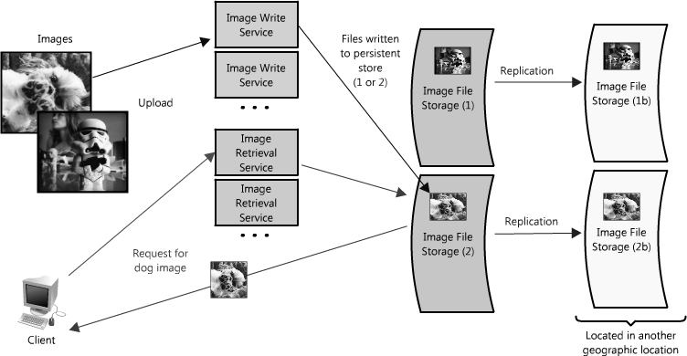
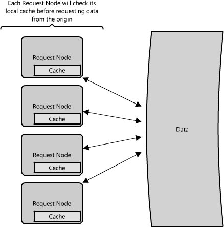
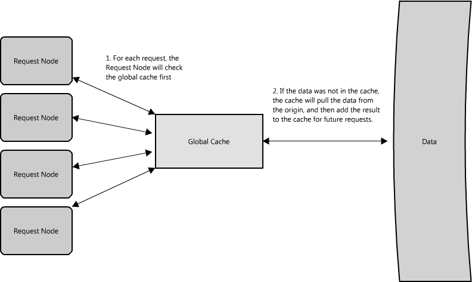
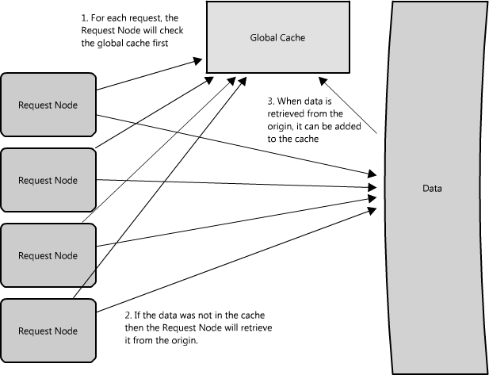
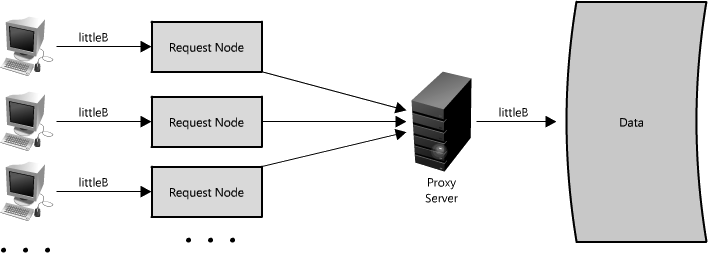
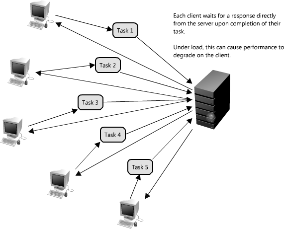

- [ ] 分布式架构入门
  - [ ] http://www.aosabook.org/en/distsys.html
  - [ ] https://www.slideshare.net/slideshow/scalability-availability-stability-patterns/4062682
  - [ ] https://github.com/donnemartin/system-design-primer
- [ ] 分布式理论
  - [ ] [分布式理论教学过程提纲](https://github.com/aphyr/distsys-class)
  - [ ] [拜占庭问题](https://en.wikipedia.org/wiki/Byzantine_fault_tolerance) 容错系统研究中有三个重要理论：CAP、FLP、DLS
    - [ ] [一致性问题虚构模型论文](https://www.microsoft.com/en-us/research/uploads/prod/2016/12/The-Byzantine-Generals-Problem.pdf)
    - [ ] [Dr.Dobb’s - The Byzantine Generals Problem](http://www.drdobbs.com/cpp/the-byzantine-generals-problem/206904396)
    - [ ] [The Byzantine Generals Problem](http://blog.jameslarisch.com/the-byzantine-generals-problem)
    - [ ] [Practicle Byzantine Fault Tolerance]()
  - [ ] [8 条荒谬的分布式假设](https://en.wikipedia.org/wiki/Fallacies_of_distributed_computing)

<!-- @include: basic.md#statement -->

# 快速入门

可以查阅 [开源应用程序的体系结构（第 2 卷）可伸缩的 Web 体系结构和分布式系统](https://aosabook.org/en/v2/distsys.html) 来快速入门，本文就是基于这篇文章进行展开的，并且加入了其他的资料和一些自己的理解。

## 1.分布式设计原则

在网站架构设计中（尤其是大型网站架构），有一些常见的值得考量的关键原则：

- **可用性：**网站的正常运行时间对于许多公司的声誉和功能绝对至关重要。对于一些较大的在线零售网站来说，即使几分钟不可用也可能导致数千或数百万美元的收入损失，因此将其系统设计为持续可用且能够抵御故障既是一项基本业务，也是一项技术要求。分布式系统中的高可用性需要仔细考虑关键组件的冗余，在发生部分系统故障时快速恢复，并在出现问题时正常降级。
- **可靠性：**系统需要可靠，以便数据请求始终返回相同的数据。如果数据发生更改或更新，则同一请求应返回新数据。用户需要知道，如果某些内容被写入系统或存储，它将持续存在，并且可以依靠它来备将来检索。
- **可扩展：**对于任何大型分布式系统，大小只是需要考虑的规模的一个方面。同样重要的是增加容量以处理更多负载所需的努力，通常称为系统的可扩展性。可扩展性可以指系统的许多不同参数：它可以处理多少额外流量，添加更多存储容量的难易程度，甚至可以处理多少交易。
- **可管理：**设计易于操作的系统是另一个重要的考虑因素。系统的可管理性等同于操作的可扩展性：维护和更新。要考虑可管理性的事情是问题发生时诊断和理解问题的难易程度、进行更新或修改的难易程度以及系统操作的简单程度。
- **性能：**网站性能已成为大多数网站的重要考虑因素。网站的速度会影响使用情况和用户满意度，以及搜索引擎排名，这是一个与收入和留存率直接相关的因素。因此，创建针对快速响应和低延迟优化的系统是关键。
- **成本：**成本是一个重要因素。这显然可能包括硬件和软件成本，但考虑部署和维护系统所需的其他方面也很重要。构建系统所需的开发人员时间、运行系统所需的操作工作量，甚至所需的培训量都应该考虑在内。

这些原则中的每一个都为设计分布式 `Web` 体系结构的决策提供了基础。然而，它们也可能彼此不一致，以至于实现一个目标是以牺牲另一个目标为代价的。一个基本示例：选择通过简单地添加更多服务器（可扩展性）来解决容量问题，其代价是可管理性（您必须操作额外的服务器）和成本（服务器的价格）。

## 2.分布式设计搭建

### 2.1.普通系统

在系统架构设计中，有几个关键点需要考虑：

1. 选择合适的组件
2. 这些组件如何相互配合
3. 如何权衡各种利弊

在需求尚未出现之前就投入资源进行扩展通常不是明智的商业决策；然而在设计阶段进行一些前瞻性的思考可以为未来节省大量时间和资源。

我们先从一个 `Image Hosting` 即图片托管项目作为例子来谈起。

想象一下这样一个系统：用户可以将他们的图像上传到中央服务器，并且可以通过 `Web` 链接或 `API` 请求图像。为简单起见，我们假设此应用程序有两个关键部分：将图像上传到服务器的能力，以及查询图像的能力。

- **核心需求**：虽然我们当然希望上传是高效的，但我们最关心的是当有人请求图像时（例如，可以为网页或其他应用程序请求图像）时实现非常快速的交付（快速查看）。这与 `Web` 服务器或内容分发网络边缘服务器（服务器 `CDN` 用于将内容存储在多个位置，以便内容在地理/物理上更接近用户，从而获得更快的性能）可能提供的功能非常相似。
- **其他需求**：还有一些其他的需求需要综合考虑
  - 如果用户上传了图像，则图像应始终存在（可靠性）
  - 将存储的图像数量没有限制，因此需要考虑图像计数方面的存储扩展（可扩展）
  - 系统应该易于维护（可管理）
  - 图像下载/请求需要有低延迟（性能）
  - 由于图像托管的利润率不高，因此该系统需要具有成本效益（成本）

因此得到的一个最为普通的系统架构如下。

### 2.2.面向服务

在考虑可扩展的系统设计时，将功能解耦并将系统的每个部分视为具有明确接口的独立服务是非常有帮助的。在实际中，这种设计方式被称为**面向服务的架构**（`Service-Oriented Architecture, SOA`）。对于这类系统，每个服务都有其独特的功能上下文，与上下文之外的交互通过抽象接口完成，通常是另一个服务的公开 `API`。

将系统分解为一组互补的服务可以将这些部分的操作彼此解耦。这种抽象有助于建立服务、其底层环境以及服务消费者之间的清晰关系。这种明确的分界线不仅有助于隔离问题，还允许各部分独立扩展。这种面向服务的设计与面向对象的编程设计非常相似。

在我们的示例中，所有上传和检索图像的请求都由同一个服务器处理；然而，随着系统需要扩展，将这两个功能拆分为各自的服务显得合理。

假设服务已被广泛使用；在这种情况下，很容易看到较长的写入操作会如何影响读取图像所需的时间，因为这两种功能将争夺共享资源。根据架构的不同，这种影响可能非常显著。即使上传和下载速度相同（实际上大多数 `IP` 网络并非如此，因为大多数网络设计的下载速度与上传速度的比例至少为 `3:1`），读取文件通常会从缓存中读取，而写入最终必须写入磁盘（在某些最终一致性情况下可能会写入多次）。即使所有内容都在内存中或从磁盘（如 `SSD`）读取，数据库写入几乎总是比读取更慢。

向上面的设计的另一个潜在问题是，像 `Apache` 或 `lighttpd` 这样的 `Web` 服务器通常对其能维护的同时连接数有上限（默认值约为 `500`，但可以设置得更高），在高流量下，写入操作可能会迅速耗尽所有连接。由于读取可以是异步的，或者可以利用其他性能优化技术（如 `gzip` 压缩或分块传输编码），`Web` 服务器可以更快地处理读取请求并快速切换客户端，从而每秒处理的请求数可能远远超过最大连接数（例如，对于 `Apache`，最大连接数设置为 `500`，但每秒处理几千个读取请求并不罕见）。而写入操作通常会在整个上传过程中保持连接打开，因此在大多数家庭网络中上传 `1MB` 文件可能需要超过 `1` 秒，这样 `Web` 服务器一次只能处理 `500` 个这样的写入操作。

根据面向服务架构的思想，我们可以根据不同的功能，把读取接口和写入接口分离为两个服务，部署到两个服务器上会更佳，也就是下面这样。

### 2.3.数据冗余

为了优雅地应对故障，`Web` 架构必须在其服务和数据中实现冗余。例如，如果某个文件的唯一副本存储在单一服务器上，那么失去该服务器（单点故障）就意味着丢失该文件。丢失数据通常是不可接受的，常见的解决方法是创建多个冗余副本。

在系统中创建冗余可以消除单点故障，并在需要时提供备份或备用功能。例如，如果生产环境中运行了两个相同服务的实例，其中一个发生故障或性能下降，系统可以切换到正常运行的副本。故障切换可以自动完成，也可以手动干预。

服务冗余的另一个关键部分是创建 **无共享架构**。在这种架构中：每个节点能够独立运行，彼此之间没有中央“大脑”来管理状态或协调活动。

- **独立性**：每个节点可以独立处理任务，不依赖于其他节点的状态或资源
- **扩展性**：由于节点之间没有共享资源，可以轻松添加新节点来扩展系统
- **容错性**：没有单点故障（Single Point of Failure），即使某些节点失效，系统仍然可以继续运行
- **高性能**：由于没有共享资源，节点之间不会争夺资源，从而减少了瓶颈

### 2.4.数据分片

可能会有非常大的数据集，无法容纳在单个服务器上。也可能是某个操作需要太多计算资源，从而降低性能，迫使需要增加容量。在这种情况下，你有两个选择：垂直扩展或水平扩展。

- **垂直扩展**意味着为单个服务器添加更多资源。因此，对于一个非常大的数据集，这可能意味着增加更多（或更大的）硬盘，使单个服务器能够容纳整个数据集。对于计算操作，这可能意味着将计算任务迁移到一台更强大的服务器上，具有更快的 CPU 或更多的内存。在每种情况下，垂直扩展是通过使单个资源能够独立处理更多的工作来实现的。
- **水平扩展**，另一方面，是指添加更多的节点。对于大数据集，这可能意味着第二台服务器来存储数据集的部分内容，而对于计算资源，则意味着将操作或负载分配到更多的节点上。要充分利用水平扩展，它应该作为系统架构的内在设计原则，否则修改和拆分上下文以实现这一点可能会非常麻烦。

在水平扩展方面，一种常见的技术是将服务分成多个分区或分片。这些分区可以分布，以便每个逻辑功能集都是独立的；这可以通过地理边界来实现，或者通过其他标准，比如付费用户和非付费用户。采用这些方案的优点在于，它们为服务或数据存储提供了额外的容量。

以我们的图像服务器为例，单个文件服务器用于存储图像，可能会被多个文件服务器替代，每个文件服务器包含自己独特的图像集。这样的架构将允许系统填充每个文件服务器的图像，当磁盘满了时，添加更多的服务器。设计需要一个命名方案，将图像的文件名与包含它的服务器关联。可以通过一致性哈希方案将图像名称映射到各个服务器。或者，另一种方法是为每个图像分配一个递增的 `ID`，这样当客户端请求图像时，图像检索服务只需要维护映射到每个服务器的 ID 范围（类似于索引）。

## 3.分布式设计补丁

随着上面的分布式架构的雏形诞生，根据 **等价交换法则**，您得到分布式的好处，也应该提防分布式的坏处。

- **快速访问数据**：数据的访问速度是一个关键问题。将大量数据加载到内存中非常昂贵，且磁盘访问速度远低于内存访问速度。特别是对于大数据集，磁盘 `I/O` 会导致显著的性能瓶颈，因此如何优化数据的存取，减少磁盘 `I/O` 成为一个重要挑战。
- **存储可扩展性**：随着数据量的增加，如何有效地存储和管理大规模的数据集成为一个关键问题。特别是当数据量达到数 `TB` 时，如何在多个节点上分布存储并确保数据的访问效率是一个挑战。
- **定位特定数据**：即使有唯一的 `ID`，找到特定的数据块也可能是一个复杂的过程。这类似于在有多个抽屉的情况下，不看抽屉的情况下，从存储中检索特定的数据。如何高效地定位和访问数据是另一个难题。
- **水平的扩展性**：要实现系统的水平扩展，必须设计一个能够支持分布式存储和计算的架构。这涉及到如何在多个节点间分配负载、管理数据分区、确保数据一致性等问题。

### 3.1.缓存机制

根据局部性原理，最近请求的数据可能会再次请求。它们几乎用于计算的每一层：硬件、操作系统、`Web` 浏览器、`Web` 应用程序等。缓存就像短期内存。它的空间有限，但通常比原始数据源更快，并且包含最近访问的项目。缓存可以存在于架构中的所有级别，但通常位于最靠近前端的级别。在那里，缓存的实现是为了快速返回数据，而不会对下游级别造成负担。

#### 3.1.1.局部热点缓存

将缓存直接放在请求层节点上可以启用响应数据的本地存储。每次向服务发出请求时，节点都会快速返回本地缓存数据（如果存在）。如果它不在缓存中，请求节点将从磁盘查询数据。一个请求层节点上的缓存也可以位于内存中（非常快）和节点的本地磁盘上（比转到网络存储更快）。

当您将其扩展到多个节点时会发生什么情况？如果请求层扩展到多个节点，则仍然很有可能让每个节点托管自己的缓存。但是，如果您的负载均衡器在节点之间随机分配请求，则同一请求将发送到不同的节点，从而增加缓存未命中的概率。克服此障碍的两种选择是全局缓存和分布式缓存。

#### 3.1.2.全局热点缓存

全局缓存顾名思义就是所有节点共享同一个缓存空间。这需要添加一个服务器或某种类型的文件存储，速度比原始存储更快，并且所有请求层节点都可以访问。每个请求节点查询缓存的方式与查询本地缓存相同。不过这种缓存方案可能会随着客户端和请求数量的增加，很容易使单一缓存过载，但在某些架构中（特别是那些使用专用硬件使全局缓存非常快速，或者需要缓存固定数据集的架构）非常有效。

并且也有两种方式，在缓存未命中时，可以选择由全局热点缓存服务器来检索缺失的数据，也可以选择由服务节点来检索缺失的数据（甚至可以两种都要）。

#### 3.1.3.分布式的缓存

在分布式缓存中，每个节点拥有部分缓存数据，因此如果冰箱充当杂货店的缓存，那么分布式缓存就像是将食物存放在多个位置——你的冰箱、橱柜和午餐盒——这些地方方便你取零食，而无需去商店。

通常，缓存是通过一致性哈希函数进行划分的，这样如果请求节点正在寻找某个数据，它可以快速知道在分布式缓存中哪里查找，以确定该数据是否可用。在这种情况下，每个节点都有缓存的一小部分，然后会向另一个节点发送请求获取数据，再向源数据请求。因此，分布式缓存的一个优势是，通过向请求池中添加节点，可以增加缓存空间。

分布式缓存的一个缺点是如何处理缺失的节点。一些分布式缓存通过在不同的节点上存储数据的多个副本来解决这个问题；然而，你可以想象，这种逻辑会迅速变得复杂，尤其是当你向请求层添加或移除节点时。尽管如此，即使一个节点消失并且部分缓存丢失，请求仍然会从原始数据源拉取数据——因此，这并不一定是灾难性的！

### 3.2.代理机制

代理服务器是一种中间的硬件或软件组件，用于接收来自客户端的请求并将其转发到后端的原始服务器。通常，代理被用于过滤请求、记录请求，或在某些情况下对请求进行转换（例如添加/移除头部信息、加密/解密或压缩）。

代理在协调来自多个服务器的请求时非常有用，从系统整体角度提供优化请求流量的机会。使用代理加速数据访问的一种方法是将相同（或相似）的请求合并为一个请求，然后将单一的结果返回给发出请求的客户端。这被称为 **请求合并转发**。

例如，假设多个节点请求相同的数据（我们称之为 `littleB`），而该数据不在缓存中。如果这些请求通过代理路由，那么所有这些请求可以合并为一个请求，这意味着我们只需要从磁盘读取一次 `littleB`。这种设计会带来一些成本，因为每个请求可能会有略高的延迟，并且某些请求可能会稍微延迟以便与其他相似请求分组。但在高负载情况下，特别是当相同数据被反复请求时，这种设计能显著提升性能。这与缓存类似，但与缓存存储数据/文档不同，代理通过优化这些文档的请求或调用，充当客户端的代理。

另一种使用代理的优秀方法是，不仅合并对相同数据的请求，还可以合并对原始存储中空间上彼此接近的数据（磁盘上连续存储）的请求。采用这种策略可以最大化请求的数据局部性，从而减少请求延迟。例如，假设多个节点请求 `B` 的不同部分：`partB1、partB2` 等。我们可以设置代理识别这些单独请求的空间局部性，将它们合并为一个请求，并仅返回 `bigB`，从而大大减少从原始数据源的读取次数。当您在 `TB` 级别的数据中随机访问时，这种方法对请求时间的影响可能非常显著！代理在高负载情况下或缓存有限时尤其有用，因为它们可以将多个请求批量处理为一个。

### 3.3.索引机制

利用索引快速访问数据是一种众所周知的优化数据访问性能的策略，尤其是在数据库领域。这种方法通过增加存储开销和减慢写入速度（因为需要同时写入数据和更新索引）来换取更快的读取速度。

就像传统关系型数据存储一样，这一概念也可以应用于更大的数据集。使用索引的关键在于仔细考虑用户将如何访问数据。当数据集规模达到数 `TB`，但每次访问的数据量很小（例如 `1 KB`）时，索引是优化数据访问的必要工具。在如此庞大的数据集中找到一个小数据块是个巨大的挑战，因为无法在合理的时间内遍历所有数据。此外，这种大规模数据集很可能分布在多个（甚至很多）物理设备上，这就需要一种方法来定位目标数据的具体物理位置，而索引是实现这一目标的最佳方式。

索引可以像一本书的目录一样，指引你找到数据所在的位置。例如，如果你正在寻找一部分数据（比如 `B` 的第 `2` 部分），如何知道它的位置呢？如果有一个按数据类型排序的索引（例如数据 `A、B、C`），它会告诉你数据 `B` 在原始存储中的位置。然后，你只需跳转到该位置并读取所需的 `B` 的部分即可。

这些索引通常存储在内存中，或者非常接近客户端请求的位置。树状数据结构是常用的索引存储方式，它们以有序列表的形式存储数据，非常适合通过索引访问。

索引通常分为多层，类似于一张地图，引导你从一个位置到下一个位置，直到找到所需的具体数据。

索引还可以用于为相同数据创建多个不同的视图。对于大型数据集，这是定义不同过滤条件和排序方式的绝佳方法，而无需创建数据的多个副本。

例如，假设之前提到的图片托管系统实际上是托管书页的图片，并允许客户端在这些图片中的文本中进行查询，类似于搜索引擎允许用户搜索 `HTML` 内容的方式。在这种情况下，所有这些书页图片需要很多服务器来存储文件，而找到一页内容并呈现给用户可能非常复杂。

- 首先，需要方便访问的倒排索引来查询任意单词或词组，也就是找到包含关键词的书籍（倒排索引）
- 接着，还需要定位具体书页和书中的位置，这里记录了出现位置和出现次数，并提取正确的图片以返回结果，也就是找到关键词在书籍中的具体位置（书内索引）

### 3.4.负载均衡

任何分布式系统的另一个关键部分是负载均衡器。负载均衡器是任何架构的主要部分，因为它们的作用是在一组负责处理请求的节点之间分配负载。这允许多个节点透明地为系统中的同一功能提供服务。它们的主要目的是处理大量并发连接并将这些连接路由到其中的某一个请求节点，从而允许系统通过添加节点进行扩展以均衡的方式服务更多请求。

有许多不同的算法可用于负载均衡的服务请求：

- **随机算法（Random Node Selection）**：从可用节点中随机挑选一个
- **轮询算法（Round Robin）**：按顺序依次分配请求到每个节点，循环往复
- **基于特定指标的选择（Criteria-Based Selection）**：根据节点的当前状态（如内存使用率、`CPU` 利用率等）来决定分配请求的节点

负载均衡器的实现形式也不仅仅是在软件层次上，也可以实现在硬件层次上：

- **软件实现**：通过软件程序实现负载均衡逻辑，灵活且易于配置
- **硬件实现**：使用专用硬件设备提供高性能负载均衡，但成本较高

在分布式系统中，负载均衡器通常位于系统的最前端，所有传入的请求都会根据负载均衡器的规则进行路由。在复杂的分布式系统中，某个请求被路由到多个负载均衡器是很常见的。

并且也允许存在多个负载均衡服务器。

负载均衡器的挑战之一是管理特定于用户会话的数据。在电子商务网站中，当您只有一个客户时，很容易允许用户将商品放入购物车并在两次访问之间保留这些内容（这很重要，因为如果产品在用户返回时仍在购物车中，您更有可能出售该产品）。

但是，如果用户在会话中被路由到一个节点，然后在下次访问时路由到另一个节点，则可能会出现不一致，因为新节点可能缺少该用户的购物车内容（如果你把商品放在购物车里，然后回来发现它是空的，你不会不高兴吗？）。

解决此问题的一种方法是使会话具有粘性，以便用户始终路由到同一节点，但这样就很难利用一些可靠性特性，比如自动故障转移。在这种情况下，用户的购物车始终会有内容，但如果他们的粘性节点不可用，就需要处理特殊情况，假设购物车内容存在的前提不再有效（尽管希望这个假设不会被硬编码到应用程序中）。当然，这个问题也可以通过本章中介绍的其他策略和工具来解决，比如服务，或者一些未覆盖的工具（如浏览器缓存、`Cookies` 和 `URL` 重写）。

如果一个系统只有几个节点，那么像轮询 `DNS` 这样的系统可能更有意义，因为负载均衡器可能很昂贵，并且会增加不必要的复杂性。当然，在更大的系统中，有各种不同的调度和负载均衡算法，包括简单的随机选择或轮询算法，以及更复杂的机制，这些机制会考虑到利用率和容量等因素。所有这些算法都可以实现流量和请求的分配，并提供有用的可靠性工具，如自动故障转移或自动移除故障节点（负载均衡器一般提供能够测试节点运行状况的关键功能，这样，如果节点无响应或过载，则可以利用系统中不同节点的冗余，将其从处理请求的池中删除）。

然而，这些高级功能可能会使问题诊断变得繁琐。例如，在高负载情况下，负载均衡器会移除可能变慢或超时的节点（由于请求过多），但这只会加剧其他节点的负担。在这种情况下，广泛的监控非常重要，因为整体系统的流量和吞吐量可能看起来在下降（因为节点处理的请求减少了），但个别节点却可能已经达到最大负载。

 ### 3.5.队列机制

到目前为止，我们已经介绍了许多快速读取数据的方法，但扩展数据层的另一个重要部分是有效的写入管理。当系统简单、处理负载最小且数据库较小时，写入速度可以预见。但是在更复杂的系统中，写入可能需要几乎不确定的很长时间。例如，可能必须将数据写入不同服务器或索引上的多个位置，或者系统可能只是处于高负载下。

在写入或任何与此相关的任务可能需要很长时间的情况下，实现性能和可用性需要在系统中构建异步，一种常见的实现方法是使用队列。

想象一下这样一个系统：每个客户端都请求对任务进行远程服务。这些客户端中的每一个都将其请求发送到服务器，服务器在服务器中尽快完成任务并将结果返回给各自的客户端。在小型系统中，一台服务器（或逻辑服务）可以为传入的客户端提供服务，就像它们来的时候一样，这种情况应该可以正常工作。但是，当服务器收到的请求数超出其处理能力时，每个客户端都会被迫等待其他客户端的请求完成，然后才能生成响应。

这种同步行为会严重降低客户端性能;客户端被迫等待，实际上不执行任何工作，直到其请求得到响应。添加其他服务器以解决系统负载也无法解决问题;即使实施了有效的负载平衡，也很难确保公平和公平地分配工作，以最大限度地提高客户端性能。此外，如果处理请求的服务器不可用或失败，那么上游的客户端也将失败。要有效地解决这个问题，需要在客户端的请求和为服务它而执行的实际工作之间进行抽象。

队列听起来很简单：一个任务进来，被添加到队列中，然后工作人员在有能力处理该任务时接手下一个任务。这些任务可以表示对数据库的简单写入，也可以表示为文档生成缩略图预览图像等复杂操作。当客户端向队列提交任务请求时，他们不再被迫等待结果。相反，他们只需要确认请求已正确接收。这种确认可以在以后作为参考，当客户端需要时，用于获取任务的结果。

队列使客户端能够以异步方式工作，为客户端的请求和响应提供了一个战略性的抽象。在同步系统中，请求和回复之间没有区别，因此它们不能单独管理。在异步系统中，客户端请求一个任务，服务通过消息响应，确认任务已被接收，然后客户端可以定期检查任务的状态，只有在任务完成后才请求结果。当客户端等待异步请求完成时，它可以自由地执行其他工作，甚至可以向其他服务发起异步请求，这是队列和消息在分布式系统中如何被利用的一个例子。

队列还提供了一些对服务中断和故障的保护，队列可以帮助系统在遇到服务故障时更好地处理请求。例如，当服务器发生临时故障时，队列可以自动重试那些失败的请求，而不需要客户端自己去处理这些错误。如果没有队列，客户端就需要自己处理这些间歇性的故障，通常这种处理方式既复杂又不一致。而通过使用队列，系统可以保证一定的服务质量，让客户端不必直接面对这些问题，从而减少了客户端的负担和错误处理的复杂性。

<!-- @include: basic.md#comment -->