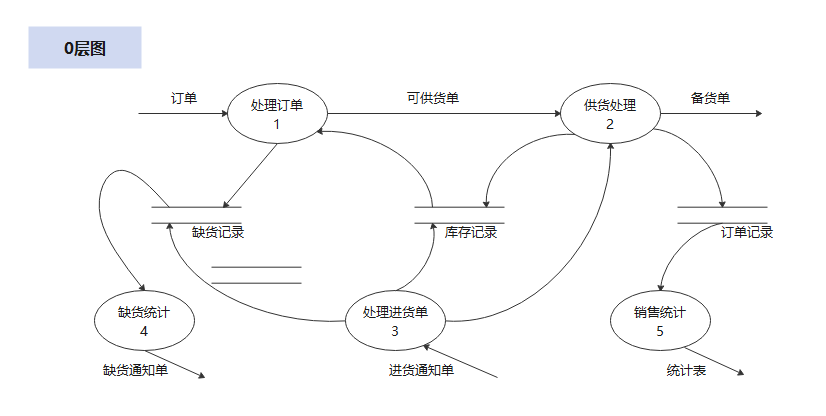
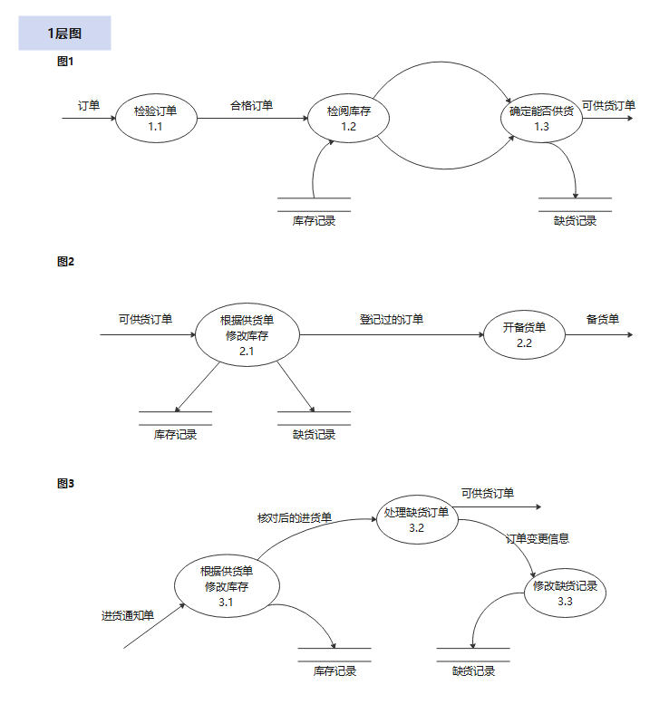
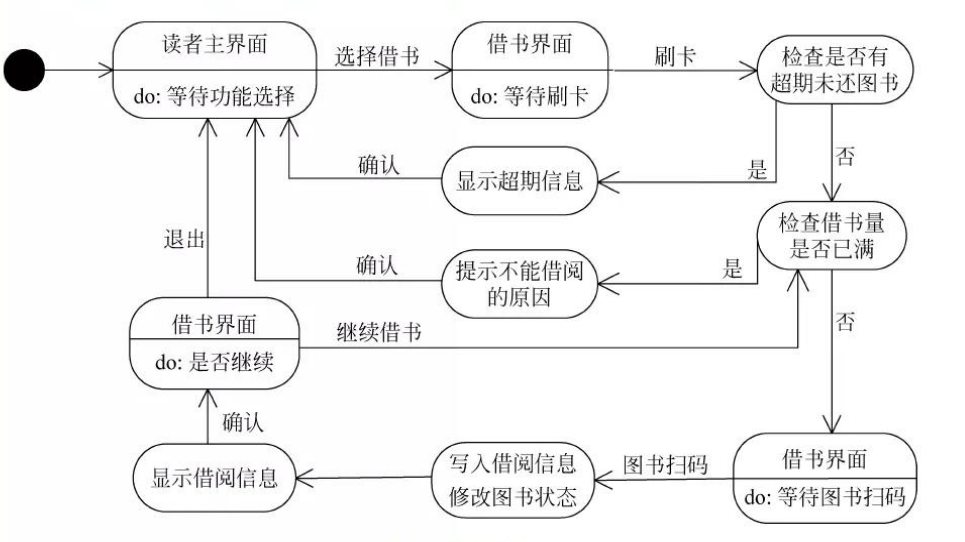
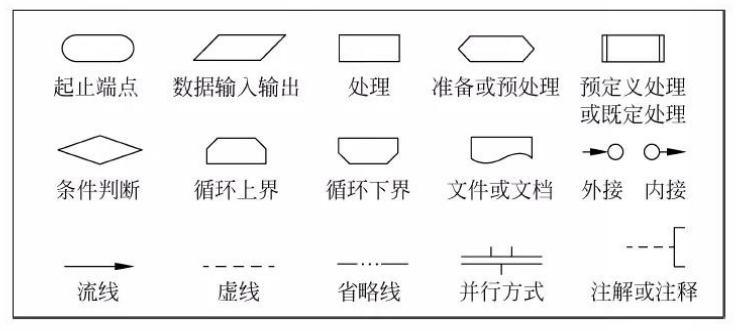
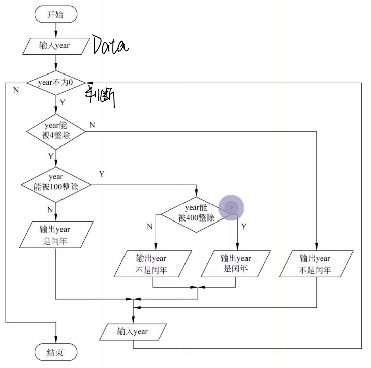

# 快速入门

软件=程序+数据+文档+服务

软件危机：是指开发软件所需高成本和产品的低质量之间有着尖锐的矛盾，软件工程应运而生。因此，软件工程学就是以较低的成本研制较高质量的软件。

软件工程的理论和技术性研究的内容主要包括：

- 软件开发技术
- 软件工程管理

开发大型系统产生困难的根本原因是大系统的复杂性。

文档是公司各职位人员以及计算机之间沟通的桥梁。

## 1.软件生命周期

一套完整的软件项目通常具有一个生命周期，分别为：

1.   **问题定义**：快速精简定义要解决的问题是什么？

2.   **可行研究**：研究该项目投资效益是否值得持续开发？

3.   **需求分析**：充分了解用户的具体需求确定目标软件需要具备哪些功能？

4.   **总体设计**：高度抽象概括说明如何解决问题？期间至少准备三套方案

     - 低成本解决方案：完成所有任务最低要求
     - 中成本解决方案：完成所有任务最低要求，使用方便
     - 高成本解决方案：完成所有任务最低要求，使用方便，并且具备一定的具有实际价值的拓展功能

5.   **详细设计**：使用各类型流程图设计软件的工程蓝图，程序员可以根据该蓝图设计出具体的代码

6.   **编码测试**：开始具体的编码和各类测试（主要是单元测试和综合测试）

7.   **软件维护**：保证系统可持久进行使用，一般有四类维护活动

     - 改正性维护，诊断并修改使用过程中出现的软件错误
     - 适应性维护，修改软件适应可能不断变化的软件环境
     - 完善性维护，根据用户需求改进和拓展软件使其完善
     - 预防性维护，修改软件预防未来可能出现的运行错误

## 2.软件工程要素

软件生命周期描述的，在现实生活中几乎对应的就是各类红头文件，但这只是概要描述了一个软件设计的步骤，前三步其实还好，基本上不是程序员也可以做，但是在后面四个步骤就很不够了，这些步骤对应的描述未免太过于抽象，因此这里需要引入软件工程学的三要素，指导我们进行更好的软件开发。

-   **方法**：决定了软件的编程语哲学是使用面向过程编程还是面向对象过程编程，以及对软件生命周期的处理思路
-   **工具**：决定了公司需要采购和使用哪些软件工具支持项目开发（这里的工具不只是指某些开发软件）
-   **过程**：决定了软件的开发模型，是对项目开发过程的指导

### 2.1.软件工程学方法

-   **结构化方法** 特征有 `面向过程语言, 自顶向下设计, 结构化, 模块化`
-   **面对对象方法** 特征有 `面向对象语言, 对象建模, 接近人类思维`

### 2.2.软件工程学工具

-   需求分析工具
-   架构设计工具
-   开发编码工具
-   运行调试工具
-   软件测试工具
-   ...

### 2.3.软件工程学过程

#### 2.2.1.传统瀑布模型

- **模型概念**：瀑布模型是软件开发中最早提出的一种**线性顺序开发模型**，它将整个软件开发过程划分为多个阶段，并按照顺序逐步推进。每个阶段都有明确的目标和产出，只有完成当前阶段并验证后才能进入下一个阶段。
- **模型特点**
  1. **阶段性**：开发过程分为多个阶段，每个阶段依赖于前一个阶段的成果。
  2. **线性顺序**：每个阶段按固定顺序进行，不允许回退。
  3. **文档驱动**：每个阶段都会生成详细的文档作为输入或输出。
  4. **严格控制**：强调计划性和过程控制。
- **主要阶段**
  1. **需求分析（Requirements Analysis）**
     - **目标**：与用户沟通，明确软件的功能、性能和约束条件。
     - **输出**：需求规格说明书（SRS），描述系统的需求。
  2. **系统设计（System Design）**
     - **目标**：根据需求设计系统架构，包括模块划分、接口设计和数据结构。
     - **输出**：系统设计文档。
  3. **编码实现（Implementation）**
     - **目标**：将设计转化为实际代码，完成各模块的开发。
     - **输出**：可执行的程序代码。
  4. **测试（Testing）**
     - **目标**：验证软件是否满足需求，检查功能、性能和可靠性。
     - **输出**：测试报告。
  5. **部署（Deployment）**
     - **目标**：将软件交付用户使用，完成系统的安装和配置。
     - **输出**：运行的软件系统。
  6. **维护（Maintenance）**
     - **目标**：对软件进行修复、改进或升级，以适应新需求或解决问题。
     - **输出**：更新后的软件版本。
- **优点**
  1. **简单易理解**：结构清晰，适合初学者和管理人员。
  2. **文档规范**：每个阶段都有详细文档，便于沟通和审查。
  3. **阶段明确**：便于项目的进度控制和质量管理。
- **缺点**
  1. **灵活性差**：不支持阶段间的回退，难以应对需求变化。
  2. **风险高**：直到后期才能看到软件成果，容易导致问题积累。
  3. **用户参与少**：用户只能在需求阶段和验收阶段参与，可能导致产品不符合期望。
- **适用场景**
  1. 需求明确且稳定的项目。
  2. 技术可行性较高、风险较低的项目。
  3. 小型或中型项目，开发团队经验丰富。

> [!NOTE]
>
> 吐槽：单次严格顺序生成一系列文档，前子文档作为输入来输出后子文档。

#### 2.2.2.增量模型

- **模型概念**：增量模型将系统开发分为多个小的增量，每个增量都是系统的一个子集，逐步构建并交付系统的完整功能。每个增量都包含部分功能，逐步实现完整的系统。
- 模型特点
  1. **分阶段开发**：系统功能被分成多个增量，每个增量都逐步开发。
  2. **逐步交付**：每个增量都可以交付给用户使用，提供早期的反馈。
  3. **灵活性高**：每个增量都可以根据用户反馈进行调整，灵活应对需求变化。
  4. **风险控制**：早期交付增量，能及时发现问题并进行修正。
- 主要阶段
  1. 需求分析与规划
     - **目标**：分析系统的需求并规划增量开发的顺序。
     - **输出**：需求文档，增量开发计划。
  2. 增量设计与开发
     - **目标**：设计和开发每个增量的功能。
     - **输出**：每个增量的设计文档和开发代码。
  3. 增量交付与反馈
     - **目标**：将增量交付给用户，收集反馈。
     - **输出**：用户反馈报告。
  4. 增量改进与迭代
     - **目标**：根据反馈改进系统，开发下一个增量。
     - **输出**：改进后的增量和新开发的增量。
- 优点
  1. **早期交付**：每个增量都可以在开发过程中交付，减少了用户等待时间。
  2. **灵活应对变化**：每个增量可以根据反馈进行调整，适应需求变化。
  3. **风险分散**：通过增量交付，能够在早期发现问题并及时解决。
- 缺点
  1. **系统设计复杂**：需要在初期规划好各个增量的开发，设计较为复杂。
  2. **集成问题**：随着增量的增加，集成和系统的整体性可能会面临挑战。
  3. **需求控制困难**：需求可能会随着增量的交付而不断变化，难以控制项目的范围。
- 适用场景
  1. 需求变化频繁且项目较大时。
  2. 需要早期交付并逐步完善的项目。
  3. 用户参与度高的项目，适合逐步验证功能。

> [!NOTE]
>
> 吐槽：多次的严格顺序生成一系列子文档（整体作为一个增量），前子文档作为输入来输出后子文档。

#### 2.2.3.快速原型模型

- **模型概念**：快速原型模型是一种迭代式开发方法，通过快速构建原型系统来帮助用户明确需求，并通过不断的用户反馈来改进系统，最终交付一个符合需求的完整系统。
- 模型特点
  1. **快速构建原型**：在开发初期，迅速开发一个功能简单的原型系统，帮助用户理解系统功能。
  2. **用户反馈**：通过用户使用原型并提供反馈，改进系统的功能和设计。
  3. **迭代开发**：在多个迭代周期中，原型系统不断完善，逐步接近最终系统。
  4. **需求逐步明确**：通过原型展示，用户可以更清晰地表达需求，开发团队能根据反馈调整系统。
- 主要阶段
  1. 需求收集与初步设计
     - **目标**：收集用户需求并进行初步设计，明确系统的基本功能。
     - **输出**：初步需求文档，功能定义。
  2. 构建原型
     - **目标**：快速开发一个功能简化的原型系统。
     - **输出**：原型系统。
  3. 用户评估与反馈
     - **目标**：用户使用原型并提供反馈，指出系统的不足之处。
     - **输出**：用户反馈报告。
  4. 改进原型
     - **目标**：根据用户反馈对原型进行改进，添加功能或修改设计。
     - **输出**：改进后的原型。
  5. 重复迭代
     - **目标**：通过多次迭代和反馈，逐步完善原型，直到满足用户需求。
     - **输出**：最终系统。
- 优点
  1. **快速响应需求变化**：用户能在早期看到系统原型，需求可以随时调整。
  2. **提高用户参与度**：用户通过频繁的反馈，能够积极参与开发过程。
  3. **需求明确**：原型帮助用户更清晰地表达需求，减少需求不明确的风险。
- 缺点
  1. **原型可能不完全**：原型通常功能简单，可能不能完全反映系统的最终复杂性。
  2. **需求膨胀**：由于用户的反馈不断增加，可能导致系统需求过多，增加开发的复杂性。
  3. **项目管理难度大**：频繁的修改和迭代可能导致项目的进度和预算难以控制。
- 适用场景
  1. 需求不完全明确或经常变化的项目。
  2. 用户参与度高，需求频繁变化的项目。
  3. 快速展示系统功能，帮助用户理解系统需求的项目。

> [!NOTE]
>
> 吐槽：多次的严格顺序生成一系列快速文档（整体作为一个快速原型），前子文档作为输入来输出后子文档，快速原型可以根据用户的不断反馈进行调整。

#### 2.2.4.喷泉模型

- **模型概念**：喷泉模型是对传统瀑布模型的改进，强调软件开发过程中各阶段的反复迭代与交叉进行，而不是严格的线性顺序。它适用于需求可能变化的项目，通过多个迭代和反馈来逐步完善系统。
- **模型特点**
  1. **阶段交叉进行**：不同阶段可以同时进行，允许不同阶段之间的交叉与迭代。
  2. **需求变化支持**：适合需求变化较多的项目，开发过程中不断反馈和调整。
  3. **灵活性高**：各阶段之间可以互相影响和调整，开发过程更为灵活。
- **主要阶段**
  1. 需求分析
     - **目标**：收集和分析需求，进行初步设计。
     - **输出**：需求规格说明书。
  2. 设计与开发
     - **目标**：进行系统设计，并开始部分功能的开发。
     - **输出**：系统设计文档和初步代码。
  3. 测试与反馈
     - **目标**：测试系统的部分功能，收集用户反馈，进行必要的调整。
     - **输出**：测试报告和用户反馈。
  4. 迭代与完善
     - **目标**：根据反馈进行改进，逐步完善系统。
     - **输出**：改进后的系统版本。
- **优点**
  1. **灵活性高**：各阶段可以并行进行，能够快速响应需求变化。
  2. **适应性强**：能够应对需求变化，逐步调整开发方向。
- **缺点**
  1. **管理复杂**：阶段交叉进行，可能导致项目管理和进度控制的困难。
  2. **需求不稳定**：频繁的反馈和需求变化可能导致项目范围膨胀。
- **适用场景**
  1. 需求不完全明确，且可能发生变化的项目。
  2. 需要灵活调整开发过程的项目。

> [!NOTE]
>
> 吐槽：单次的非纯顺序生成一系列子文档（一次性同时开发所有文档），每一个节点内部不断迭代。

#### 2.2.5.螺旋模型

- **概述**：螺旋模型是一种将**迭代开发**与**风险管理**相结合的软件开发模型。它强调**风险分析**和逐步完善，每次迭代都包括计划、风险评估、开发和评审四个阶段。  
- **阶段划分**  
   1. **确定目标阶段**  
      - **目标**：分析需求，确定项目目标，识别潜在风险。  
      - **输出**：需求说明文档、风险分析报告。  
   2. **风险分析阶段**  
      - **目标**：识别和评估项目中可能存在的风险，提出解决方案。  
      - **输出**：风险评估报告、解决方案。  
   3. **开发与验证阶段**  
      - **目标**：开发具体的功能模块，并进行验证和测试。  
      - **输出**：可交付的产品原型或功能模块。  
   4. **评审与规划阶段**  
      - **目标**：评审当前阶段的成果，规划下一次迭代的目标和任务。  
      - **输出**：评审报告、下一阶段的开发计划。  
- **优点**  
   1. **风险管理突出**：每次迭代都进行风险分析，降低项目失败的概率。  
   2. **适应性强**：能够灵活应对需求变化，适合复杂和大型项目。  
   3. **逐步完善**：通过多次迭代，逐步提高产品质量和功能。  
- **缺点**  
   1. **成本较高**：频繁的风险分析和评估增加了项目的时间和成本。  
   2. **依赖风险分析能力**：需要有经验的团队进行风险评估，否则效果有限。  
   3. **不适合小型项目**：对于需求简单的小项目，螺旋模型显得过于复杂。  
- **适用场景**  
   1. 复杂度高、需求不明确且变化频繁的项目。  
   2. 需要进行风险管理的大型软件开发项目。  
   3. 需要逐步交付原型，并不断优化的项目。  

> [!NOTE]
> 
> 吐槽：快速原型模型 + 喷泉模型。

#### 2.2.6.统一过程模型

- **模型概念**：统一过程模型（`Unified Process, UP`）是一种迭代增量的软件开发过程模型，基于面向对象的方法，强调通过不断的迭代和反馈来开发软件。它通过合理的阶段划分和角色分配来确保软件开发的高效性和可管理性。
- **模型特点**
  1. **迭代增量**：项目通过多个迭代来逐步交付功能，每个迭代都有明确的目标和产出。
  2. **面向对象**：采用面向对象的方法进行系统设计和开发，支持模块化和重用。
  3. **角色明确**：定义了不同的角色（如开发人员、测试人员、项目经理等），确保团队协作。
- **主要阶段**
  1. 初始阶段
     - **目标**：定义项目的愿景和目标，进行需求分析，规划项目。
     - **输出**：需求文档、项目计划。
  2. 细化阶段
     - **目标**：进行详细设计，开发系统的核心功能。
     - **输出**：详细设计文档、初步代码。
  3. 构建阶段
     - **目标**：完成系统的开发和测试，交付增量版本。
     - **输出**：系统代码、测试报告。
  4. 交付阶段
     - **目标**：交付最终系统，进行用户验收和部署。
     - **输出**：交付的系统、部署文档。
- **优点**
  1. **灵活性高**：支持多次迭代和增量交付，能够灵活应对需求变化。
  2. **面向对象**：支持模块化设计，便于系统的扩展和维护。
  3. **高效管理**：明确的角色分配和阶段划分，有助于项目管理。
- **缺点**
  1. **复杂性高**：涉及的过程和角色较多，管理和实施复杂。
  2. **适应性差**：对于小型项目或需求明确的项目，可能显得过于复杂。
- **适用场景**
  1. 大型、复杂的项目，特别是面向对象开发的项目。
  2. 需求可能变化，但仍需要清晰规划和高效管理的项目。

> [!NOTE]
>
> 吐槽：不太懂。

#### 2.2.7.敏捷开发模型

- **模型概念**：敏捷开发模型是一种灵活、快速的开发方法，强调通过短周期的迭代交付和持续反馈来快速响应需求变化。敏捷开发强调团队协作、客户参与和快速交付。
- **模型特点**
  1. **短周期迭代**：通过多个短周期（通常为1-4周）的迭代来交付功能。
  2. **高频次反馈**：每个迭代结束后都会收集用户反馈，快速调整开发方向。
  3. **持续改进**：每次迭代后团队进行回顾，不断优化开发过程。
  4. **强调协作**：开发团队与客户之间保持密切沟通，确保开发方向符合用户需求。
- **主要阶段**

1. 计划阶段
   - **目标**：定义项目的愿景和目标，确定开发的优先级。
   - **输出**：产品愿景文档、开发计划。
2. 迭代开发阶段
   - **目标**：进行短周期的迭代开发，每个迭代交付可用功能。
   - **输出**：每个迭代的功能版本。
3. 评审与反馈阶段
   - **目标**：用户评审每个迭代版本并提供反馈，进行必要的调整。
   - **输出**：用户反馈报告。
4. 回顾与改进阶段
   - **目标**：团队回顾每个迭代过程，优化开发流程。
   - **输出**：改进后的开发流程和方法。

- 优点
  1. **快速响应需求变化**：通过短周期的迭代和反馈，能够快速适应需求的变化。
  2. **高效沟通与协作**：团队和客户之间保持密切沟通，确保开发符合需求。
  3. **提高产品质量**：通过持续的反馈和改进，能够及时发现并解决问题。
- 缺点
  1. **难以预测进度**：由于需求变化频繁，项目进度难以准确预测。
  2. **管理挑战**：频繁的迭代和变化可能导致项目管理难度增加。
- 适用场景
  1. 需求变化频繁且不完全明确的项目。
  2. 强调团队协作和客户参与的项目。

> [!NOTE]
>
> 吐槽：不太懂。

## 3.软件设计流程

接下来，结合软件生命周期和软件工程学三要素开始设计一个软件项目。

选择不同的方法，也就决定了我们如何处理软件生命周期。

选择不同的工具，也就决定了设计过程中使用的工具。

选择不同的过程，也就决定了整个项目在时间线上是如何开发的。

### 3.1.面向过程软件项目

#### 3.1.1.选择方法

这里选择 ==面对过程== 方法。

##### 3.1.1.1.问题定义

只需要一段话，这段话需要定义用户的问题。

> [!IMPORTANT]
>
> 补充：得到 **问题定义规格书**。

##### 3.1.1.2.可行研究

1. 技术可行性：
   - 系统性能、是否可靠、维护成本
   - 实现系统需要的硬件设备、软件技术
   - 开发成本、开发时间、技术风险
2. 经济可行性：
   - 软件硬件费用
   - 开发人员费用
   - 系统维护费用
   - 人员培训费用
   - ...
3. 操作可行性：一个项目或系统在投入使用后，是否能够满足用户的需求，并在组织或业务环境中被有效地运行，它评估的是新系统的实际可用性和操作效率
4. 法律可行性：合同明细、侵权明细、规范明细、责任明细

> [!IMPORTANT]
>
> 补充：得到 **可行研究规格书**。

##### 3.1.1.3.需求分析

###### 3.1.1.3.1.获取需求 N

1. 通过启发和引导客户，得到原始需求
2. 遵循以下原则
   - 深入浅出：需求获取是全集，目标项目是子集
   - 流程主线：用户交流中，使用流程将所有内容串连起来
3. 解决以下任务
   - 发现和分析问题，分析问题的前后因果关系
   - 与用户各种交流，用调查研究方法收集信息
   - 从三个成分（数据、接口、过程）观察问题
   - 深入客户所需目标软件应用领域和应用场景
   - 让用户和技术人员相互沟通了解大概的方案

###### 3.1.1.3.2.分析需求 R1

功能建模、数据建模、行为建模。

1. 功能建模 - DFD 数据流图（`+, ⊕, *`，`外部实体、加工、数据存储、数据流向、源点、汇点`）

   

   数据加工比较多时，就需要进行编号。但是顶层图只有一张，图中的“加工”也只有一个，不必为其编号，要尽可能囊括所有功能。然后从顶层图出发绘制 `0` 层图，加工标记序号 `1,2,3,...`。如果还可以拆分就 `1.1,1.2,1.3,...` 继续拆分直到无法分解。

   外部实体之间不应该存在数据流，因为数据流的起点和终点中必有一个是加工 。

   

   

   

2. 数据建模 - ER 实体图（`1, m, n`，`实体、属性、关系`）

   

3. 行为建模 - SD 状态图（`●, ◎,圆角矩形, 箭头`）

   

   

4. 数据字典 - 词条（根据最详细一层的数据流图中的每一个元素进行文字描述）

   待补充...

   - 数据流条目
   - 数据项条目
   - 数据存储条目
   - 加工条目

###### 3.1.1.3.3.定义需求 R2

把之前的分析过程编写为一份文档，这个过程就是定义需求的过程，也就是编写初步的 **需求分析规格书** 的过程。

###### 3.1.1.3.4.验证需求 R3

- 审核规格文档没有表述问题，不清晰问题
- 转交需求规格文档，确保用户理解和接受
- 记录用户的意见，积极和用户沟通并调整

> [!IMPORTANT]
>
> 补充：得到 **需求分析规格书**。

##### 3.1.1.4.总体设计

评估后，选择合适的架构，给出以下方案：

- 低成本解决方案：完成所有任务最低要求

- 中成本解决方案：完成所有任务最低要求，使用方便

- 高成本解决方案：完成所有任务最低要求，使用方便，并且具备一定的具有实际价值的拓展功能

> [!IMPORTANT]
>
> 补充：得到 **总体设计规格书**。

##### 3.1.1.5.详细设计

###### 3.1.1.5.1.设计原则

设计原则体现在编码和架构中。

- **模块**：将大型软件分解为许多容易解决的小模块
- **高内聚低耦合**：
  - **内聚**：程序中各个元素之间结合紧密的程度（**功能内聚** > **信息内聚** > **通信内聚** > **过程内聚** > **时间内聚** > **逻辑内聚** > **巧合内聚**）
    - **功能内聚**：模块内的所有部分都围绕一个单一的功能进行组织，每个部分的操作都紧密地协作以完成这个功能（每个部分没有除了当前模块以外的其他任务）。功能内聚的模块通常是最理想的，易于理解和维护（一个函数只做一件事，内部的局部元素都是为函数服务的）
    - **信息内聚**：模块内的所有部分都围绕相同数据类型进行操作（操作同一数据结构的不同接口，但是只传入一个数据结构参数）
    - **通信内聚**：模块内的所有部分都围绕同一数据集合进行操作（操作同一数据结构的不同接口，但是不只传入一个数据结构参数，还包括其他参数）
    - **过程内聚**：模块的不同部分执行一系列按顺序排列的操作，但这些操作并不围绕单一的功能，而是按步骤排列（代码端太长了，把一些条件代码、循环代码、计算代码...抽离为多个新模块顺序执行）
    - **时间内聚**：模块内的不同部分在同一时间点（附近）执行，通常是一些初始化操作，或者在某个特定时刻执行的任务。虽然这些任务不一定相关，但它们需要在相同的时机发生（定时清理数据库日志、定时备份数据库数据、定时发送报告通知）
    - **逻辑内聚**：模块内的不同部分在功能上不同但是同属一个类别的部分（认为某类函数是属于一个分类中）
    - **巧合内聚**：几个模块中恰好有一段代码相同进行抽离的模块（修改代码时可以偷懒，一次修改处处修改，方便而已）
  - **耦合**：程序中各个模块之间相互关联的度量（**非直接耦合** < **数据耦合** < **标记耦合** < **控制耦合** < **外部耦合** < **公共耦合** < **内容耦合**）
    - **非直接耦合**：两个模块完全没有直接关系，他们的联系依靠主模块的调度
    - 数据耦合：一个模块访问另一个模块时，彼此之间通过简单数据（也就是字段变量）来传递输入输出信息（例如通过 `getter` 和 `setter` 获取和设置简单数据）
    - **标记耦合**：一个模块访问另一个模块时，彼此之间通过参数表（也就是结构体指针）来传递输入输出信息（例如通过 `getter` 和 `setter` 获取和设置参数表）
    - **控制耦合**：一个模块通过某个开关、标志等控制参数明显改变另一个模块的功能（标志位）
    - **外部耦合**：多个模块访问同一全局简单变量/全局变量（直接依赖没有接口的全局变量）
    - **公共耦合**：多个模块访问同一公共数据环境（直接依赖没有视图的数据库）
    - **内容耦合**：一个模块可以直接访问（不是间接）另外一个模块中的内容，是耦合度最高的做法（一个模块直接访问另一个模块的内部变量或数据结构、一个模块不通过公共接口直接调用另一个模块的私有函数、一个模块通过硬编码地址或偏移量直接访问另一个模块的内部数据、一个模块直接修改另外一个模块的代码、一个模块直接依赖另一个模块的具体实现、两个模块通过共享内存直接操作对方的数据）
- **分层抽象**：抽取事务的基本特征和基本行为，忽略基本细节，有利于控制软件开发的复杂性，提高开发人员对软件的理解和过程的管理
- **信息封装**：将模块的实现细节和数据细节隐藏起来
- **设计一致性**：每个模块使用的术语、模块使用的符号、模块使用的接口、系统规格说明和系统应用行为应该保持一致

###### 3.1.1.5.2.体系结构

- 变换型数据流，待补充...
- 事务型数据流，待补充...
- 混合型数据流，待补充...

###### 3.1.1.5.3.接口设计

- 软件面向人类的接口：界面简洁实用、界面清楚一致、符合用户习惯、减小记忆负担、可逆安全可靠
- 软件面向软件的接口：待补充...

###### 3.1.1.5.4.数据设计

- 文件设计：待补充...
- 数据设计：实体映射、联系映射、视图设计

###### 3.1.1.5.5.过程设计

以下设计都可以使用：程序流程图、`N-S` 图、`PAD` 图来绘制。

- 算法设计
- 数据结构设计
- 输入输出格式设计
  - 命令行内输入输出格式设计
  - 网络接口输入输出格式设计
  - 函数接口输入输出格式设计

> [!IMPORTANT]
>
> 补充：得到 **详细设计规格书**。

##### 3.1.1.6.编写软件

- 选择编程语言
- 选择设计模式
- 选择编码规范

##### 3.1.1.7.编码测试

测试的目的是 **发现程序中的缺陷**，而不是验证程序是正确的。

- **黑盒测试（侧重程序功能）**：代码细节之上的测试
  - **等价划分法**：将需要测试的输入分类为不同子集，在每个子集中抽取少数代表数据作为测试数据。等价类就是指某个子集，并且假定等价类中的某个值就可以代表整个等价类。而理论上，有些等价类是符合接口的规格的，有些不是，因此也可以分为有效等价类和无效等价类。
  - **边界值分析法**：是对等加划分法的补充，因为有大量的错误发生在边界值上，而这里的边界特指 `>=<` 边界值的特殊值，因此这种方法需要先做好等加划分法，探寻完等价类的范围。
  - **错误推测法**：根据经验进行合理的猜测
  - **因果图法**：使用因果图描述多个等价类之间的因果关系、依赖关系
- **白盒测试（侧重程序结构）**：代码细节之下的测试
  - **静态白盒测试**：不实际运行代码
    - **桌面检查**：程序员自行为自己的源代码设计测试用例中走查
    - **代码走查**：测试人员阅读文档和源代码，人工将测试数据（依旧可用等价类划分法）输入程序中走查
    - **代码审查**：语言专家、程序员、行业专家、项目经理、测试人员对代码进行审核

  - **动态白盒测试**：需实际运行代码
    - **语句覆盖**：保证若干测试样例使得每个执行语句至少执行一次（注意是执行语句而不是每一行代码）
    - **判定覆盖**：保证若干测试样例使得每个判断条件都至少经历一次判断
    - **条件覆盖**：保证若干测试样例使得每个布尔条件都至少经历一次真判断和经历一次假判断
    - **判定条件覆盖**：判定覆盖根据每个判断条件是否为真遍历多种情况，但是每个判断条件本身往往是布尔条件构成的，因此判定覆盖结合条件覆盖就可以覆盖出比语句覆盖多得多的逻辑路径
    - **条件组合覆盖**：不过仅仅是做到条件覆盖中的每个布尔条件的真和假经历一次还不够，还需要考虑布尔条件组合起来的情况，因此条件组合覆盖会比其他覆盖更加严格
    - **基本路径测试**：基于程序的流程图的测试方法，旨在 **确定程序中的独立路径图**，并确保这些路径被测试到，除了前面的条件组合覆盖，包含其他的所有覆盖，根据导出的独立路径图来保证每个路径都被执行一次

- **集成测试**：将模块组合起来进行测试，所以也叫组装测试
  - **增量集成测试**：在每个模块都被分别测试的情况下，逐步连接组件，边连接边进行回归测试（全部或部分重复以前做过的测试）
  - **一次性集成测试**：在每个模块都被分别测试的情况下，把所有模块组装到一起进行测试，一般在增量集成测试结束后进行使用

- **系统测试**：基于集成好的软件系统作为一个整个计算机系统的一个元素，与计算机硬件、软件、网络、数据、人员在实际使用环境下对整个软件系统进行确认测试
  - **功能测试**：在运行一段时间后，测试系统的所有功能
  - **回归测试**：在运行一段时间后，如果软件系统有所更改，就需要进行回归测试验证修改后的团结系统是否满足规格
  - **可靠测试**：在运行一段时间后，使用 `MTBF(平均失效间隔时间)` 和 `MTTR(因故障而停机时间)` 来度量系统的可靠性
  - **压力测试**：在运行一段时间后，检查软件系统运行在环境恶劣的情况下表现
  - **性能测试**：在运行一段时间后，检查软件系统在正常环境中的性能是否达标
  - **启动/停止测试**：在运行启动和运行停止的关键阶段，软件系统是否具有正确的处理能力
  - **安全性测试**：使用某些机制力图破坏系统保护机制以非安全的形式进入系统
  - **安装测试**：检验软件系统在不同环境下的安装表现，确保没有安装错误
  - **兼容性测试**：检验软件系统不同版本的兼容性，最好是做到向下兼容（不同版本之间的兼容性）和交错兼容（不同版本和其他相关业务的兼容性）
  - **容量测试**：检验软件系统的最高能力可以达到什么程度
  - **文档测试**：检验软件系统提交给用户的使用文档中的例子是否能正确通过软件系统

- **验收测试**：
  - **正式验收测试**：
    - **执行者**：通常由客户、最终用户或第三方验收团队进行测试，而不是开发团队
    - **依据**：基于需求文档、合同、用户故事或其他正式定义的验收标准
    - **环境**：在接近实际生产的环境中进行，模拟真实用户的操作场景
    - **目标**：验证功能、性能、兼容性、安全性等是否符合预期

  - **Alpha 测试**：内部测试团队或内部少量模拟用户，开发者记录技术问题和功能性缺陷
  - **Beta 测试**：外部测试团队或外部大量真实用户，验证实际使用情况并收集用户反馈

#### 3.1.2.选择工具

待补充...

#### 3.1.3.选择过程

待补充...

### 3.2.面向对象软件项目

#### 3.2.1.选择方法

这里选择 ==面向对象== 方法。

##### 3.2.1.1.问题定义

只需要一段话，这段话需要定义用户的问题。

> [!IMPORTANT]
>
> 补充：得到 **问题定义规格书**。

##### 3.2.1.2.可行研究

1. 技术可行性：
   - 系统性能、是否可靠、维护成本
   - 实现系统需要的硬件设备、软件技术
   - 开发成本、开发时间、技术风险
2. 经济可行性：
   - 软件硬件费用
   - 开发人员费用
   - 系统维护费用
   - 人员培训费用
   - ...
3. 法律可行性：合同明细、侵权明细、规范明细、责任明细

> [!IMPORTANT]
>
> 补充：得到 **可行研究规格书**。

##### 3.2.1.3.需求分析

###### 3.2.1.3.1.获取需求 N

1. 通过启发和引导客户，得到原始需求
2. 遵循以下原则
   - 深入浅出：需求获取是全集，目标项目是子集
   - 流程主线：用户交流中，使用流程将所有内容串连起来
3. 解决以下任务
   - 发现和分析问题，分析问题的前后因果关系
   - 与用户各种交流，用调查研究方法收集信息
   - 从三个成分（数据、接口、过程）观察问题
   - 深入客户所需目标软件应用领域和应用场景
   - 让用户和技术人员相互沟通了解大概的方案

###### 3.2.1.3.2.分析需求 R1

- 建立用例模型
- 建立对象模型
- 建立交互模型
  - 顺序图
  - 状态图
  - 活动图

###### 3.2.1.3.3.定义需求 R2

把之前的分析过程编写为一份文档，这个过程就是定义需求的过程，也就是编写初步的 **需求分析规格书** 的过程。

###### 3.2.1.3.4.验证需求 R3

- 审核规格文档没有表述问题，不清晰问题
- 转交需求规格文档，确保用户理解和接受
- 记录用户的意见，积极和用户沟通并调整

> [!IMPORTANT]
>
> 补充：得到 **需求分析规格书**。

##### 3.2.1.4.总体设计

评估后，选择合适的架构，给出以下方案：

- 低成本解决方案：完成所有任务最低要求

- 中成本解决方案：完成所有任务最低要求，使用方便

- 高成本解决方案：完成所有任务最低要求，使用方便，并且具备一定的具有实际价值的拓展功能

> [!IMPORTANT]
>
> 补充：得到 **总体设计规格书**。

##### 3.2.1.5.详细设计

###### 3.2.1.5.1.设计原则

设计原则体现在编码和架构中。

- **模块**：将大型软件分解为许多容易解决的小模块
- **高内聚低耦合**：
  - **内聚**：程序中各个元素之间结合紧密的程度（**功能内聚** > **信息内聚** > **通信内聚** > **过程内聚** > **时间内聚** > **逻辑内聚** > **巧合内聚**）
    - **功能内聚**：模块内的所有部分都围绕一个单一的功能进行组织，每个部分的操作都紧密地协作以完成这个功能（每个部分没有除了当前模块以外的其他任务）。功能内聚的模块通常是最理想的，易于理解和维护（一个函数只做一件事，内部的局部元素都是为函数服务的）
    - **信息内聚**：模块内的所有部分都围绕相同数据类型进行操作（操作同一数据结构的不同接口，但是只传入一个数据结构参数）
    - **通信内聚**：模块内的所有部分都围绕同一数据集合进行操作（操作同一数据结构的不同接口，但是不只传入一个数据结构参数，还包括其他参数）
    - **过程内聚**：模块的不同部分执行一系列按顺序排列的操作，但这些操作并不围绕单一的功能，而是按步骤排列（代码端太长了，把一些条件代码、循环代码、计算代码...抽离为多个新模块顺序执行）
    - **时间内聚**：模块内的不同部分在同一时间点（附近）执行，通常是一些初始化操作，或者在某个特定时刻执行的任务。虽然这些任务不一定相关，但它们需要在相同的时机发生（定时清理数据库日志、定时备份数据库数据、定时发送报告通知）
    - **逻辑内聚**：模块内的不同部分在功能上不同但是同属一个类别的部分（认为某类函数是属于一个分类中）
    - **巧合内聚**：几个模块中恰好有一段代码相同进行抽离的模块（修改代码时可以偷懒，一次修改处处修改，方便而已）
  - **耦合**：程序中各个模块之间相互关联的度量（**非直接耦合** < **数据耦合** < **标记耦合** < **控制耦合** < **外部耦合** < **公共耦合** < **内容耦合**）
    - **非直接耦合**：两个模块完全没有直接关系，他们的联系依靠主模块的调度
    - **数据耦合**：一个模块访问另一个模块时，彼此之间通过简单数据（也就是字段变量）来传递输入输出信息（例如通过 `getter` 和 `setter` 获取和设置简单数据）
    - **标记耦合**：一个模块访问另一个模块时，彼此之间通过参数表（也就是结构体指针）来传递输入输出信息（例如通过 `getter` 和 `setter` 获取和设置参数表）
    - **控制耦合**：一个模块通过某个开关、标志等控制参数明显改变另一个模块的功能（标志位）
    - **外部耦合**：多个模块访问同一全局简单变量/全局变量（直接依赖没有接口的全局变量）
    - **公共耦合**：多个模块访问同一公共数据环境（直接依赖没有视图的数据库）
    - **内容耦合**：一个模块可以直接访问（不是间接）另外一个模块中的内容，是耦合度最高的做法（一个模块直接访问另一个模块的内部变量或数据结构、一个模块不通过公共接口直接调用另一个模块的私有函数、一个模块通过硬编码地址或偏移量直接访问另一个模块的内部数据、一个模块直接修改另外一个模块的代码、一个模块直接依赖另一个模块的具体实现、两个模块通过共享内存直接操作对方的数据）
- **分层抽象**：抽取事务的基本特征和基本行为，忽略基本细节，有利于控制软件开发的复杂性，提高开发人员对软件的理解和过程的管理
- **信息封装**：将模块的实现细节和数据细节隐藏起来
- **设计一致性**：每个模块使用的术语、模块使用的符号、模块使用的接口、系统规格说明和系统应用行为应该保持一致

###### 3.2.1.5.2.环境模型

###### 3.2.1.5.3.体系结构

###### 3.2.1.5.3.各子系统

###### 3.2.1.5.4.对象设计

> [!IMPORTANT]
>
> 补充：得到 **详细设计规格书**。

##### 3.2.1.6.编写软件

- 选择编程语言
- 选择设计模式
- 选择编码规范

##### 3.2.1.7.编码测试

- **黑盒测试**：代码细节之上的测试
  - 等价划分法：将需要测试的输入分类为不同子集，在每个子集中抽取少数代表数据作为测试数据。等价类就是指某个子集，并且假定等价类中的某个值就可以代表整个等价类。而理论上，有些等价类是符合接口的规格的，有些不是，因此也可以分为有效等价类和无效等价类。
  - 边界值分析法：是对等加划分法的补充，因为有大量的错误发生在边界值上，而这里的边界特指 `>=<` 边界值的特殊值，因此这种方法需要先做好等加划分法，探寻完等价类的范围。
  - 错误推测法：根据经验进行合理的猜测
  - 因果图法：使用因果图描述多个等价类之间的因果关系、依赖关系
- **白盒测试**：代码细节之下的测试
  - **静态白盒测试**：不实际运行代码
    - **桌面检查**：程序员自行为自己的源代码设计测试用例中走查
    - **代码走查**：测试人员阅读文档和源代码，人工将测试数据（依旧可用等价类划分法）输入程序中走查
    - **代码审查**：语言专家、程序员、行业专家、项目经理、测试人员对代码进行审核
  - **动态白盒测试**：需实际运行代码
    - **语句覆盖**：保证若干测试样例使得每个执行语句至少执行一次（注意是执行语句而不是每一行代码）
    - **判定覆盖**：保证若干测试样例使得每个判断条件都至少经历一次判断
    - **条件覆盖**：保证若干测试样例使得每个布尔条件都至少经历一次真判断和经历一次假判断
    - **判定条件覆盖**：判定覆盖根据每个判断条件是否为真遍历多种情况，但是每个判断条件本身往往是布尔条件构成的，因此判定覆盖结合条件覆盖就可以覆盖出比语句覆盖多得多的逻辑路径
    - **条件组合覆盖**：不过仅仅是做到条件覆盖中的每个布尔条件的真和假经历一次还不够，还需要考虑布尔条件组合起来的情况，因此条件组合覆盖会比其他覆盖更加严格
    - **基本路径测试**：基于程序的流程图的测试方法，旨在 **确定程序中的独立路径图**，并确保这些路径被测试到，除了前面的条件组合覆盖，包含其他的所有覆盖，根据导出的独立路径图来保证每个路径都被执行一次
- **集成测试**：将模块组合起来进行测试，所以也叫组装测试
  - **增量集成测试**：在每个模块都被分别测试的情况下，逐步连接组件，边连接边进行回归测试（全部或部分重复以前做过的测试）
  - **一次性集成测试**：在每个模块都被分别测试的情况下，把所有模块组装到一起进行测试，一般在增量集成测试结束后进行使用
- **系统测试**：基于集成好的软件系统作为一个整个计算机系统的一个元素，与计算机硬件、软件、网络、数据、人员在实际使用环境下对整个软件系统进行确认测试
  - **功能测试**：在运行一段时间后，测试系统的所有功能
  - **回归测试**：在运行一段时间后，如果软件系统有所更改，就需要进行回归测试验证修改后的团结系统是否满足规格
  - **可靠测试**：在运行一段时间后，使用 `MTBF(平均失效间隔时间)` 和 `MTTR(因故障而停机时间)` 来度量系统的可靠性
  - **压力测试**：在运行一段时间后，检查软件系统运行在环境恶劣的情况下表现
  - **性能测试**：在运行一段时间后，检查软件系统在正常环境中的性能是否达标
  - **启动/停止测试**：在运行启动和运行停止的关键阶段，软件系统是否具有正确的处理能力
  - **安全性测试**：使用某些机制力图破坏系统保护机制以非安全的形式进入系统
  - **安装测试**：检验软件系统在不同环境下的安装表现，确保没有安装错误
  - **兼容性测试**：检验软件系统不同版本的兼容性，最好是做到向下兼容（不同版本之间的兼容性）和交错兼容（不同版本和其他相关业务的兼容性）
  - **容量测试**：检验软件系统的最高能力可以达到什么程度
  - **文档测试**：检验软件系统提交给用户的使用文档中的例子是否能正确通过软件系统
- **验收测试**：
  - **正式验收测试**：
    - **执行者**：通常由客户、最终用户或第三方验收团队进行测试，而不是开发团队
    - **依据**：基于需求文档、合同、用户故事或其他正式定义的验收标准
    - **环境**：在接近实际生产的环境中进行，模拟真实用户的操作场景
    - **目标**：验证功能、性能、兼容性、安全性等是否符合预期
  - **Alpha 测试**：内部测试团队或内部少量模拟用户，开发者记录技术问题和功能性缺陷
  - **Beta 测试**：外部测试团队或外部大量真实用户，验证实际使用情况并收集用户反馈

#### 3.2.2.选择工具

待补充...

#### 3.2.3.选择过程

待补充...

### 3.3.系统维护软件项目

软件测试和维护是花费最多的阶段。

### 3.4.关闭存档软件项目

待补充...
