# 快速上手

## 1.环境安装

先花  `14` 天体验官方正版，再来考虑其他的事情。需要先注册好一个 `Dreamtonics` 账号，然后去 [官网](https://dreamtonics.com/download-free-trials/) 这里下载。

## 2.基础学习

先了解一下界面，然后对软件进行一些基础设置。

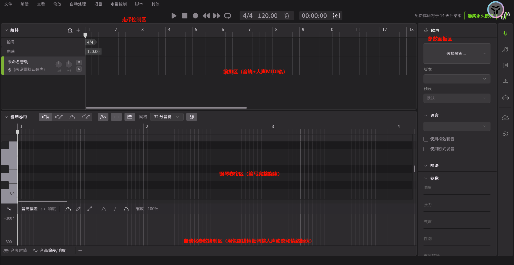

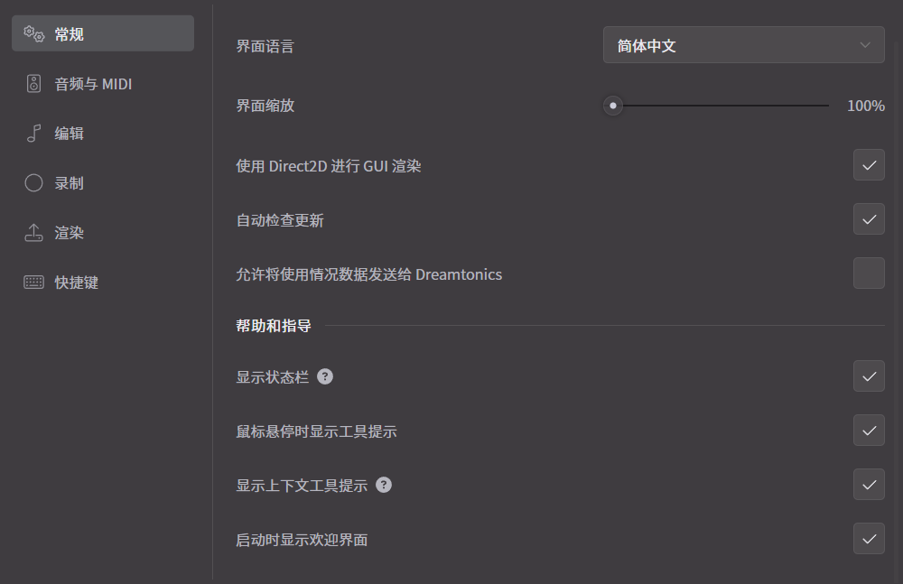

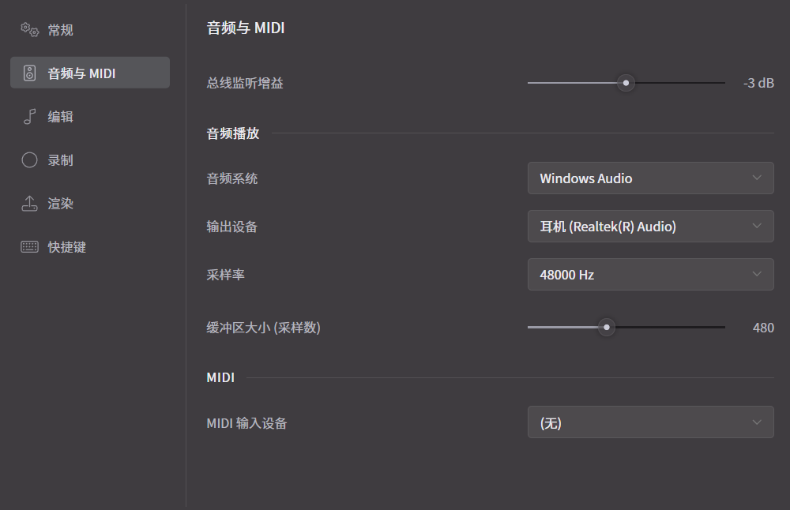

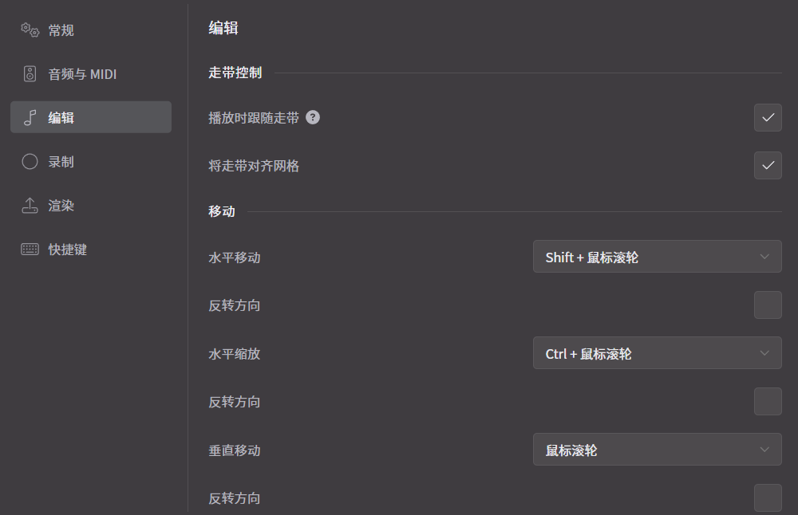

这里的总线监听增益只是编辑时的音量大小，保持在 `0 db` 到 `-6 dB` 即可，没有声卡就直接使用 `Windows Audio` 即可，缓冲区如果 `CPU` 好就调小（播放时出现爆音就需要调大）。

## 3.快速体验

### 3.1.准备音频

如果是伴奏音频 `.wav` 或人声音频 `.midi` 直接拖拽进去就可以了，导入进去可以发现开头的图标是不一样的，可以标识哪一个是伴奏，哪一个是人声。双击可以修改轨道名称，单击音频轨道文件名可以替换音频文件，单击歌声数据库则可以替换人声。可以先在 `7` 天之内免费领取并且安装一些大家耳熟的人声库，这里我选择重音 `TETO` 的音库来作为本次学习的声库。

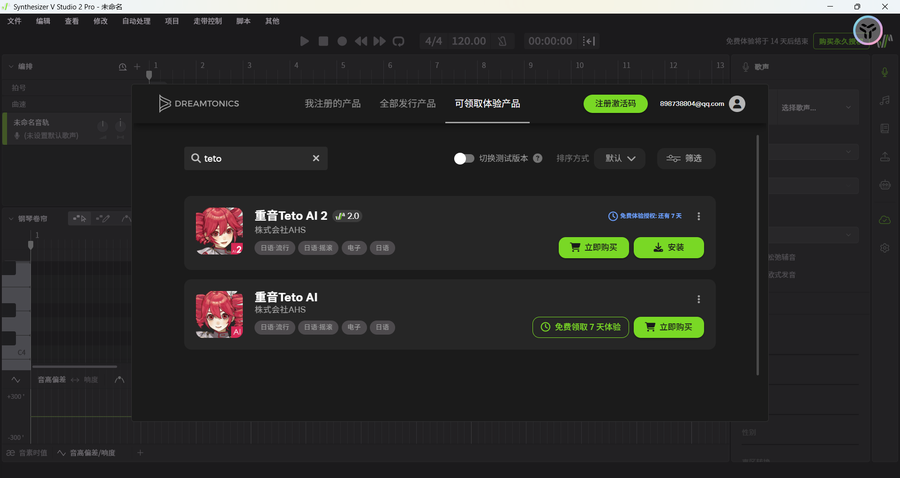

而这里音频轨道的左侧旋钮可以控制音频大小，右侧旋钮可以控制声相左右道平衡，两个旋钮都可以 `[alt]` 点击后回复默认值。而 `M` 是静音，`S` 是独奏。

那么应该选什么作为我们的伴奏呢？我们先不考虑 `MIDI` 轨道，先找一个好的伴奏先吧！这里我找的是 `私、アイドル宣言伴奏.wav`。

对齐节拍，差不多就可以了，新手无所谓了。然后记得是可以选择循环播放的。

接下来就是编写音符了，点击或按着 `[ctrl]` 用画笔工具自由绘画。

选中音符然后 `[ctrl+上/下]` 既可进行八度移位。

### 3.2.编写音符

除了手搓音符还有使用 `MIDI` 导入的方法，可以把哼唱的 `DEMO` 直接转化为音符，可以找人帮忙唱一下。

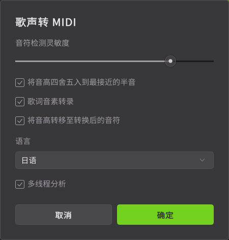

这里可以同时把音符和歌词一起导入，会在音频轨道上出现 `MIDI` 文件，非常厉害（但是没有选择声库是听不了的）。

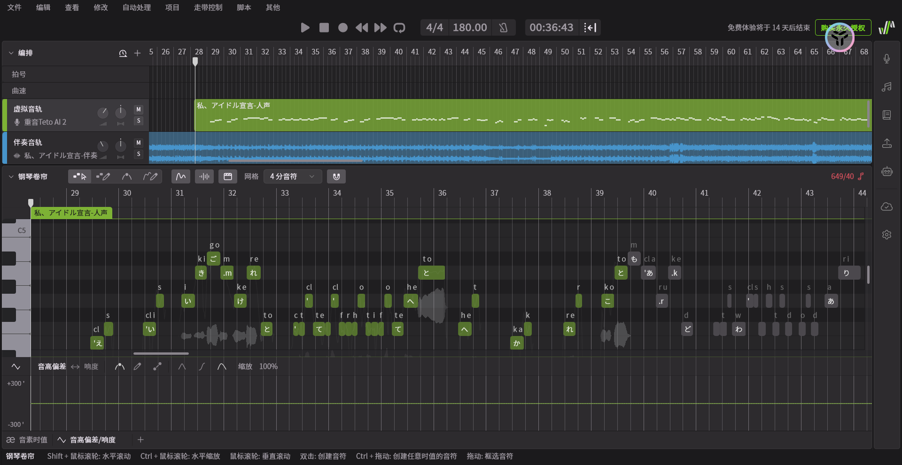

这样可玩法就很多了，可以自填歌词整活、修改虚拟歌姬、多语言种合唱...总之玩法就非常多了。不过呢，目前我还是白嫖阶段，音符只能写 `40` 个就无法继续继续播放 `TETO` 的人声了，并且软件也还没有买无法做到导出，不过先这样

### 3.3.优化歌曲

#### 3.3.1.歌词编辑

首先查看歌曲歌词，是否有识别错歌词的情况，修改字符即可。如果需要自己填充大量的歌词，可以再音符上右键选 `填入歌词` 并且勾选 `按字符隔开` 软件就会按照字符隔开自动依次分配到后续的音符中。

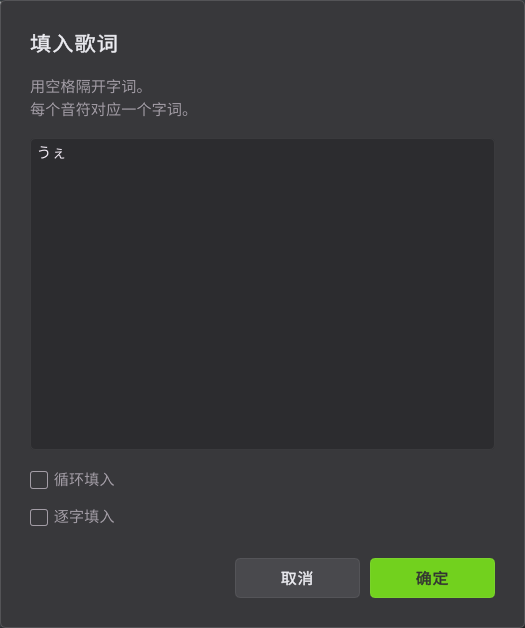

#### 3.3.2.转音问题

如果遇到同一个文字的转音会识别错误，有些时候需要手动进行修正，需要使用 `-` 来进行连接，这样的转音更加自然。

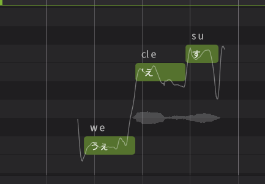

#### 3.3.3.切换语言

有些时候歌曲会有不同语种，而这款软件支持 `6` 种语言，而且切换起来非常方便，不过我的这首暂时没有，所以简单展示切换的界面就可以。

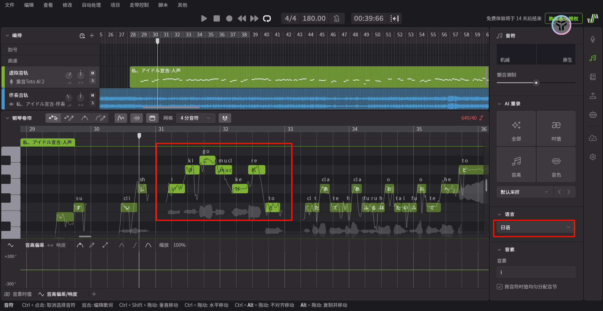

#### 3.3.4.音高修复

首先人耳对音高是有感知宽容度的，音乐中以音分为最小单位，一个半音等于 `100` 音分，只要起伏控制在几十音分内，人耳并不会觉得跑调，反而会显得自然，因此不能强行拉直。

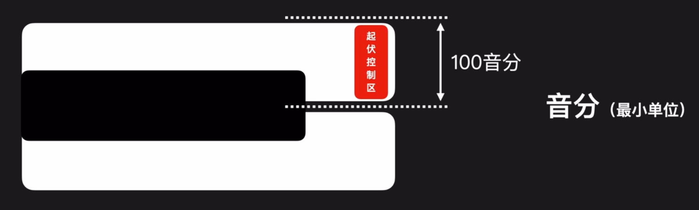

该怎么修正呢？需要用到两个工具。

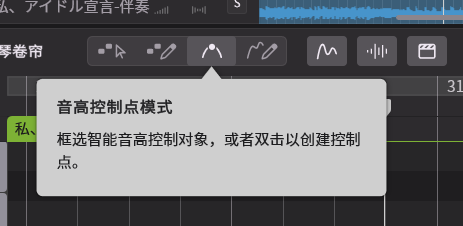

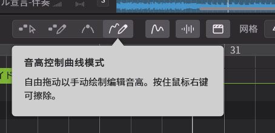

第一个工具选中后可以双击曲线生成控制点然后拖拽进行修正，也可以直接框选一段曲线然后进行移动，也可以删除控制点。第二个工具更加离谱，直接手动画音高曲线。

那么什么情况下才需要修正音高曲线呢？一般情况下：

- 长音起伏更大，短音更加平直（原理是短音没有那么多气息不会抖动气息）
- 其次就是尾音起伏会更大，衔接音会更加平直
- 落差高的音起伏大，落差低的音更平直
- 高音点位更平直，低音点位起伏大

如果把握不住可以使用 `AI 重录` 功能，非常强大。

### 3.4.细致调教

#### 3.4.1.呼吸设计

#### 3.4.2.唱法设计

#### 3.4.3.音色设计

#### 3.4.4.包络设计

#### 3.4.5.情绪设计

#### 3.4.6.音素设计

### 3.5.导出工程

## 4.深入研究

待补充...

> [!IMPORTANT]
>
> 资料引用...