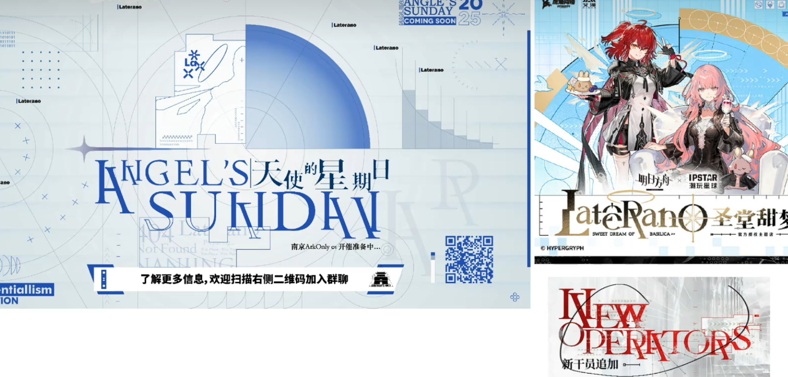
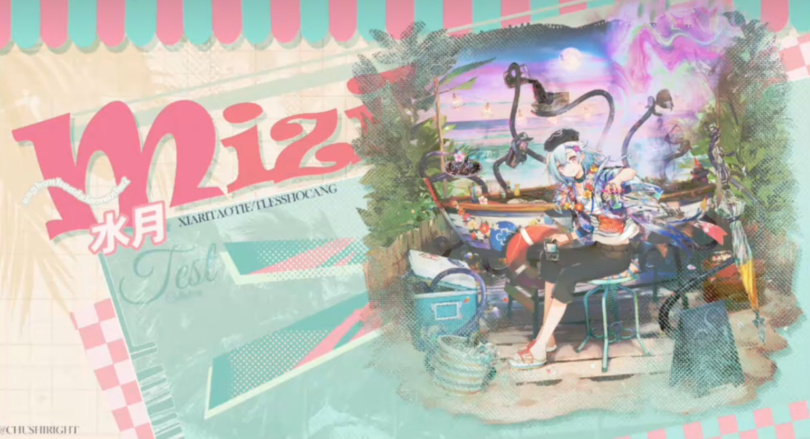

# 平排经验

## 1.关于方舟预宣图的一些碎碎念

预宣图这个东西就会出现一个问题，就是设计很可能拿不到很多的素材（比如很细节的素材、比如一些未透露或决定的信息），这就很考验设计风格了。

- 直观元素：这张图中有大量圆弧的存在，还有一些特殊字符编排，以及测量刻度数据，这是瞄准镜的刻度线、还有一点透明的方格背景
- 微小排版：左侧图其实是有很多空白的，原图在做对称设计，但是空白却在不做对应的设计，这样其实是有点问题的，因为这张图是有一点对称设计，左侧明显会被右侧信息量大一些
- 重心趋势：当实心物体和空心物体摆放在一起的时候，实际上空心物体在视觉感官上是会朝着实心物体跑的，而重心也会跟着跑，因此这里的二维码和上面的实心文字 + 空心星星整体是错位的，对齐不上，对齐不是呆板的东西，是考虑到重度问题
- 信息重度：而且一般来说有颜色元素的会比没颜色元素要更重，因为信息密度重度更大，其实上面的重心也是这个原理，因此有时候就需要给某些缺少重度的元素提高复杂度，或者调整元素位置，避免重弱太明显，尤其是在对称场景的时候
- 字间距离：这里的字体间的字间距太宽了，做字也要注重可读性
- 字母首行：一般来说在英文书籍的编排中，有一种很常见的手法就是开头字母大写，但是这种手法有些时候是需要字足够多才能凸显出来的
- 透明程度：线条的透明度降下来可以缓解画面拥挤的问题
- 引导问题：这里的文字引导很不合理，观众其实第一眼不知道二维码要做什么，第一眼看见了二维码却不知道做什么，看到文字才知道，应该做成一体才正确

## 2.关于火山旅梦的一些碎碎念

