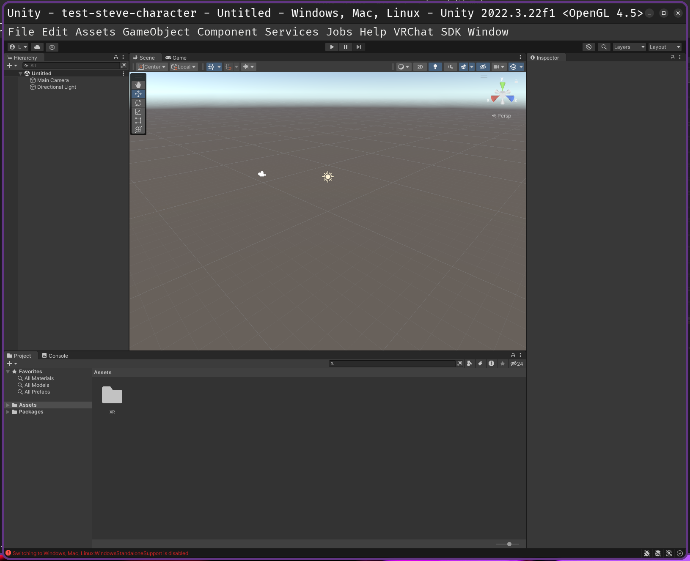
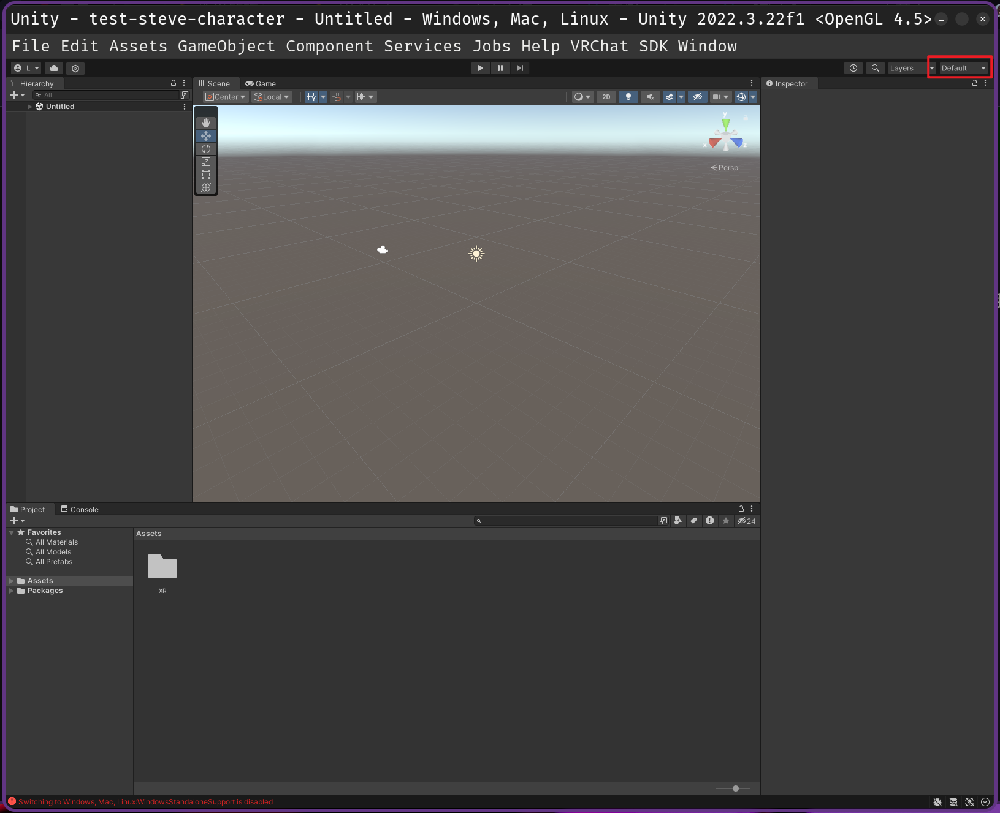
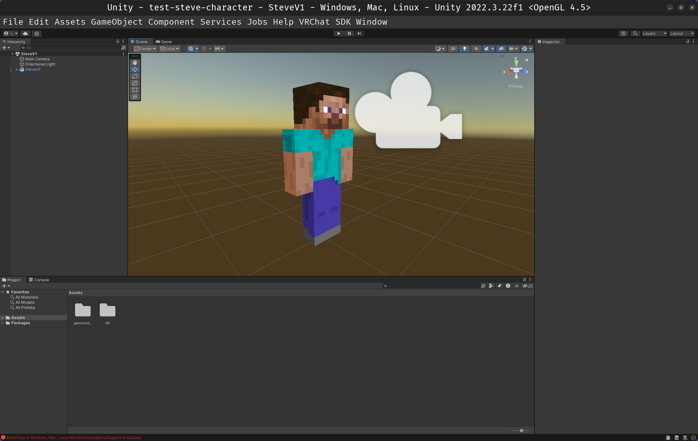
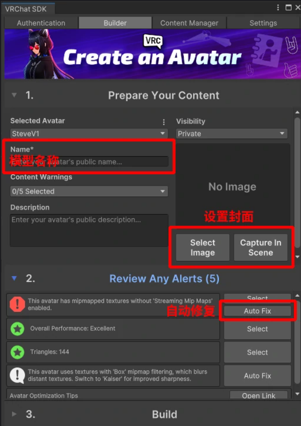

# 虚拟现实

## 1.环境安装

除了 `Blender`，我们还需要做一些新的软件安装。


> [!IMPORTANT]
>
> 补充：本教程操作系统是 `Ubuntu`，不过教程适应 `Windows`。

安装流程待补充...

如果没有自动识别到 `UnityHub` 和安装好的 `Unity` 编辑器，则可以手动在 `ALCOM` 软件进行指定。


## 2.基础工具

我们来理解一下为什么需要上述的软件工具，虽然我们已经有了 `Blender` 的基础，但是我们最好还是先尝试使用别人的模型之后再来尝试做自己的模型，也就是说：在学会 `VRchat` 建模之前我们需要学会 `VRchat` 改模。而本教程是基于以下内容以及一些部分自己的理解进行编写的：

- [视频教程](https://www.bilibili.com/video/BV1MfYez2E2J/)
- [图文教程](https://vrclearn.gamemode1.com/docs/start/starter-why-unity.html)

首先我们需要一些安装环境的配置，`Blender` 我们之前已经安装过了，还需要安装 `UnityHub` 来进一步安装 `Unity` 编辑器，还需要安装一个 `ALCOM`（用来替代 `VRCaht` 官方的 `VCC` 工具）。并且，您还需要拥有一个能够上传到 `VRChat` 上的一个帐号。

首先我们需要理解一下上述软件的工作流程：

1. 建模手需要使用 `Blender` 进行建模来获取 `.blender` 文件以及 `.fbx` 文件等资源文件，或者在公开渠道及各种商店中购买模型直接获取 `.unitypackage` 压缩包（内含前面的文件）
2. 然后我们安装好 `UnityHub` 后，可以使用这个工具来下载并且管理多个版本的 `Unity` 工具，同时获取最为重要的许可证（免费）
3. 然后我们需要在本地安装好 `ALCOM` 软件，这款软件的作用和 `VRChat` 的官方软件 `VCC` 的作用是一样的，这款软件的主要作用就是可以快速下载 `VRChat` 项目所需要的依赖，以及自动识别 `Unity` 编辑器的地址快速建立一个符合 `VRChat` 规范的 `VRChat` 项目

## 3.快速体验

### 3.1.获取模型包

我们先来简单获取一些公开的模型包（这里获取的是我的世界史蒂夫的模型），一个标准的模型包应该是下面这样的。


### 3.2.创建新项目

然后我们需要创建新的项目。


> [!WARNING]
>
> 注意：这里的报错是正常的，可以不用理会。这个错误只是表明从 `VRChat` 官方包仓库下载依赖包超时失败，但是 `ALCOM` 会自己处理。
>
> 

> [!WARNING]
>
> 注意：一般情况下 `ALCOM` 新建项目时会自动给你安装以下两个模块并高亮显示名称，
> 若没有则需要点击软件包右边的 `+` 手动安装一下。
>
> - `VRChat SDK - Avatars`
> - `VRChat SDK - Base`


点击右上角的 `打开 UNITY` 就可以自动识别 `Unity` 编辑器来打开新项目了。

> [!CAUTION]
>
> 警告：请耐心等待 `Unity` 加载完毕，当 `Unity` 弹出界面时，先不要着急操作，为了避免出现未响应等错误，等待界面右下角的加载图标变为 `√` 后，再开始进行操作。



然后界面布局稍微改一下。



在 `Unity` 菜单栏上依次选择 `Assets - Import Package - Custom Package...` 来导入我们的压缩包。


在 `Unity` 弹出的 `Import Unity Package` 窗口中，点击 `All` 确保选中全部的文件（默认全部选中），最后点击 `Import`。导入完后，在正下方的窗口中会多出一个 `gamemode1` 文件夹。


> [!IMPORTANT]
>
> 补充：这里保留一份目录解构，预防后续需要进行一些深入的研究。
>
> ```bash
> ├── Assets
> ├── Library
> ├── Logs
> ├── Materials
> ├── Packages
> ├── ProjectSettings
> ├── Temp
> ├── test-steve-character.sln
> ├── UniTask.Addressables.csproj
> ├── UniTask.csproj
> ├── UniTask.DOTween.csproj
> ├── UniTask.Editor.csproj
> ├── UniTask.Linq.csproj
> ├── UniTask.TextMeshPro.csproj
> ├── UserSettings
> ├── VRC.ExampleCentral.Editor.csproj
> ├── VRC.SDK3A.csproj
> ├── VRC.SDK3A.Editor.csproj
> ├── VRC.SDKBase.csproj
> ├── VRC.SDKBase.Editor.BuildPipeline.csproj
> ├── VRC.SDKBase.Editor.csproj
> └── VRC.SDKBase.Editor.ShaderStripping.csproj
> 
> ```

### 3.3.一些基础认识

在继续学习之前，需要先了解 `Unity` 编辑器的不同窗口，认识不同的窗口对后续的学习有很大的帮助。


在游戏开发中，游戏对象（在 `Unity` 中称为 `GameObject`）是游戏里所有 **可见** 和 **不可见** 元素的统称。无论是玩家角色，角色身上的装备，还是地图中的道具，音效，背后的逻辑代码等，都可以称为一个游戏对象。简单来说，游戏对象就是游戏中每一个独立的 `东西`。这有些类似一些编程语言的对象概念，但是在这个领域中有所区分。

- `Scene` 窗口：用于直观的观察和编辑场景中的对象。`Scene` 窗口有多种操作方式来改变视角，这里只讲两种最简单的

  - 在 `Scene` 窗口中按住 `鼠标右键`，使用 `WASD` 移动视角

  - 在 `Hierarchy` 中双击你想观察的对象可以直接把视角拉到该物体旁边，但有时会因为错误的模型中心点导致视角非常远，所以首选第一种方式

  - 最右上角的 `Gizmos` 开关，用于控制显示 `Scene` 中的各种辅助图标，辅助线

    

- `Hierarchy` 窗口：用于管理 `Scene` 窗口中的所有对象，因此这两个窗口本质上相互关联。

- `Project` 窗口：类似电脑中的文件管理器，用于文件管理，向场景中添加对象。其左侧可用于快速选择文件的路径（类似电脑文件管理器上方的路径栏）。其中不同的文件夹一般有不同的作用

  - `Assets`：这是你的资源文件夹，可以把所有需要的资源（比如图片，音频，模型等）都放在这里

  - `Packages`：包/库文件夹，用于存放官方（包括第三方）提供的 `Unity` 工具和插件，
    此文件夹由 `Unity` 自动管理，一般不会用到


> [!IMPORTANT]
>
> 补充：一些常见的软件图标也需要您稍微了解一下
>
> - 文件夹图标（Folder）
> - 预制件图标（Prefab）
> - 模型文件图标（Model）
> - 材质球图标（Material）
> - 场景图标（Scene）![场景](data:image/webp;base64,UklGRjgEAABXRUJQVlA4ICwEAADwFQCdASo2AEAAAMASJaQAToXwx8Tnkn2T3Ra/j/J/jZ+Xeok/uX5K/jtnPv0n/Kfl5wEv5Ae6J/o/yV5gaMv/F/kZ793+x5R/yT++/7v/GfAF/If5//sP7r/ffex9iv7Aexd+xSDbkxnD9elzUQAQKmANONSWN0I6TFqeoBso9jSXnHvCEH/4PQ8jQlQBetm165m2nxyukUUHpEZqks8QfQWndQ1cTo+d2+QEJrL57VZSWUTYfr4AAP7/SGLgnxi18IrxYKoDNaGHkkIs3Xr41kI2Qvj7rRxm9s+ihxe9QcmKq/B96+r91PqYxoQsd9mZ/DP4MV11XVAjBeA+TEwD8IoTqR/R/YcPr8NPHZ6b+AlnmrXaaje7M6gE/n2zCc0t71DnewW67BGK/rantPXOOsL1YX/rfCK+9n2dNq3wgDmhX/Tec2ly9t16R2S1Q8f/v9BEW7nJpLtb4vonn+srybqrEQ6HFo2qDy5D6lM/5xtxXEq6jU0gSgir1CKpEhLMvH01owelDRg61V13SbomQoDzwJ6ObH/QvcQWVVeD6ssMM9K0ytlqLXd/nhqvI9HGtIlfzRWGN4CryJqBl1vSeShVhpwrTBHpoNKqaGsPfDjp7K8qcH7AvERUuvrkkg7raZNh3tNDN4Qcwu3sCbMCvbCUwxEQneEn8v9IhUzxDldLJ3U/iG0K9xdeaHnyoV6UkhWvN5L8XDbbqowixnFmvbPm8hvzTq0tf4Iw9YH/rmeUr7ExvGgLHBytfMdfMxwka1HMOSVCih+/0IMRyZujN8kU6Daf8+S9cnR3can6uk/trCq6Ze/lBT/YH3R7Z//DJ0nXDaxFt3N5eQqoMnXoV7XNkKJ5a4wf5EN/N0DS4BIu2MUX1C/Ye0rQjIv1pIxUFrOffzetJ80pwymAohKx8Sl21IOT3GpM9jv7KZsTwufrRZNJ51GVUAOrpl+4t6kwykhpr7zPproeFZ5+BZMB/aF1fRMhC/GqtOPkP3c9oowDVdvBWItwnf8NUS/D4pNDLUrFwOa9RKmkQRmv57xVXDYZyKJkBbWm/4lfY3yPon76UnZeVqBzQJ1ov/z15t7TbvA5ZWMuQ+P/4n+RV5FTakIucaulIQB4soXFOvRuO2UOK1FRUYHtP86eHSJPvue2tCI+270gRmoNNAlgz0dSKxhPByyoIB20rczvzyoixjqA5ZY38S0cDqYkw+uKmWDYq/jTn0LkbKmIv23ShT77rXZdMLrTl4iLRaen24gsskO6wzfvcrr8Op0KSDuzf/5O6pEnZbwaAbFF3mE8hbzwO7pH9PqXrEuMYpX9z/LzVnzGWP9/3dkzrVR8gvGG37A+GX6yJVCffv/8gdwcuaHO7+heE4Hu6ipm+/Ul5Uy35AN8cQd56Ndpd4zUrYuEYOADkaIlf5MgrdaFgAA=)

### 3.4.两个场景

其中导入 `unitypackage` 后，会看到两个 `场景` 文件：

- `SteveV1`：经典版硬邦邦史蒂夫，走路时四肢直直的
- `SteveV2`：有动作模组的史蒂夫，各个关节可以弯曲

### 3.5.安装着色器


进入场景后会看见一个紫色的方块人，这是缺少必要的 `着色器` 导致模型渲染失败。如果你玩过 `Minecraft`，这就类似于材质包错误时显示黑紫色的方块。在这个项目中，我们的模型使用 `liltoon` 着色器，现在我们来学习如何安装。

> [!IMPORTANT]
>
> 补充：
>
> - 着色器：着色器是一种给物体“上色”的配方。它告诉电脑如何给物体表面涂上颜色、添加光影效果等。
> - Gizmos：如果觉得场景内的图标遮挡了视野，可以关闭 `Gizmos` 开关，或者关闭下拉列表里的 `3D Icons` 使其显示为更小的图标。

打开 `ALCOM`，[从主站前往 VRChat SDK 镜像站](https://start.gamemode1.com/)，搜索并在 `ALCOM` 中添加 `liltoon` 的 `镜像仓库地址`。然后回到 `项目` 列表，进入 `项目` 的 `管理` 界面，在列表中找到 `liltoon` 并添加。


然后重新打开项目就可以看见了（或者原地等待一分钟不重新启动也是可以的）。



如果您觉得背景的天空碍事，按图片所示位置关闭 `Skybox` 层级。

### 3.6.更换贴图

下载任意的 `png` 图片来进行更换皮肤，并且将您的皮肤文件拖入到 `#Skin` 文件夹中。


然后选中 `SteveV1` 子级里的 `Body`，将您的皮肤图片文件拖入到 `主色/透明度` 的小图标上。


如果您的图片是有透明的地方，则需要先点击您的图片，然后打开一个叫 `Alpha Is Transparency` 的选项，激活图片的透明通道（不过我这张图片没有透明的部分所以看不出来效果）。


然后将 `Warp Mod` 修改为 `Clamp`，将 `Filter Mod` 修改为 `Point (no filter)`。

- `Warp Mod 【Clamp】`：拉伸贴图（纹理）的边缘
- `Filter Mod Point 【no filter】`：贴图（纹理）变为块状

将 `Max Size` 修改为 `512`，将 `Compression` 修改为 `None`

- `Max Size 【512】`：限制贴图（纹理）最大尺寸为 `512`
- `Compression 【None】`：不压缩贴图（纹理）

然后点击应用。


### 3.7.上传角色

开启加速器，这个没办法。然后从 `Unity` 菜单中选择 `VRChat SDK`，打开 `Show Control Panel`，并登录自己的账号。


若满足上传条件，`Avatar Creator Status` 这一栏会显示 `Allowed to publish avatars`。进入 `Builder` 界面，填写模型名称，设置封面，自动修复报错其他的非八边形红色报错不用管。



- `Select Image`：选择一张图片，只支持 `PNG` 格式
- `Capture In Scene`：从场景中截取一张图片作为封面

最后点击 `Build & Publish` 上传，一般会上传成功，但是如果不行就可能需要阅读 [报错报告](https://vrclearn.gamemode1.com/docs/avatarsdk/summary-of-network-issues)。

### 3.8.添加装饰物

等到上传成功后使用 https://vrclearn.gamemode1.com/docs/avatarsdk/diamond-sword.html 就可以。

## 4.深入研究


## 5.插件推荐

## 6.开发能力

待补充...

