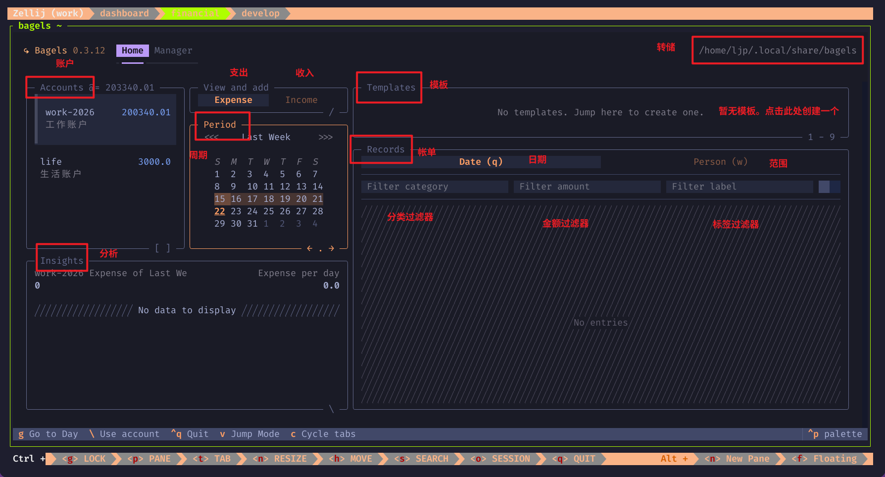
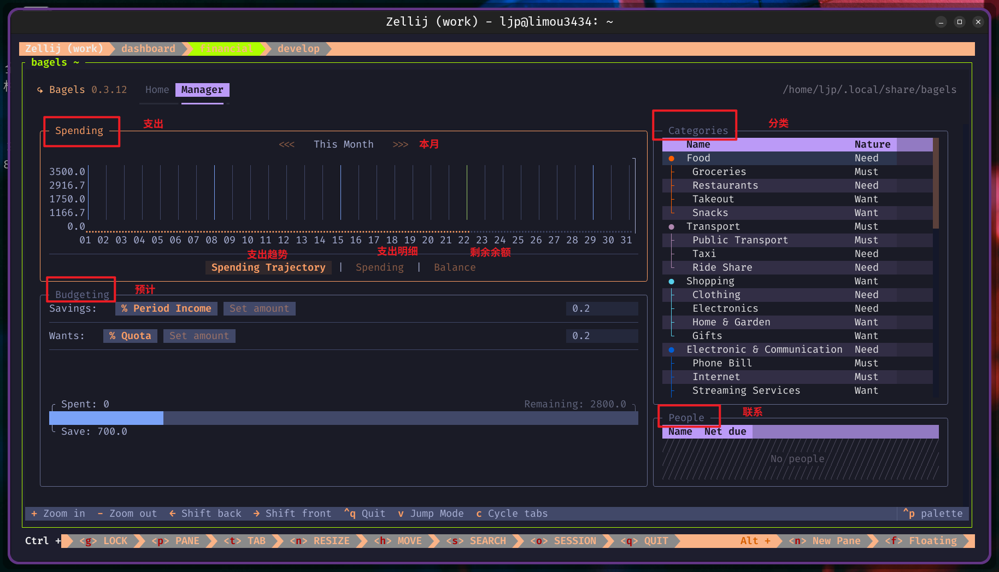
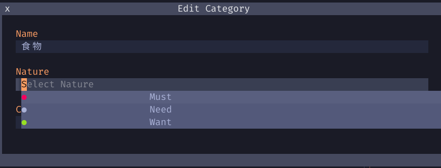

# bagels 财务软件

bagels locate database 可以现实存储数据的地址

首先您需要创建账户，然后重新编写符合自己需求的分类和标签。

- **Must = 必花的钱（生存）**
- **Need = 想花的钱（质量）**
- **Want = 想花的钱（提升）**

这里根据这里的内容 https://github.com/EnhancedJax/Bagels/issues/53 可以得知这个选择操作是使用 tab 键进行选择的。

###### 
