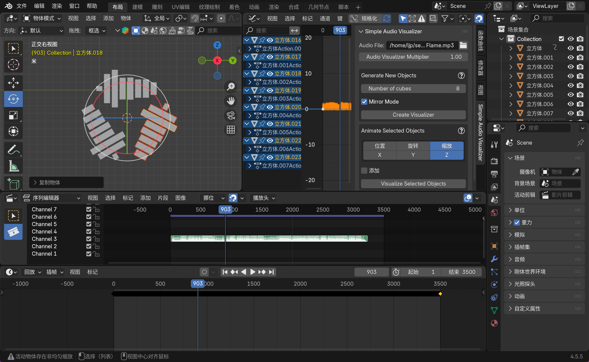
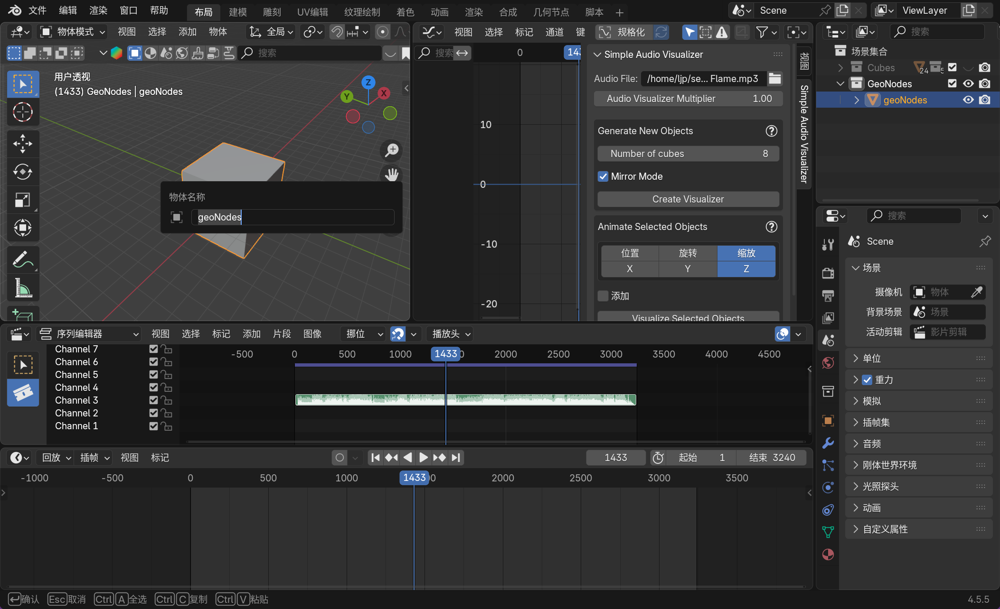
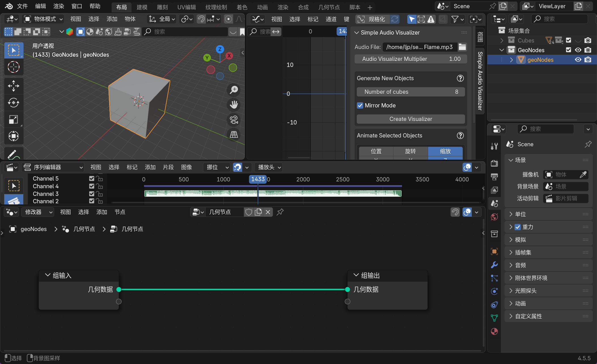
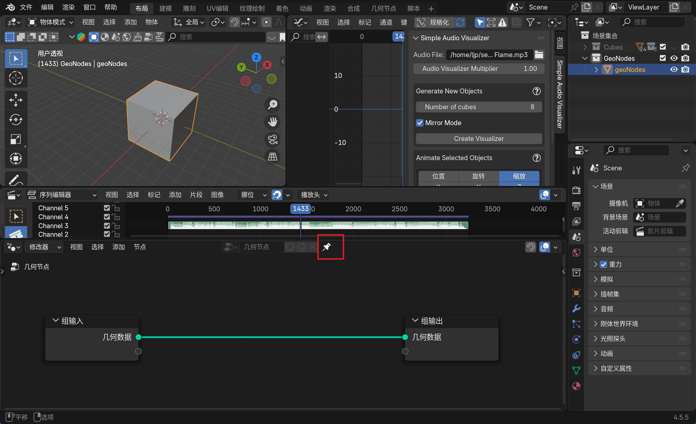
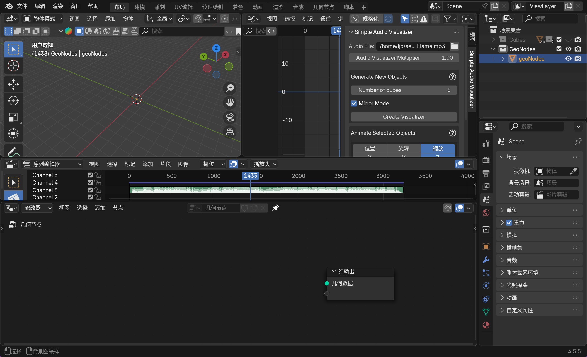
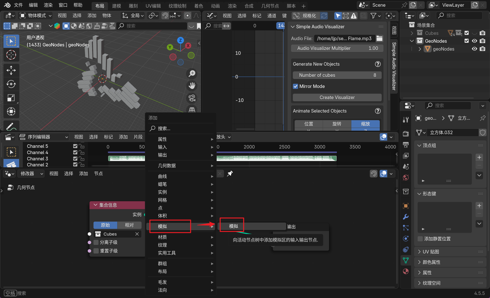
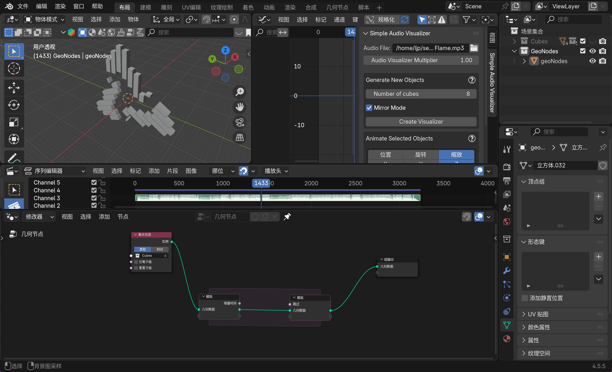
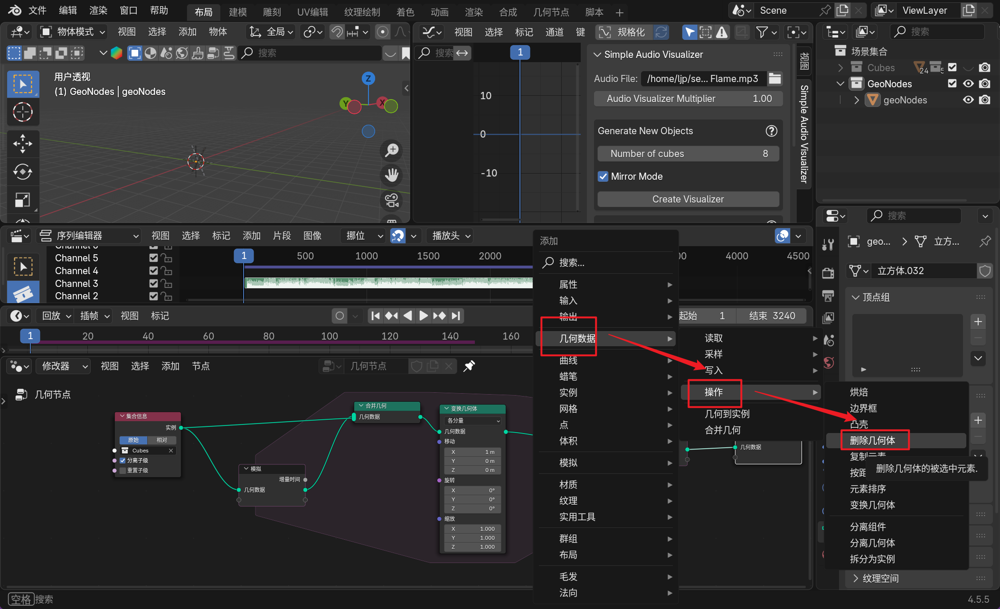
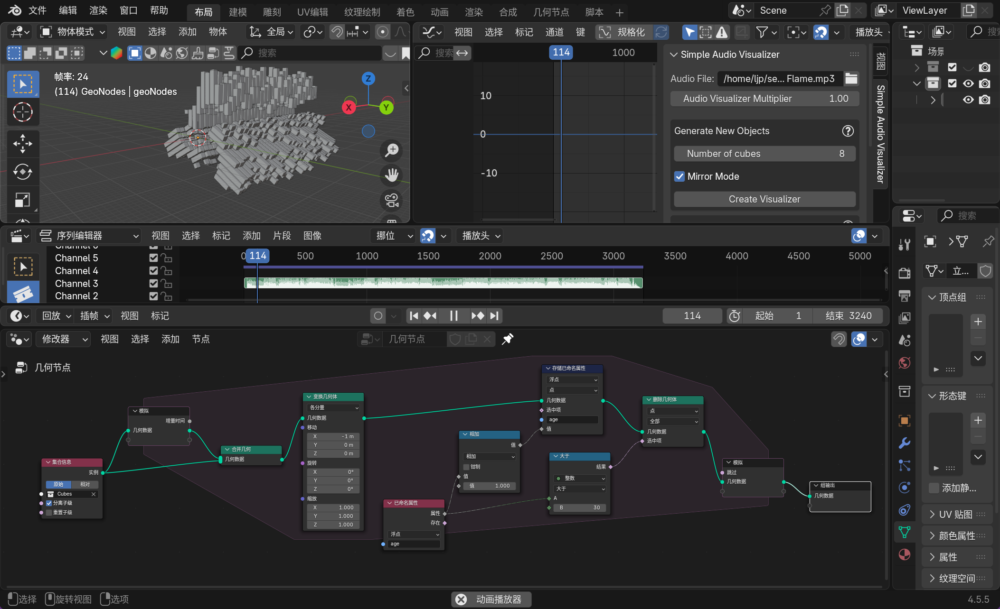

## 1.插件介绍

默认会根据导入音频来给出跳动的可视化表。不过也可以使用 `Visualize Selected Objects, 可视化已选中的对象` 按钮把可视化应用在某些物体上，甚至作用在多个不同物体上时，物体会有不同的律动（如果勾选“添加”选项则会以辐射的方式追加可视化）。

## 2.建模过程

我们对需要可视化的音频做旋转复制，不过最快的方法应该是使用阵列修改器。

然后创建一个空集合，并且和原本的集合分别进行命名（快捷键 `[1]` 或 `[2]` 可以快速切换两个集合）。

然后我们使用 `[2]` 切换到空集合中创建一个网格对象。

## 3.动画过程

切换新编辑器得到几何节点编辑器，新建后启用固钉。

> [!IMPORTANT]
>
> 补充：启用固定功能后，会锁定当前选中的几何节点编组，而非跟随活动修改器变化。当你编辑完某个物体的几何节点组后，即便后续选中其他物体，或是切换到其他修改器，几何节点编辑器里始终显示的还是之前固定的那个节点组。比如给场景中的桌椅分别做了几何节点形变效果，固定桌椅的节点组后，编辑椅子模型时，也能随时查看桌子的节点组结构进行参考修改。

这里的几何节点编辑器的输入代表的就是我们引入的立方体，我们其实不需要这个立方体，可以直接删除这个组输入。

然后我们可以把我们需要的集合拖拽进几何节点编辑器中形成新的组输入。

然后什么需要利用几何节点编辑器来做到一个不断生成可视化立方体集合的动画，我们需要添加一个模拟节点。

做一些连线和参数操作。

添加合并几何节点。

这样效果就制作好了，然后我们需要每一帧都向前移动。

然后我们不需要渲染那么多立方体滞留在空间中。

然后我们需要记录需要删除的集合体的年龄。

我们需要添加一个读取属性的节点。

添加一个增加节点。

还需要添加一个比较节点。

完成的截图。

再加上一些变化，但是直接控制参数是有些麻烦的，我们不如加一点空对象。

拖拽。

这就几乎是创建了一个父节点（注意空对象注意应用变换），可以利用空对象来调整可视化。

然后可以添加一些关键帧做些动画（这里就不加了）。

可以添加一些场景。

参考教程 https://www.bilibili.com/video/BV1drubzJEoL/?spm_id_from=333.788.top_right_bar_window_custom_collection.content.click&vd_source=c92c89dbfcf9cc30c48086469621f35b。

