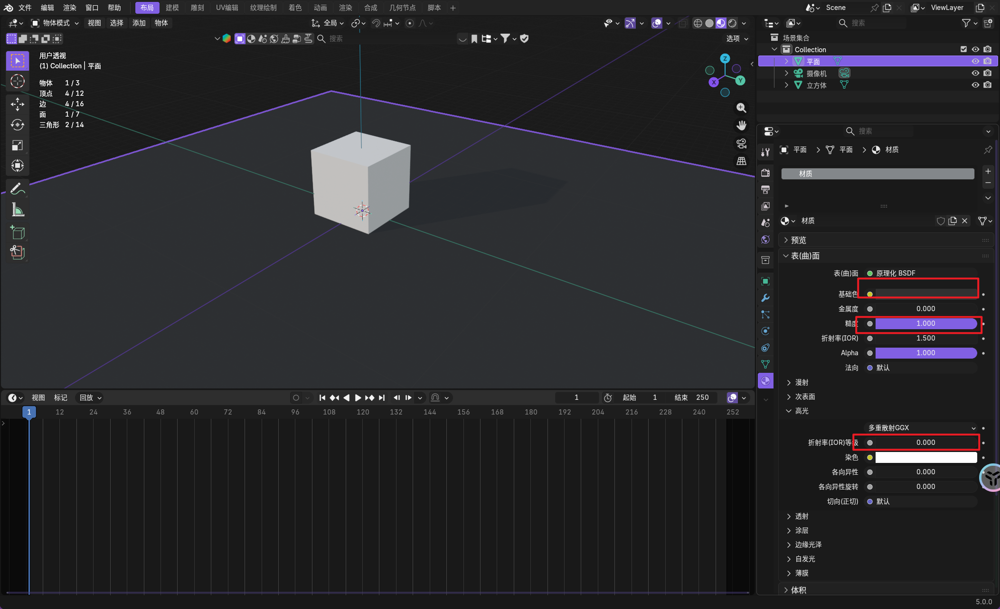
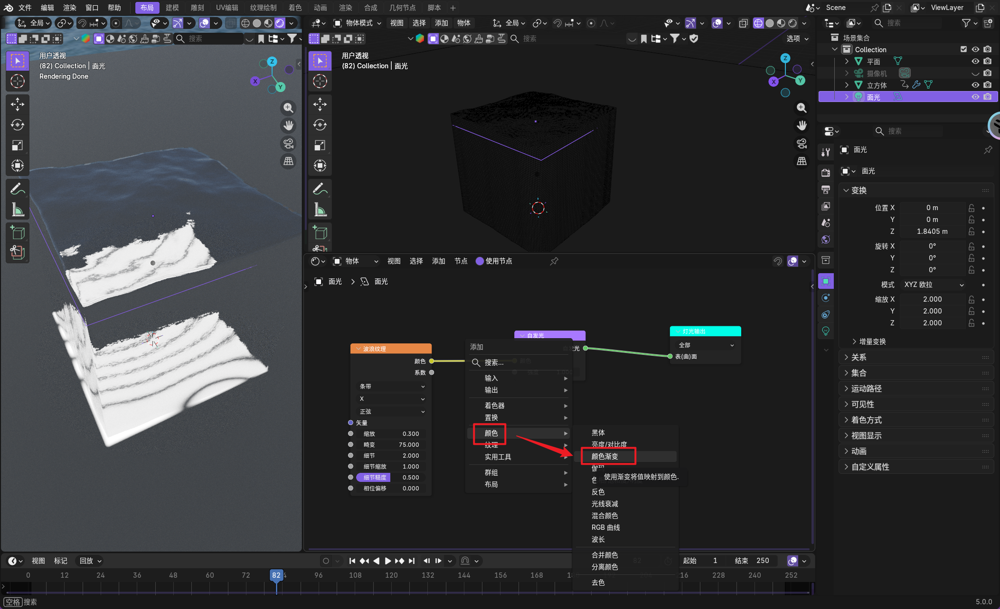
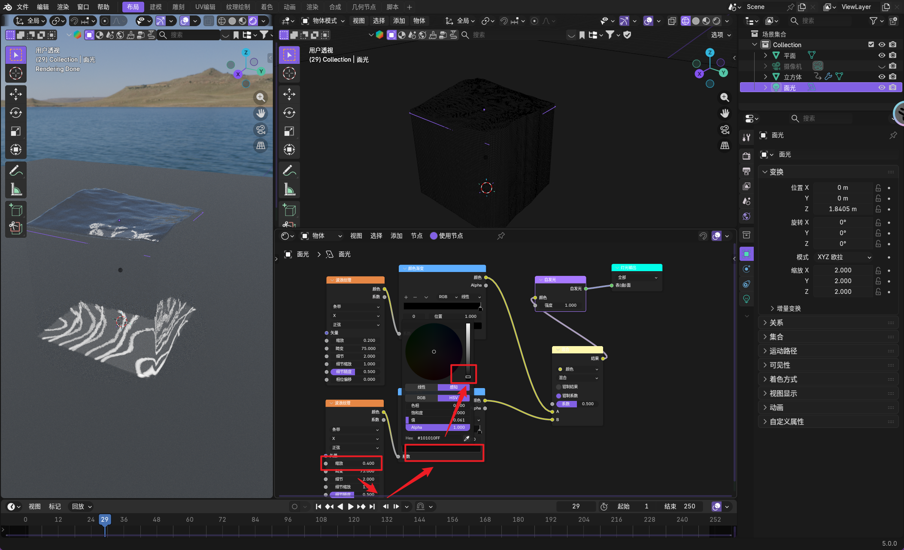
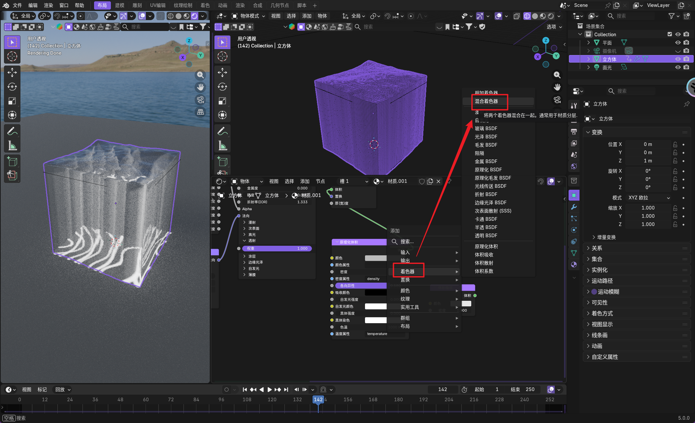
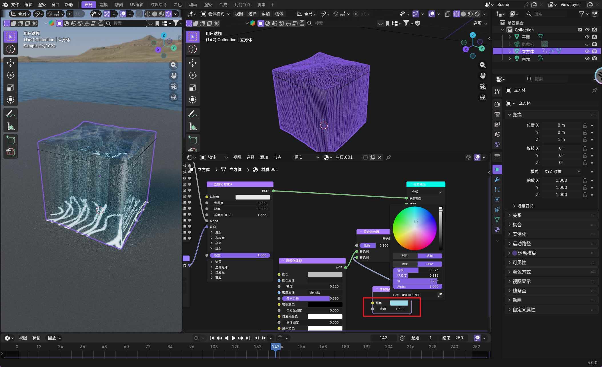

多次细分。

增加动画化。

然后需要正确穿过光线。

对水进行位移。

增加细节。

添加焦散。

https://www.bilibili.com/video/BV1CYxqeKEyB/?spm_id_from=333.1007.top_right_bar_window_history.content.click&vd_source=c92c89dbfcf9cc30c48086469621f35b
