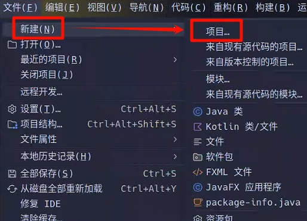
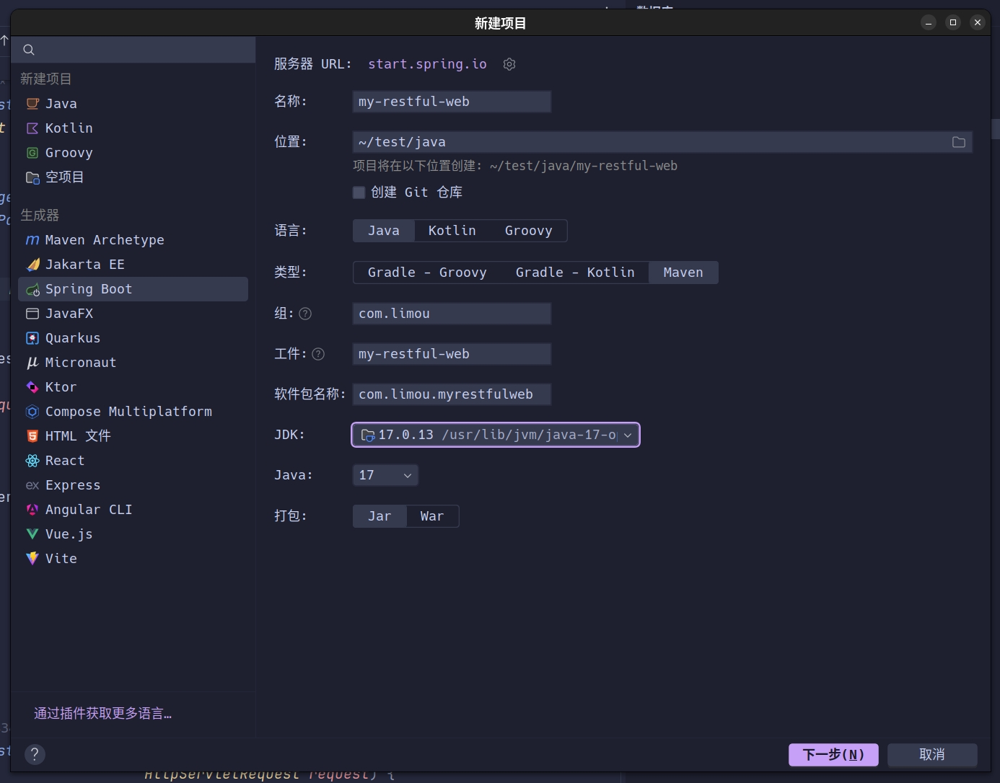
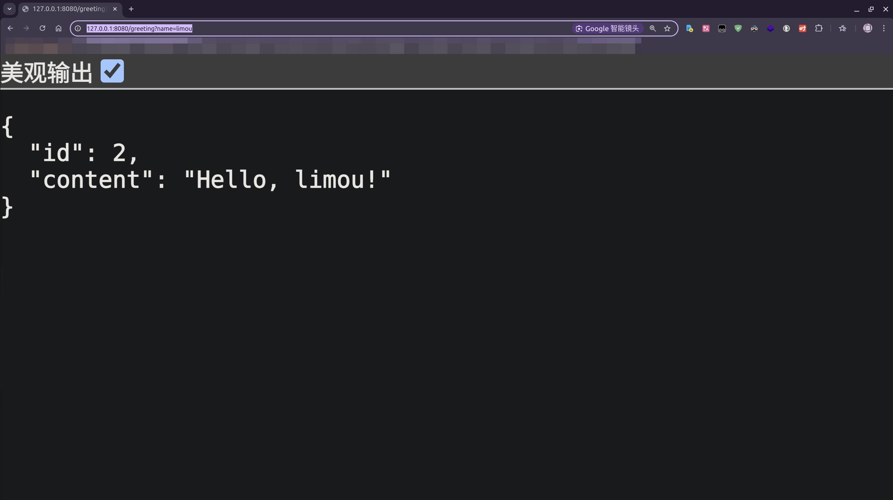

<!-- @include: basic.md#statement -->

---

# Spring Boot 基础知识

根据常见的服务器开发，这里给出一份关于 `Spring Boot` 的总文档，旨在让您只看一遍就知道如何编写一个完整的 `Web` 服务器。

下面是您可能需要的资料：
- [Spring Boot 项目概览](https://spring.io/projects/spring-boot#overview)
- [Spring Boot 参考文档](https://docs.spring.io/spring-boot/index.html)
- [Spring Boot 接口文档](https://docs.spring.io/spring-boot/api/java/index.html)
- [构建 RESTful Web 服务](https://spring.io/guides/gs/rest-service) 和 [使用 RESTful Web 服务](https://spring.io/guides/gs/consuming-rest) 

## 1.RESTful Web 服务

这里将先根据 [构建 RESTful Web 服务](https://spring.io/guides/gs/rest-service) 和 [使用 RESTful Web 服务](https://spring.io/guides/gs/consuming-rest) 这两份官方文档、其他官方文档、我个人的见解来讲述如何完整编写 `RESTful Web` 规范的 `Web` 服务器。

### 1.1.编码目标

- 我们将实现一个 `Web` 服务器
- 构建常见的 `HTTP` 请求、
- 需要自定义返回的 `JSON` 格式

### 1.2.创建项目

这次我们不再使用 `Spring Initializr` 来创建 `Spring Boot` 项目了，而使用著名的 `IDEA` 编辑器来构建一个 `Spring Boot` 项目。






然后打开侧边的 `Maven` 执行和上一节一样的命令行操作，在生命周期中先点击 `clean` 再点击 `install`，最后打开启动文件，点击运行启动函数即可。


可以看到在终端中，`Spring boot` 成功被启动起来了。

### 1.3.简单使用

由于我们需要自定义返回的 `JSON` 字符串，因此需要使用一些 `Resource Representation` 来进行数据建模（就是下面定义的 `Greeting`）。

::: details 简单使用

::: tabs

@tab 项目结构

```shell
# 项目文件结构
$ tree my-restful-web
my-restful-web
├── HELP.md
├── mvnw
├── mvnw.cmd
├── pom.xml
├── src
│   ├── main
│   │   ├── java
│   │   │   └── com
│   │   │       └── limou
│   │   │            └── myrestfulweb
│   │   │                 ├── Greeting.java # 我们将要编写的 "资源表示类"
│   │   │                 ├── GreetingController.java # 我们将要编写的 "资源控制类"
│   │   │                 └── MyRestfulWebApplication.class # 不需要改动的 "启动文件"
│   │   └── resources
│   │       ├── application.properties
│   │       ├── static
│   │       └── templates
...

```

@tab 资源表示

``` java
// Greeting.java: 资源表示
package com.limou.myrestfulweb;

public record Greeting(long id, String content) {
/**
 * record 会自动为类的字段生成以下内容：
 *
 * 常用方法:
 * 构造函数
 * getter()
 * toString()
 * equals()
 * hashCode()
 *
 * 不可变性: record 中的字段是 final 的, 不能更改(在创建后即为只读), 没有提供 setter()
 */
}
```

@tab 资源控制

```java
// GreetingController.java: 资源控制
package com.limou.myrestfulweb;

import java.util.concurrent.atomic.AtomicLong;

import org.springframework.web.bind.annotation.GetMapping;
import org.springframework.web.bind.annotation.RequestParam;
import org.springframework.web.bind.annotation.RestController;

@RestController
/**
 * @RestController 表示这是一个资源控制类
 * 其中每个方法都返回域对象而不是视图, 它是包括 @Controller 和 @ResponseBody 的简写
 */
public class GreetingController {

    private static final String template = "Hello, %s!"; // 需要返回数据的模板
    private final AtomicLong counter = new AtomicLong(); // 用于生成线程安全计数器的对象, 常用于对资源的访问进行计数或生成唯一标识符(ID), 具有一个 incrementAndGet() 可以对计数器进行递增

    @GetMapping("/greeting")
    /**
     * @GetMapping 表示这是一个 Get 方法的映射接口
     * 
     * @RequestMapping(method = RequestMethod.GET) <=> @GetMapping
     * @RequestMapping(method = RequestMethod.POST) <=> @PostMapping
     * 
     * 简而言之 @RequestMapping 可以用于处理任何 HTTP 方法的请求，而 @GetMapping、@PostMapping 等是专门为常见 HTTP 方法提供的简化版本
     */
    public Greeting greeting(@RequestParam(value = "name", defaultValue = "World") String name) {
        /**
         * @RequestParam 表示做一个查询参数到函数参数的映射, 常用于 Get 方法中
         * 'value' 是表单中的键值名
         * '"name"' 是本函数的参数名
         * 剩下的 'defaultValue' 就是当查询参数中没有传递时使用的默认值
         */
        return new Greeting(counter.incrementAndGet(), String.format(template, name)); // 使用前面的资源表示类来进行数据返回(存放了一个不断递增的 ID 字段和一个 name 字段), 可以在浏览器上访问注意到: 这里返回的是一个对象, 严格来说只是一个引用, 但是在浏览器中自动被转化为 JSON 文档对象(自动序列化)
    }

}
```

@tab 启动文件

```java
// MyRestfulWebApplicationTests.java: 启动文件
// 注意无需进行任何改动!
package com.limou.myrestfulweb;

import org.springframework.boot.SpringApplication;
import org.springframework.boot.autoconfigure.SpringBootApplication;

/**
 * @SpringBootApplication 是一个便捷的注释，它添加了以下所有内容:
 * = @SpringBootConfiguration 标识这是一个 Spring Boot 应用程序的配置类
 * + @EnableAutoConfiguration 启用 Spring Boot 的自动配置机制, 根据依赖和类路径内容自动配置应用程序, 避免手动配置大量的 Spring 配置类
 * + @ComponentScan 启用组件扫描, 默认会扫描当前包及其子包中的所有类(如 @Controller, @Service, @Repository, @Component 等注解标记的类)
 */

@SpringBootApplication
public class MyRestfulWebApplication {
    public static void main(String[] args) {
        SpringApplication.run(MyRestfulWebApplication.class, args);
    }
}

```

:::

> [!IMPORTANT]
>
> 补充：`Jackson JSON` 库将 `Greeting` 类型的实例自动封送到 `JSON` 中。默认情况下，`Jackson` 由 `Web` 启动器包含。

> [!WARNING]
>
> 警告：在编码过程中请注意您的包名不一定和我一样...

还是像上一小节一样运行 `Spring Boot` 不过这次我们可以使用 `IDEA` 快速点击运行，然后使用浏览器访问 `http://127.0.0.1:8080/greeting`（或者使用类似 `http://127.0.0.1:8080/greeting?=limou` 的写法）。



### 1.4.高自定义

如果您对 `HTTP` 协议足够熟悉，您一定会像如何高自定义化网络报文的，因此下面给出了一个稍微现代化的写法供您参考，为节省一些说明，我把文件稍微精简了一些...

::: details 高自定义

::: tabs

@tab 项目结构

```shell
# 项目结构
$ tree my-restful-web
my-restful-web
├── HELP.md
├── mvnw
├── mvnw.cmd
├── pom.xml
├── src
│   ├── main
│   │   ├── html
│   │   │   └── test.html # 将要编写的 "前端页面"
│   │   ├── java
│   │   │   └── com
│   │   │       └── limou
│   │   │           └── myrestfulweb
│   │   │              ├── GreetingController.java # 将要编写的 "资源控制"
│   │   │              └── MyRestfulWebApplication.class # 不需要改动的 "启动文件"
│   │   └── resources
│   │       ├── application.properties # 将要编写的 "配置文件"
│   │       ├── static
│   │       └── templates
...

```

@tab 资源控制

```java
// GreetingController.java: 资源控制
package com.limou.myrestfulweb;

import com.fasterxml.jackson.annotation.JsonIgnoreProperties;
import org.springframework.boot.autoconfigure.ssl.SslProperties;
import org.springframework.http.HttpHeaders;
import org.springframework.http.ResponseEntity;
import org.springframework.web.bind.annotation.*;

import java.io.File;
import java.io.IOException;
import java.nio.charset.StandardCharsets;
import java.nio.file.Files;
import java.nio.file.Paths;
import java.util.Map;
import java.util.concurrent.atomic.AtomicLong;

@RestController
/**
 * @RestController 表示这是一个资源控制类
 * 其中每个方法都返回域对象而不是视图, 它是包括 @Controller 和 @ResponseBody 的简写
 */
public class GreetingController {

    // 1. 定义一些后面需要用的成员和方法
    private static final String template = "Hello, %s!"; // 需要返回数据的模板

    private final AtomicLong counter = new AtomicLong(); // 用于生成线程安全计数器的对象, 常用于对资源的访问进行计数或生成唯一标识符(ID), 具有一个 incrementAndGet() 可以对计数器进行递增

    // @JsonIgnoreProperties(ignoreUnknown = true)
    public record Name(String name) {} // 资源描述(请求)

    public record Greeting(long id, String content, String message) {} // 资源描述(响应)

    private static final Map<Integer, String> statusCodeToMessage = Map.of(
            200, "OK: 成功",
            404, "Not Found: 没有找到资源",
            500, "Internal Server Error: 出现服务器问题"
    ); // 自定义错误码映射错误描述的函数

    // 2. 演示如何 获取请求报文中的数据 和 设置响应报文中的数据(GET)
    @GetMapping("/greeting_get")
    /**
     * @GetMapping 表示这是一个 Get 方法的映射接口
     *
     * @RequestMapping(method = RequestMethod.GET) <=> @GetMapping
     * @RequestMapping(method = RequestMethod.POST) <=> @PostMapping
     *
     * 简而言之 @RequestMapping 可以用于处理任何 HTTP 方法的请求，而 @GetMapping、@PostMapping 等是专门为常见 HTTP 方法提供的简化版本
     */
    public ResponseEntity<Greeting> greetingPlus(
            @RequestParam(value = "name", defaultValue = "World") String name,
            @RequestHeader("Cookie") String cookie,
            @RequestBody(required = false) String requestBody) { // 如果传递的数据载荷中是 JSON 时这里其实会自动映射, 如果有未绑定的键可以使用 @JsonIgnoreProperties(ignoreUnknown = true) 来进行不严格匹配(后面的 POST 接口有演示)
        
        // (1) 演示获取请求报文中的数据
        /**
         * @RequestParam 获取请求路径中的查询参数
         * 常用于 Get 方法中
         * 'value' 是表单中的键值名
         * '"name"' 是本函数的参数名
         * 剩下的 'defaultValue' 就是当查询参数中没有传递时使用的默认值
         */

        /**
         * @RequestHeader 获取请求头部中的键
         * 这里获取的是 cookie
         */

        /**
         * @RequestBody 获取请求载荷中的键
         * 不过一般 Get 方法很少有传递业务需要使用的键, 因此这里打印出来大概率是空, 毕竟浏览器没有传递任何的载荷
         * 这里的 required = false 表示如果请求体为空, 则不会抛出异常
         * 在 POST 方法中可以使用其他类型的对象来接受获取内部更加详细的数据
         */

        System.out.println(name);
        System.out.println(cookie);
        System.out.println(requestBody);


        // (2) 演示设置响应报文中的数据
        // a. 准备报头数据
        int customStatusCode = 404; // 错误码
        HttpHeaders headers = new HttpHeaders();
        headers.add("X-Custom-Message", "This is a custom message header");

        // b. 准备载荷数据
        String customStatusMessage = statusCodeToMessage.getOrDefault(customStatusCode, "Unknown status code"); // 错误描述
        Greeting customResponse = new Greeting(counter.incrementAndGet(), String.format(template, name), customStatusMessage);

        // (3) 使用函数调用链返回 ResponseEntity
        return ResponseEntity
                .status(customStatusCode) // 设置状态码
                .headers(headers) // 设置响应头
                .body(customResponse); // 设置响应体
    }

    // 3. 演示如何 获取请求报文中的数据 和 设置响应报文中的数据(POST)
    @PostMapping("/greeting_post")
    public ResponseEntity<Greeting> greeting_plus_post(
            @RequestBody(required = false) Name nameObj) {
        String name = "World";
        if (nameObj!= null && nameObj.name!= null) {
            name = nameObj.name;
            System.out.println(nameObj);
        }

        // 准备报头数据
        int customStatusCode = 200;
        HttpHeaders headers = new HttpHeaders();
        headers.add("X-Custom-Message", "This is a custom message header for POST request");

        // 准备载荷数据
        String customStatusMessage = statusCodeToMessage.getOrDefault(customStatusCode, "Unknown status code");
        Greeting customResponse = new Greeting(counter.incrementAndGet(), String.format(template, name), customStatusMessage);

        return ResponseEntity
                .status(customStatusCode)
                .headers(headers)
                .body(customResponse);
    }

    // 4.可以看到 Spring boot 也有能力做到 Spring MVC 一样返回一个完整的页面视图(不过这种方式不常用, 我这里之所以写这个接口仅仅是为了让您不至于遇到跨域问题从而进行麻烦的配置)
    @GetMapping("/html")
    public String getHTML() throws IOException {
        File file = new File("/home/ljp/test/java/my-restful-web/src/html/test.html");
        byte[] encoded = Files.readAllBytes(Paths.get(file.getAbsolutePath()));
        return new String(encoded, StandardCharsets.UTF_8);
    }
}

```

@tab 前端页面

```html
<!-- test.html: 前端页面 -->
<!DOCTYPE html>
<html lang="en">

<head>
    <meta charset="UTF-8">
    <title>POST Request Example</title>
</head>

<body>
<form id="myForm">
    <label for="name">Name:</label>
    <input type="text" id="name" name="name"><br/>
    <label for="age">Age:</label>
    <input type="text" id="age" name="age"><br/> <!-- 这个字段后端是不需要处理的, 但是我依旧强行传递过去了 -->
    <input type="submit" value="Submit">
</form>
<script>
    document.getElementById('myForm').addEventListener('submit', function (e) {
        e.preventDefault();

        var name = document.getElementById('name').value;
        var age = document.getElementById('age').value;
        var requestBody = {
            "name": name,
            "age": age // 这里表单虽然传递给了后端, 但是由于后端的 "/greeting_plus_post" 接口内的资源表示类使用了 "@JsonIgnoreProperties(ignoreUnknown = true)" 注解, 因此不会抛出异常(您可以去掉这个注解试一试)
        };

        fetch('http://127.0.0.1:8080/greeting_post', {
            method: 'POST',
            headers: {
                'Content-Type': 'application/json'
            },
            body: JSON.stringify(requestBody)
        })
            .then(response => response.json())
            .then(data => {
                console.log(data);
                // 在这里可以根据返回的数据进行进一步的页面展示等操作，比如显示响应中的消息等
            })
            .catch(error => {
                console.error('Error:', error);
            });
    });
</script>
</body>

</html>
```

@tab 配置文件

```shell
# application.properties: 配置文件
spring.application.name=my-restful-web
spring.jackson.deserialization.fail-on-unknown-properties=true # 加上这一句就可以
# 注意这个文件不可以加入任何注释, 记得删除我在这里写的注释

```

@tab 启动文件

```java
// MyRestfulWebApplicationTests.java
// 注意无需进行任何改动!
package com.limou.myrestfulweb;

import org.springframework.boot.SpringApplication;
import org.springframework.boot.autoconfigure.SpringBootApplication;

/**
 * @SpringBootApplication 是一个便捷的注释，它添加了以下所有内容:
 * = @SpringBootConfiguration 标识这是一个 Spring Boot 应用程序的配置类
 * + @EnableAutoConfiguration 启用 Spring Boot 的自动配置机制, 根据依赖和类路径内容自动配置应用程序, 避免手动配置大量的 Spring 配置类
 * + @ComponentScan 启用组件扫描, 默认会扫描当前包及其子包中的所有类(如 @Controller, @Service, @Repository, @Component 等注解标记的类)
 */

@SpringBootApplication
public class MyRestfulWebApplication {
    public static void main(String[] args) {
        SpringApplication.run(MyRestfulWebApplication.class, args);
    }
}

```

:::


> [!IMPORTANT]
>
> 补充：如果不在 `application.properties` 配置文件中加入 `spring.jackson.deserialization.fail-on-unknown-properties=true` 就会默认不约束 `JSON` 报文数据。但是如果加上了，并且没有对资源描述做 `// @JsonIgnoreProperties(ignoreUnknown = true)` 忽略，在有字段缺失时，就会抛出异常。
>
> 

> [!IMPORTANT]
>
> 补充：`@JsonIgnoreProperties` 其实还有一些其他的用法，比如对某些特定字段进行忽略...

> [!CAUTION]
>
> 警告：上述代码中有一个 `/html` 的接口，可以直接组合 `HTML` 返回一个前端页面，这是前后端不分离的做法，也就是类似 `Spring MVC` 的做法，`Spring Boot` 开发一般不会这么做，这只是我为了进行方便的测试 `POST` 方法而已。

当然，如果您不希望使用 `Spring Boot` 做页面返回这种奇怪的做法（毕竟几乎没有人会这么做），可以在启动文件中定义一个定义一个 `RestTemplate` 客户端，用来模拟浏览器进行接口测试（这是 `Spring` 提供的），只需要在启动文件中加入一些代码即可。

```java
// MyRestfulWebApplicationTests.java: 启动文件
// 注意无需进行任何改动!
package com.limou.myrestfulweb;

import org.slf4j.Logger;
import org.slf4j.LoggerFactory;
import org.springframework.boot.CommandLineRunner;
import org.springframework.boot.SpringApplication;
import org.springframework.boot.autoconfigure.SpringBootApplication;
import org.springframework.boot.web.client.RestTemplateBuilder;
import org.springframework.context.annotation.Bean;
import org.springframework.context.annotation.Profile;
import org.springframework.http.HttpEntity;
import org.springframework.http.HttpHeaders;
import org.springframework.http.HttpMethod;
import org.springframework.http.ResponseEntity;
import org.springframework.web.client.RestTemplate;

/**
 * @SpringBootApplication 是一个便捷的注释，它添加了以下所有内容:
 * = @SpringBootConfiguration 标识这是一个 Spring Boot 应用程序的配置类
 * + @EnableAutoConfiguration 启用 Spring Boot 的自动配置机制, 根据依赖和类路径内容自动配置应用程序, 避免手动配置大量的 Spring 配置类
 * + @ComponentScan 启用组件扫描, 默认会扫描当前包及其子包中的所有类(如 @Controller, @Service, @Repository, @Component 等注解标记的类)
 */

@SpringBootApplication
public class MyRestfulWebApplication {

    public static void main(String[] args) {
        SpringApplication.run(MyRestfulWebApplication.class, args);
    }

    private static final Logger log = LoggerFactory.getLogger(MyRestfulWebApplication.class);

    @Bean
    public RestTemplate restTemplate(RestTemplateBuilder builder) {
        return builder.build();
    }

    @Bean
    @Profile("!test")
    public CommandLineRunner run(RestTemplate restTemplate) throws Exception {
        return args -> {
            try {
                String getUrl = "http://127.0.0.1:8080/greeting_get?name=gimou";

                // 创建请求头
                HttpHeaders headers = new HttpHeaders();
                headers.add("Cookie", "your_cookie_value"); // 在这里添加 Cookie 请求头

                // 创建 HttpEntity 并将请求头和请求体设置进去
                HttpEntity<String> entity = new HttpEntity<>(null, headers); // 请求体为 null

                // 使用 exchange 方法发送请求
                ResponseEntity<GreetingController.Greeting> getResponse =
                        restTemplate.exchange(
                                getUrl, // 请求的 URL
                                HttpMethod.GET, // 请求方法
                                entity, // 请求实体，包括头信息
                                GreetingController.Greeting.class // 响应体类型
                        );

                // 打印响应结果
                log.info("Response: {}", getResponse.getBody());
            } catch (Exception e) {
                // 捕获所有异常并记录日志
                log.error("An error occurred while making the request: {}", e.getMessage(), e);
            }
        };
    }


}
```

- 使用上述代码中的 `RestTemplate` 同步客户端根据来测试（不太推荐）
- 使用已经编写好的前端程序，用浏览器进行调试，例如 `Chrome`（但要有前端代码）
- 使用一些现成的接口调用软件，在本地进行测试，例如 `Postman`（比较不错）
- 使用命令行进行测试，例如 `wget, telnet`（更加直观但难上手）

> [!IMPORTANT]
>
> 补充：使用 `RestTemplate` 的方式其实意味着 `Spring Boot` 也是可以开发一个前端的，不过这种前端是无界面的前端，更加适合在终端中执行。

### 1.5.原理深入

不知道您有没有注意到一些问题，我们的确定义了两个东西：

- 资源表示类
- 资源控制类

但是值得令人好奇的是，我们没有调用资源控制类的对象，仅仅是在内部使用了资源表示类的对象，但是浏览器却能调用资源控制类内部的方法，这其实和 `Bean` 机制有关。

在 `Spring` 框架中，`Bean` 是指由 `Spring` 容器管理的对象。`Spring` 使用 `DI(依赖注入)` 机制来创建和管理这些对象，确保对象之间的依赖关系得到正确处理。`Spring` 容器通过配置文件、注解或 `Java` 配置类来管理这些 `Bean`。

而实际上 `Bean` 就是一个普通的 `Java` 对象，但是它被 `Spring` 容器 **创建、管理、注入** 到其他对象中。

`Spring` 容器通过使用注解（如 `@Component、@Service、@Repository`）或 `XML` 配置文件来标识哪些类是 `Bean`，并将这些对象注册到 `Spring` 容器中。

不过更多的原理，我认为可以转移到 `Spring` 那里去理解，毕竟 `Spring Boot` 可以理解为基于 `Spring` 的封装。

在上述代码中：
- 资源控制类 是由 `Spring` 容器自动管理的 `Bean`，`Spring` 会根据配置的 `URL` 映射来自动调用控制器类的方法
- 资源表示类（如 `Greeting`）用于封装返回给客户端的数据。`GreetingController` 类内部使用了 `Greeting` 类，但不需要显式地调用 `GreetingController` 实例
- 通过 `Bean` 管理和 自动映射，`Spring` 会自动处理 `HTTP` 请求并执行相应的方法，开发者无需手动实例化和调用控制器类

### 1.6.常用注解

我相信您一定能明白注解对于 `Spring Boot` 的重要性，因此这里补充一些关于常见注解的详细讲解，您需要按需加入到您的应用中，并且值得注意的是，每一组相关的组件我都会用足够完整的代码供您测试。

- `@SpringBootApplication = @SpringBootConfiguration + @EnableAutoConfiguration + @ComponentScan` 标识 `Spring Boot` 应用程序的配置类、启用 `Spring Boot` 的自动配置机制、启用组件扫描来自动管理实例
- `@RestController = @Controller + @ResponseBody`：控制器
- `@GetMapping = @RequestMapping(method = RequestMethod.GET)`：映射 `Get` 方法的接口
- `@PostMapping = @RequestMapping(method = RequestMethod.POST)`：映射 `Post` 方法的接口
- `@RequestParam`： 获取路径中的查询参数
- `@RequestHeader`：请求报头，从请求报头中获取字段值
- `@RequestBody`：请求载荷，从请求载荷中获取字段值
- `@JsonIgnoreProperties`：对资源描述类约束的控制

> [!IMPORTANT]
>
> 补充：后面会有一个十分标准工业化的模板项目，会带您更加工业化理解 `Spring Boot` 的魅力，本节文档只是教您如何快速使用 `Java` 做到和其他语言一样便捷的 `Web` 服务器开发而已 !!还远远不够呢!!。

## 2.用 JPA 操作数据库

https://spring.io/guides/gs/accessing-data-jpa

---

<!-- @include: basic.md#comment -->
