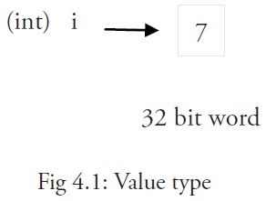
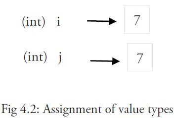

# 快速入门

## 1.第一份代码

先检查自己是否有正确下载 `Go`，如果没有直接去 [Go 安装](https://go.dev/doc/install) 进行安装。

```shell
# 检查是否有 Go
$ go version
go version go1.23.4 linux/amd64

```

然后根据 [Go 的入门教程](https://go.dev/doc/tutorial/getting-started) 开始进行学习。

```shell
# 初始化 Go 项目
$ mkdir example && cd example # Go 会在 example 目录下创建一个 go.mod 文件, 并将模块路径设置为 example/hello

$ go mod init example/hello 
go: creating new go.mod: module example/hello

$ ls -al
总计 16
drwxrwxr-x  3 ljp ljp 4096  2月  3 23:24 .
drwxrwxr-x 15 ljp ljp 4096  1月 27 23:44 ..
-rw-rw-r--  1 ljp ljp   32  2月  3 23:24 go.mod

$ cat go.mod
module example/hello

go 1.23.4

$ ll -al hello/
总计 8.0K
drwxrwxr-x 2 ljp ljp 4.0K  2月  3 23:21 .
drwxrwxr-x 3 ljp ljp 4.0K  2月  3 23:24 ..

```

`go mod init example/hello` 是用来在 `example/` 下初始化一个 `Go` 项目的模块的命令：

*   `go mod`：这是 `Go 1.11` 引入的模块系统的命令，用于管理项目的依赖
*   `init`：该命令用于创建一个新的模块并初始化 `go.mod` 文件，`go.mod` 文件是 `Go` 项目的模块定义文件，用于记录模块的依赖信息和 `Go` 版本等信息
*   `example/hello`：这是您为某一个模块指定的名称。通常模块名称是一个符合 `Go` 命名规则的路径，也可能是一个 `Git` 仓库地址（比如 `github.com/user/repo`）或者本地路径（比如 `example/hello`）

```shell
# 编写第一份代码
$ vim hello.go && cat hello.go
package main

import "fmt"

func main() {
    fmt.Println("Hello, World!")
}

$ go run .
Hello, World!

$ go run hello.go
Hello, World!

```

简单说一下关于上述代码的一些重点。

-   第一行代码 `package main` 定义了包名。您必须在源文件中非注释的第一行指明这个文件属于哪个包。`package main` 表示一个可独立执行的程序，每个 `Go` 应用程序都包含一个名为 `main` 的包
-   下一行 `import "fmt"` 告诉 `Go` 编译器这个程序需要使用 `fmt` 包（的函数或其他元素），`fmt` 包实现了格式化 `IO`（输入/输出）的函数（也支持通过 `+` 实现字符串连接）
-   下一行 `func main()` 是程序开始执行的函数。`main` 函数是每一个可执行程序所必须包含的，一般来说都是在启动后第一个执行的函数（如果有 `init()` 函数则会先执行该函数）
-   单行注释是最常见的注释形式，你可以在任何地方使用以 `//` 开头的单行注释。多行注释也叫块注释，均已以 `/*` 开头，并以 `*/` 结尾，且不可以嵌套使用，多行注释一般用于包的文档描述或注释成块的代码片段
-   下一行 `fmt.Println(...)` 可以将字符串输出到控制台，并在最后自动增加换行字符 `\n`。使用 `fmt.Print("hello, world\n")` 可以得到相同的结果。`Print()` 和 `Println()` 这两个函数也支持使用变量，如：`fmt.Println(arr)`。如果没有特别指定，它们会以默认的打印格式将变量 `arr` 输出到控制台。
-   另外标识符的大小写是有说法的，大小写决定了包内外的可见性
    -   标识符（包括常量、变量、类型、函数名、结构字段等等）以一个大写字母开头，如 `Group1`，那么使用这种形式的标识符的对象就可以被外部包的代码所使用（客户端程序需要先导入这个包），这被称为导出（像面向对象语言中的 `public`）
    -   标识符如果以小写字母开头，则对包外是不可见的，但是他们在整个包的内部是可见并且可用的（像面向对象语言中的 `protected`）
-   在 `Go` 程序中，一行代表一个语句结束。每个语句不需要像 `C` 家族中的其它语言一样以分号 `;` 结尾，因为这些工作都将由 `Go` 编译器自动完成。如果你打算将多个语句写在同一行，它们则必须使用 `;` 人为区分，但在实际开发中我们并不鼓励这种做法

>   [!IMPORTANT]
>
>   补充：不过其实就算是没有初始化项目，只引入 `Go` 内部模块（例如 `fmt`）的情况下，一个单独的 `.go` 文件也可以使用 `go run xxx.go` 运行起来。

`go` 的运行方式有两种，一种是即时编译运行，一种是执行编译后的可执行文件。

```shell
# 编译 Go 程序
$ go build -o hello.exe hello.go

$ ls -al
总计 2100
drwxrwxr-x 2 ljp ljp    4096  2月  4 00:13 .
drwxrwxr-x 3 ljp ljp    4096  2月  3 23:49 ..
-rw-rw-r-- 1 ljp ljp      32  2月  4 00:12 go.mod
-rwxrwxr-x 1 ljp ljp 2130759  2月  4 00:13 hello.exe
-rw-rw-r-- 1 ljp ljp      77  2月  4 00:13 hello.go

$ ./hello.exe
Hello, World!

```

接下来尝试引入外部的包，相关的包可以在 [pkggodev](https://pkg.go.dev/) 上搜索，例如搜索 `quote`。


```bash
# 修改代码以使用外部的模块
$ vim hello.go && cat hello.go
package main

import "fmt"
import "rsc.io/quote" // 引入外部依赖

func main() {
    fmt.Println(quote.Go())
}

$ go mod tidy # 会自动下载 rsc.io/quote 包并更新 go.mod 文件

go: finding module for package rsc.io/quote
go: downloading rsc.io/quote v1.5.2
go: found rsc.io/quote in rsc.io/quote v1.5.2
go: downloading rsc.io/sampler v1.3.0
go: downloading golang.org/x/text v0.0.0-20170915032832-14c0d48ead0c

$ ls -al
总计 2.1M
drwxrwxr-x  3 ljp ljp 4.0K  2月  3 23:42 .
drwxrwxr-x 15 ljp ljp 4.0K  1月 27 23:44 ..
-rw-rw-r--  1 ljp ljp  175  2月  3 23:42 go.mod
-rw-rw-r--  1 ljp ljp  499  2月  3 23:42 go.sum # 多出该文件
-rwxrwxr-x  1 ljp ljp 2.1M  2月  3 23:36 hello.exe
-rw-rw-r--  1 ljp ljp   95  2月  3 23:39 hello.go

$ cat go.mod
module example/hello

go 1.23.4

require rsc.io/quote v1.5.2

require (
        golang.org/x/text v0.0.0-20170915032832-14c0d48ead0c // indirect
        rsc.io/sampler v1.3.0 // indirect
)

$ go run hello.go
Don't communicate by sharing memory, share memory by communicating.

```

`go.sum` 文件在 `Go` 项目中扮演着重要的角色，它用于记录项目依赖的 **模块** 的 **校验和**，确保模块在下载时的完整性和一致性。防止恶意代码和不一致的版本被引入项目中，确保依赖项的安全和可重现性。

## 2.数据类型

### 2.1.分类

一般来说，`Go` 使用 `var` 来定义变量，并且会根据手动赋予的初始值来确定变量类型，如果不赋予初始值则需要显式声明变量的类型，并且这样做会赋予一个默认值（不过哪怕是手动赋予了初始值也可以显式声明变量类型）。`Go` 的类型分为四种，和其他的语言（尤其是类 `C` 家族的语言）非常类似。

| 类型           | 描述                                                         |
| :------------- | :----------------------------------------------------------- |
| **布尔型**     | 布尔型 `bool` 的值只可以是常量 `true` 或者 `false`。         |
| **数字类型**   | 整型 `int`（可分为 `uint64、uint32、uint16、uint8、int8、int16、int32、int64`）、浮点型（可分为 `float32、float64、complex64、complex128`），其中位运算采用补码进行运行。 |
| **字符串类型** | 字符串就是一串固定长度的字符连接起来的字符序列，`Go` 的字符串是由单个字节连接起来的。`Go` 语言的字符串的字节使用 `UTF-8` 编码标识 `Unicode` 文本。 |
| **派生类型**   | 包括：(a)指针类型 (b)数组类型 (c)结构类型 (d)通道类型 (e)函数类型 (f)切片类型 (g)接口类型 (h)键值对类型。 |

### 2.2.变量

```go
// 展示大部分的数据类型
package main

import (
	"fmt"
)

type Person struct {
	Name string
	Age  int
}

func main() {
	// 布尔类型
	var isGoFun bool = true
	fmt.Println("布尔类型:", isGoFun)

	// 数字类型
	var i int = 42
	var f float64 = 3.1415
	var c complex128 = complex(1, 2) // 这定义了一个复数
	fmt.Println("整型:", i)
	fmt.Println("浮点型:", f)
	fmt.Println("复数:", c)

	// 字符串类型
	var str string = "Hello, Go!"
	fmt.Println("字符串:", str)

    // 复合类型
    // (1)指针类型
	var ptr *int = &i
	fmt.Println("指针:", ptr, "指向的值:", *ptr)

    // (2)数组类型
	var arr [3]int = [3]int{1, 2, 3}
	fmt.Println("数组:", arr)

    // (3)结构体类型
	var p Person = Person{Name: "Alice", Age: 25}
	fmt.Println("结构体:", p)

    // (4)切片类型(动态数组)
	var slice []int = []int{4, 5, 6}
	fmt.Println("切片:", slice)

    // (5)Map 类型(键值对)
	var m map[string]int = map[string]int{"apple": 5, "banana": 10}
	fmt.Println("Map:", m)

    // (6)函数类型
	var add func(a, b int) int
	add = func(a, b int) int { return a + b }
	fmt.Println("函数类型: 3 + 7 =", add(3, 7))
}

```

>   [!IMPORTANT]
>
>   补充：我们知道可以在变量的初始化时省略变量的类型而由系统自动推断，声明语句写上 `var` 关键字其实是显得有些多余了，因此我们可以将它们简写为 `a := 50`、`b := false` 这些形式，等价于 `var a = 50`、`var b = false`。

>   [!IMPORTANT]
>
>   补充：`Go` 允许像 `Python` 在一行定义或赋值多个变量（并行赋值）。因此如果您想要快速交换两个变量的值，则可以简单地使用 `a, b = b, a`，但是两个变量的类型必须是相同。并行赋值也被用于当一个函数返回多个返回值时，比如 `val, err = Func(var)`。

>   [!IMPORTANT]
>
>   补充：空白标识符 `_` 也被用于抛弃值，如在 `_, b = 5, 7` 中 `5` 被抛弃。`_` 实际上是一个只写变量，您不能得到它的值。有时您会遇到并不需要使用从一个函数得到的所有返回值的情况，这个时候 `_` 会非常有用。

>   [!WARNING]
>
>   注意：有几种类型我没有给出，后面慢慢研究。

>   [!CAUTION]
>
>   警告：如果在相同的代码块中，我们不可以再次对于相同名称的变量使用初始化声明 `:=`，这会出现编译错误，但是可以给相同的变量赋予 `=` 一个新的值。

>   [!CAUTION]
>
>   警告：如果您声明了一个局部变量却没有在相同的代码块中使用它，同样会得到编译错误，但是全局变量则不会编译失败。





**值类型：所有像 int、float、booltring... 这些基本类型都属于值类型，使用这些类型的变量直接指向存在内存中的值。**

当使用等号 `=` 将一个变量的值赋值给另一个变量时，如：`j = i`，实际上是在内存中将 `i` 的值进行了拷贝。

您可以通过 `&i` 来获取变量 `i` 的内存地址，例如：`0xf840000040`（每次的地址都可能不一样）。

值类型变量通常存储在栈中，尤其是当它们是局部变量时。当值类型变量的值需要在函数作用域之外使用时，`Go` 会自动将其分配到堆内存中。

内存地址会根据机器的不同而有所不同，甚至相同的程序在不同的机器上执行后也会有不同的内存地址。因为每台机器可能有不同的存储器布局，并且位置分配也可能不同。


**引用类型：更复杂的数据通常会需要使用多个字，这些数据一般使用引用类型保存。一个引用类型的变量 r1 存储的是 r1 的值所在的内存地址（数字），或内存地址中第一个字所在的位置。**

这个内存地址称之为指针，这个指针实际上也被存在另外的某一个值中。

同一个引用类型的指针指向的多个字可以是在连续的内存地址中（内存布局是连续的），这也是计算效率最高的一种存储形式；也可以将这些字分散存放在内存中，每个字都指示了下一个字所在的内存地址。

当使用赋值语句 `r2 = r1` 时，只有引用（地址）被复制。如果 `r1` 的值被改变了，那么这个值的所有引用都会指向被修改后的内容，在这个例子中，`r2` 也会受到影响。

### 2.3.常量

在 `Go` 语言中也有常量 `const` 的概念，是指程序运行中不会被修改的值。可以一次性定义多个常量，也可以干脆结合 `()` 定义一个枚举值量。

```go
// 使用常量
package main

import "fmt"

func main() {
    const val1, val2, val3 int = 1, 2, 3
    fmt.Println(val1, val2, val3) // 这里可以注意到一个特性, 在打印时会自动空格待打印的多个变量值

    const (
        v1 = 4
        v2 = 5 // 如果这里没有写 '= 5' 那么 v2 默认和 v1 值相同
        v3 = 6
    )
    fmt.Println(v1, v2, v3)
}

```

`iota` 是一个特殊的常量，可以认为是一个可以被编译器修改的常量。`iota` 在 `const` 关键字出现时将被重置为 `0`，`const` 中每新增一行常量声明将使 `iota` 计数一次（可理解为 `const` 语句块中的行索引）。

```go
// 使用枚举常量
package main

import "fmt"

func main() {
    const (
        a = iota   // 0, iota += 1
        b          // 1, iota += 1
        c          // 2, iota += 1
        d = "ha"   // 设置独立值 "ha", iota += 1
        e          // "ha", iota += 1
        f = 100    // 设置独立值 100, iota +=1
        g          // 100, iota +=1
        h = iota   // 7, iota +=1
        i          // 8, iota +=1
    )
    
    fmt.Println(a, b, c, d, e, f, g, h, i) // 0 1 2 ha ha 100 100 7 8
}

```

>   [!IMPORTANT]
>
>   补充：在 `const` 中可以使用 `iota` 进行正常的运算，犹如对普通常量进行计算。

### 2.4.指针

指针变量是特殊的变量，这个概念继承自 `C` 语言。

### 2.5.范围

谈及变量就需要考虑变量的作用域，变量可以在三个地方声明。

*   函数内定义的变量称为局部变量
*   函数外定义的变量称为全局变量
*   函数定义中的变量称为形式参数

## 3.类型转化


## 4.控制程序流

和 `C` 语言类似，不过有一些简化和加强。首先 `Go` 和 `Python` 类似去掉了冗余的 `()` 来放置布尔表达式，但仍需要 `{}`，可以用一个代码来解释清楚。

```go
package main

import (
	"fmt"
	"time"
)

func main() {
	// if 语句
	num := 10
	if num > 5 {
		fmt.Println("num 大于 5")
	}

	// if...else 语句
	if num%2 == 0 {
		fmt.Println("num 是偶数")
	} else {
		fmt.Println("num 是奇数")
	}

	// 嵌套 if 语句
	if num > 0 {
		fmt.Println("num 是正数")
		if num%5 == 0 {
			fmt.Println("num 还是 5 的倍数")
		}
	}
    
	// 多个 else if 语句
	score := 85
    
	if score >= 90 {
		fmt.Println("成绩等级: A")
	} else if score >= 80 {
		fmt.Println("成绩等级: B")
	} else if score >= 70 {
		fmt.Println("成绩等级: C")
	} else if score >= 60 {
		fmt.Println("成绩等级: D")
	} else {
		fmt.Println("成绩等级: F (不及格)")
	}

	// switch 语句
	day := time.Now().Weekday()
	switch day {
	case time.Monday:
		fmt.Println("今天是星期一")
	case time.Tuesday:
		fmt.Println("今天是星期二")
	case time.Wednesday, time.Thursday:
		fmt.Println("今天是星期三或星期四")
	default:
		fmt.Println("今天是周末或其他时间")
	}

	// for 循环
	fmt.Println("普通 for 循环:")
	for i := 0; i < 5; i++ {
		fmt.Println(i)
	}
}

```

而其实这里我说的所谓“加强”仅仅是指多了个 `select`，这种控制流有些类似 `switch`，但需要和多并发的代码结合使用，这点我将会在语言特性中进行讲解。

>   [!IMPORTANT]
>
>   补充：`Go` 也继承了 `C` 的 `break、continue、goto` 三个关键字，并且使用方法一样。

>   [!WARNING]
>
>   警告：`Go` 没有三目运算符，所以不支持 `?:` 形式的条件判断。

>   [!WARNING]
>
>   警告：`Go` 也没有 `while` 循环关键字，只有 `for`。

## 5.运算符

`Go` 的运算符几乎完美继承了 `C` 的特色，没啥好讲的...

## 6.函数

### 6.1.内置函数

`len()`, `cap()`, `unsafe.Sizeof()` 在 Go 语言中分别用于不同的目的，是内置的函数，无需引入任何的模块即可使用。

#### 6.1.1.len()

返回数组、切片、字符串、映射、通道等量的长度（或元素个数）。

```go
package main

import "fmt"

func main() {
    arr := [5]int{1, 2, 3, 4, 5}
    slice := []int{1, 2, 3, 4}
    str := "Hello, 世界"
    m := map[string]int{"a": 1, "b": 2}

    fmt.Println("数组长度:", len(arr)) // 5
    fmt.Println("切片长度:", len(slice)) // 4
    fmt.Println("字符串长度:", len(str)) // 13 (UTF-8 编码，每个中文占 3 字节)
    fmt.Println("键值对长度:", len(m)) // 2
}
```

#### 6.1.2.cap()

返回数组、切片或通道的容量（底层分配的存储空间大小）。

```go
package main

import "fmt"

func main() {
    s := make([]int, 3, 10) // make() 可以设置切面的长度为 3，容量 10
    fmt.Println("len(s):", len(s)) // 3
    fmt.Println("cap(s):", cap(s)) // 10
}

```

>   [!IMPORTANT]
>
>   补充：另外在 `Go` 的模块中有专门的函数可以静态计算一个变量的内存占用（计算出字节的个数，类似 `C` 的 `sizeof()`）。

### 6.2.自定函数

#### 6.2.1.普通用法

函数是基本的代码块，用于执行一个任务，`Go` 语言最少有个 `main()`，`Go` 语言函数定义格式如下。

```go
// 定义一个函数的模板
func function_name( [parameter_list] ) [return_types] {
   函数体
}

```

*   `func`：函数由 func 开始声明，至少您可以认为 `function_name` 是一种函数变量
*   `function_name`：函数名称，参数列表和返回值类型构成了函数签名
*   `parameter_list`：参数列表，参数就像一个占位符，当函数被调用时，你可以将值传递给参数，这个值被称为实际参数。参数列表指定的是参数类型、顺序、及参数个数。参数是可选的，也就是说函数也可以不包含参数
*   `return_types`：返回类型，函数返回一列值。`return_types` 是该列值的数据类型。有些功能不需要返回值，这种情况下 `return_types` 不是必须的
*   函数体：函数定义的代码集合

```go
// 函数返回两个数的最大值
package main

import "fmt"

func main() {
   // 定义局部变量
   var a int = 100
   var b int = 200
   var ret int

   // 调用函数并返回最大值
   ret = max(a, b)

   fmt.Printf( "最大值是 : %d\n", ret )
}

func max(num1, num2 int) int { // 这个定义也可以放在 main() 后, 并且不用像 C 语言一样需要先声明函数后才能使用
   // 声明局部变量
   var result int

   if (num1 > num2) {
      result = num1
   } else {
      result = num2
   }

   return result
}

```

就像前面说的那样，`Go` 的函数可以返回多个返回值，并且使用并行赋值来获取。

```go
package main

import "fmt"

func swap(x, y string) (string, string) {
   return y, x
}

func main() {
   a, b := swap("Google", "limou")
   fmt.Println(a, b)
}

```

不过我们需要讨论一个值得注意的问题，就是传递给函数的参数究竟是怎么传递的。普通变量和结构体变量都使用值传递，在函数内修改传递过来的普通变量和结构体变量是不会影响传递前的量。而其他引用变量则会使用引用传递，在函数内修改传递过来的引用变量会影响传递前的量。

```go
package main

import "fmt"

// 传递普通变量(值传递)
func modifyInt(x int) {
    x = 100
}

// 传递结构体(值传递)
type Person struct {
    name string
    age  int
}

func modifyStruct(p Person) {
    p.age = 30
}

// 传递切片(引用传递)
func modifySlice(s []int) {
    s[0] = 100
}

// 传递映射(引用传递)
func modifyMap(m map[string]int) {
    m["age"] = 30
}

func main() {
    // 普通变量
    num := 10
    modifyInt(num)
    fmt.Println("num:", num) // 仍然是 10(值传递)

    // 结构体
    p := Person{name: "Alice", age: 25}
    modifyStruct(p)
    fmt.Println("p.age:", p.age) // 仍然是 25(值传递)

    // 切片
    slice := []int{1, 2, 3}
    modifySlice(slice)
    fmt.Println("slice:", slice) // [100 2 3](引用传递)

    // 映射
    myMap := map[string]int{"age": 25}
    modifyMap(myMap)
    fmt.Println("myMap:", myMap) // map[age:30](引用传递)
}

```

#### 6.2.2.高阶用法

| 函数用法 | 描述                                     |
| :------- | :--------------------------------------- |
| 回调     | 函数定义后可作为另外一个函数的实参数传入 |
| 闭包     | 闭包是匿名函数，可在动态编程中使用       |
| 方法     | 方法就是一个包含了接受者的函数           |

```go
// 回调
package main

import "fmt"

// 定义一个函数, 参数是另一个函数
func operate(a, b int, op func(int, int) int) int {
    return op(a, b) // 调用传入的函数
}

// 具体的函数实现
func add(x, y int) int {
    return x + y
}

func multiply(x, y int) int {
    return x * y
}

func main() {
    fmt.Println(operate(3, 4, add)) // 7
    fmt.Println(operate(3, 4, multiply)) // 12
}

```

```go
// 闭包
package main

import "fmt"

// 返回一个函数, 内部引用了外部变量
func counter() func() int {
    count := 0
    return func() int {
        count++ // 外部变量 count 并且捕获并存储, 即使函数执行完毕, 变量依然客观存在
        return count
    }
}

func main() {
    c := counter() // 创建闭包
    fmt.Println(c()) // 1
    fmt.Println(c()) // 2
    fmt.Println(c()) // 3

    // 重新创建新的闭包, count 变量重新初始化
    d := counter()
    fmt.Println(d()) // 1
}

```

```go
// 方法
package main

import "fmt"

// 定义结构体
type Person struct {
    name string
    age  int
}

// 绑定方法, 值接收者
func (p Person) greet() {
    fmt.Println("Hello, my name is", p.name)
}

// 绑定方法, 指针接收者(可修改原始数据)
func (p *Person) growUp() {
    p.age++
}

func main() {
    p1 := Person{"Alice", 25}
    p1.greet() // Hello, my name is Alice

    p1.growUp()
    fmt.Println("p1.age:", p1.age) // 26
}

```

>   [!NOTE]
>
>   补充：`Go` 的方法有些像是语法糖，挺接近现代面向对象语言的实现原理。

## 7.数组和字符串

### 7.1.数组

### 7.2.字符串

`Go` 语言中使用 `fmt.Sprintf()` 或 `fmt.Printf()` 格式化字符串并赋值给新串：

*   `Sprintf()` 根据格式化参数生成格式化的字符串并返回该字符串
*   `Printf()` 根据格式化参数生成格式化的字符串并写入标准输出

因此下面两段代码等价。

```go
// 使用 Sprintf()
package main

import (
    "fmt"
)

func main() {
    // %d 表示整型数字，%s 表示字符串
    var stockcode = 123
    var enddate = "2020-12-31"
    var url = "Code=%d&endDate=%s"
    var target_url = fmt.Sprintf(url, stockcode, enddate)
    fmt.Println(target_url)
}

```

```go
// 使用 Printf()
package main

import (
    "fmt"
)

func main() {
    // %d 表示整型数字，%s 表示字符串
    var stockcode = 123
    var enddate = "2020-12-31"
    var url = "Code=%d&endDate=%s"
    fmt.Printf(url, stockcode, enddate)
}

```

分别运行代码，输出结果均为：

```
Code=123&endDate=2020-12-31
```

## 8.集合框架


## 9.面向哲学

-   面向并发编程
-   面向函数式编程
-   面向消息编程

## 10.错误处理


## 11.文件操作


## 12.包管理器


## 13.语言特性

