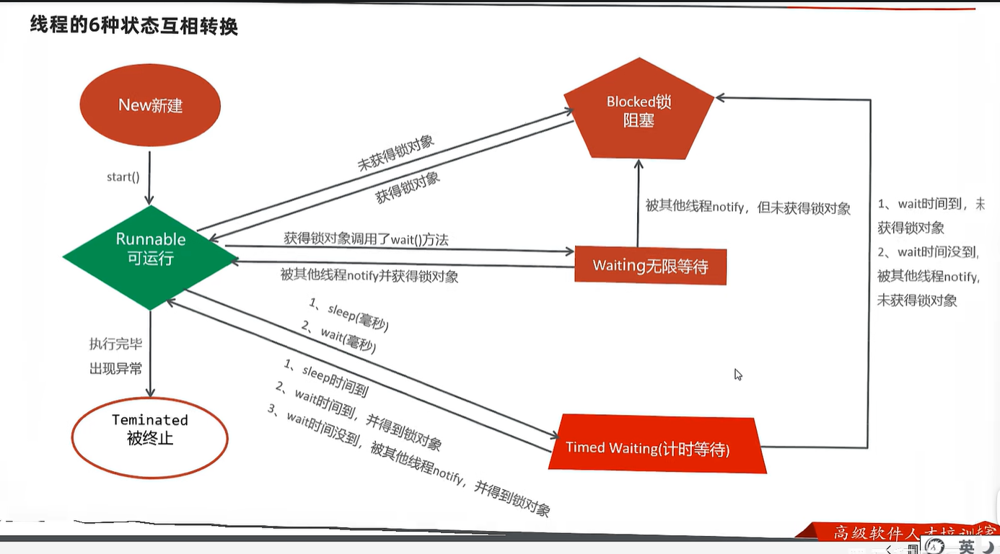
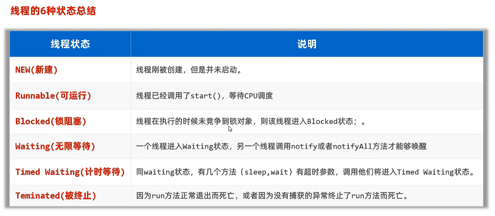

**叠甲：以下文章主要是依靠我的实际编码学习中总结出来的经验之谈，求逻辑自洽，不能百分百保证正确，有错误、未定义、不合适的内容请尽情指出！**

[TOC]

>   概要：...

>   资料：...

---

# 1.线程创建

在 `Java` 的实现中，有三种方法做到多线程：

-   **继承**：
    -   定义继承 `Thread{}` 的子类，并且覆盖 `run()`，该方法内部是线程需要做的事情，然后创建该子类的实例后调用 `start()`

-   **接口**：
    -   实现 `Runnable` 接口，实现类需要实现内部的 `run()` 然后把该实现类的实例作为参数传递给 `Thread{}` 构造线程实例，使用线程实例的 `start()`
    -   实现 `Callable<>` 接口，实现类需要实现内部的 `call()`，然后把该实现类的实例使用 `Callable<>` 引用，然后使用 `FutureTask<>` 继续封装为“未来任务”，实例化出新实例，交给 `Thread{}` 作为构造参数，然后使用对应的线程实例调用 `start()` 方法（这种方式最大的好处就是可以使用线程实例的 `get()` 获取返回值）

-   **lambda**：
    -   要么通过继承，要么通过接口，这两种方式实现原理都很符合 `Java` 的理念，但是不够简洁，因此可以考虑使用 `Lambda` 转化为接口的形式简化编码过程，也就是使用 `public Thread(Runnable target)` 构造方法，然后传入一个 `Runnable lambda` 表达式。为什么可以把表达式传入构造函数内？因为 `Thread{}` 也有 `Runnable` 接口的属性，所以 `Lambda` 表达式会被构造器转化给 `run()` 中，并在用户调用 `start()` 方法时调用 `lambda` 实现的 `run()`
    -   同理 `Callable<>` 接口也有类似的 `Lambda` 简化方法


>   [!IMPORTANT]
>
>   补充：一般推荐使用实现 `Runnable` 接口的方式来创建线程，因为这样更加灵活，可以避免 `Java` 单继承的限制，并且支持更好的资源共享和代码结构的清晰度。

```java
// 继承 Thread 类的子类
class MyThread extends Thread {
    private String message;

    // 构造方法, 接受需要传递的参数
    public MyThread(String message) {
        this.message = message;
    }

    @Override
    public void run() {
        System.out.println("Thread is running with message: " + message);
        // 线程执行的逻辑
    }
}

public class Main {
    public static void main(String[] args) {
        // 创建线程对象时传递参数
        String msg = "Hello, World!";
        MyThread thread = new MyThread(msg);
        thread.start();
    }
}
```

```java
// 实现 Runnable 接口的实现类
class MyRunnable implements Runnable {
    private String message;

    // 设置实例变量的方法
    public void setMessage(String message) {
        this.message = message;
    }

    @Override
    public void run() {
        System.out.println("Runnable is running with message: " + message);
        // 线程执行的逻辑
    }
}

public class Main {
    public static void main(String[] args) {
        MyRunnable myRunnable = new MyRunnable();
        String msg = "Hello, Runnable!";

        // 设置参数
        myRunnable.setMessage(msg);

        Thread thread = new Thread(myRunnable);
        thread.start();
    }
}
```

```java
// 实现 Callable 接口的实现类, 并且包装为 FutureTask
import java.util.concurrent.*;

// 实现 Callable 接口的类
class MyCallable implements Callable<String> {

    private int num;

    // 构造方法, 接收需要的参数
    public MyCallable(int num) {
        this.num = num;
    }

    // 实现 call() 定义线程执行的逻辑
    @Override
    public String call() {
        String sum = new String();
        for (int i = 1; i <= num; i++) {
            sum += i;
        }
        return sum;
    }
}

public class Main {
    public static void main(String[] args) throws Exception {
        // 创建 Callable 对象
        Callable<String> callable = new MyCallable(10); // 使用接口对象引用实现类对象
        FutureTask<String> ft = new FutureTask<>(callable); // 然后使用 FutureTask 进行进一步封装为"将来任务"
        Thread t = new Thread(ft); // 创建线程
        t.start(); // 启动线程
        System.out.println("连接结果: " + ft.get()); // 获取线程执行结果
    }
}
```

```java
// 使用 Lambda 转化为 Runnable 接口
class UnsafeCounter {
    private int count = 0;

    public void increment() {
        count++;  // 非原子操作
    }

    public int getCount() {
        return count; // 非原子操作
    }
}

public class Main {
    public static void main(String[] args) {
        UnsafeCounter counter = new UnsafeCounter();

        Runnable r = () -> { // 实际上 Thread{} 也有实现 implements Runnable
            for (int i = 0; i < 10000; i++) {
                counter.increment();
            }
        };

        // 创建并启动多个线程来增加计数器的值
        Thread thread = new Thread(r);

        thread.start();

        // 等待两个线程完成
        try {
            thread.join();
        } catch (InterruptedException e) {
            e.printStackTrace();
        }

        // 输出最终的计数器值
        System.out.println("Final Count: " + counter.getCount());
    }
}
```

```java
// 使用 Lambda 转化为 Callable<String> 接口
import java.util.concurrent.Callable;
import java.util.concurrent.FutureTask;

public class Main {
    public static void main(String[] args) throws Exception {
        int num = 10;

        // 使用 Lambda 表达式创建 Callable 对象
        Callable<String> callable = () -> {
            String sum = "";
            for (int i = 1; i <= num; i++) {
                sum += i;
            }
            return sum;
        };

        // 使用 Lambda 表达式创建 FutureTask 对象
        FutureTask<String> ft = new FutureTask<>(callable);

        // 创建线程并启动
        Thread t = new Thread(ft);
        t.start();

        // 获取线程执行结果
        System.out.println("连接结果: " + ft.get());
    }
}
```

>   [!IMPORTANT]
>
>   补充：抛开线程不谈，这里有一个把 `Lambda` 转化为接口进行使用的完整例子您可以看一看，对上述的 `lambda` 实现线程的原理或许有所帮助。
>
>   **自定义函数接口，**首先，定义一个函数接口，例如 `Task`，它包含一个抽象方法，类似于你希望执行的任务逻辑。
>
>   ```java
>   // 自定义函数接口
>   @FunctionalInterface
>   public interface Task {
>      void execute();
>   }
>   ```
>
>   **在构造函数中接受函数接口并实现回调**，在 `MyTask` 类的构造函数中接受这个函数接口作为参数。
>
>   ```java
>   // 在构造函数中接受函数接口并实现回调
>   public class MyTask {
>      private Task task;
>   
>      public MyTask(Task task) {
>          this.task = task;
>      }
>   
>      public void runTask() {
>          // 在这里执行任务逻辑
>          task.execute();
>      }
>   }
>   ```
>
>   **使用 Lambda 表达式进行实例化**，现在可以使用 `Lambda` 表达式来实现 `Task` 接口的实例，从而初始化 `MyTask` 类。
>
>   ```java
>   // 使用 Lambda 表达式进行实例化
>   public class Main {
>      public static void main(String[] args) {
>          // 使用Lambda表达式初始化MyTask对象
>          MyTask myTask = new MyTask(() -> {
>              System.out.println("Executing task...");
>          });
>   
>          // 执行任务
>          myTask.runTask();
>      }
>   }
>   ```

# 2.线程方法

然后我们开始看 `Thread` 的其他方法，我们使用第一种方式来演示。

```java
// 使用 Thread 的其他常见方法
// 继承 Thread 类的子类
class MyThread extends Thread {
    private String message;

    // 构造方法, 接受需要传递的参数
    public MyThread(String message) {
        this.message = message;
    }

    @Override
    public void run() {
        System.out.println("线程得到的参数 " + message);

        // 打印线程名称
        System.out.println("线程名 " + this.getName());

        // 打印线程优先级
        System.out.println("线程优先级 " + this.getPriority());

        // 获取当前执行的线程对象
        System.out.println("当前正在执行的线程对象 " + Thread.currentThread());

        // 模拟线程工作
        for (int i = 0; i < 5; i++) {
            System.out.println(this.getName() + " - Count: " + i);
            try {
                Thread.sleep(1000); // 线程休眠 1 秒
            } catch (InterruptedException e) {
                e.printStackTrace();
            }
        }
        System.out.println(this.getName() + " 线程完成执行");
    }
}

public class Main {
    public static void main(String[] args) {
        // 创建线程对象时传递参数
        String msg = "Hello, World!";
        MyThread thread1 = new MyThread(msg);
        thread1.setName("MyThread-1"); // 设置线程名称
        thread1.setPriority(Thread.MAX_PRIORITY); // 设置线程优先级

        // 创建并启动另一个线程
        MyThread thread2 = new MyThread("Another Message");
        thread2.setName("MyThread-2"); // 设置线程名称
        thread2.setPriority(Thread.MIN_PRIORITY); // 设置线程优先级

        // 启动线程
        thread1.start();
        thread2.start();

        // 获取当前执行的线程对象
        System.out.println("当前正在执行的线程对象 " + Thread.currentThread());

        try {
            // 等待线程 1 完成
            thread1.join();
            System.out.println(thread1.getName() + " 已经完成回收");

            // 等待线程 2 完成
            thread2.join();
            System.out.println(thread2.getName() + " 已经完成回收");
        } catch (InterruptedException e) {
            e.printStackTrace();
        }

        // 检查线程是否还在运行
        System.out.println(thread1.getName() + " 是否还在运行 " + thread1.isAlive());
        System.out.println(thread2.getName() + " 是否还在运行 " + thread2.isAlive());
    }
}
```

# 3.线程参数

不过还有一件事情值得注意，线程的参数如果直接传递其实是有一些局限性的。

-   当多个线程传递了相同的实例对象时，线程的参数传递会导致被迫共享参数对象，一旦某个线程修改了参数的引用，就会导致其他线程看到修改后的值（或者有的可能会没看到），进而引发数据不一致等意外行为。
-   当调用链中有无法修改源码的第三方库时，我们无法直接修改这些库的方法签名，导致无法将某些我们需要的参数传递到线程中。

因此对于线程内部的参数数据传递，使用 `ThreadLocal` 是一种常见做法。

`ThreadLocal` 是 `Java` 中提供的一种用于 **线程局部存储** 的机制。它允许每个线程都拥有自己独立的变量副本，从而避免多个线程共享同一个变量。这在多线程环境中非常有用，尤其是当你希望每个线程有独立的数据时，避免线程间的竞争和同步问题。

# 4.线程安全

先展示一个线程不安全的代码。

```java
// 线程不安全的代码
class UnsafeCounter {
    private int count = 0;

    public void increment() {
        count++;
    }

    public int getCount() {
        return count;
    }
}

public class Main {
    public static void main(String[] args) throws InterruptedException {
        UnsafeCounter counter = new UnsafeCounter();

        // 创建多个线程并发增加计数器
        Thread thread1 = new Thread(() -> {
            for (int i = 0; i < 10000; i++) {
                counter.increment();
            }
        });

        Thread thread2 = new Thread(() -> {
            for (int i = 0; i < 10000; i++) {
                counter.increment();
            }
        });

        thread1.start();
        thread2.start();

        // 等待两个线程执行完成
        thread1.join();
        thread2.join();

        // 输出最终的计数器值（可能小于2000，因为线程不安全）
        System.out.println("Final count (unsafe): " + counter.getCount());
    }
}
```

## 4.1.Lock 锁

```java
// 尝试使用 Lock 锁
import java.util.concurrent.locks.Lock;
import java.util.concurrent.locks.ReentrantLock;

class SafeCounterWithLock {
    private int count = 0;
    private Lock lock = new ReentrantLock();

    public void increment() {
        lock.lock(); // 获取锁资源
        try {
            count++;
        } finally {
            lock.unlock(); // 释放锁资源
        }
    }

    public int getCount() {
        lock.lock(); // 获取锁资源
        try {
            return count;
        } finally {
            lock.unlock(); // 释放锁资源
        }
    }
}

public class Main {
    public static void main(String[] args) throws InterruptedException {
        SafeCounterWithLock counter = new SafeCounterWithLock();

        Thread thread1 = new Thread(() -> {
            for (int i = 0; i < 10000; i++) {
                counter.increment();
            }
        });

        Thread thread2 = new Thread(() -> {
            for (int i = 0; i < 10000; i++) {
                counter.increment();
            }
        });

        thread1.start();
        thread2.start();

        thread1.join();
        thread2.join();

        System.out.println("Final count (with lock): " + counter.getCount());
    }
}
```

## 4.2.同步代码块

```java
// 尝试使用同步代码块
class SafeCounterSyncBlock {
    private int count = 0;

    public void increment() {
        synchronized (this) { // 这里就使用了同步代码块, 保证同一时刻只有一个线程可以调用这个方法
            count++;
        }
    }

    public int getCount() {
        synchronized (this) {  // 这里就使用了同步代码块, 保证同一时刻只有一个线程可以调用这个方法
            return count;
        }
    }
}

public class Main {
    public static void main(String[] args) throws InterruptedException {
        SafeCounterSyncBlock counter = new SafeCounterSyncBlock();

        Thread thread1 = new Thread(() -> {
            for (int i = 0; i < 10000; i++) {
                counter.increment();
            }
        });

        Thread thread2 = new Thread(() -> {
            for (int i = 0; i < 10000; i++) {
                counter.increment();
            }
        });

        thread1.start();
        thread2.start();

        thread1.join();
        thread2.join();

        System.out.println("Final count (sync block): " + counter.getCount());
    }
}
```

>   吐槽：在 `Java` 中同步代码块将同步的关注点从线程上转移到了代码块（或对象）上，这种方式的实现和底层操作系统的线程锁定（如 `Linux` 中的锁资源竞争）是有些不同的。

## 4.3.同步方法

```java
// 尝试使用同步方法
class SafeCounterSyncMethod {
    private int count = 0;

    public synchronized void increment() {
        count++;
    }

    public synchronized int getCount() {
        return count;
    }
}

public class Main {
    public static void main(String[] args) throws InterruptedException {
        SafeCounterSyncMethod counter = new SafeCounterSyncMethod();

        Thread thread1 = new Thread(() -> {
            for (int i = 0; i < 10000; i++) {
                counter.increment();
            }
        });

        Thread thread2 = new Thread(() -> {
            for (int i = 0; i < 10000; i++) {
                counter.increment();
            }
        });

        thread1.start();
        thread2.start();

        thread1.join();
        thread2.join();

        System.out.println("Final count (sync method): " + counter.getCount());
    }
}
```

>   补充：三种方法主要区别就是颗粒度不同。

# 5.线程状态





# 6.线程通信

貌似这里的很奇怪...还有唤醒的问题...

# 7.线程池化

您当然可以使用 `ExecutorService` 的实现类自己实现一个线程池类。

```java
// 尝试使用 ExecutorService
import java.util.concurrent.ExecutorService;
import java.util.concurrent.Executors;

public class Main {
    public static void main(String[] args) {
        // 创建一个固定大小的线程池
        ExecutorService executor = Executors.newFixedThreadPool(5); // 设置线程个数, 内部就会自动启动线程开始等待

        // 提交 10 个任务给线程池
        for (int i = 0; i < 10; i++) {
            executor.execute(() -> {  // 执行...这里的 Lambda 表达式实现了 Runnable 接口
                System.out.println(Thread.currentThread().getName() + " Start.");
                for (int j = 0; j < 100; j++) {
                    System.out.println(j);
                }
                System.out.println(Thread.currentThread().getName() + " End.");
            });
        }

        // 关闭线程池
        executor.shutdown();
        while (!executor.isTerminated()) {
        }
    }
}
```

---

>   结语：...